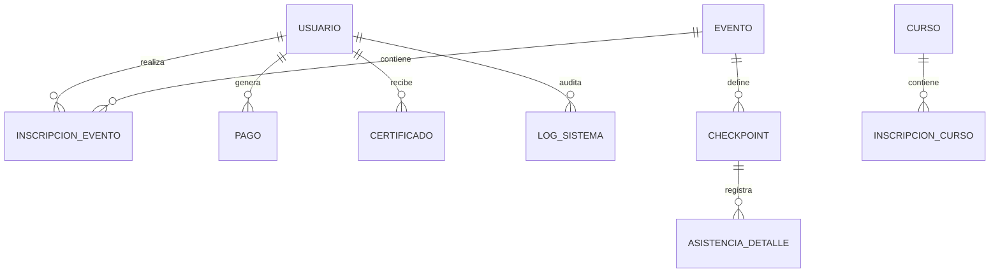

# MANUAL TÉCNICO DETALLADO: PLATAFORMA MEH

Este documento complementa la documentación académica, centrándose en el diseño de bajo nivel de la base de datos y la interfaz de programación de aplicaciones (API).

---

## 1. DISEÑO DE BASE DE DATOS (DICCIONARIO DE DATOS)

El sistema utiliza **PostgreSQL** con una arquitectura de auditoría universal mediante un Mixin de SQLAlchemy. Todas las tablas (excepto Logs) incluyen las columnas: `creado_por`, `fecha_creacion`, `modificado_por` y `fecha_modificacion`.

### 1.1. Tabla: `usuarios`
Almacena la identidad y perfiles de la comunidad.
*   `id_usuario` (PK): Integer, Auto-incremental.
*   `nombres / apellidos`: String.
*   `alias`: String, Nombre público del usuario.
*   `correo` (UQ): String, Identificador para login.
*   `password_hash`: Text, Cifrado con Bcrypt.
*   `rol`: String, {ADMIN, ORGANIZADOR, MODERADOR, SOPORTE, EMBAJADOR, MIEMBRO}.
*   `foto_url / bio`: Text, Datos de perfil.
*   `preferencia_tema`: String, {dark, light}.

### 1.2. Tabla: `eventos`
Gestiona las actividades presenciales y virtuales.
*   `id_evento` (PK): Integer.
*   `titulo / descripcion`: String / Text.
*   `fecha_inicio / fecha_fin`: DateTime.
*   `modalidad`: String, {VIRTUAL, PRESENCIAL, HIBRIDO}.
*   `id_organizador` (FK): Referencia a `usuarios.id_usuario`.

### 1.3. Tabla: `inscripciones_eventos`
Vínculo entre usuarios y eventos con estado de pago.
*   `id_inscripcion` (PK): Integer.
*   `id_usuario` (FK): Referencia a `usuarios`.
*   `id_evento` (FK): Referencia a `eventos`.
*   `estado_inscripcion`: String, {PENDIENTE, PAGADO, ASISTIO}.
*   `codigo_qr` (UQ): String, Token único para validación de entrada.

### 1.4. Tabla: `pagos`
Registro financiero y trazabilidad de comprobantes.
*   `id_pago` (PK): Integer.
*   `id_usuario` (FK): Referencia a `usuarios`.
*   `monto`: Numeric(10,2).
*   `url_comprobante`: String, Ruta al archivo físico/S3.
*   `estado_pago`: String, {PENDIENTE, APROBADO, RECHAZADO}.

---

## 2. DIAGRAMA ENTIDAD-RELACIÓN (ERD)

---

## 3. CATÁLOGO DE ENDPOINTS (API REST)

La API está construida sobre FastAPI y utiliza el prefijo `/api/v1`.

### 3.1. Módulo: Autenticación (`/auth`)
| Método | Ruta | Descripción | Rol Mínimo |
|:---|:---|:---|:---|
| POST | `/login` | Intercambia credenciales por un JWT. | VISITANTE |
| POST | `/register` | Crea un nuevo perfil de Miembro. | VISITANTE |
| GET | `/me` | Retorna el perfil del usuario actual. | MIEMBRO |
| PUT | `/usuarios/{id}/rol` | Cambia el nivel de acceso de un usuario. | **ADMIN** |

### 3.2. Módulo: Eventos y QR (`/eventos`)
| Método | Ruta | Descripción | Rol Mínimo |
|:---|:---|:---|:---|
| GET | `/` | Lista todos los eventos programados. | MIEMBRO |
| POST | `/` | Crea un nuevo evento. | **ORGANIZADOR** |
| POST | `/{id}/asistencia-qr` | Registra entrada mediante token QR. | **ORGANIZADOR** |

### 3.3. Módulo: Finanzas (`/pagos`)
| Método | Ruta | Descripción | Rol Mínimo |
|:---|:---|:---|:---|
| POST | `/upload-comprobante` | Sube imagen de transferencia. | MIEMBRO |
| GET | `/admin/todos` | Lista todas las transacciones pendientes. | **SOPORTE** |
| PUT | `/admin/{id}/validar` | Aprueba pago y activa inscripción. | **ORGANIZADOR** |

### 3.4. Módulo: Auditoría y BI (`/logs`, `/dashboard`)
| Método | Ruta | Descripción | Rol Mínimo |
|:---|:---|:---|:---|
| GET | `/logs` | Trazabilidad completa de acciones. | **ADMIN** |
| GET | `/dashboard/stats` | KPIs de asistencia y crecimiento. | **ADMIN** |

---

## 4. ESPECIFICACIONES DE SEGURIDAD TÉCNICA
1.  **Transporte:** Cifrado mediante TLS (HTTPS).
2.  **Tokens:** JWT con algoritmo HS256 y expiración de 24 horas.
3.  **Base de Datos:** Acceso restringido vía variables de entorno, pool de conexiones dinámico.
4.  **Hashing:** Algoritmo Argon2 o Bcrypt para persistencia de credenciales.
