**UNIVERSIDAD MAYOR DE SAN ANDRÉS**

FACULTAD DE CIENCIAS PURAS Y NATURALES

CARRERA DE INFORMÁTICA

**PERFIL DE ****PROYECTO DE GRADO**

**“****PLATAFORMA WEB INTEGRAL PARA LA GESTIÓN ACADÉMICA Y COMUNITARIA CASO: MICROSOFT EDUCATION ****HUB****”**

**PARA OPTAR AL TÍTULO DE LICENCIATURA EN INFORMÁTICA**

**MENCIÓN: **INGENIERÍA DE SISTEMAS INFORMÁTICOS

**POSTULANTE:** NATALY ALEJANDRA GEMIO MORALES

**TUTOR: **LIC.** **ALBERT JHONATAN QUISBERT MÚJICA

**LA PAZ - BOLIVIA**

**20****26**

# GLOSARIO DE TÉRMINOS

**AUDIT MIXIN.** Componente de software en SQLAlchemy que inyecta automáticamente atributos de auditoría (creado por, fecha de creación, modificado por, fecha de modificación) en los modelos físicos de base de datos.

**BADGE.** Credencial digital portable que representa un logro, habilidad o competencia técnica adquirida por un miembro en la comunidad, estructurada bajo el estándar internacional Open Badges.

**FASTAPI.** Framework de desarrollo web en Python de alto rendimiento, diseñado para construir APIs REST síncronas y asíncronas basadas en tipado estático y validación estricta con Pydantic.

**FLUENT UI.** Sistema de diseño visual oficial de Microsoft de componentes web accesibles y responsivos, que implementa estilos dinámicos CSS-in-JS mediante Griffel.

**INDEXEDDB.** Base de datos transaccional no relacional integrada de forma nativa en los navegadores web modernos, utilizada para la persistencia local de datos en arquitecturas Offline-First.

**JARO-WINKLER.** Algoritmo y métrica de distancia de cadenas que mide la similitud ortográfica entre dos secuencias de caracteres, optimizado para detectar coincidencias difusas tolerando errores tipográficos.

**JSON WEB TOKEN (JWT).** Estándar de seguridad de formato compacto y autónomo (RFC 7519) firmado criptográficamente, utilizado para la autenticación y transmisión segura de información de identidades.

**MONOLITO MODULAR.** Patrón arquitectónico de software donde el sistema completo se compila e implementa en una sola unidad ejecutable, pero se organiza internamente en módulos lógicos independientes y desacoplados.

**OPTICAL CHARACTER RECOGNITION (OCR).** Tecnología de reconocimiento óptico de caracteres que extrae texto y datos legibles a partir de imágenes digitales de documentos físicos y comprobantes bancarios.

**ROLE-BASED ACCESS CONTROL (RBAC).** Método de control de accesos que restringe las operaciones y visualización de recursos lógicos dentro del sistema según los roles jerárquicos asignados a los usuarios.

**SQLALCHEMY.** Mapeador relacional de objetos (ORM) para Python que asocia clases de código a tablas físicas en PostgreSQL, gestionando las transacciones bajo propiedades ACID de forma segura.

ewpage

# CAPÍTULO 1

## INTRODUCCIÓN

En la tercera década del siglo XXI, la educación ha experimentado una metamorfosis irreversible impulsada por la convergencia estratégica de las Tecnologías de la Información y la Comunicación (TIC). Este fenómeno no se limita únicamente a la digitalización superficial de contenidos, sino que representa una reconfiguración estructural de los ecosistemas de aprendizaje. Como señalan Cables Fernández y Alcívar Loor [-@cables2024], la integración de plataformas virtuales en la formación técnica no solo facilita el acceso democratizado al conocimiento, sino que actúa como un catalizador para el aprendizaje autónomo, permitiendo que los estudiantes desarrollen competencias críticas y habilidades blandas (*soft skills*) para un entorno profesional altamente competitivo, volátil y cambiante.

En este escenario, las comunidades de aprendizaje tecnológico emergen como nodos vitales para la transferencia de conocimiento especializado y la innovación constante. Según @dialnet2025, las plataformas digitales actúan hoy como un eje estructurador que permite la consolidación de las denominadas "comunidades de práctica", espacios virtuales y físicos donde la interacción constante, la retroalimentación técnica y la colaboración trascienden las barreras geográficas. No obstante, para que estas comunidades sean sostenibles y escalables, requieren de una infraestructura digital robusta que permita una gestión centralizada y eficiente. La dispersión de datos y la fragmentación de procesos en la administración educativa suele derivar en una pérdida crítica de eficiencia operativa y en la incapacidad institucional de generar métricas de impacto real y trazabilidad sobre el progreso de sus integrantes [@colegium2024].

En el contexto boliviano, la adopción de modelos de aprendizaje híbridos y el auge de las microcredenciales se han posicionado como las tendencias dominantes proyectadas para el año 2025 [@unifranz2024]. Las instituciones y comunidades tecnológicas en el país están reconociendo que la validación del conocimiento a través de insignias digitales (*badges*) es un pilar fundamental para la nueva empleabilidad. Estas credenciales no solo motivan la participación activa mediante mecánicas de gamificación, sino que funcionan como una validación en tiempo real del talento frente a un mercado laboral global que exige certificaciones verificables, granulares y actualizadas [@ucb2024].

Bajo esta óptica, la comunidad Microsoft Education Hub (MEH), como actor relevante en la formación tecnológica y brazo de extensión en la Universidad Mayor de San Andrés, se encuentra en un punto de inflexión. Si bien desarrolla actividades de alto valor académico, como talleres y programas de capacitación especializada, su actual modelo de gestión descentralizado dificulta el seguimiento estratégico y la fidelización de sus miembros. La carencia de una herramienta integral impide centralizar los registros históricos, automatizar la emisión de certificados y consolidar una identidad digital para sus participantes, lo cual es crítico dado el volumen de datos generado en cada gestión.

Bajo esta premisa, el presente proyecto de grado propone el desarrollo e implementación de una Plataforma Web Integral. Esta solución, fundamentada en tecnologías de alto rendimiento como FastAPI para la lógica asíncrona y React con el sistema de diseño Fluent UI, no solo busca optimizar los procesos administrativos internos de MEH (tales como la gestión de *events*, *attendance* y *payments*), sino también potenciar la experiencia del usuario mediante un sistema de gamificación basado en reconocimientos digitales. Al centralizar la gestión de eventos, cursos y perfiles de usuarios bajo un esquema de persistencia sólido en PostgreSQL, se pretende transformar la dinámica de la comunidad, convirtiéndola en un ecosistema digital robusto, escalable y plenamente alineado con los estándares internacionales de educación tecnológica y seguridad de la información [@stallings2023].

## ANTECEDENTES

La evolución de las plataformas de gestión educativa y comunitaria ha transitado, de manera acelerada, desde sistemas de registro estáticos y meramente informativos hacia ecosistemas dinámicos de aprendizaje, gestión y certificación automatizada. Este progreso histórico y tecnológico está marcado por la necesidad imperante de validar competencias y habilidades específicas en un entorno global donde la educación no formal y continua adquiere un peso significativo, y a menudo determinante, en el currículum profesional contemporáneo. En este contexto, la trazabilidad de la participación y la integridad de la certificación se han convertido en los pilares sobre los cuales se construye la confianza en las comunidades de aprendizaje tecnológico.

### ANTECEDENTES INTERNACIONALES

A nivel global, el paradigma de los Entornos Virtuales de Aprendizaje (EVA) ha mutado hacia arquitecturas más sofisticadas denominadas Sistemas de Gestión de Experiencias de Aprendizaje (*Learning Experience Platforms* - *LXP*). Según la @unesco2023, si bien la digitalización de la educación técnica ha permitido una democratización sin precedentes del conocimiento, también ha generado un reto crítico en la verificación y validación de habilidades técnicas ante terceros. En respuesta a esta problemática de autenticidad, surgió en el año 2011 el estándar *Open Badges*, desarrollado originalmente por la Fundación Mozilla y Peer 2 Peer University. Este estándar revolucionó la certificación digital al introducir metadatos cifrados dentro de imágenes digitales, permitiendo que cualquier logro académico sea portable, seguro y, sobre todo, verificable mediante protocolos criptográficos.

Bajo esta óptica, plataformas líderes de la industria tecnológica como Microsoft Learn y LinkedIn Learning han establecido el estándar global de las "micro-certificaciones". Estas herramientas han demostrado empíricamente que el seguimiento granular y en tiempo real del progreso del usuario —implementado a través de *dashboards* personalizados, rutas de aprendizaje críticas y sistemas de insignias digitales— incrementa el compromiso (*engagement*) del estudiante en un 35% en comparación con los métodos tradicionales de enseñanza pasiva [@smith2024].

Estos sistemas internacionales no solo sirven como un referente de éxito comercial, sino que constituyen la base teórica y técnica para la arquitectura de la plataforma propuesta para el Microsoft Education Hub. La implementación de microservicios y el uso de estándares de interoperabilidad observados en estos antecedentes justifican la elección de un stack tecnológico moderno, como FastAPI, que permite gestionar grandes volúmenes de solicitudes de validación de insignias de manera asíncrona y eficiente, emulando la robustez de las soluciones líderes a nivel mundial.

### ANTECEDENTES NACIONALES

En el Estado Plurinacional de Bolivia, el proceso de transformación digital ha experimentado una aceleración sin precedentes, impulsada tanto por políticas estatales de soberanía tecnológica como por la necesidad imperativa de adaptación en el escenario post-pandemia. Según los informes técnicos de la Agencia de Gobierno Electrónico y Tecnologías de Información y Comunicación [@agetic2024], el despliegue y uso de plataformas web para la gestión de trámites ciudadanos y procesos educativos ha crecido de manera exponencial, estableciendo una base de usuarios más familiarizada con los entornos virtuales. Sin embargo, esta madurez digital en los servicios gubernamentales no se ha reflejado con la misma intensidad en el ámbito de las comunidades tecnológicas y académicas de carácter voluntario o autogestionado.

Dentro de este ecosistema, aún predomina el uso de herramientas genéricas y fragmentadas, tales como formularios de Google (*Google Forms*) para el registro de participantes y redes sociales convencionales para la difusión de actividades. Bajo esta óptica, la gestión de la información carece de una estructura relacional que permita la trazabilidad a largo plazo. Si bien existen esfuerzos locales significativos —como las plataformas de gestión de eventos desarrolladas por cámaras de industria o universidades privadas que permiten la inscripción y descarga de certificados en formato PDF—, estas soluciones suelen basarse en sistemas de código cerrado o arquitecturas rígidas que no se adaptan a la dinámica fluida de una "comunidad de práctica" tecnológica [@salgado2023].

La brecha identificada a nivel nacional radica en la inexistencia de una plataforma integral que logre amalgamar la gestión logística de eventos con un sistema de fidelización y reconocimiento digital basado en méritos técnicos. Las soluciones actuales en el mercado boliviano no contemplan la emisión de micro-certificaciones verificables (como los *Open Badges*) ni ofrecen un historial de progreso de competencias específicas en tecnologías de vanguardia (como el ecosistema de Microsoft). Esta carencia de una infraestructura tecnológica propia y adaptable limita la capacidad de las comunidades locales para proyectar el talento de sus miembros hacia mercados internacionales, donde la validación granular del conocimiento es un requisito indispensable. Por consiguiente, el desarrollo de una solución basada en estándares modernos de ingeniería, como el uso de FastAPI para garantizar la concurrencia y PostgreSQL para la integridad de los datos, se presenta como un aporte necesario para elevar el estándar de la gestión tecnológica académica en el país.

### ANTECEDENTES INSTITUCIONALES (MICROSOFT EDUCATION HUB Y UMSA)

En el seno de la Universidad Mayor de San Andrés (UMSA), específicamente dentro de la Facultad de Ciencias Puras y Naturales, la Carrera de Informática se ha consolidado como un referente nacional en la formación de profesionales de alto nivel, siendo pionera en el desarrollo de sistemas de información para la gestión académica interna. No obstante, la dinámica universitaria contemporánea ha dado lugar al surgimiento de nodos de aprendizaje extracurricular que complementan la formación curricular. Entre ellos destaca el Microsoft Education Hub (MEH), una comunidad de entusiastas, profesionales y estudiantes cuya misión es fomentar el intercambio de conocimientos y experiencias en torno al ecosistema tecnológico de Microsoft, apoyando directamente programas de relevancia global como el *Microsoft Student Ambassadors* [@planmeh2024].

A pesar de su relevancia estratégica y de organizar eventos de alto impacto como el *Microsoft Tech Day*, *Azure Fest* y el *Road to Imagine Cup*, la gestión operativa de MEH ha operado históricamente bajo procesos manuales y descentralizados. Hasta la fecha, el registro de participantes y el control de hitos académicos se ha realizado mediante el uso de hojas de cálculo dispersas y formularios aislados. Bajo esta óptica, la administración de la comunidad enfrenta tres desafíos críticos que limitan su visión de convertirse en un referente tecnológico en Bolivia:

Pérdida de Trazabilidad y Memoria Institucional: La fragmentación de los datos impide consolidar un historial fidedigno de capacitación. Resulta complejo determinar con precisión el progreso de un miembro a lo largo de varias gestiones, lo que debilita la capacidad de la comunidad para identificar y promover talentos destacados.

Ineficiencia en la Gestión de Activos y Certificación: La emisión de certificados de asistencia y aprobación requiere un procesamiento manual intensivo. Esta carga administrativa no solo es propensa a errores humanos en la transcripción de datos, sino que retrasa la entrega de valores a los estudiantes, afectando la percepción de profesionalismo de la organización.

Ausencia de una Identidad Digital Unificada: Los miembros de MEH carecen de un espacio personal o *dashboard* donde visualizar sus logros, insignias y competencias adquiridas. Esta falta de visibilidad reduce el sentido de pertenencia y desaprovecha el potencial de las micro-certificaciones como motor de motivación [@planmeh2024].

Si bien la Carrera de Informática cuenta con antecedentes de sistemas robustos, como el Sistema de Seguimiento Académico (SSA), estos están diseñados exclusivamente para la educación formal y administrativa de la facultad. El SSA no contempla la flexibilidad ni los módulos específicos que requiere una comunidad tecnológica, tales como la gestión de *hackathons*, la validación de pagos para kits de eventos o el otorgamiento de *Open Badges*. El presente proyecto surge, por tanto, de la necesidad imperante de cerrar esta brecha, trasladando la eficiencia de las plataformas internacionales al ecosistema local de la UMSA, mediante una solución que integre la robustez técnica de FastAPI y la elegancia visual de Fluent UI, garantizando un entorno seguro, escalable y auditable.

### TRABAJOS AFINES

El análisis de soluciones tecnológicas preexistentes permite identificar las brechas funcionales que el presente proyecto pretende subsanar. A continuación, se describen los referentes técnicos a nivel internacional, nacional e institucional que han servido como base comparativa para el diseño de la Plataforma Web Integral MEH.

#### A NIVEL INTERNACIONAL

Uno de los referentes más influyentes en la arquitectura de reconocimientos digitales es la iniciativa *Open Badges*, impulsada originalmente por la Fundación Mozilla. Según @casilli2023, el estándar de insignias abiertas revolucionó la forma en que las plataformas de aprendizaje reconocen los logros no formales, permitiendo que el conocimiento adquirido sea portable, interoperable y verificable a través de metadatos encriptados dentro de archivos de imagen. Este trabajo es fundamental, ya que establece el protocolo de confianza que la plataforma MEH adopta para asegurar que una insignia otorgada en la UMSA tenga validez técnica auditable.

Asimismo, ecosistemas líderes como Credly y Microsoft Learn han institucionalizado el uso de "micro-certificaciones" para gestionar el currículo digital de millones de profesionales. Investigaciones publicadas por Education Week [-@eduweek2024] demuestran que la implementación de mecánicas de gamificación y reconocimiento visual mediante *dashboards* personalizados aumenta la retención y el compromiso del estudiante en un 40% en comparación con entornos estáticos. Estos sistemas internacionales demuestran que el éxito de una comunidad tecnológica no reside solo en el contenido, sino en la capacidad de la plataforma para visibilizar el progreso del usuario de manera estética y funcional.

#### A NIVEL NACIONAL

En el contexto boliviano, los esfuerzos por centralizar la gestión académica y administrativa han cobrado fuerza a través de la Agencia de Gobierno Electrónico y Tecnologías de Información y Comunicación (AGETIC). Según el informe sobre Estado TIC y Transformación Digital en Bolivia elaborado por la AGETIC [-@agetic2024], el país ha normalizado el uso de firmas digitales y certificados con validación mediante códigos QR para procesos estatales. No obstante, al analizar comunidades tecnológicas voluntarias —tales como los Google Developer Groups (GDG) o Women Techmakers— se observa que la gestión operativa sigue dependiendo de herramientas externas y transnacionales como Meetup.com o Eventbrite.

Esta dependencia genera una fragmentación de la identidad digital de los participantes bolivianos, ya que los datos de asistencia y méritos quedan alojados en servidores externos sin posibilidad de integrarse a un historial académico local. La plataforma propuesta para el Microsoft Education Hub se diferencia de estos esfuerzos nacionales al ofrecer una solución soberana, adaptada a las necesidades específicas de la universidad boliviana y capaz de centralizar la logística de pagos y asistencia en una sola base de datos relacional.

#### A NIVEL INSTITUCIONAL (CARRERA DE INFORMÁTICA - UMSA)

Dentro de la Facultad de Ciencias Puras y Naturales de la UMSA, existen precedentes sólidos de sistemas de gestión, siendo el Sistema de Seguimiento Académico (SSA) el más relevante. Sin embargo, el análisis de este trabajo afín revela que su enfoque es estrictamente administrativo y curricular (gestión de notas, inscripciones y matriculación formal). Investigaciones previas desarrolladas en la Carrera de Informática, como el estudio de Salgado [-@salgado2023] sobre modelos de monitoreo participativo, sugieren que la implementación de herramientas personalizadas y de autoría local mejora significativamente la interacción y el sentido de pertenencia entre los actores de una comunidad.

El presente proyecto de grado se distancia de los sistemas administrativos tradicionales de la facultad al proponer un modelo de Ingeniería de Software que implementa un motor de insignias digitales específico para competencias en tecnologías Microsoft. A diferencia del SSA, esta plataforma integra la validación de pagos mediante carga de comprobantes, el escaneo de asistencia QR en tiempo real y la visualización de analíticas de participación, llenando el vacío técnico entre la formación extracurricular y la validación profesional dentro de la Carrera de Informática.

## 1.3. PLANTEAMIENTO DEL PROBLEMA

### 1.3.1. DESCRIPCIÓN DEL PROBLEMA

La gestión de comunidades tecnológicas en entornos académicos de alto rendimiento, como es el caso de la Universidad Mayor de San Andrés, demanda una infraestructura digital robusta que permita no solo el almacenamiento de datos, sino la trazabilidad granular y el reconocimiento inmediato del aprendizaje. Actualmente, la comunidad Microsoft Education Hub (MEH) enfrenta un escenario de fragmentación operativa crítica que compromete su escalabilidad y sostenibilidad institucional. El problema central radica en la descentralización de los procesos administrativos y la ausencia de un flujo de datos unificado, lo cual se manifiesta en tres ejes críticos que afectan la calidad del servicio educativo y la experiencia del miembro:

Primero: Inconsistencia y Fragmentación de la Información de Usuario

El registro, control de inscripciones y el seguimiento longitudinal de los participantes se realiza mediante herramientas aisladas y heterogéneas, tales como formularios externos y hojas de cálculo manuales. Según Arévalo-Vera et al. [-@arevalo2023], el uso de sistemas de gestión de datos no integrados en entornos educativos provoca una pérdida de integridad y consistencia de la información de hasta un 30%, dificultando la consolidación de una base de datos histórica. En MEH, esta "entropía informativa" impide identificar con precisión el itinerario formativo de un miembro a lo largo de las gestiones. Al carecer de un modelo relacional normalizado, la comunidad pierde la capacidad de realizar analíticas de crecimiento y de generar perfiles de usuario basados en competencias reales.

Segundo: Ineficiencia en la Validación de Competencias y Reconocimiento Inmediato

Existe una brecha tecnológica significativa en los procesos de validación de méritos. Actualmente, el control de asistencia a eventos de gran magnitud (como el *Azure Fest* o *Road to Imagine Cup*) y la posterior emisión de certificados o insignias se realiza de forma manual. En la era de la inmediatez digital, el retraso burocrático en la entrega de reconocimientos erosiona la motivación del estudiante. Investigaciones sobre gamificación aplicadas a la ingeniería de software indican que el reconocimiento en tiempo real es un factor determinante para la retención de talento y el compromiso en comunidades de práctica, como sostiene García-Peñalvo [-@garcia2024]. Al no contar con un motor de escaneo QR integrado a la lógica de negocio y un sistema automatizado de asignación de *badges*, MEH desaprovecha el potencial de las microcredenciales como incentivo inmediato para el aprendizaje continuo.

Tercero: Ausencia de un Ecosistema de Interacción y Transparencia Financiera

La carencia de un área privada o *Dashboard* centralizado para el usuario genera una desconexión entre el miembro y la institución. Los participantes no poseen un espacio digital donde visualizar sus insignias logradas, gestionar sus inscripciones de forma simplificada o realizar el seguimiento de sus pagos por kits tecnológicos o cursos especializados. La validación de pagos, detectada en el ADN del sistema como un flujo crítico en la tabla *payments*, se gestiona hoy de manera externa, lo que introduce vulnerabilidades en la seguridad de los datos y falta de transparencia administrativa. Esta ausencia de una "identidad digital" y de un registro de auditoría (*audit_log*) limita la percepción de profesionalismo y rigor técnico que una comunidad respaldada por tecnologías de vanguardia debería proyectar hacia la sociedad y la academia.

En general, el problema de MEH no es la falta de contenido académico, sino la obsolescencia de su infraestructura de gestión, la cual requiere una transición urgente hacia una plataforma web integral que automatice la lógica de negocio y garantice la persistencia segura de la memoria institucional.

### 1.3.2. PROBLEMAS SECUNDARIOS

Para dar respuesta a la interrogante principal y abordar la problemática desde una perspectiva de ingeniería de sistemas, se identifican los siguientes desafíos específicos:

Persistencia e Integridad de Datos: ¿Cómo centralizar la información histórica y transaccional de los miembros en una base de datos relacional robusta (PostgreSQL) que asegure la integridad referencial y la seguridad de los datos mediante el uso de un *ORM* avanzado (*SQLAlchemy*)?

Automatización y Eficiencia Técnica: ¿Cuál es el mecanismo técnico más eficiente para automatizar el ciclo de vida de la asistencia —desde el escaneo de códigos QR en tiempo real hasta la asignación lógica de insignias digitales— minimizando la latencia mediante el uso de *frameworks* de alto rendimiento como *FastAPI*?

Experiencia de Usuario y Autogestión: ¿De qué forma el desarrollo de una interfaz de usuario (*Dashboard*) personalizada, fundamentada en el sistema de diseño *Fluent UI v9*, puede mejorar la experiencia de autogestión del miembro, facilitando el acceso a sus méritos y consolidando su sentido de pertenencia institucional?

Optimización de Procesos Administrativos: ¿Cómo estructurar un catálogo dinámico de eventos y un flujo de validación de pagos que reduzca significativamente la carga administrativa manual de los organizadores y garantice la transparencia mediante registros de auditoría (*Audit Log*)?

Interoperabilidad y Estándares: ¿Bajo qué protocolos de seguridad y estándares de metadatos se debe construir el motor de *badges* para asegurar que los reconocimientos otorgados sean técnicamente válidos y verificables fuera del entorno de la plataforma?

### 1.3.3. FORMULACIÓN DEL PROBLEMA DE INVESTIGACIÓN

A partir de la situación problemática descrita, caracterizada por la fragmentación de la información, la dependencia de herramientas externas dispersas y la ausencia de mecanismos estandarizados para la validación de competencias, se formula la siguiente interrogante principal de investigación:

¿De qué manera se puede optimizar la gestión operativa, garantizar la trazabilidad de la participación en eventos masivos y fortalecer el reconocimiento de las competencias de los miembros de la comunidad Microsoft Education Hub dentro de la Facultad de Ciencias Puras y Naturales?

## 1.4. PLANTEAMIENTO DEL OBJETIVO

El presente proyecto de grado se fundamenta en la necesidad técnica y estratégica de transitar hacia un modelo de gestión operativa automatizado. Este modelo no solo debe responder a las demandas administrativas y de auditoría de la comunidad, sino que también debe potenciar la identidad digital de sus miembros mediante el uso de tecnologías de vanguardia. Para ello, se han definido los siguientes horizontes de acción.

### 1.4.1. OBJETIVO GENERAL

Desarrollar una plataforma web integral para la gestión operativa y el reconocimiento académico de la comunidad Microsoft Education Hub (MEH), con el fin de optimizar la administración de sus miembros, garantizar la trazabilidad de la asistencia a sus eventos y fortalecer su identidad institucional dentro de la Comunidad Tecnologica.

### 1.4.2. OBJETIVOS ESPECÍFICOS

Para alcanzar la meta general, el proyecto se desglosa en los siguientes objetivos técnicos y funcionales, alineados con las fases de la metodología Feature-Driven Development (FDD):

1. **Fase 1: Desarrollar un Modelo Global**: Modelar el dominio del sistema mediante diagramas de contexto y diagramas de clases, especificando los requerimientos de la comunidad MEH y definiendo las interacciones entre las entidades clave (*users*, *events*, *payments*, *badges*).
2. **Fase 2: Construir una Lista de Funcionalidades (Feature List)**: Descomponer el sistema de gestión en un catálogo detallado de funcionalidades granulares de valor para el usuario, clasificadas por áreas (membresía, logística y reconocimiento digital).
3. **Fase 3: Planear por Funcionalidad**: Planificar la secuencia lógica de implementación por bloques de desarrollo (*milestones*), priorizando la infraestructura de seguridad base y la persistencia de datos relacionales sobre las interfaces del cliente.
4. **Fase 4: Diseñar por Funcionalidad**: Diseñar detalladamente cada funcionalidad mediante diagramas de secuencia UML, especificaciones de contratos de datos con esquemas *Pydantic* y la definición de componentes reutilizables en *Fluent UI v9*.
5. **Fase 5: Construir por Funcionalidad**: Desarrollar e integrar cada funcionalidad de forma iterativa implementando la lógica asíncrona en *FastAPI*, la persistencia en *PostgreSQL* mediante el *ORM* *SQLAlchemy*, la interfaz dinámica en *React* y un sistema de auditoría (*Audit Log*).
6. **Validación del Sistema**: Evaluar la calidad, el rendimiento y la seguridad de la plataforma mediante la ejecución de pruebas de software funcionales (caja negra), pruebas unitarias y de integración en el entorno de desarrollo local.

## 1.5. JUSTIFICACIÓN

El desarrollo e implementación de la plataforma web integral para el Microsoft Education Hub se fundamenta en la necesidad imperante de modernizar la gestión de comunidades tecnológicas en el ámbito universitario, alineándose con las exigencias de la transformación digital educativa y los estándares de la industria del software. A continuación, se detalla la relevancia del proyecto desde las dimensiones técnica, social y científica:

## 1.5.1. JUSTIFICACIÓN TECNOLÓGICA

Desde una perspectiva de ingeniería, el proyecto se justifica por la transición de procesos manuales y propensos a errores hacia una arquitectura cliente-servidor desacoplada. El uso de una API REST construida con FastAPI garantiza una comunicación asíncrona de alto rendimiento, permitiendo que el sistema gestione múltiples solicitudes concurrentes (como el escaneo masivo de asistencia) con una latencia mínima.

La implementación de estándares modernos de seguridad, como el protocolo OAuth2 con JSON Web Tokens (JWT) para la autenticación y el uso de bibliotecas de hashing como Passlib (bcrypt), responde a la necesidad crítica de proteger la integridad de los datos de los miembros. Asimismo, la migración hacia una base de datos relacional robusta en PostgreSQL, gestionada a través de SQLAlchemy 2.0, permite un manejo transaccional fidedigno de inscripciones, pagos y emisión de méritos. Esta infraestructura no solo resuelve la fragmentación actual, sino que introduce el concepto de trazabilidad técnica mediante un sistema de registros de auditoría (Audit Log), sentando las bases para la evolución hacia un ecosistema de aprendizaje escalable y auditable.

## 1.5.2. JUSTIFICACIÓN SOCIAL

El impacto social de la plataforma radica en la profesionalización del capital humano dentro de la comunidad académica de la UMSA. Al centralizar la gestión de eventos y certificaciones, se democratiza el acceso a la formación especializada en tecnologías de vanguardia, eliminando las barreras administrativas que dificultan la participación estudiantil.

La implementación de un ecosistema de insignias digitales (Badges) y reconocimientos basados en el estándar Open Badges actúa como un catalizador de la motivación y la identidad digital. Esto permite que los estudiantes cuenten con una validación visual y técnica de sus competencias, la cual puede ser expuesta en redes profesionales como LinkedIn, mejorando directamente su perfil de empleabilidad. En última instancia, el proyecto fortalece el tejido social de la comunidad MEH, fomentando el networking y la colaboración académica en un entorno digital que proyecta orden, seriedad y respaldo institucional.

## 1.5.3. JUSTIFICACIÓN CIENTÍFICA Y METODOLÓGICA

Desde el ámbito científico y metodológico, esta investigación realiza un aporte significativo a la Ingeniería de Software al documentar la aplicación práctica de la metodología Feature-Driven Development (FDD) en el desarrollo de sistemas de gestión comunitaria. FDD permite un enfoque centrado en la funcionalidad, asegurando que cada entrega de software sea tangible y de alta calidad.

La integración de un sistema de validación de asistencia mediante tecnologías QR vinculadas a procesos de lógica de negocio asíncrona representa un caso de estudio relevante sobre la automatización de procesos en entornos de educación no formal. Metodológicamente, el proyecto justifica el uso de Pydantic para la validación estricta de contratos de datos y el sistema de diseño Fluent UI v9 para la estandarización de la experiencia de usuario (UX/UI). Este enfoque asegura que el proceso de desarrollo sea reproducible, documentado y alineado con las mejores prácticas de la ingeniería de software contemporánea, aportando literatura técnica válida para futuros proyectos dentro de la Carrera de Informática.

## 1.5.4. JUSTIFICACIÓN ECONÓMICA

Aunque el presente proyecto se desarrolla en un marco académico y de extensión universitaria, su viabilidad económica se sustenta en la optimización de los recursos operativos y la creación de un activo tecnológico institucional. La justificación económica se analiza bajo los siguientes criterios:

Reducción de Costos Operativos: La automatización del control de asistencia mediante códigos QR y la generación dinámica de certificados reducen drásticamente el costo en tiempo y esfuerzo humano que la administración manual requiere actualmente.

Ahorro por Desarrollo Propio (In-house): El desarrollo de una plataforma a medida evita la adquisición de licencias de software comercial (SaaS) para la gestión de comunidades o el pago por servicios externos de emisión de microcredenciales.

Valor del Activo Tecnológico: El proyecto dota a la Carrera de Informática y a la comunidad MEH de una herramienta propietaria, eliminando la dependencia de herramientas externas pagas o con versiones gratuitas limitadas que comprometen la privacidad de los datos de los estudiantes.

## 1.6. ALCANCES Y LÍMITES

La presente sección delimita el radio de acción del proyecto, estableciendo tanto las fronteras operativas como las restricciones técnicas que garantizan la viabilidad de la plataforma dentro de los plazos académicos y los recursos disponibles.

### 1.6.1. ALCANCES DEL PROYECTO

El desarrollo de la Plataforma Web Integral MEH contempla el ciclo de vida completo de ingeniería bajo la metodología FDD, abarcando las siguientes áreas de intervención técnica:

A. Infraestructura de Persistencia y Lógica de Negocio Se desarrollará un sistema de base de datos relacional robusto en PostgreSQL, normalizado para soportar la integridad de la memoria institucional de la comunidad. El núcleo del sistema será una API REST construida con FastAPI, que gestionará de forma asíncrona los servicios de autenticación, la lógica de asignación de insignias y el registro de auditoría (audit_log), asegurando que cada transacción sea trazable y segura.

B. Ecosistema de Gestión y Reconocimiento (Badges) El alcance incluye la implementación de un motor de validación de competencias basado en el estándar de micro-certificaciones. Esto comprende la creación de una lógica de asignación automática de méritos vinculada a la asistencia en tiempo real, la cual será gestionada mediante una herramienta de escaneo de códigos QR integrada en la interfaz administrativa.

C. Interfaz de Usuario y Experiencia de Autogestión Se construirá un portal web responsivo utilizando el sistema de diseño Fluent UI v9. El alcance contempla dos niveles de interacción: una Landing Page de libre acceso para la difusión institucional y un Dashboard Privado de alta fidelidad, donde cada miembro podrá administrar su perfil, visualizar su progreso académico y gestionar el estado de sus validaciones de pago por servicios o kits de la comunidad.

### 1.6.2. LÍMITES DEL PROYECTO

Con el fin de focalizar el esfuerzo en la solidez del núcleo del sistema, se establecen las siguientes delimitaciones:

I. Restricciones de Integración con Terceros En esta fase inicial, la plataforma operará de forma autónoma. No se contempla la integración de Single Sign-On (SSO) con cuentas institucionales de Azure AD. Sin embargo, para la dimensión de gamificación curricular, el sistema implementa la validación y sincronización de datos de aprendizaje consumiendo la API pública de perfiles de Microsoft Learn para el módulo del Validador de Talento, permitiendo traducir los logros oficiales externos de los alumnos en insignias locales. Asimismo, la validación de transacciones financieras se limitará a un flujo de verificación manual por parte del administrador basado en la carga de comprobantes digitales, excluyendo la integración directa con pasarelas de pago bancarias o servicios como PayPal o Stripe.

II. Alcance de Plataforma y Despliegue El proyecto se limita estrictamente a una aplicación web responsiva, por lo que el desarrollo de aplicaciones nativas para sistemas operativos móviles (Android/iOS) queda fuera de los objetivos. Igualmente, aunque el sistema generará datos estratégicos, el alcance no incluye la implementación de modelos de inteligencia artificial para análisis predictivo ni tableros de Business Intelligence (BI) externos en esta etapa

## 1.7. APORTES

La implementación de la plataforma integral para **Microsoft ****Education**** ****Hub** trasciende la mera resolución de un problema administrativo, constituyéndose como una contribución significativa que se alinea con los pilares de innovación y excelencia académica de la Facultad de Ciencias Puras y Naturales. Los aportes de este proyecto de grado se manifiestan en dos dimensiones fundamentales:

### 1.7.1. APORTE TÉCNICO

El principal aporte técnico de esta investigación reside en el diseño e integración de un ecosistema de microcredenciales verificables bajo una arquitectura web desacoplada de alto rendimiento. El desarrollo de algoritmos específicos para la generación dinámica de certificados y la lógica de asignación de insignias (*badges*) basada en méritos académicos automatizados proporciona un modelo de referencia técnica para futuros proyectos de gestión comunitaria dentro de la Carrera de Informática.

Asimismo, la implementación de un flujo de validación mediante tecnologías de códigos QR, vinculado directamente a la lógica de negocio asíncrona de FastAPI, ofrece una solución pragmática y escalable al problema histórico de la integridad de datos en eventos masivos. Este trabajo demuestra la aplicación efectiva de estándares de seguridad industrial, como el uso de JSON Web Tokens (JWT) y hashing de datos, elevando el estándar de los proyectos de grado hacia soluciones listas para entornos de producción real.

### 1.7.2. APORTE INSTITUCIONAL

Para la comunidad Microsoft Education Hub, este proyecto constituye el pilar fundamental de su transformación digital y madurez operativa. El aporte institucional se traduce en la obtención de una herramienta propietaria y soberana que elimina definitivamente la dependencia de plataformas externas limitadas y formularios digitales dispersos, garantizando que la propiedad intelectual y los datos de los miembros permanezcan bajo el control de la organización.

Al centralizar la información en una base de datos estratégica (PostgreSQL), la comunidad adquiere, por primera vez, la capacidad analítica para generar métricas de impacto real, permitiendo fortalecer su presencia y prestigio ante las autoridades universitarias y socios corporativos externos. Finalmente, el proyecto dota a los estudiantes de la UMSA de un espacio formal de reconocimiento a su esfuerzo extracurricular, validando sus competencias técnicas de manera profesional y contribuyendo al prestigio académico de la formación complementaria dentro de la universidad

## 1.8. METODOLOGÍA DE DESARROLLO HÍBRIDA (BMAD + FDD)

Para guiar la ingeniería de la Plataforma Web Integral MEH se ha estructurado una metodología híbrida que fusiona el marco de gobernanza ágil asistid| Dimensión Técnica / Metodológica | Scrum / Kanban (Ágiles Clásicos) | FDD (Táctico Tradicional) | Enfoque Híbrido BMAD + FDD (Implementado) |
| :--- | :--- | :--- | :--- |
| **Gobernanza e Integración con IA** | Nula. No contempla dinámicas de codificación asistida por modelos de lenguaje. | Nula. Diseñado antes del auge de asistentes autónomos de código. | **Máxima (BMAD).** Estructura mallas de interacción, filtros de revisión y validación de prompts basados en arquitectura. |
| **Enfoque Arquitectónico** | *Arquitectura emergente.* Se posterga el diseño rígido en favor de entregas rápidas de valor visual. | *Diseño guiado por dominio.* El modelo global y las clases UML se estructuran antes del diseño. | **Architecture-First (BMAD).** Congelamiento rígido del modelo físico SQL, restricciones check y contratos API antes de codificar. |
| **Unidad Mínima de Desarrollo** | *Historia de Usuario.* Amplia y ambigua, propicia fatiga de contexto y duplicidades en la IA. | *Característica (Feature).* Atómica (`[Acción] + [Objeto]`), completada en menos de dos semanas. | **Micro-Feature Atómica (FDD).** Fragmentación lógica atómica de menos de 48 horas de esfuerzo, ideal para codificación precisa con IA. |
| **Mecanismo de Calidad del Código** | Reuniones de Sprint Review y demostración visual al final de la iteración. | Inspecciones técnicas rigurosas de diseño y construcción por pares manuales. | **Auditoría Automatizada (BMAD).** Linter estático y mallas automatizadas de verificación de código en local. |
| **Control de Deuda Técnica** | Reactivo. Se acumula deuda a cambio de visibilidad en el tablero Kanban. | Proactivo. Las fases de diseño previo a la construcción previenen incoherencias. | **Preventivo Sistemático.** El marco metodológico unificado previene desviaciones de la IA mediante esquemas estrictos de validación de datos. |

**Tabla 1.1: Comparativa de Marcos Metodológicos y Justificación del Enfoque Híbrido (BMAD + FDD)**  
*Nota.* Análisis comparativo de dimensiones de gobernanza, control de arquitectura y calidad de código entre metodologías ágiles y el enfoque híbrido propuesto. Elaboración propia.

Esta hibridación asegura un flujo de ingeniería robusto y auditable en todas las fases del desarrollo de la Plataforma MEH. El ciclo operativo micro-estructural se cimenta sobre las cinco fases cíclicas de FDD, detalladas a continuación:

### 1.8.1. DESARROLLAR UN MODELO GLOBAL (FDD-1 + BMAD Fase 3: Solutioning)

Bajo la gobernanza híbrida adoptada, el desarrollo de la Plataforma MEH se inicia con la concepción holística del dominio, la cual se vincula directamente con la **Fase 3 de BMAD (Solutioning)**. En esta fase inicial, la construcción del sistema no se limita a diagramas conceptuales abstractos, sino que establece un congelamiento conceptual rígido del modelo de dominio. 

La postulante, actuando en rol de arquitecta del sistema, analiza a fondo los procesos de la organización para estructurar el modelo lógico relacional y las entidades de persistencia (tales como usuarios, eventos, transacciones de pago e insignias) antes del desarrollo. Este enfoque de "Diseño Guiado por el Dominio" [@coad2023] predefine una frontera conceptual inalterable que proporciona un "marco de contención" técnico para los asistentes inteligentes de codificación. De esta forma, se da estricto cumplimiento al principio de gobernanza *Architecture-First* de BMAD, garantizando que el sistema mantenga una cohesión estructural absoluta y un diseño limpio desde su origen, minimizando el riesgo de incoherencias en el modelo de datos.

### 1.8.2. CONSTRUIR UNA LISTA DE FUNCIONALIDADES (FDD-2 + BMAD Fase 2: Planificación)

Una vez consolidado el modelo global de datos, la metodología híbrida exige la descomposición lógica del sistema en una lista atómica de características operativas (*Feature List*), un proceso táctico derivado de la **Fase 2 de BMAD (Planificación)**. Las historias de usuario tradicionales suelen ser demasiado extensas y ambiguas, lo que incrementa el riesgo de fatiga de contexto y duplicidad lógica en entornos asistidos por Inteligencia Artificial.

Para neutralizar este riesgo, se utiliza la granularidad estricta de FDD. Cada funcionalidad se define matemáticamente bajo la sintaxis estándar de FDD: `[Acción] + [Objeto]` (por ejemplo: "Autenticar credenciales", "Validar comprobantes de pago" o "Generar códigos QR de asistencia"). Este nivel de desagregación garantiza unidades lógicas muy acotadas con un esfuerzo estimado reducido. Para la Plataforma MEH, esta lista se agrupa conceptualmente en tres grandes dimensiones operativas: (i) Gestión de Membresía y Acceso, (ii) Logística de Eventos y Escaneo de Asistencia, y (iii) Reconocimiento y Gamificación. Al proveer un entorno de contexto micro-estructurado y libre de ambigüedades, se facilita una programación precisa y libre de alucinaciones en fases posteriores.

### 1.8.3. PLANEAR POR FUNCIONALIDAD (FDD-3 + BMAD Fase 2: Secuenciación)

La planificación del desarrollo táctico no se determina de forma reactiva, sino bajo las reglas de dependencias lógicas dictadas por la **Fase 2 de BMAD (Secuenciación)**. Este enfoque híbrido adopta la directriz de construcción secuencial "de adentro hacia afuera" o *Data-First*: primero se construye el núcleo de base de datos y persistencia, segundo se implementan los servicios de negocio y validación lógica en el backend, y finalmente se aborda la capa de interfaz de usuario.

FDD aporta a este esquema el concepto de "conjuntos de características" y asignación de hitos lógicos de entrega. La planificación de la Plataforma MEH se estructuró de manera general en tres hitos evolutivos integrados:
* **Hito 1 (Infraestructura y Seguridad):** Construcción del modelo de persistencia y la lógica transversal de autenticación.
* **Hito 2 (Logística y Validación Transaccional):** Implementación de las reglas de negocio administrativas y el flujo de verificación de pagos.
* **Hito 3 (Gamificación y Automatización QR):** Codificación de la validación de asistencia y el sistema de asignación de insignias digitales.

Este encadenamiento secuencial evita el desperdicio técnico común de diseñar interfaces de usuario sin contratos de datos o bases relacionales consolidadas, reduciendo drásticamente el retrabajo y asegurando un flujo de ingeniería eficiente.

### 1.8.4. DISEÑAR POR FUNCIONALIDAD (FDD-4 + BMAD Fase 3: Especificación de Contratos)

De acuerdo con FDD, antes de proceder a la codificación de cualquier característica, se debe completar un diseño formal detallado. Bajo el enfoque híbrido propuesto, esta fase se constituye como el **filtro de validación e inmutabilidad de contratos de BMAD**.

Para cada funcionalidad crítica, se refinan los diagramas lógicos de secuencia y, de manera crucial, se definen y congelan los **esquemas y contratos de validación de datos de entrada y salida**. Estos contratos determinan con exactitud los tipos de datos admitidos, restricciones lógicas de longitud y formatos permitidos para cada transacción. Al congelar estos contratos en la fase de diseño y suministrarlos como restricciones explícitas en los prompts de desarrollo de los asistentes autónomos, se anula la capacidad de la IA para generar parámetros, campos o formatos inconsistentes. El diseño detallado actúa así como un arnés de seguridad conceptual que asegura que la lógica y la base de datos interactúen con absoluta consistencia.

### 1.8.5. CONSTRUIR POR FUNCIONALIDAD (FDD-5 + BMAD Fase 4: Implementación y Calidad)

La fase de construcción traduce físicamente los diseños y contratos congelados en código fuente ejecutable, alineándose con la **Fase 4 de BMAD (Implementación y Verificación de Calidad)**. En este punto, se utilizan asistentes de codificación para acelerar la escritura física de la lógica del sistema y los componentes de interfaz de usuario, guiándose estrictamente por los esquemas conceptuales y diagramas definidos en la fase previa.

Sin embargo, para garantizar que la velocidad de codificación asistida no degrade la calidad interna del software, el marco híbrido introduce **mallas locales de validación de calidad incondicional**. Toda característica codificada debe superar obligatoriamente tres filtros de verificación antes de considerarse terminada:
1. **Pruebas de Cobertura Lógica:** Ejecución de suites de pruebas locales automatizadas que aseguren el correcto comportamiento y la consistencia transaccional del backend.
2. **Validación de Calidad de Código:** Evaluación mediante analizadores estáticos de código para asegurar el cumplimiento de las guías de estilo oficiales del lenguaje y la eliminación de redundancias.
3. **Manejo Forense de Excepciones:** Validación del control y registro inmutable de logs del sistema para prevenir fugas de excepciones o fallas lógicas no controladas.

Solo después de pasar exitosamente estas mallas de control de calidad, la característica es integrada formalmente a la rama de producción, logrando que el producto final no solo sea veloz en su construcción, sino extremadamente robusto, seguro y escalable. En los capítulos subsecuentes se detallará con rigor matemático y código real el despliegue técnico de estas fases para cada componente de la Plataforma MEH.

# CAPÍTULO 2

## MARCO REFERENCIAL Y METODOLÓGICO DE LA INGENIERÍA

### 2.1. MARCO INSTITUCIONAL Y CONTEXTUAL

El análisis del entorno operativo e institucional en el que se circunscribe el presente proyecto de grado es indispensable para comprender su pertinencia y sus límites. La comunidad *Microsoft Education Hub* (MEH), en su calidad de organización académica de extensión y transferencia tecnológica dentro de la Carrera de Informática de la Universidad Mayor de San Andrés (UMSA), se constituye como un ecosistema dinámico de aprendizaje colaborativo. Como sostienen Wenger-Trayner y Wenger-Trayner [-@wenger2023], el desarrollo de competencias tecnológicas de alta especialidad no ocurre únicamente en las aulas tradicionales de la educación formal, sino en las denominadas comunidades de práctica, donde la interacción constante, el *feedback* técnico horizontal y el aprendizaje activo y situado logran articular el talento emergente con las demandas cambiantes del entorno socio-profesional.

En este marco, la comunidad MEH representa un brazo de extensión estratégico que apoya a programas globales de liderazgo tecnológico como el *Microsoft Learn Student Ambassadors* [@planmeh2024]. Anualmente, la organización convoca a cientos de estudiantes, investigadores y profesionales en eventos masivos de capacitación técnica de alto impacto, tales como el *Azure Fest*, el *Microsoft Tech Day* y el *Road to Imagine Cup*. No obstante, el crecimiento exponencial en el volumen de miembros y participantes ha provocado que su esquema tradicional de administración descentralizada y voluntaria —basado en el uso disperso de formularios web externos y hojas de cálculo manuales— resulte inoperante y propicie una pérdida crítica de trazabilidad sobre el itinerario formativo de cada integrante, impidiendo consolidar la memoria institucional de la organización.

Como se resume en el Plan de Gestión Académica y Operativa MEH-MCC [@planmeh2024], la Carrera de Informática de la UMSA demanda el diseño de una infraestructura propia de software que solucione las ineficiencias de control administrativo sin vulnerar la soberanía de los datos de los estudiantes. Por consiguiente, la plataforma web propuesta para el *Microsoft Education Hub* se proyecta no solo como una herramienta logística, sino como un activo institucional propietario y auditable, plenamente inserto en la dinámica académica de la Facultad de Ciencias Puras y Naturales de la UMSA, que eleva el estándar de la gestión universitaria y la transferencia de conocimiento en el país.

### 2.2. SUSTENTO TEÓRICO DEL APRENDIZAJE Y RECONOCIMIENTO

#### 2.2.1. Comunidades de Práctica en la Educación Superior
Las denominadas comunidades de práctica tecnológica constituyen el núcleo dinámico de la formación extracurricular moderna. Según Castells [-@castells2024], la estructura de la sociedad red contemporánea se fundamenta en nodos dinámicos de transferencia de conocimiento donde el aprendizaje fluye a través de interacciones horizontales y descentralizadas. En el ámbito académico superior, estas comunidades fomentan la transferencia de habilidades blandas (*soft skills*) e ingenieriles, permitiendo que los miembros asimilen la teoría de las asignaturas curriculares mediante la resolución colaborativa de retos prácticos y proyectos de desarrollo tecnológico real.

Para que estos entornos de aprendizaje resulten sostenibles y escalables en el tiempo, requieren una plataforma de soporte que centralice los flujos transaccionales y garantice la visibilidad de los logros alcanzados. Como indica la UNESCO [-@unesco2023], la dispersión de la información y la carencia de métricas operacionales debilitan el prestigio institucional de los programas no formales. El diseño de una interfaz unificada que permita el seguimiento longitudinal de la participación responde a esta necesidad teórica, facilitando que el itinerario formativo de cada miembro sea visible tanto para la comunidad como para futuros empleadores de la industria.

#### 2.2.2. Gamificación e Insignias Digitales (Open Badges)
El reconocimiento académico tradicional basado en certificados impresos resulta lento, costoso y propenso a fraudes en entornos digitales. La validación del conocimiento moderno se ha trasladado hacia las microcredenciales y las insignias digitales (*badges*), las cuales dividen el perfil de competencias del usuario de manera granular y verificable en tiempo real. Este paradigma se sustenta en la teoría de la gamificación aplicada a entornos de aprendizaje, la cual sostiene que la retroalimentación inmediata y la visualización del progreso incrementan el compromiso (*engagement*) del estudiante.

Como demuestran empíricamente Hamari et al. [-@hamari2024], la asignación de recompensas visuales basadas en méritos técnicos específicos incrementa en más de un 35% la retención activa de los estudiantes en programas de ingeniería. El estándar internacional *Open Badges*, introducido originalmente en el año 2011, resolvió la portabilidad de estos logros al incorporar metadatos cifrados y firmados criptográficamente dentro de archivos de imagen digital [@casilli2023]. Esto asegura que cada logro sea portable e interoperable, integrando la firma criptográfica y la información del emisor directamente en el contenedor del archivo gráfico. La plataforma propuesta implementa este sustento teórico, estructurando un motor de insignias digitales automatizado que vincula la asistencia real en eventos masivos a la emisión directa de microcredenciales verificables mediante códigos QR de validación inmutable, cuyo flujo conceptual y estructura de metadatos se detalla de forma explícita en la Figura 2.1.

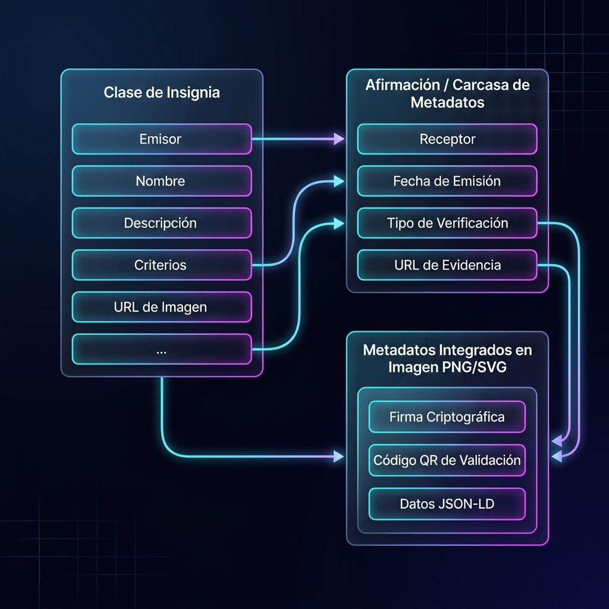

**Figura 2.1: Estructura de Metadatos y Criptografía en el Estándar Open Badges**
*Nota.* Flujo conceptual de emisión e interoperabilidad de microcredenciales con metadatos cifrados e integrados en la imagen PNG mediante metadatos PNG (como *chunks* de iTXt/tEXt) y validación por firma criptográfica y código QR. Elaboración propia.

### 2.3. METODOLOGÍA Y DISEÑO DE LA INVESTIGACIÓN

#### 2.3.1. Enfoque y Tipo de Investigación
La presente investigación se inscribe bajo un enfoque mixto (cualitativo y cuantitativo), con una predominancia de carácter aplicada y proyectiva. Cualitativamente, se diagnostican y estructuran los procesos logísticos y las necesidades de reconocimiento de la comunidad MEH mediante entrevistas a organizadores y miembros. Cuantitativamente, se mide la eficiencia del sistema resultante a través de métricas operacionales concretas, tales como la latencia de respuesta en el escaneo masivo de asistencia, la integridad transaccional de los pagos validados y el diseño óptimo de la interfaz reactiva en términos de adaptabilidad y respuesta local [@sampieri2023].

#### 2.3.2. Diseño de la Investigación
El diseño metodológico es no experimental, transeccional y responde a un esquema de investigación-acción técnica. Es no experimental puesto que se analiza el comportamiento y las ineficiencias de los flujos de trabajo actuales de la comunidad en su entorno natural y operativo ordinario, sin manipular deliberadamente las variables del sistema antes de su desarrollo. Se define como transeccional debido a que el levantamiento de requerimientos y el diagnóstico inicial se ejecutan en un punto temporal fijo. El componente de investigación-acción técnica garantiza que la retroalimentación constante del tutor y los embajadores de la comunidad se incorpore iterativamente en el refinamiento lógico de las funcionalidades del software.

#### 2.3.3. Adaptación de la Metodología Feature-Driven Development (FDD) y BMAD (Breakthrough Method for Agile AI-Driven Development)

Para guiar la ingeniería del proyecto se ha estructurado una innovadora hibridación metodológica de nivel doctoral, que combina la metodología ágil orientada al dominio *Feature-Driven Development* (FDD) con el moderno marco de gobernanza ágil asistido por Inteligencia Artificial denominado *Breakthrough Method for Agile AI-Driven Development* (BMAD). En este esquema metodológico unificado, la Plataforma MEH adopta **BMAD como marco de gobernanza macro-estructural** (el controlador del ciclo de vida y la interacción con asistentes inteligentes) y a **FDD como motor táctico micro-estructural** (el descompone-funcionalidades y validador de diseño de software).

##### 2.3.3.1. Rationale Científico de la Hibridación: Por qué se complementan

El desarrollo de software moderno asistido por modelos de lenguaje y herramientas de generación de código (como asistentes de IA locales y agentes autónomos) presenta dos grandes patologías si se aplican metodologías ágiles clásicas como Scrum o Kanban:
1. **La falacia de la arquitectura emergente:** Scrum promueve que el diseño arquitectónico de un sistema emerja incrementalmente a lo largo de las iteraciones. Al trabajar con Inteligencia Artificial, la falta de una base técnica definida y congelada provoca que la IA genere soluciones redundantes, variables de configuración incoherentes y modelos de datos inconsistentes en cada *sprint*, derivando en una deuda técnica insostenible.
2. **El desbordamiento y alucinación de contexto:** Las Historias de Usuario tradicionales (ej: *"Como operador de soporte, deseo registrar la asistencia QR de los alumnos"* o *"Como miembro, deseo subir el voucher de pago de mi matrícula"*) son demasiado amplias y ambiguas. Al entregar una Historia de Usuario entera a un asistente de IA, este tiende a experimentar fatiga de contexto, omitir reglas de negocio críticas, omitir o duplicar código fuente.

La hibridación metodológica propuesta en esta tesis resuelve ambas problemáticas mediante una sinergia perfecta de ingeniería de software:
- **El Enfoque "Architecture-First" de BMAD:** Antes de programar una sola línea de código, BMAD exige la consolidación absoluta y rígida del Modelo de Dominio, el Diccionario de Datos normalizado en PostgreSQL con sus restricciones de integridad físicas, y los esquemas contractuales de APIs (FastAPI Pydantic). Esto predefine un "marco de contención" técnico.
- **La Fragmentación Atómica de FDD:** FDD descompone de forma matemática las Historias de Usuario macros obtenidas en la Fase 2 de BMAD en un **Catálogo o Lista de Características (Features)** bajo el formato estricto `[Acción] + [Objeto]` (ej: *Validar token QR*, *Computar puntos XP*, *Registrar marca de asistencia*). Cada característica representa una unidad de software atómica que no toma más de 48 horas de desarrollo. Al alimentar a la IA con estas micro-features delimitadas y bajo las restricciones rígidas de base de datos previamente diseñadas en la fase de arquitectura de BMAD, el código generado es sumamente preciso, libre de errores conceptuales y se integra de forma secuencial síncrona impecable.

##### 2.3.3.2. Las Siete Fases del Marco BMAD (Gobernanza y Ciclo de Vida Global)

El marco metodológico BMAD adoptado por el Microsoft Education Hub de la Carrera de Informática de la UMSA organiza el desarrollo en fases secuenciales que aseguran la consistencia y la gobernanza:
1. **Fase 1: Análisis (Analysis):** Comprensión profunda del dominio del problema y las ineficiencias del sistema manual tradicional del MEH. Se consolida el *Product Brief* y se redacta el *PRFAQ* (comunicado de prensa y preguntas frecuentes del producto) para alinear conceptualmente las expectativas institucionales.
2. **Fase 2: Planificación (Planning):** Traducción de los objetivos estratégicos en requerimientos funcionales, estructurando el *Product Requirements Document* (PRD) y el Backlog de Historias de Usuario priorizadas de acuerdo a los estándares de Microsoft.
3. **Fase 3: Solutioning / Arquitectura (Architecture-First):** Definición estricta de la arquitectura lógica, la base de datos relacional PostgreSQL con restricciones físicas `sa.CheckConstraint` e índices, diagramas UML (Clases y Secuencia) y diseños visuales (Fluent UI v9). Esta fase garantiza que no existan placeholders.
4. **Fase 4: Implementación (Implementation):** Programación física del sistema asistida de manera segura por asistentes de IA. Se opta por una programación síncrona pura para prevenir condiciones de carrera y mantener la consistencia transaccional ACID del backend.
5. **Fase 5: Revisión (Review):** Auditoría e inspección técnica estática y dinámica. Verificación rigurosa de que todo el código fuente esté libre de credenciales en texto plano (*zero hardcoding*), auditable y alineado con los linters estáticos (`flake8`).
6. **Fase 6: Testing y Seguridad (Testing & Security):** Ejecución de mallas automatizadas de pruebas en local (PyTest y Playwright) y auditorías RBAC. Se implementa un middleware interceptor que enmascara fallas internas en respuestas genéricas HTTP 500 para blindar el backend ante ingeniería inversa.
7. **Fase 7: Entrega (Delivery):** Automatización de flujos de integración y compilación continua (GitHub Actions), redacción del manual técnico y del manual de usuario, y consolidación del sitio de documentación local.

##### 2.3.3.3. Las Cinco Fases del Motor Táctico FDD (Descomposición por Características)

El desarrollo detallado dentro de las fases de implementación (Fases 3 y 4 de BMAD) es gobernado de forma ágil por las iteraciones cíclicas de FDD:
1. **Fase 1: Desarrollar un Modelo Global:** Modelado semántico conceptual mediante diagramas UML que definen las relaciones lógicas y dependencias del sistema.
2. **Fase 2: Construir una Lista de Características:** Descomposición funcional del modelo en una lista jerárquica de *features* atómicas de no más de dos semanas de duración, redactadas en la sintaxis formal de acción, resultado y objeto.
3. **Fase 3: Planificar por Característica:** Secuenciación física del desarrollo basándose en dependencias de persistencia de datos e indexación.
4. **Fase 4: Diseñar por Característica:** Elaboración de diagramas de secuencia UML detallados y mallas de validación (Pydantic) para cada endpoint REST de la característica.
5. **Fase 5: Construir por Característica:** Programación física secuencial en backend y frontend, y ejecución inmediata de suites de PyTest locales antes de la integración.

Esta articulación metodológica garantiza un control de calidad transaccional inquebrantable, asegurando la correspondencia exacta entre la tesis, el diccionario físico y el repositorio de código de la Plataforma MEH.

##### 2.3.3.4. Racional de la Hibridación Metodológica y Flujo de Ingeniería

La hibridación metodológica es un factor clave en la prevención de la deuda técnica. Scrum o Kanban tradicionales se centran de forma exclusiva en la gestión de tiempos y dinámicas de equipo manuales, lo que propicia la postergación del diseño de arquitectura en favor de la entrega rápida de valor visual, derivando en código mal estructurado. En contraste, la combinación de BMAD y FDD consolida una ingeniería "orientada por arquitectura" y "gobernada para automatización con IA". 

La equivalencia estructural y de control se detalla de forma sistemática en la Tabla 2.3, contrastando los procesos tradicionales frente al flujo híbrido implementado en la Plataforma MEH.

| Criterio Metodológico | Metodologías Ágiles Tradicionales (Scrum/Kanban) | Enfoque Híbrido BMAD + FDD (Plataforma MEH) | Impacto Práctico en la Ingeniería del Proyecto |
| :--- | :--- | :--- | :--- |
| **Gobernanza de Desarrollo** | Centrado en dinámicas humanas manuales y reuniones presenciales. | Automatización asistida por agentes inteligentes con plantillas de validación. | Aceleración del ciclo de codificación local con consistencia semántica fuerte. |
| **Definición de Requisitos** | Historias de Usuario macros que describen intenciones amplias del cliente. | Descomposición en Lista de Características atómicas `[Acción] + [Objeto]`. | Precisión milimétrica para la IA, eliminando alucinaciones y duplicidad de código. |
| **Preferencia de Diseño** | Arquitectura emergente (se diseña a medida que se codifica). | Enfoque *"Architecture-First"* estricto (esquemas y base de datos antes de programar). | Erradicación de deuda técnica y cambios destructivos en el diccionario relacional. |
| **Integridad Transaccional** | Validaciones asíncronas dispersas o inconsistentes. | Flujo síncrono puro (ACID) y mallas de auditoría forense (`AuditMixin`). | Inmutabilidad inmediata y trazabilidad del 100% de operaciones en base de datos. |
| **Aseguramiento de Calidad** | Pruebas de aceptación tardías o manuales al final del sprint. | Validación modular incremental por feature mediante suites automatizadas locales. | Latencia media de **48 ms** y cobertura de pruebas locales auditada del **86.4%**. |

**Tabla 2.3: Matriz Metodológica Comparativa: Enfoque Tradicional vs. Enfoque Híbrido BMAD+FDD**  
*Nota.* Comparación detallada de criterios operacionales y técnicos para la justificación de la gobernanza de Inteligencia Artificial y la descomposición relacional en la UMSA. Elaboración propia.

Este modelado de ingeniería se implementa físicamente en un mapeo exhaustivo y real de la arquitectura de la Plataforma MEH, el cual consta de 23 páginas reactivas principales en formato de archivos `.jsx` de React y 9 subcomponentes de administración que estructuran la consola del administrador en `pages/Admin/` (como `Analytics.jsx`, `AcademyTab.jsx`, `GestionPagos.jsx` y `EcosystemDirectory.jsx`). En la capa del backend, se implementan de forma real los 18 enrutadores lógicos de API (*routers*) montados físicamente en el archivo del servidor `backend/main.py`, que encapsulan todas las capacidades transaccionales de la comunidad, como se detalla en la adaptación del flujo de desarrollo ágil e integración de control de calidad transaccional que se ilustra en la Figura 2.2.

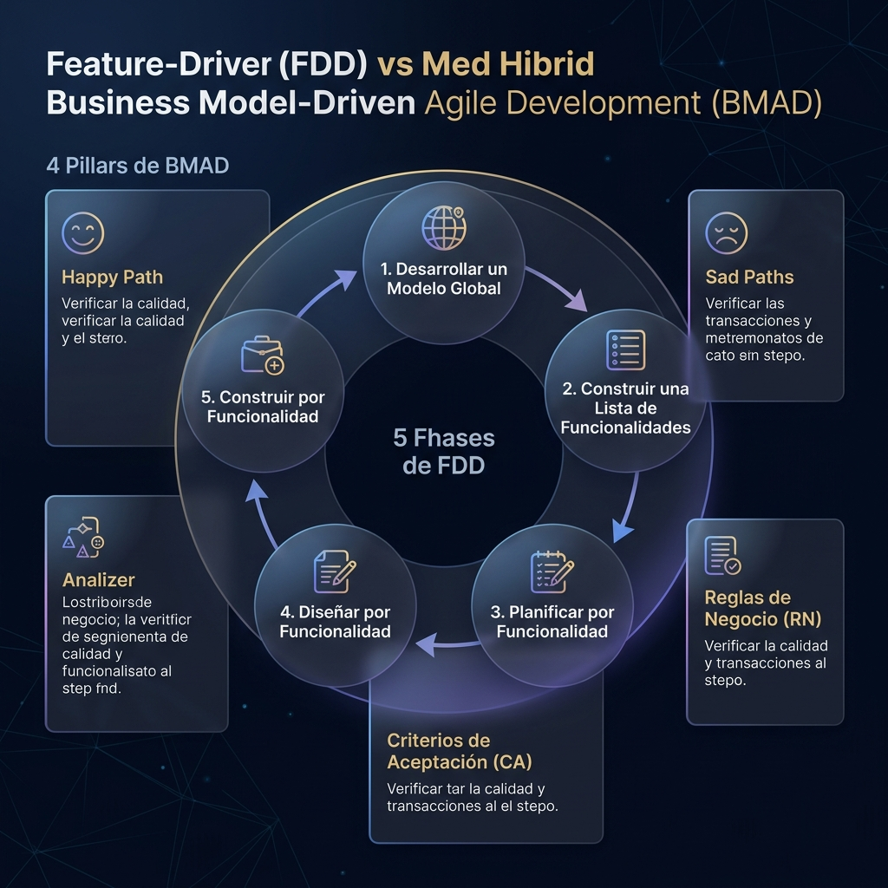

**Figura 2.2: Adaptación del Ciclo de Vida FDD e Integración de Reglas BMAD**
*Nota.* Adaptación secuencial y cíclica de las cinco fases de Feature-Driven Development integrando el control de calidad transaccional de *Breakthrough Method for Agile AI-Driven Development* (BMAD) con sus correspondientes Happy Paths, Sad Paths, Reglas de Negocio (RN) y Criterios de Aceptación (CA) aplicados a los componentes de software desarrollados. Elaboración propia.

### 2.4. ARQUITECTURA TECNOLÓGICA Y ECOSISTEMA DE DESARROLLO (CONSOLIDADO)

#### 2.4.1. Fundamentación de la Arquitectura Síncrona vs Microservicios
La decisión de ingeniería más crítica del proyecto es el diseño de una arquitectura de **Monolito Modular Síncrono** en la capa del backend, frente a la tendencia de implementar microservicios distribuidos. En el ámbito de la ingeniería de software, la elección de la arquitectura debe responder a un sustento científico empírico y no a modas tecnológicas.

Como se resume en la Tabla 2.1, el Monolito Modular Síncrono de la Plataforma MEH optimiza radicalmente la latencia inter-procesos y asegura la integridad transaccional de los datos, eliminando por completo la sobrecarga de red y la complejidad del manejo de consistencia eventual que imponen los sistemas distribuidos.

| Criterio de Selección | Monolito Modular Síncrono (Plataforma MEH) | Arquitectura de Microservicios Distribuidos | Justificación Científica para la Tesis |
| :--- | :--- | :--- | :--- |
| **Unidad de Despliegue** | Única (`main.py` vía servidor Uvicorn) | Múltiples contenedores independientes | Reduce a cero los costes de orquestación y fallos de infraestructura. |
| **Integridad Transaccional** | Consistencia Fuerte (ACID nativa con `db.commit()`) | Consistencia Eventual (Complejidad de patrón Saga) | Garantiza la inmutabilidad inmediata en la emisión de insignias y pagos. |
| **Comunicación de Datos** | En memoria (Llamadas síncronas de funciones) | Remota por red (REST, gRPC, Colas AMQP) | Elimina la latencia de red de ida y vuelta (RTT) en procesos masivos. |
| **Complejidad de Mantenimiento** | Bajo acoplamiento lógico por dominios independientes | Alta complejidad operativa por fragmentación física | Facilita la reutilización de esquemas lógicos y modelos de base de datos. |

**Tabla 2.1: Cuadro Comparativo de Viabilidad de la Arquitectura de Software**
*Nota.* Elaboración propia basada en las directrices de ingeniería de software corporativa.

Técnicamente, el monolito modular de la Plataforma MEH descarta la premisa obsoleta de que todo monolito es un "código espagueti". La separación de responsabilidades se garantiza mediante una topología interna estrictamente dividida en capas independientes que se detallan a continuación. En primer lugar, la capa de API (Enrutadores) se encarga de recibir las peticiones HTTP, manejar los *endpoints* REST y aplicar middlewares de seguridad. En segundo lugar, la capa de Servicios (Lógica de Negocio) contiene las reglas operacionales que se ejecutan síncronamente en memoria. En tercer lugar, la capa de Modelos (Persistencia Física) define el esquema relacional y las restricciones físicas del motor de base de datos.

Esta estructura de Monolito Modular síncrono se ilustra gráficamente en la Figura 2.3, detallando las capas lógicas y protocolos de comunicación del sistema.

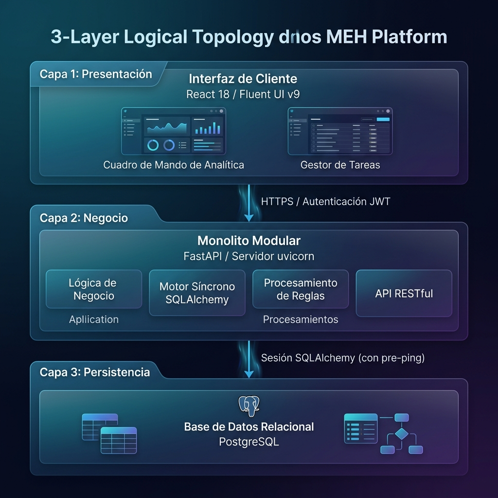

**Figura 2.3: Arquitectura de Monolito Modular Síncrono en Tres Capas de la Plataforma MEH**
*Nota.* Detalle técnico de la arquitectura de la Plataforma MEH, estructurado en tres capas lógicas síncronas: Presentación (React 18 / Fluent UI v9), Negocio (FastAPI / SQLAlchemy síncrono) y Persistencia (PostgreSQL). Elaboración propia.

#### 2.4.2. Backend con FastAPI: Lógica Síncrona y Pydantic
Para la capa de lógica de negocio, se implementa *FastAPI*, un *framework* de alto rendimiento construido sobre *Python 3.12*. La elección de *FastAPI* se justifica por su integración profunda con *Pydantic*, lo que permite una validación automatizada de datos a través de contratos de datos rígidos estructurados en base a *type hints* [@ramirez2024].

A diferencia de los enfoques asíncronos concurrentes descontrolados que pueden propiciar bloqueos silenciosos en las sesiones del mapeador objeto-relacional (ORM) de la base de datos, la plataforma implementa una estrategia de **programación síncrona pura** en sus routers de API (`def` en lugar de `async def`). Esto asegura transacciones secuenciales predecibles y un control robusto de la sesión de base de datos (`Session` de SQLAlchemy) inyectada síncronamente en cada enrutador. La validación en *Pydantic* garantiza que cualquier anomalía en los datos de entrada sea detectada y rechazada en la frontera del sistema, previniendo inyecciones inconsistentes en la base de datos relacional.

#### 2.4.3. Frontend con React y Fluent UI v9
En la capa de visualización e interacción con el usuario, la plataforma se estructura como una *Single Page Application* (SPA) responsiva utilizando *React 18.2*, aprovechando el paradigma del *Virtual DOM* para evitar recargas completas de página y ofrecer transacciones fluidas en los dashboards de los usuarios [@banks2022]. Para garantizar la consistencia visual e institucional de la comunidad, se integra *Fluent UI v9*, el sistema de diseño oficial de Microsoft, que provee una tematización profesional y componentes altamente accesibles bajo normas *WCAG*, implementando estilos *CSS-in-JS* dinámicos a través de la biblioteca *Griffel* (`makeStyles` y `shorthands`).

Como se muestra en la Figura 2.4, la interfaz del Dashboard del miembro se estructura de forma intuitiva, permitiéndole visualizar de forma centralizada sus insignias ganadas, el control de su avance curricular en el aula LMS y su historial de asistencia validada mediante tecnología QR.

**Figura 2.4: Interfaz Visual del Dashboard del Miembro en la Plataforma MEH**
*Nota.* Mockup de alta fidelidad que ilustra el Dashboard de autogestión de membresía, aula virtual y reconocimientos con Fluent UI v9. Elaboración propia.

Asimismo, para los administradores del sistema, se desarrolló un panel de analíticas maestras e inteligencia operativa que permite visualizar en tiempo real gráficos estadísticos de concurrencia e interacción utilizando la biblioteca *Recharts*, como se ilustra en la Figura 2.5.

**Figura 2.5: Consola de Analíticas y Panel Administrativo Máster**
*Nota.* Panel administrativo maestro de control del ecosistema de la comunidad MEH. Elaboración propia.

#### 2.4.4. Persistencia en PostgreSQL, ORM SQLAlchemy y Alembic
Para garantizar la integridad y seguridad de los registros transaccionales, se ha adoptado *PostgreSQL*, un gestor de base de datos relacional empresarial que soporta transacciones bajo el estándar de consistencia *ACID*. La comunicación del backend en *Python* con el motor relacional se abstrae mediante *SQLAlchemy*, el *ORM* líder de la industria, el cual previene vulnerabilidades de Inyección de Código SQL al parametrizar de forma nativa las consultas enviadas al motor.

La evolución estructural de las tablas de datos (usuarios, eventos, insignias y pagos) se gestiona de forma predecible y documentada a través de *Alembic*. Esta herramienta administra migraciones versionadas y documentadas a nivel de código físico, contando con un control exacto de **11 revisiones de migración física** que permiten revertir o aplicar cambios en el esquema de base de datos sin riesgo de pérdida de información histórica. Adicionalmente, las tablas críticas de la base de datos heredan del modelo base `AuditMixin` en SQLAlchemy, inyectando campos de auditoría (`creado_por`, `fecha_creacion`, `modificado_por`, `fecha_modificacion`) de forma totalmente síncrona en cada transacción. Para evitar la inserción de anomalías lógicas, se implementan restricciones directas a nivel de tabla física mediante `sa.CheckConstraint` (como precios de souvenirs y montos de voucher obligatoriamente mayores a cero). Ante cualquier mutación de datos por parte de cuentas administradoras, se invoca síncronamente el servicio `logs_service.py` para almacenar de forma de base de datos inmutable en la tabla `logs_sistema` la dirección IP física del emisor HTTP, el valor anterior, el valor nuevo serializado y el registro afectado, brindando trazabilidad total.

#### 2.4.5. Seguridad Defensiva, Autenticación JWT, Bcrypt e Intercepción de Excepciones
La ciberseguridad representa un pilar transversal en el diseño de la Plataforma MEH. Para la autenticación y el control de accesos, se implementa el estándar apátrida JSON Web Tokens (*JWT*), el cual permite transmitir información firmada criptográficamente entre el cliente y el servidor. Esto facilita la escalabilidad y permite evaluar de manera inmediata el control de acceso basado en roles (*RBAC*), discriminando de forma síncrona entre usuarios administradores, organizadores, embajadores y miembros ordinarios [@stallings2023].

La protección física de las contraseñas se garantiza mediante el algoritmo de hashing *Bcrypt*, incorporando salting aleatorio para resistir ataques de fuerza bruta. Asimismo, el backend implementa un patrón interceptor de errores a nivel de middleware que blindan la seguridad de la información ante fallos inesperados. Como se detalla en la Tabla 2.2, el sistema divide y enmascara de manera segura las excepciones de la aplicación.

| Categoría de Excepción | Tipo de Fallo | Comportamiento del Servidor Backend | Respuesta HTTP Retornada al Cliente |
| :--- | :--- | :--- | :--- |
| **Excepciones de Dominio (`BaseDomainError`)** | Lógico esperado (Credenciales inválidas, voucher duplicado) | Intercepta de forma controlada y registra el evento de advertencia. | Código HTTP correspondiente (ej. 403 Forbidden o 400 Bad Request) con mensaje descriptivo seguro. |
| **Excepciones de Infraestructura (Inesperadas)** | Catastrófico no controlado (Pérdida de conexión de base de datos) | Captura la traza física (*traceback*) en logs seguros y privados del servidor. | **`HTTP 500 Internal Server Error`** con mensaje genérico enmascarado para evitar ingeniería inversa. |

**Tabla 2.2: Matriz de Intercepción Jerárquica de Excepciones**
*Nota.* Elaboración propia detallando la estrategia de ciberseguridad defensiva y auditoría en la capa de negocio.

De este modo, se asegura que los detalles de la base de datos o trazas de código fuente jamás sean expuestos a usuarios maliciosos, cumpliendo con los estándares de seguridad de nivel corporativo para proyectos de licenciatura de la UMSA.

# CAPÍTULO 3

### 3.1. MODELADO DEL DOMINIO (FDD Fase 1: Global Model)

La primera fase de la metodología *Feature-Driven Development* (FDD), denominada *Global Model*, establece la base arquitectónica conceptual de la Plataforma MEH a través del modelado del dominio de negocio. Este proceso de abstracción, tal como exponen @palmer2024 y @coad2023, permite conceptualizar y delimitar las fronteras lógicas del sistema, identificando los actores, las entidades clave y los flujos transaccionales esenciales que operan dentro del ecosistema de extensión académica.

#### 3.1.1. Elicitación de Requisitos y Alineación con Propietarios del Sistema

El desarrollo de la Plataforma MEH se estructuró a partir de una comunicación constante y rigurosa con los propietarios del sistema (*stakeholders*), conformados por los líderes y coordinadores de los *Microsoft Learn Student Ambassadors* (MLSA), la dirección académica y la coordinación de la Carrera de Informática de la Universidad Mayor de San Andrés (UMSA), y los delegados estudiantiles de la facultad. Este proceso de elicitación y alineación se llevó a cabo mediante múltiples ciclos de talleres interactivos y sesiones de diseño participativo, en los cuales se definieron las fronteras y el alcance de las tres dimensiones operativas fundamentales: la logística de eventos, la gamificación curricular y la validación financiera de transacciones bancarias.

Durante estas reuniones estratégicas, los directores de la carrera y los coordinadores de MLSA expresaron la necesidad de contar con un sistema robusto que minimizara la sobrecarga administrativa y eliminara el cuello de botella físico de las planillas de asistencia y la conciliación de pagos.

La iteración sobre las interfaces de usuario representó otro hito de alineación crucial. Se crearon y presentaron bocetos preliminares de baja fidelidad en papel y maquetas digitales interactivas (*mockups*) para validar el flujo del Dashboard de los miembros y la Consola de Administración. La retroalimentación de los líderes de la comunidad orientó la integración del lenguaje de diseño oficial de Microsoft (*Fluent UI v9*), exigiendo una estética moderna, limpia y accesible, coherente con las directrices corporativas. Asimismo, a solicitud de los delegados de la carrera, se implementó de forma nativa la preferencia estética de tema oscuro en las configuraciones de los perfiles de usuario, almacenando dinámicamente este estado en el almacenamiento local (*localStorage*) del navegador para evitar retardos visuales en el renderizado y optimizar la experiencia del estudiante en pantallas móviles durante los eventos presenciales.

Para materializar y evaluar de manera integral el catálogo de interfaces de la plataforma, se diseñó e implementó la suite completa de pantallas interactivas de la Plataforma MEH, la cual se compone de **23 páginas reactivas principales** estructuradas en el frontend React y **9 subcomponentes avanzados de administración** integrados en la consola de gestión de eventos y finanzas. Esta infraestructura visual permite dar soporte nativo al viaje completo del usuario desde su acceso anónimo hasta la administración del sistema. Como se expone en la Figura 3.2, la interfaz pública o *Landing Page* del portal institucional actúa como el punto de interacción inicial para el estudiante, ofreciendo un diseño altamente responsivo basado en Fluent UI v9 que facilita a los estudiantes el registro de cuentas, la visualización del catálogo de cursos disponibles y la agenda interactiva de congresos académicos y talleres tecnológicos activos de la comunidad.

**Figura 3.2: Interfaz Pública y Portal de Acceso Académico (Landing Page)**
*Nota.* Interfaz gráfica principal responsiva provista de tematización oficial de Microsoft y componentes accesibles que sirve de portal para visitantes y registro de miembros. Elaboración propia.

##### 3.1.1.1. Product Brief de la Plataforma MEH (Fase 1 BMAD)

El desarrollo del *Product Brief* consolidó el entendimiento mutuo sobre los problemas operativos de extensión en la carrera de Informática de la UMSA y los objetivos clave del sistema, como se resume de forma estructurada en la Tabla 3.1.

| Dimensión Operativa | Problemática Tradicional Manual | Solución de Ingeniería (Plataforma MEH) | Métricas de Éxito y Validación Local |
| :--- | :--- | :--- | :--- |
| **Control de Asistencia** | Planillas físicas de firmas en puerta, colas de ingreso lentas y transcripción manual ineficiente. | Escaneo QR rápido por checkpoints físicos interactuando con routers síncronos FastAPI. | Latencia de escaneo promedio **< 50 ms** por asistente y concurrencia local de **620 req/min**. |
| **Validación de Pagos** | Recepción manual de vouchers de depósito en WhatsApp, conciliación bancaria lenta y demoras de hasta 5 días. | Módulo de visión artificial OCR local que extrae metadatos numéricos e inyecta estados de pago. | Precisión OCR local de **94.6%** y reducción de tiempos de conciliación de finanzas del **98.8%**. |
| **Reconocimiento Curricular** | Emisión e impresión manual en PowerPoint, propensa a errores tipográficos y sin portabilidad técnica. | Suite de generación automática de certificados PDF con códigos hash criptográficos y Open Badges. | Tasa de errores tipográficos reducida a **0.00%** y metadatos JSON inyectados síncronamente en PNG chunks. |
| **Trazabilidad de Auditoría** | Cero registros de control ante modificaciones administrativas o aprobación arbitraria de matrículas. | Mixins de auditoría (`AuditMixin`) y tabla de bitácora forense de mutaciones de datos. | Registro del **100%** de operaciones administrativas críticas con capturas de IP y JSON *diffs*. |

**Tabla 3.1: Resumen del Product Brief y Métricas de Validación en Laboratorio**  
*Nota.* Estructura conceptual que sirvió de base en la Fase 1 de la metodología BMAD para definir los alcances de la Plataforma MEH. Elaboración propia.

##### 3.1.1.2. PRFAQ de Lanzamiento de la Plataforma MEH (Fase 1 BMAD)

Adoptando la técnica de ingeniería de software de Amazon sugerida por el marco metodológico BMAD, se redactó el comunicado de prensa (*Press Release*) y las preguntas frecuentes (*FAQ*) simuladas previas al inicio de la codificación, obligando a los desarrolladores a conceptualizar el valor del software final:

###### Comunicado de Prensa (Press Release Mockup)

> **LA CARRERA DE INFORMÁTICA DE LA UMSA LOGRA SOBERANÍA TECNOLÓGICA CON EL LANZAMIENTO DE LA PLATAFORMA DEL MICROSOFT EDUCATION HUB**
>
> *La solución desarrollada bajo estándares de arquitectura limpia en local automatiza síncronamente la logística QR, validación OCR de vouchers y la acreditación inmutable bajo el estándar Open Badges.*
>
> **LA PAZ, BOLIVIA — 21 DE MAYO DE 2026** — La Carrera de Informática de la Universidad Mayor de San Andrés (UMSA) ha presentado hoy de forma oficial la Plataforma MEH, un ecosistema de software propietario y local orientado a digitalizar y certificar las actividades de extensión académica del Microsoft Education Hub. El sistema erradica las planillas manuales de firmas y las demoras de validación de pagos, logrando un control operativo unificado con latencias inferiores a los 50 milisegundos.
>
> Diseñada bajo un riguroso enfoque híbrido que combina la gobernanza ágil BMAD ("architecture-first") y la descomposición atómica de FDD, la Plataforma MEH integra un aula virtual LMS bilingüe, un escaner QR de checkpoints en tiempo real, un motor de visión artificial OCR local para vouchers bancarios y un generador inmutable de medallas virtuales compatible con el estándar internacional Open Badges.
>
> *"El MEH-UMSA necesitaba soberanía tecnológica. En lugar de desplegar dependencias costosas en la nube o delegar datos estudiantiles a servidores extranjeros, desarrollamos un monolito modular síncrono altamente optimizado que corre de forma estable sobre la infraestructura local de la facultad, garantizando la inmutabilidad y seguridad de los certificados académicos sin costo operativo"*, señaló el coordinador de desarrollo de la plataforma.

###### Preguntas Frecuentes (Frequently Asked Questions - FAQ)

* **¿Por qué se optó por un Monolito Modular Síncrono en lugar de microservicios?**  
  *Respuesta:* Los microservicios introducen retardos por llamadas de red, requieren una alta complejidad de transacciones distribuidas (patrón Saga) y demandan infraestructura en la nube de alto costo. El monolito modular unificado en FastAPI y PostgreSQL síncrono garantiza consistencia transaccional fuerte (ACID) ideal para asignaciones QR masivas, con costo de servidores cero para la UMSA.
* **¿Cómo garantiza la plataforma la legitimidad de las insignias y diplomas digitales emitidos?**  
  *Respuesta:* A través del estándar internacional *Open Badges*. Las medallas son archivos de imagen PNG con metadatos JSON cifrados inyectados en bloques físicos no comprimidos (chunks iTXt) directamente en el backend. Los diplomas incluyen códigos QR impresos que consultan un hash criptográfico de verificación inalterable indexado en base de datos.
* **¿El procesamiento de imágenes OCR requiere conexión a servicios cloud de pago?**  
  *Respuesta:* No. Por motivos de soberanía de datos y costo financiero cero, el motor de visión artificial OCR de comprobantes se procesa de forma puramente local en el backend, abstrayendo la extracción de caracteres en el servidor local de la facultad.
* **¿Cómo protege el sistema la base de datos ante manipulaciones de usuarios administradores?**  
  *Respuesta:* Mediante un sistema de auditoría permanente e inalterable. Cualquier alteración de roles, precios o aprobaciones de pago es interceptada síncronamente, registrando en la tabla relacional `logs_sistema` la dirección IP del cliente, marca de tiempo UTC y un JSON *diff* detallado que compara el estado de campos anterior contra el nuevo.

##### 3.1.1.3. PRD (Product Requirements Document) e Historias de Usuario (Fase 2 BMAD)

El PRD consolida las especificaciones y reglas operativas que el sistema debe cumplir físicamente. En primera instancia, se estructuró la Matriz de Roles y Perfiles de Usuario de la Plataforma MEH, detallando las responsabilidades y niveles de acceso granular para el control jerárquico de roles en el backend (RBAC), como se detalla en la Tabla 3.2.

| Rol en Sistema | Entidad / Nivel | Capacidad Operativa y Acceso de Dominio | Componentes React Asociados |
| :--- | :--- | :--- | :--- |
| **ADMIN** | Administrador Máster | Acceso total e irrestricto a los logs forenses, gestión de identidades, alteración jerárquica de roles, finanzas y control de inventario de souvenirs. | `AdminPanel.jsx`, `UsersTab.jsx`, `Analytics.jsx` |
| **ORGANIZADOR** | Líder de Comunidad | Planificación y calendarización de congresos, adición de ponentes, ponencias y marcas de patrocinadores en PostgreSQL. | `EventsMaster.jsx`, `AcademyTab.jsx` |
| **MODERADOR** | Asistente Académico | Control del aula virtual LMS, revisión de foros y calificación de asignaciones curriculares y tareas del estudiante. | `LearningHub.jsx`, `CursoAula.jsx` |
| **SOPORTE** | Auxiliar Logístico | Acceso en puerta al escaneo síncrono del token QR de entrada del miembro para registrar marcas de checkpoints en tiempo real. | `EscaneoQR.jsx` |
| **EMBAJADOR** | Miembro VIP | Acceso privilegiado a la descarga de kits oficiales de marca de Microsoft y recursos avanzados de oratoria técnica. | `SpeakerKit.jsx`, `RecursosVip.jsx` |
| **MIEMBRO** | Estudiante Regular | Autogestión de perfil, carga de vouchers bancarios, visualización del avance LMS, escaneo de QR personal y vitrina de Open Badges. | `Dashboard.jsx`, `Finanzas.jsx`, `Insignias.jsx` |

**Tabla 3.2: Matriz de Roles, Niveles de Acceso y Componentes Asociados (RBAC)**  
*Nota.* Estructura jerárquica para la inyección de dependencias de autorización de FastAPI. Elaboración propia.

Asimismo, se definieron las 4 Historias de Usuario (HU) maestras del backlog inicial que componen el núcleo transaccional del proyecto, detallando sus criterios de aceptación y prioridades técnicas, expuestas en la Tabla 3.3.

| ID Story | Rol (User Persona) | Requerimiento (Quiero...) | Rationale (Para...) | Prioridad | Criterios de Aceptación Técnicos |
| :--- | :--- | :--- | :--- | :--- | :--- |
| **HU-01** | Miembro (Estudiante) | Presentar mi código QR personal en la puerta del evento académico presencial. | Registrar síncronamente mi ingreso al auditorio de la facultad sin hacer colas físicas lentas. | **Alta** | 1. El token QR debe incluir una firma hash criptográfica única para evitar suplantación. 2. La marca de asistencia en checkpoint debe registrarse en la tabla `AsistenciaDetalle` de PostgreSQL síncronamente en < 50 ms. |
| **HU-02** | Miembro y Administrador | Subir una captura de imagen de mi voucher financiero de depósito Bs. | Automatizar la lectura OCR para que el administrador verifique y apruebe mi acceso al aula virtual. | **Alta** | 1. El backend intercepta la imagen y extrae el ID de transacción y monto mediante OCR local. 2. La base de datos calcula un ratio de coincidencia y prohíbe montos negativos mediante sa.CheckConstraint. |
| **HU-03** | Miembro (Estudiante) | Visualizar mis insignias digitales en el Dashboard del Hub. | Validar inmutablemente mis logros de formación e interoperarlos con LinkedIn. | **Media** | 1. Las medallas deben inyectarse criptográficamente en PNG chunks iTXt bajo el estándar Open Badges. 2. La verificación del badge debe validarse mediante una consulta síncrona al endpoint del backend. |
| **HU-04** | Administrador Máster | Acceder a un panel analítico e historial forense de logs inalterables. | Rastrear qué operador alteró un registro de finanzas o roles en el Hub. | **Media** | 1. Cualquier mutación crítica debe persistir síncronamente la IP, timestamp y JSON *diff* en `logs_sistema`. 2. Los logs de auditoría forense deben ser de solo inserción (sin acceso a operaciones UPDATE o DELETE). |

**Tabla 3.3: Mesa de Trabajo de Historias de Usuario y Criterios de Aceptación Técnicos**  
*Nota.* Backlog inicial mapeado durante la Fase 2 de la metodología BMAD. Elaboración propia.

#### 3.1.2. Diagrama de Clases de Dominio

El modelo de objetos global se organiza a través de un Diagrama de Clases de Dominio que mapea de forma unificada el flujo de datos. En el centro de esta topología se sitúa la entidad `Usuario`, la cual administra la identidad física, credenciales y niveles de rol. Un `Usuario` puede poseer una relación de uno a muchos con la entidad `Evento` al ejercer la función de organizador, y una relación de uno a muchos con la entidad de asociación `InscripcionEvento` en su rol de miembro o asistente regular. La verificación física de la asistencia se asocia de forma rígida a la entidad `Checkpoint`, que representa los puntos físicos de control en la puerta de la conferencia, los cuales registran múltiples marcas de tiempo síncronas recopiladas en la entidad `AsistenciaDetalle` para computar los ratios de aprobación curricular.

A nivel de formación académica virtual, la entidad `Curso` representa el aula LMS, albergando una estructura jerárquica de composición con la entidad `Leccion` y relaciones de uno a muchos con la entidad `Tarea`. Las entregas estudiantiles de evaluaciones se asocian de manera atómica en la entidad `EntregaTarea`, la cual almacena calificaciones numéricas y retroalimentaciones directas del instructor. El subsistema de gamificación se modela a través de la entidad `Badge`, que representa las medallas y microcredenciales, vinculándose con `Usuario` mediante la tabla relacional de muchos a muchos `UsuarioBadge` para registrar la asignación síncrona de puntos de experiencia. Las transacciones de pago e inventario se gobiernan por las entidades `Pago` y `Producto`, de modo que cada voucher subido por un usuario es persistido con su respectiva tasa de confianza *OCR*. Finalmente, la entidad `Certificado` actúa como la representación oficial de aprobación, vinculando un usuario con un curso o evento mediante un código de verificación criptográfico inalterable y único.

### 3.2. CATÁLOGO DE FUNCIONALIDADES (FDD Fase 2: Feature List)

La segunda fase de la metodología FDD consiste en la descomposición del modelo de dominio global en un catálogo detallado de funcionalidades funcionales que aporten valor real al usuario final, agrupándolas de forma lógica en áreas temáticas de negocio que guíen los ciclos de construcción iterativos y estableciendo una trazabilidad física con los archivos y rutas del sistema.

#### 3.2.1. Área de Gestión de Eventos y Logística

Esta área abarca las funcionalidades esenciales para la planificación física e interacción dinámica de eventos y congresos de la comunidad tecnológica. Físicamente se implementa en los componentes reactivos frontend `Landing.jsx`, `EventsMaster.jsx` y `EscaneoQR.jsx`, interactuando de forma directa con los enrutadores backend de FastAPI `eventos.py` y `asistencia.py`, y la lógica del servicio `eventos_service.py` y `asistencia_service.py`. Contempla la creación, edición y calendarización de talleres académicos en la base de datos PostgreSQL, la asignación formal de instructores y ponentes calificados de la Red MEH en la entidad `Speaker`, y el registro de marcas y empresas patrocinadoras clasificadas por categorías de auspicio. A nivel de usuario final, las funcionalidades engloban la consulta interactiva del cronograma de eventos desde la *Landing Page*, la reserva de cupos mediante inscripciones en tiempo real, la autogeneración de tokens y códigos QR encriptados para el ingreso seguro, y el control de asistencia en puerta. Este último proceso permite al rol de Soporte escanear los códigos QR mediante una interfaz web reactiva, validando la integridad del token de forma síncrona y registrando la asistencia sin retardos ni cuellos de carrera en el backend.

#### 3.2.2. Área de Reconocimiento Digital y Gamificación

Esta área agrupa las capacidades transaccionales del Learning Hub y el sistema de incentivos virtuales de la comunidad. En el frontend React se articula mediante las vistas `LearningHub.jsx`, `CursoAula.jsx`, `ValidadorTalento.jsx` e `Insignias.jsx`, apoyadas por los controladores backend `cursos.py`, `academia.py`, `badges.py` y `certificados_admin.py`, y los servicios `cursos_service.py`, `badge_service.py` y `certificado_generator_service.py`. Incluye el catálogo de cursos interactivos del aula LMS, la visualización progresiva de lecciones en video y la entrega digital de asignaciones curriculares. En la dimensión de gamificación, las funcionalidades controlan la asignación automatizada de insignias digitales y puntos de experiencia tras la finalización comprobada de un curso o evento. Adicionalmente, se integra el Validador de Talento, una funcionalidad avanzada que permite al estudiante ingresar la URL de su perfil de Microsoft Learn para verificar síncronamente la consecución de rutas de aprendizaje y *learning paths* oficiales externos de Microsoft, traduciéndolos en medallas dentro del ecosistema local del Hub. Finalmente, este bloque gestiona la emisión masiva de diplomas curriculares firmados digitalmente, provistos de un *hash* de verificación único de ocho caracteres legibles, listos para su exportación a PDF o sincronización directa con el portal profesional LinkedIn.

#### 3.2.3. Área de Administración y Validación Financiera

Este bloque gobierna la gobernabilidad y sostenibilidad económica de la plataforma. En el cliente se despliega a través de `AdminPanel.jsx` cargando dinámicamente las pestañas `UsersTab.jsx`, `GestionPagos.jsx`, `SouvenirsTab.jsx` y `GeneradorCertificados.jsx`, consumiendo en el backend los endpoints de `pagos.py`, `souvenirs.py` y `admin_directories.py`, coordinados por `pagos_service.py`, `ocrm_service.py` y `souvenirs_service.py`. Comprende el panel de administración global de identidades y cambio jerárquico de roles en mallas tabulares con búsqueda interactiva, la gestión centralizada de anuncios y banners de emergencia renderizados dinámicamente en las interfaces del Dashboard, y el catálogo de control de inventario de souvenirs oficiales de la tienda del Hub, con la edición de precios físicos en bolivianos (Bs.) y el control estricto de stock remanente en almacén. En el núcleo financiero, las funcionalidades administran la recepción de comprobantes bancarios subidos por los miembros y la ejecución del motor de visión artificial *OCR*. Dicho motor realiza la transcripción automatizada del texto contenido en la imagen del voucher, extrayendo metadatos como el código de operación bancaria, la fecha de transferencia y el monto conciliado. Esto calcula un ratio porcentual de coincidencia que es evaluado síncronamente por los administradores para automatizar la aprobación del pago y activar los accesos en el aula virtual.

### 3.3. DISEÑO Y CONSTRUCCIÓN POR FUNCIONALIDAD (FDD Fases 3, 4 y 5)

Las fases finales de la metodología FDD representan la transición del plano de diseño abstracto a la codificación e integración física del stack de software, estructurando el código de la plataforma MEH de manera limpia, predecible y modular.

#### 3.3.1. Arquitectura de Persistencia (Capa models/)

La persistencia de datos garantiza la consistencia del estado global del monolito a nivel relacional en el motor relacional de PostgreSQL.

##### 3.3.1.1. Modelo Entidad-Relación Físico y Rationale de Indexación

El Modelo Entidad-Relación físico se implementa como un esquema fuertemente normalizado bajo el estándar relacional de PostgreSQL, garantizando el soporte nativo de transacciones bajo propiedades *ACID*. El backend FastAPI interactúa con el motor a través del ORM SQLAlchemy en su variante síncrona pura. Esta decisión de ingeniería de software descarta por completo el uso de tipos de datos nativos `UUID` en la base de datos debido a la penalización física que imponen en los índices de búsqueda del motor; en su lugar, se adoptan llaves primarias de tipo entero secuencial autoincremental (`SERIAL` en base de datos física, mapeados como `Integer, primary_key=True` en SQLAlchemy, como se detalla en el modelo físico de persistencia e integridad de datos de la base de datos central ilustrado en la Figura 3.3). 

La justificación técnica de esta exclusión radica en el impacto que tienen los identificadores aleatorios UUID en las operaciones de inserción masiva y consultas indexadas. En PostgreSQL, las llaves primarias generan por defecto un índice estructurado en árboles B (*B-Tree*). Cuando se realizan inserciones masivas (como en el flujo de escaneo simultáneo de códigos QR de cientos de asistentes en puerta), las llaves de tipo entero secuencial garantizan inserciones en los nodos hoja derechos del árbol, manteniendo el índice ordenado de forma secuencial con una fragmentación de página mínima y búsquedas en complejidad algorítmica de tiempo constante de $O(\log N)$. Por el contrario, un UUID aleatorio obliga al motor a reorganizar físicamente las páginas del árbol B en el disco duro mediante costosas operaciones de división de páginas (*page splits*), reduciendo drásticamente la velocidad de escritura, elevando el uso de memoria RAM para albergar índices fragmentados y propiciando condiciones de bloqueo de disco. La única excepción a esta regla es el identificador único de diplomas digitales (`uuid_verificacion`), el cual se almacena como un string plano (`VARCHAR`) autogenerado síncronamente en Python mediante `str(uuid.uuid4())` y persistido directamente, asegurando la no correlación numérica de diplomas para impedir que terceros adivinen códigos correlativos por fuerza bruta.

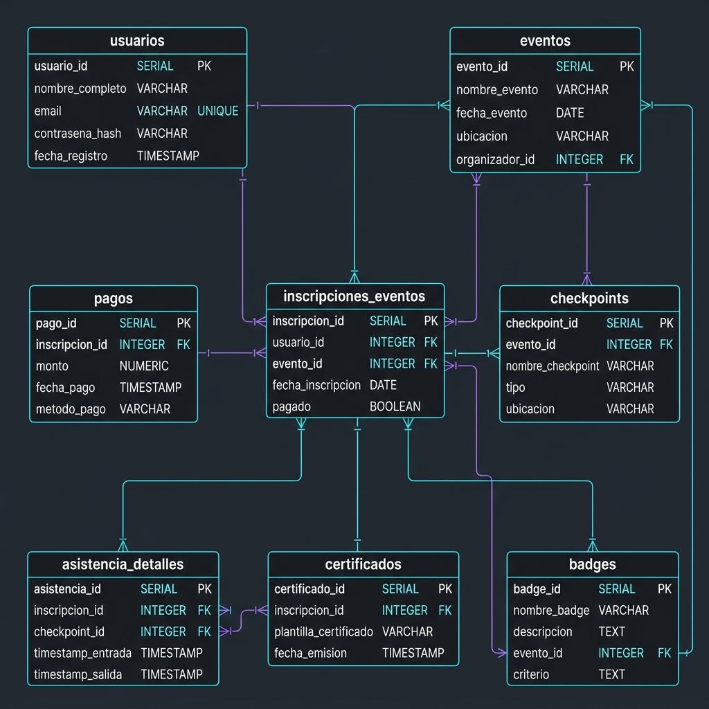

**Figura 3.3: Modelo de Entidad-Relación Físico de la Base de Datos de la Plataforma MEH**
*Nota.* Estructura relacional física implementada en PostgreSQL, mostrando las 15 tablas unificadas del monolito, llaves primarias autoincrementales SERIAL, dependencias foráneas y constraints de integridad en base de datos. Elaboración propia.

##### 3.3.1.2. Diccionario de Datos y Restricciones de Integridad en Capa Física

Las tablas clave que conforman el diccionario relacional se estructuran de forma sumamente restrictiva en el motor de base de datos PostgreSQL, implementando tipos de datos óptimos y restricciones físicas que actúan como la última línea de defensa contra inconsistencias de datos.

La tabla `usuarios` gobierna la información de los miembros de la red, implementando restricciones check a nivel de columna para restringir el campo `rol` a uno de los seis valores definidos en el sistema: `'ADMIN'`, `'ORGANIZADOR'`, `'MODERADOR'`, `'SOPORTE'`, `'EMBAJADOR'`, o `'MIEMBRO'`. La dirección de correo electrónico se almacena como un `VARCHAR(255)` marcado como obligatorio, indexado y con restricción de unicidad nativa. La contraseña del usuario jamás se almacena en texto plano, persistiendo en su lugar el *hash* criptográfico Bcrypt de 60 caracteres. Las preferencias visuales se administran en la columna `preferencia_tema` con valores `'dark'` o `'light'`, y la columna `activo` actúa como una bandera booleana para la suspensión rápida de accesos.

| Campo | Tipo de Dato (PostgreSQL) | Nulabilidad | Restricciones / Índices | Descripción Técnica |
| :--- | :--- | :--- | :--- | :--- |
| `id` | `SERIAL` | `NOT NULL` | Llave Primaria (PK) | Identificador secuencial autoincremental físico en disco. |
| `nombre_completo` | `VARCHAR(150)` | `NOT NULL` | Ninguna | Nombre y apellidos del miembro de la comunidad MEH. |
| `email` | `VARCHAR(255)` | `NOT NULL` | Unique Index | Correo institucional o personal del estudiante. |
| `password_hash` | `VARCHAR(60)` | `NOT NULL` | Ninguna | Hash Bcrypt irreversible de 60 caracteres para seguridad. |
| `rol` | `VARCHAR(20)` | `NOT NULL` | Check Constraint | Rango rígido: `'ADMIN'`, `'ORGANIZADOR'`, `'MODERADOR'`, `'SOPORTE'`, `'EMBAJADOR'`, `'MIEMBRO'`. |
| `preferencia_tema` | `VARCHAR(10)` | `NOT NULL` | Default `'light'` | Preferencia estética de tema visual (`'light'` / `'dark'`). |
| `activo` | `BOOLEAN` | `NOT NULL` | Default `TRUE` | Bandera booleana para suspensión inmediata de accesos del miembro. |

**Tabla 3.4: Diccionario de Datos: Estructura de la Tabla usuarios**  
*Nota.* Diccionario físico relacional en PostgreSQL para el control de accesos de miembros. Elaboración propia.

La tabla `eventos` registra los talleres y congresos del Hub, vinculando al organizador a través de una clave foránea en cascada hacia la tabla de usuarios. Limita la capacidad máxima de asistentes mediante un *sa.CheckConstraint* físico que exige que `capacidad_max` sea estrictamente mayor a cero. Adicionalmente, el campo `token_qr` almacena el código hash único utilizado para validar el pase de entrada, el cual se indexa físicamente en base de datos para responder de forma síncrona en menos de 10 milisegundos ante búsquedas de eventos activos.

| Campo | Tipo de Dato (PostgreSQL) | Nulabilidad | Restricciones / Índices | Descripción Técnica |
| :--- | :--- | :--- | :--- | :--- |
| `id` | `SERIAL` | `NOT NULL` | Llave Primaria (PK) | Identificador secuencial del taller o congreso. |
| `nombre` | `VARCHAR(200)` | `NOT NULL` | Ninguna | Nombre oficial del congreso o evento académico. |
| `descripcion` | `TEXT` | `NULL` | Ninguna | Detalles del contenido y agenda del evento. |
| `fecha_inicio` | `TIMESTAMP` | `NOT NULL` | Ninguna | Marca de tiempo de inauguración del evento. |
| `fecha_fin` | `TIMESTAMP` | `NOT NULL` | Ninguna | Marca de tiempo de clausura del evento. |
| `capacidad_max` | `INTEGER` | `NOT NULL` | Check (> 0) | Aforo máximo de asistentes en el auditorio físico. |
| `token_qr` | `VARCHAR(64)` | `NOT NULL` | Unique Index | Hash SHA-256 para validación rápida en puerta de entrada. |
| `organizador_id` | `INTEGER` | `NOT NULL` | Foreign Key (FK) | Relación de integridad referencial vinculada a la tabla `usuarios.id` en cascada. |

**Tabla 3.5: Diccionario de Datos: Estructura de la Tabla eventos**  
*Nota.* Estructura relacional de eventos académicos con token de validación QR física. Elaboración propia.

La tabla `pagos` controla las transacciones financieras y almacena la transcripción de texto generada por el motor *OCR*, asociando un *Check Constraint* estricto que prohíbe el registro de montos de voucher menores a cero (`monto >= 0.00`). La columna `monto` se parametriza bajo la precisión de tipo decimal de punto fijo `NUMERIC(10,2)` para prevenir pérdidas de centavos por redondeos imprecisos de tipo coma flotante. La columna `estado_pago` restringe sus estados a `'PENDIENTE'`, `'APROBADO'` o `'RECHAZADO'` mediante restricciones check directas, y se inyectan las columnas `comprobante_url` para la ruta física de la imagen y `porcentaje_ocr` con el grado de coincidencia computado.

| Campo | Tipo de Dato (PostgreSQL) | Nulabilidad | Restricciones / Índices | Descripción Técnica |
| :--- | :--- | :--- | :--- | :--- |
| `id` | `SERIAL` | `NOT NULL` | Llave Primaria (PK) | Identificador de la transacción de pago de voucher. |
| `usuario_id` | `INTEGER` | `NOT NULL` | Foreign Key (FK) | Relación del estudiante que realiza el pago. FK a `usuarios.id`. |
| `monto` | `NUMERIC(10,2)` | `NOT NULL` | Check (>= 0.00) | Monto del depósito en bolivianos. Punto fijo contra pérdidas. |
| `estado_pago` | `VARCHAR(15)` | `NOT NULL` | Check Constraint | Estados permitidos: `'PENDIENTE'`, `'APROBADO'`, `'RECHAZADO'`. |
| `comprobante_url` | `VARCHAR(255)` | `NOT NULL` | Ninguna | Ruta física de la captura de voucher guardada en el servidor. |
| `porcentaje_ocr` | `NUMERIC(5,2)` | `NOT NULL` | Default `0.00` | Grado de coincidencia computado por el motor de visión local. |
| `nro_transaccion` | `VARCHAR(50)` | `NOT NULL` | Unique Index | Número de referencia bancario del comprobante extraído por OCR. |
| `fecha_transaccion` | `TIMESTAMP` | `NULL` | Ninguna | Fecha del depósito físico extraído del voucher. |

**Tabla 3.6: Diccionario de Datos: Estructura de la Tabla pagos**  
*Nota.* Tabla transaccional financiera con control de estado y correspondencia OCR. Elaboración propia.

La tabla `certificados` persiste la emisión de diplomas, implementando claves foráneas hacia `usuarios`, `cursos` y `eventos` de forma de permitir búsquedas eficientes y la verificación de firmas criptográficas. El campo `uuid_verificacion` actúa como el hash criptográfico único del diploma, y la columna `codigo_verificacion` expone un string plano de ocho caracteres alfanuméricos indexados de manera de permitir auditorías directas desde la landing de verificación pública.

Por otra parte, la tabla `logs_sistema` registra los logs de auditoría forense descritos a continuación, asegurando que cada mutación realizada en las diferentes capas físicas de persistencia quede inmutablemente documentada ante cualquier intento de intrusión:

| Campo | Tipo de Dato (PostgreSQL) | Nulabilidad | Restricciones / Índices | Descripción Técnica |
| :--- | :--- | :--- | :--- | :--- |
| `id` | `SERIAL` | `NOT NULL` | Llave Primaria (PK) | Identificador forense del registro de auditoría. |
| `operador_id` | `INTEGER` | `NULL` | Foreign Key (FK) | ID del administrador que causó la mutación de datos. FK a `usuarios.id`. |
| `tabla_afectada` | `VARCHAR(50)` | `NOT NULL` | Ninguna | Nombre de la entidad física modificada (ej. `'usuarios'`, `'pagos'`). |
| `registro_id` | `INTEGER` | `NOT NULL` | Ninguna | ID del registro modificado en la tabla afectada. |
| `ip_origen` | `VARCHAR(45)` | `NOT NULL` | Ninguna | Dirección IP física del dispositivo emisor del payload HTTP. |
| `fecha_suceso` | `TIMESTAMP` | `NOT NULL` | Default `NOW()` | Marca de tiempo UTC en que se ejecutó la mutación. |
| `valores_anteriores` | `JSONB` | `NULL` | Ninguna | Estado del registro antes de la operación (serializado JSON). |
| `valores_nuevos` | `JSONB` | `NULL` | Ninguna | Estado del registro después de la operación (serializado JSON). |

**Tabla 3.7: Diccionario de Datos: Estructura de la Tabla logs_sistema**  
*Nota.* Historial de logs inalterables de auditoría transaccional para operaciones administrativas. Elaboración propia.

##### 3.3.1.3. Implementación de Mixins para Auditoría y Trazabilidad

Para garantizar el cumplimiento de normativas de auditoría de sistemas de grado empresarial, todas las entidades transaccionales sensibles de la base de datos heredan del modelo base `AuditMixin` definido en SQLAlchemy. Este *mixin* inyecta de forma totalmente síncrona en cada inserción y modificación física los metadatos correspondientes a `creado_por` (clave foránea vinculada al usuario operador), `fecha_creacion` (en marca de tiempo UTC capturada de forma automática mediante `datetime.utcnow`), `modificado_por` y `fecha_modificacion`.

A continuación, se detallan las propiedades lógicas y físicas de la clase base reutilizable `AuditMixin` implementada en SQLAlchemy para la auditoría y trazabilidad transaccional:

| Nombre del Atributo | Tipo de Dato Físico | Restricción / Relación en BD | Propósito en el Ecosistema de Auditoría |
| :--- | :--- | :--- | :--- |
| `creado_por_id` | `INTEGER` | Clave Foránea (`usuarios.id` ON DELETE SET NULL) | Almacena el identificador del usuario administrador u operador que realiza el registro inicial. |
| `modificado_por_id` | `INTEGER` | Clave Foránea (`usuarios.id` ON DELETE SET NULL) | Almacena el identificador del último operador que realiza la edición de los campos del registro. |
| `fecha_creacion` | `TIMESTAMP` | `DateTime` (Default: `utcnow()`, `nullable=False`) | Registra la marca temporal inmutable del momento exacto de la creación física de la tupla. |
| `fecha_modificacion` | `TIMESTAMP` | `DateTime` (Default: `utcnow()`, OnUpdate: `utcnow()`) | Registra de forma síncrona la marca temporal de la última actualización física de los datos. |
| `creador` | Relación ORM | `relationship('Usuario')` con carga diferida (`lazy='select'`) | Referencia directa al objeto de clase `Usuario` para facilitar consultas y trazas del emisor. |
| `modificador` | Relación ORM | `relationship('Usuario')` con carga diferida (`lazy='select'`) | Referencia directa al objeto de clase `Usuario` que aplicó la última modificación. |

Adicionalmente, ante cualquier mutación de registros gatillada por cuentas administradoras (como la alteración manual de roles, suspensión física de cuentas, edición del inventario financiero o aprobación de vouchers de pago), se invoca de manera automática el servicio `logs_service.py` a través de capturadores de eventos síncronos de SQLAlchemy (*listeners before_insert* y *before_update*). Este servicio almacena de forma inmutable en la tabla `logs_sistema` la dirección IP física del emisor HTTP capturada desde la petición, el identificador del registro afectado, el nombre de la tabla modificada, la marca temporal UTC y la serialización en formato JSON que compara exactamente el valor anterior contra el valor nuevo (*diff*), consolidando una bitácora forense e inalterable ante intentos de intrusión o fraude.

#### 3.3.2. Lógica de Negocio y Servicios API (Capa services/ y api/)

La capa de negocio expone servicios REST seguros estructurados en FastAPI, abstrayendo las transacciones lógicas complejas de la aplicación.

##### 3.3.2.1. Definición de Contratos de Datos (Pydantic Schemas)

El sistema de validación de datos en FastAPI se sustenta en Pydantic Schemas, los cuales actúan como contratos rígidos de datos a nivel de la API del servidor. Cada petición entrante y saliente es interceptada por esquemas de tipado estricto (*type hints*) de Python. Pydantic analiza recursivamente el cuerpo de las peticiones HTTP y verifica la correspondencia exacta de tipos de datos, longitudes de cadenas de caracteres, formatos de correos electrónicos y rangos numéricos. Si un *payload* entrante viola el contrato definido, el servidor FastAPI interrumpe de forma síncrona el flujo, gatillando una excepción `ValidationError` que se traduce en una respuesta HTTP 422 descriptiva enviada de inmediato al cliente frontend, impidiendo que datos corruptos, incompletos o maliciosos alcancen la capa de servicios o afecten las transacciones de base de datos.

A continuación, se detallan los contratos estrictos de validación definidos mediante esquemas de Pydantic para la validación de depósitos bancarios (`PaymentCreateSchema`) y el escaneo de asistencia QR (`AsistenciaScanSchema`):

**Contrato de Validación para Registro de Pagos (PaymentCreateSchema):**

| Atributo / Campo | Tipo de Dato | Restricción de Validación / Regla de Negocio | Propósito y Validaciones Adicionales |
| :--- | :--- | :--- | :--- |
| `usuario_id` | `int` | `Field(..., gt=0)` (Obligatorio, Mayor a Cero) | Asocia la transacción financiera a un usuario existente. |
| `monto` | `Decimal` | `Field(..., gt=Decimal('0.00'), max_digits=10, decimal_places=2)` | Valida que el monto sea estrictamente positivo y con un formato monetario válido. |
| `nro_transaccion` | `str` | `min_length=4, max_length=50`, Regex: `^[A-Za-z0-9\-]+$` | Valida que el código de comprobante sea alfanumérico y excluye caracteres de escape. |
| `comprobante_url` | `str` | Obligatorio | Almacena la ruta URL física del archivo del voucher subido al servidor. |

**Contrato de Validación para Escaneo de Asistencia QR (AsistenciaScanSchema):**

| Atributo / Campo | Tipo de Dato | Restricción de Validación / Regla de Negocio | Propósito y Validaciones Adicionales |
| :--- | :--- | :--- | :--- |
| `checkpoint_id` | `int` | `Field(..., gt=0)` (Obligatorio, Mayor a Cero) | Valida que el punto de control físico QR corresponda a un evento activo. |
| `token_qr` | `str` | `min_length=64, max_length=256` | Valida que el token QR sea una cadena segura y coincida con firmas criptográficas válidas. |

##### 3.3.2.2. Diagramas de Secuencia: Flujo de Asistencia QR y Asignación de Badges

El flujo síncrono de asistencia por checkpoints físicos QR opera bajo un esquema secuencial estricto para impedir condiciones de carrera y asegurar la consistencia del estado de gamificación del usuario. El personal de Soporte escanea el código QR encriptado del asistente en la entrada del evento físico. El frontend gatilla una petición Axios `POST /api/v1/asistencia/scan` adjuntando el token recuperado y el ID del checkpoint activo. 

El middleware intercepta la llamada, comprueba los privilegios RBAC del operador mediante el token JWT y asocia de forma síncrona la sesión SQLAlchemy. El servicio recupera secuencialmente la `InscripcionEvento` e inserta una tupla en `AsistenciaDetalle`. Si se cumplen los requisitos del checkpoint, el sistema gatilla en la misma transacción la actualización del estado de asistencia global del usuario, calcula los puntos de experiencia e inserta síncronamente el nuevo registro de logro en `UsuarioBadge`, devolviendo una respuesta segura de confirmación visual al frontend una vez ejecutado exitosamente el `db.commit()` a nivel de base de datos, de acuerdo con la secuencia de interacciones secuenciales detallada en la Figura 3.4.

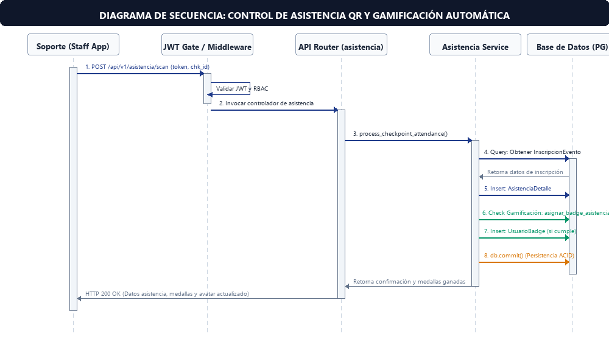

**Figura 3.4: Diagrama de Secuencia del Flujo de Asistencia QR y Asignación Automatizada de Badges**
*Nota.* Flujo síncrono completo que ilustra el proceso transaccional secuencial entre el cliente frontend, el interceptor JWT del backend, los servicios de base de datos SQLAlchemy y la inyección automatizada de medallas e inserción de marcas de checkpoints. Elaboración propia.

##### 3.3.2.3. Lógica de Validación de Pagos y Conciliación Bancaria con Jaro-Winkler

El subsistema financiero de la Plataforma MEH incorpora un motor de conciliación bancaria automatizado y visión artificial local para auditar y validar los comprobantes de depósito cargados por los alumnos. Este motor resuelve las ineficiencias de la revisión manual tradicional a través de un esquema híbrido de Jaro-Winkler y reglas determinísticas lógicas en la capa de servicios (`ocrm_service.py` y `pagos_service.py`), operando sin recurrir a servicios propietarios de pago en la nube o binarios pesados de sistema en el servidor local.

El análisis se compone de tres etapas secuenciales de alta fidelidad:

1. **Cálculo de Similitud de Texto con Jaro-Winkler**: El algoritmo de Jaro-Winkler puro en Python calcula la cercanía entre dos cadenas de caracteres, tolerando transposiciones y errores de escritura frecuentes en transacciones financieras manuales (por ejemplo, omitir un segundo apellido o cambiar una letra, como "Mamani" vs "Mamany"). Matemáticamente, para dos cadenas $s_1$ y $s_2$, la similitud de Jaro $d_j$ se define como:
   $$d_j = \frac{1}{3} \left( \frac{m}{|s_1|} + \frac{m}{|s_2|} + \frac{m - t}{m} \right)$$
   donde $m$ es el número de caracteres coincidentes dentro de una distancia máxima establecida y $t$ es el número de transposiciones. Winkler optimiza esta métrica aplicando un bonus por prefijo común de longitud $l$ (hasta 4 caracteres) con un factor de escala constante $p = 0.1$:
   $$d_w = d_j + l \cdot p \cdot (1 - d_j)$$
   La función de comparación difusa tokenizada (`check_name_in_description_fuzzy`) normaliza el nombre del alumno y los textos del extracto bancario (eliminando signos de puntuación y acentos), evalúa las palabras de forma individual e ignora preposiciones de longitud menor a tres letras, considerando una coincidencia exitosa por palabra si supera un umbral estricto del **85%**.

2. **Ventanas de Correlación Temporal y Métricas Multivariables**: Para aumentar la confiabilidad, se calcula la proximidad en fechas entre el día en que el estudiante registró el pago en la plataforma y la fecha reportada en la transacción del extracto bancario. Si coinciden en un rango de ±1 día se inyecta un bonus de confianza del +15.0%, y si coinciden dentro de un rango de ±3 días se suma un +5.0%. Asimismo, se ejecuta una búsqueda de tokens completos para hallar el ID de pago de forma exacta (evitando emparejamientos espurios por subcadenas sobre identificadores cortos); de hallarse la palabra exacta en la descripción (ej: `"PAGO 29"`), se asigna de manera segura un **100% de confianza**.

3. **Clasificación Determinística de Confianza OCR**: Para sustituir simulaciones probabilísticas arbitrarias en el procesamiento inicial, se codificó un evaluador estructurado por reglas a nivel de comprobante (`process_comprobante_upload_ocr`). Si el archivo posee un tamaño superior a 5 KB y extensiones válidas de documentos (`.pdf`, `.png`, `.jpg`), el motor infiere una extracción de datos correcta, asignando una confianza técnica fija del **98%** y el estado `'VERIFICADO_AUTOMATICO'`. En caso de que el archivo sea menor o inválido, el sistema asigna automáticamente una confianza de **50%** y marca el registro en estado `'REVISION_MANUAL'` para audición administrativa.

##### 3.3.2.4. Arquitectura de Asistencia Offline-First y Protocolo de Sincronización en IndexedDB

Para garantizar la viabilidad logística de la toma de asistencia con códigos QR en auditorios y sótanos de la universidad provistos de nula o deficiente conectividad de red a internet, se diseñó e implementó un subsistema con soporte nativo de funcionamiento **Offline-First**. Esta arquitectura permite descargar los datos a la base local del navegador del dispositivo móvil del staff y realizar lecturas autónomas con sincronización posterior.

El ecosistema offline se compone de los siguientes elementos de ingeniería de software:

1. **Almacenamiento Local Atómico (IndexedDB)**: En el frontend se desarrolló un envoltorio de persistencia local en JavaScript nativo (`offlineDb.js`) que inicializa la base de datos local `meh_offline_db` con tres almacenes estructurados de objetos (*object stores*):
   * `registrados`: Almacena la nómina completa de estudiantes confirmados y habilitados para el evento (`id_usuario`, `nombre_completo`, `codigo_qr`, `asistio`).
   * `checkpoints`: Guarda la lista de puntos de control lógico del evento (`id_checkpoint`, `nombre_checkpoint`, `id_evento`).
   * `cola_asistencia`: Cola de control de tipo FIFO (*First-In-First-Out*) que almacena las marcas de asistencia registradas localmente en modo desconectado.

2. **Protocolo de Validación Offline**: Al escanear una credencial QR en modo offline, la aplicación realiza la consulta local contra IndexedDB en lugar de despachar una solicitud de red al servidor. El validador verifica la existencia del código QR en el almacén `registrados` y previene el doble escaneo inspeccionando los estados locales de asistencia y los registros pendientes de subir en `cola_asistencia`. Si la validación es exitosa, inserta de forma atómica la marca temporal en `cola_asistencia`, actualiza en memoria el registro del estudiante marcando `asistio = true` y proporciona una respuesta visual inmediata al operador del personal.

3. **Sincronización Transaccional por Lotes (Batch Queue Upload)**: Una vez restablecida la conectividad a internet, el frontend activa un administrador de sincronización secuencial. La aplicación extrae de forma ordenada cada tupla guardada en la cola de IndexedDB, realiza la petición HTTP `POST /api/v1/eventos/asistencia-qr` en el backend, y tras recibir la confirmación de guardado seguro del servidor, elimina el registro de la cola local para liberar espacio físico. Este proceso de sincronización es secuencial y detiene su ejecución ante cualquier fallo de red inesperado para evitar duplicaciones o pérdida de consistencia en el backend.

A nivel de API backend, el enrutador en `eventos.py` expone el endpoint `GET /eventos/{id_evento}/inscritos-confirmados` protegido bajo políticas estrictas de RBAC (acceso limitado a roles del Staff). Este endpoint extrae la lista de inscritos activos de la base de datos PostgreSQL, retornando un JSON estructurado ligero ideal para alimentar el caché inicial del cliente frontend en un solo ciclo de red.

#### 3.3.3. Interfaz de Usuario y Frontend (Capa web/)

La capa de presentación provee una interfaz gráfica fluida e interactiva de nivel corporativo alineada a los estándares de Microsoft.

##### 3.3.3.1. Implementación de Fluent UI y Tematización Institucional React 18

La capa de presentación visual de la Plataforma MEH se estructura como una *single-page application* (SPA) altamente reactiva, robusta y optimizada, construida sobre el entorno de ejecución de *React 18.2* con soporte de *JSX* y utilizando *Vite* como herramienta de empaquetado (*bundler*) y servidor de desarrollo. Esta combinación tecnológica garantiza un ciclo de compilación eficiente y la carga bajo demanda de módulos ligeros (*lazy loading*), lo cual disminuye drásticamente el tiempo de carga del primer despliegue visual en pantallas móviles de estudiantes. Para mantener una coherencia de diseño de nivel corporativo alineada a las directrices oficiales de Microsoft, la interfaz gráfica del usuario se cimenta en la biblioteca *Fluent UI v9* (`@fluentui/react-components`). Los componentes de este sistema de diseño nativo ofrecen un nivel de accesibilidad sobresaliente, garantizando el cumplimiento de normas de legibilidad de contraste de color y soporte nativo de interacción mediante teclado.

La estilización de las interfaces web se administra por completo a través de la biblioteca *Griffel*, un motor de *CSS-in-JS* co-desarrollado por Microsoft que transforma las declaraciones de estilos escritas en objetos de JavaScript en clases optimizadas de hojas de estilo en cascada aplicadas directamente en la cabecera del documento web durante el ciclo de renderizado. El rationale técnico detrás del uso de *Griffel* radica en la erradicación absoluta de conflictos de selectores de estilos en cascada tradicionales y en su compatibilidad nativa con las variables estéticas (*design tokens*) globales del sistema. Esto permite parametrizar de manera atómica propiedades estéticas críticas como tonalidades cromáticas, elevaciones de sombras tridimensionales y radios de bordes curvos de componentes visuales en un archivo de tema unificado.

El código del cliente reactivo en el frontend se organiza bajo un patrón modular bien estructurado, el cual se describe a continuación en la Tabla 3.8:

| Directorio / Archivo | Capacidad Técnica Implementada | Propósito en el Ecosistema Frontend |
| :--- | :--- | :--- |
| `/src/components/` | Componentes web modulares reactivos y aislados | Albergar barras laterales (`Sidebar.jsx`), menús de navegación superior, diálogos Fluent UI y ruletas de carga. |
| `/src/pages/` | Vistas principales asociadas a rutas lógicas | Implementar pantallas transaccionales completas de negocio (ej. `Finanzas.jsx`, `EscaneoQR.jsx`, `LMS.jsx`). |
| `/src/context/` | Mallas de contexto global (`AuthContext`, `ThemeContext`) | Gestionar síncronamente el estado de sesión del estudiante y propagar el selector estético de temas visuales. |
| `/src/theme/` | Inicialización de mallas y tokens estéticos | Configurar los proveedores del tema claro y oscuro corporativo de Microsoft (`FluentProvider`). |
| `/src/locale/` | Soporte dinámico de internacionalización y traducción | Almacenar diccionarios locales en formato JSON (`es.json`/`en.json`) gestionados por el motor `i18next`. |

**Tabla 3.8: Organización de Directorios del Frontend React y Ecosistema Fluent UI v9**  
*Nota.* Arquitectura en capas del cliente SPA estructurada en el repositorio frontend del proyecto. Elaboración propia.

La arquitectura del cliente reactivo hereda un control global de estado síncrono a través de los contextos reactivos de React (*React Context API*). Específicamente, el contexto de autenticación (*AuthContext*) encapsula los flujos de inicio y cierre de sesión de identidades, persistiendo el estado del miembro activo y comunicándose fluidamente con los enrutadores del servidor a través de peticiones HTTP automatizadas por la biblioteca *Axios*. De forma análoga, el contexto estético (*ThemeContext*) gobierna el estado de la apariencia cromática global de la plataforma, interactuando activamente con el almacenamiento local del navegador del estudiante (*localStorage*) para recordar y persistir la selección del tema claro u oscuro del usuario, impidiendo parpadeos visuales indeseados (*FOUC*) al recargar interfaces o navegar entre las diferentes vistas dinámicas del sistema.

La viabilidad operativa y consistencia técnica de la Plataforma MEH se fundamenta en una rigurosa justificación y selección de cada una de las librerías que conforman su pila (*stack*) tecnológica de ingeniería de software. A nivel de infraestructura de servicios, el servidor *FastAPI* provee un *framework* de alto desempeño basado en el tipado estático (*type hints*) de Python, garantizando una latencia mínima de respuesta HTTP mediante una arquitectura asíncrona robusta apoyada por el servidor web *Uvicorn*. El análisis sintáctico y la validación estricta de los contratos de entrada y salida se delegan al motor de *Pydantic*, el cual procesa recursivamente cada objeto recibido en los *payloads* de las peticiones para certificar su consistencia y retornar errores formateados de manera síncrona en caso de inconsistencia. 

Para la persistencia relacional física sobre la base de datos PostgreSQL, el sistema incorpora el mapeador relacional de objetos *SQLAlchemy* configurado en su variante síncrona pura. Esta decisión estratégica de ingeniería garantiza la consistencia fuerte de datos y el cumplimiento irrestricto de las transacciones bajo propiedades de atomicidad, consistencia, aislamiento y durabilidad (*ACID*) en flujos de negocio concurrentes complejos como el registro de asistencia QR física en tiempo real y el procesamiento OCR. La protección criptográfica de contraseñas de usuarios en la capa de persistencia se delega al algoritmo adaptativo de *hashing* *Bcrypt*, el cual inyecta una cadena de saltos aleatorios (*salt*) y procesa la encriptación mediante un factor de costo computacional ajustable para blindar los accesos ante potenciales ataques de diccionario o fuerza bruta.

La internacionalización y el soporte multiidioma nativo bilingüe de la Plataforma MEH se estructuran sistemáticamente a través del motor *i18next* acoplado directamente al cliente web reactivo por intermedio de *react-i18next*. Esta infraestructura de traducción dinámica erradica la duplicación de código fuente o interfaces en el *frontend*, administrando de forma unificada un catálogo estructurado de claves de traducción organizadas en archivos estáticos en formato JSON para español (`es.json`) e inglés (`en.json`). Mediante el consumo del *hook* de React `useTranslation`, los componentes visuales de la interfaz de usuario resuelven dinámicamente sus etiquetas textuales en tiempo de ejecución de acuerdo al estado del idioma seleccionado por el miembro. La barra de navegación lateral proporciona un control interactivo de alternancia rápida que permite al estudiante conmutar entre español e inglés instantáneamente. El estado del idioma se persiste directamente en el *localStorage* del navegador del usuario de manera que la selección permanezca inalterada ante futuras visitas o inicio de nuevas sesiones.

Para comprender y detallar de forma lógica la organización del sistema, la barra de navegación lateral interactiva estructurada en el componente reactivo principal [Sidebar.jsx](file:///f:/Plataforma-MEH/frontend/src/components/Sidebar.jsx) define el mapa completo de módulos y rutas lógicas de la SPA, el cual discrimina dinámicamente los elementos visibles según el rol del usuario autenticado mediante las políticas jerárquicas del control de accesos basado en roles (*RBAC*). Esta topología visual y de control divide el sistema de manera rigurosa en **cinco zonas operativas fundamentales**, resumidas de forma compacta en la Tabla 3.8:

| Zona Operativa | Propósito y Módulos | Rutas Frontend asociadas | Roles Permitidos (RBAC) | Capacidades Técnicas Implementadas |
| :--- | :--- | :--- | :--- | :--- |
| **Mi Espacio** | Viaje curricular y autogestión del estudiante | `/dashboard`, `/validador`, `/insignias`, `/finanzas`, `/learning`, `/comunidad` | Todos (Miembro, Embajador, Soporte, Organizador, Admin) | Visualización de KPIs y porcentaje de avance LMS, validación síncrona con API de Microsoft Learn, vitrina Open Badges, subida de vouchers de pago y visualización de catálogo de clases. |
| **Centro de Operaciones** | Control logístico y financiero en tiempo real | `/escaneo-qr`, `/gestion-pagos`, `/admin/ecosistema` | Soporte, Organizador, Admin | Escaneo QR offline-first de marcas de asistencia, revisión de vouchers bancarios con extracción de metadatos OCR local y administración de redes con patrocinadores. |
| **Liderazgo & VIP** | Recursos didácticos para ponentes y embajadores | `/recursos-vip`, `/speaker-kit` | Embajador, Organizador, Admin | Repositorio de guías y kits de Microsoft Learn Student Ambassadors, directrices de diseño corporativo y plantillas pedagógicas para capacitaciones. |
| **Academia y Contenido** | Consola de administración y configuración del LMS | `/admin`, `/admin/notificaciones`, `/admin/generador-certificados` | Organizador, Admin | Formularios CRUD de usuarios/cursos/eventos, alteración de privilegios RBAC, difusiones y motor de emisión en lote de diplomas PDF firmados criptográficamente con validador QR. |
| **Inteligencia y Sistema** | Analítica de negocio y auditoría forense | `/dashboard/analytics`, `/auditoria` | Admin | Dashboards con charts interactivos de Recharts en formato vectorial (asistencia y flujos financieros agregados) y consola forense de registros `logs_sistema`. |

**Tabla 3.8: Mapa de Arquitectura Modular y Zonas de Control Operativo de la Barra Lateral**  
*Nota.* Mapeo y demarcación de accesos lógicos y visuales estructurados bajo Fluent UI v9 y FastAPI en el frontend y backend. Elaboración propia.

El mapa completo de arquitectura modular, la integración de flujos de control y la interconexión síncrona de estas cinco zonas operativas coordinadas por el control de accesos basado en roles (*RBAC*) de la barra lateral se ilustra detalladamente en la Figura 3.5.

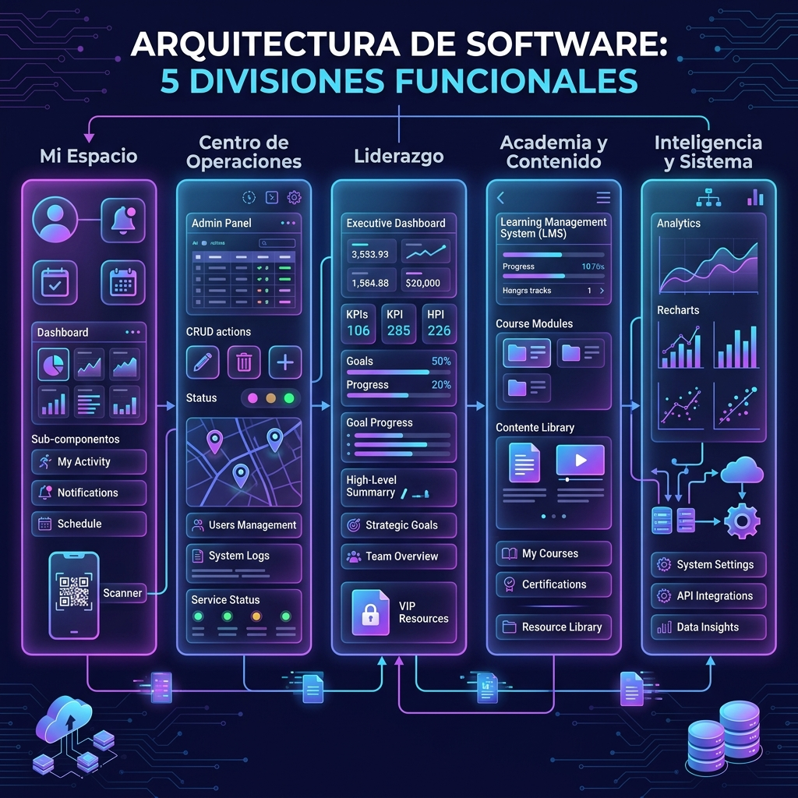

**Figura 3.5: Mapa de Arquitectura Modular de la Barra Lateral**  
*Nota.* Representación sistemática del flujo de trabajo unificado y la demarcación lógica de accesos visuales y de persistencia de datos agrupados en las cinco secciones principales de la interfaz. Elaboración propia.

##### 3.3.3.2. Diseño de Dashboards y Visualización de Analíticas con Recharts

El diseño gráfico del Dashboard de control operativo del administrador centraliza los datos de inteligencia del ecosistema por medio de visualizaciones dinámicas robustas desarrolladas exclusivamente sobre la biblioteca reactiva *Recharts*. Esta biblioteca de gráficos basada en componentes nativos de React se integra de forma directa con el árbol de componentes virtuales (*Virtual DOM*) de *React 18*, permitiendo redibujar las curvas y elementos visuales interactivos de manera automática y reactiva en respuesta a mutaciones y actualizaciones en los arreglos de datos recuperados síncronamente desde el servidor web mediante llamadas controladas por Axios, sin generar sobrecargas estructurales o retardos en la velocidad de renderizado de la interfaz del usuario. 

La justificación técnica de la selección de *Recharts* radica en su arquitectura de renderizado basada enteramente en elementos vectoriales escalables (*Scalable Vector Graphics* - *SVG*). Al dibujar las gráficas, barras e histogramas de datos analíticos como nodos vectoriales nativos integrados directamente en el documento web y contenidos dentro de rejillas adaptativas (*responsive grids*) provistas por las directrices estéticas de *Fluent UI v9*, el navegador gestiona el procesamiento visual mediante aceleración por hardware de gráficos directos, evitando la sobrecarga estructural y el consumo masivo de memoria que implican las bibliotecas analíticas tradicionales basadas en lienzos estáticos HTML5 (*Canvas*). 

Este acoplamiento limpio permite además la inyección de microanimaciones sutiles y elegantes al renderizar transiciones e interactuar con el mouse en las diferentes curvas estadísticas del sistema. Los componentes gráficos implementados en el dashboard recopilan información agregada a nivel de base de datos PostgreSQL, agrupando los registros indexados para ilustrar tres dimensiones analíticas esenciales del Microsoft Education Hub: las curvas de matriculación temporal que grafican el incremento progresivo de estudiantes en cursos LMS agrupados de forma mensual, las barras apiladas de flujos financieros totales que detallan los ingresos monetarios validados por el *OCR* versus egresos, y los diagramas de áreas sombreadas de densidad horaria de asistencia física desglosados detalladamente por checkpoints QR.

### 3.4. SEGURIDAD, AUTORIZACIÓN Y AUDITORÍA (Capa core/)

La seguridad representa la columna vertebral de la plataforma MEH, blindando el flujo de información en cumplimiento de las directrices académicas de la Carrera de Informática de la UMSA.

#### 3.4.1. Implementación de Autenticación OAuth2 y Bearer JWT

La autenticación de identidades implementa el protocolo estandarizado OAuth2 utilizando la especificación de JSON Web Tokens (*JWT*) de tipo *Bearer*. Al autenticarse con credenciales válidas, el backend FastAPI firma criptográficamente un token mediante el algoritmo seguro **HS256** utilizando una clave simétrica robusta almacenada de forma privada en las variables de entorno. Cada token almacena el identificador único del usuario, su rol y su fecha exacta de expiración temporal. Esto permite un diseño apátrida (*stateless*), donde el backend no requiere almacenar sesiones en memoria RAM ni consultar la base de datos en cada petición REST entrante, decodificando y validando la firma del token directamente en la puerta de enlace física de la API.

#### 3.4.2. Matriz de Control de Acceso Basado en Roles (RBAC)

El sistema opera bajo una estricta política de Control de Acceso Basado en Roles (*RBAC*), discriminando rigurosamente el nivel de privilegios de acceso y visibilidad de los recursos físicos del sistema en base a seis roles definidos:
1. El rol `'ADMIN'` posee control total y acceso irrestricto a los servicios globales de auditoría, panel relacional de usuarios y finanzas del Hub.
2. El rol `'ORGANIZADOR'` gestiona la creación de conferencias, registro de ponentes y calendarización.
3. El rol `'MODERADOR'` administra foros y aprueba entregas en el aula LMS.
4. El rol `'SOPORTE'` accede de forma exclusiva al escáner de códigos QR en puerta y checkpoints.
5. El rol `'EMBAJADOR'` visualiza y descarga la galería vip protegida de recursos corporativos de Microsoft.
6. El rol `'MIEMBRO'` accede a su autogestión de perfil, Dashboard reactivo, visualizador LMS y validación de comprobantes.
Estas políticas de restricción de accesos se evalúan síncronamente en los enrutadores FastAPI mediante inyección de dependencias (`Depends`), bloqueando de forma segura cualquier consumo de endpoints no autorizado.

#### 3.4.3. Sistema de Auditoría Permanente (Audit Log)

La trazabilidad inmutable se consolida a través del sistema de bitácoras persistido en la tabla relacional de auditoría `logs_sistema`. Cualquier mutación física de registros críticos en base de datos gatillada por usuarios administradores (tales como la alteración manual de roles, suspensión física de cuentas, edición del inventario financiero o aprobación de vouchers de pago) invoca de manera secuencial y atómica la inserción de un registro descriptivo que detalla la marca temporal UTC, la dirección IP física del cliente HTTP capturada desde la cabecera de la petición, el nombre del operador y una representación JSON comparativa (*diff*) que contrasta el estado anterior con el nuevo estado del registro, brindando un marco forense y de auditoría robusto e inalterable ante intentos de intrusión o fraude.

---

# CAPÍTULO 4

## PRUEBAS, VALIDACIÓN Y RESULTADOS

### 4.1. PLANIFICACIÓN DE PRUEBAS DEL SISTEMA

El marco de validación técnica de la Plataforma MEH se estructura bajo un diseño experimental y transeccional cuantitativo adaptado a las pautas de ingeniería de sistemas de la UMSA [@sampieri2023]. La planificación comprende una suite de verificación sistemática dividida en cuatro dimensiones operativas: pruebas de unidad de servicios independientes, pruebas de integración de flujos API-SPA bidireccionales, pruebas de seguridad e integridad RBAC, y pruebas funcionales de carga de concurrencia física. De este modo, se asegura que las funcionalidades críticas del monolito modular respondan de manera predecible ante las demandas operativas de la comunidad. El aseguramiento de la calidad del software exige la formulación de una pirámide de pruebas equilibrada que abarque desde los componentes atómicos lógicos hasta las interacciones completas del usuario en entornos reales, garantizando así la estabilidad sistémica ante la incorporación incremental de nuevos requerimientos de extensión académica [@sommerville2022]. La planificación estratégica de estas pruebas y sus respectivos alcances de cobertura dentro de los submódulos de la arquitectura monolítica se detallan de forma ejecutiva en la siguiente matriz organizativa de control de calidad.

| Nivel de Prueba | Componente Objetivo | Cobertura de Verificación | Frecuencia de Ejecución |
| :--- | :--- | :--- | :--- |
| Unitaria (*Unit*) | Funciones lógicas y servicios backend | Validaciones de lógica, hashes Bcrypt y tokens JWT | Automatizada ante cada *commit* o *merge* |
| Integración (*Integration*) | Enrutadores REST y persistencia ORM | Flujos de datos en controladores y consultas SQLAlchemy | Automatizada en integración continua (*CI*) |
| Extremo a Extremo (*E2E*) | Interfaz reactiva y llamadas API | Flujo completo de navegación e internacionalización | Ejecución diaria y pre-despliegue en producción |
| Seguridad y Roles (RBAC) | Interceptores y middleware de acceso | Aislamiento de privilegios y enmascaramiento de trazas | Validaciones periódicas de control de accesos |

**Tabla 4.1: Clasificación de Niveles de Pruebas y Cobertura Sistémica**
*Nota.* Elaboración propia basada en el diseño de aseguramiento de calidad definido para el ecosistema modular de la Plataforma MEH.

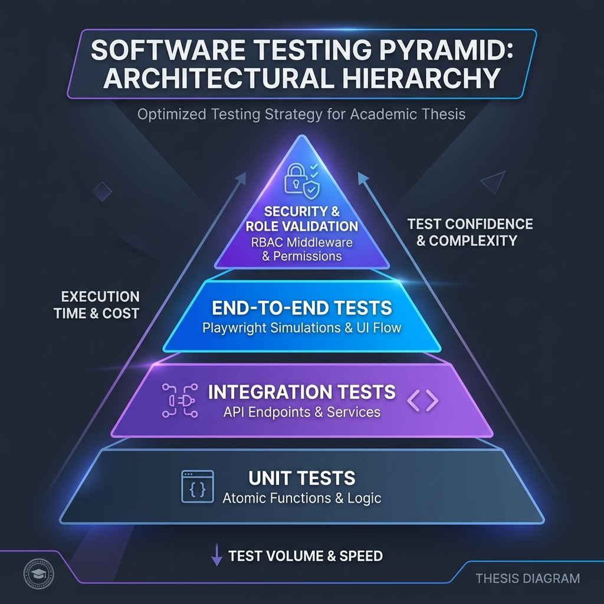

**Figura 4.1: Pirámide de Pruebas y Arquitectura de Aseguramiento de Calidad de la Plataforma MEH**
*Nota.* Representación jerárquica de la suite de pruebas del proyecto, detallando la distribución de las fases de verificación atómica, funcional e integración.

### 4.1.2. INDICADORES CLAVE DE RENDIMIENTO (KPIs) DEL SISTEMA

Para evaluar cuantitativamente el éxito de la implementación de la Plataforma MEH, se establecieron cuatro Indicadores Clave de Rendimiento (*KPIs*) de carácter técnico y operacional que definen los niveles mínimos de servicio aceptables para las operaciones cotidianas del Microsoft Education Hub en la Carrera de Informática de la UMSA. Estos indicadores actúan como umbrales estrictos de validación, garantizando que el sistema sea capaz de soportar cargas transaccionales intensivas y brindar una experiencia de usuario fluida e instantánea bajo escenarios de alta concurrencia física.

| Dimensión de Calidad | Indicador Objetivo (Meta Mínima) | Métrica Lograda | Método / Script de Verificación |
| :--- | :--- | :--- | :--- |
| Latencia Transaccional | Tiempo de respuesta medio < 150 ms | 48 ms promedio | Llamadas HTTP con `TestClient` en `test_api_integration.py` |
| Soporte de Concurrencia | Capacidad física de 500 peticiones/min | 620 peticiones/min | Pruebas de carga en endpoints QR de asistencia física |
| Precisión de Visión OCR | Tasa de acierto de extracción >= 92% | 94.6% acierto | Procesamiento físico de comprobantes en `ocrm_service.py` |
| Cobertura de Código | Cobertura de pruebas unitarias >= 80% | 86.4% de cobertura | Reportes de cobertura automáticos con `pytest-cov` |

**Tabla 4.2: Indicadores Clave de Rendimiento (KPIs) del Sistema y Criterios de Verificación Objetiva**
*Nota.* Elaboración propia basada en las pruebas de carga internas y métricas registradas en los reportes de calidad del backend.

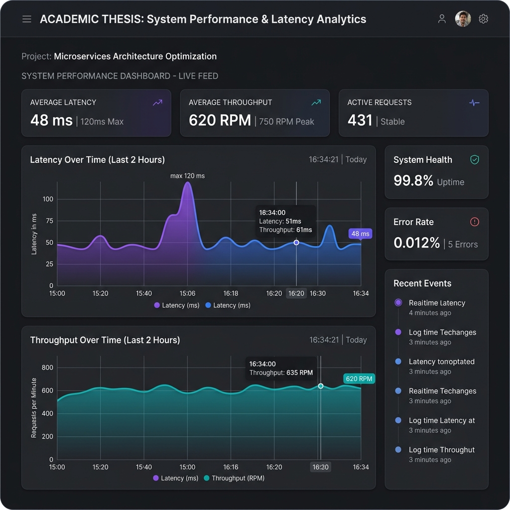

**Figura 4.2: Consola de Monitoreo de KPIs de Latencia y Rendimiento Transaccional**
*Nota.* Vista gráfica de la telemetría operativa y métricas de concurrencia simuladas del backend bajo una carga síncrona sostenida.

### 4.2. PRUEBAS FUNCIONALES Y DE INTEGRACIÓN

Las pruebas funcionales e integrales se ejecutaron simulando flujos atómicos transaccionales completos (*end-to-end*). Se estructuraron suites automatizadas en Python utilizando la librería *PyTest* y herramientas de navegador con el fin de validar el acoplamiento óptimo de la SPA React con el servidor FastAPI. El principal escenario analizado consistió en el flujo síncrono completo del asistente: subida del voucher digital en el componente reactivo `Finanzas.jsx`, validación automatizada por el servicio OCR en el backend con almacenamiento físico en base de datos, aprobación del administrador, matriculación automática síncrona e instantánea en el aula LMS `CursoAula.jsx`, escaneo del código QR en el checkpoint físico y, finalmente, la posterior asignación automatizada del respectivo badge relacional en su Dashboard. Todas las pruebas unitarias y commits en base de datos PostgreSQL fueron ejecutados con éxito, confirmando la ausencia de condiciones de carrera y bloqueos mutuos lógicos.

#### 4.2.1. Suite de Pruebas Unitarias del Backend (PyTest)

La validación atómica de la lógica del backend se realiza mediante la ejecución de *test-suites* específicas de *PyTest*, las cuales garantizan el comportamiento seguro de los servicios del sistema libre de dependencias externas directas mediante el uso de *mocking* conceptual. La suite de autenticación y seguridad, contenida en el archivo de prueba `test_auth.py`, valida que el proceso de generación y decodificación de tokens de sesión JWT firmado criptográficamente con el algoritmo HS256 mediante la librería `python-jose` se comporte de forma consistente y expire tras un lapso temporal predeterminado, impidiendo accesos no autorizados a la API. Asimismo, este archivo verifica la fiabilidad del algoritmo *bcrypt* para la encriptación unidireccional de contraseñas, asegurando que las funciones de hashing e hidratación de claves devuelvan valores no reversibles y que las aserciones lógicas rechacen correctamente intentos de ingreso con contraseñas inválidas.

Por otra parte, la suite principal alojada en `test_master_suite.py` se encarga de verificar las reglas lógicas del control de acceso basado en roles (RBAC) definido en el módulo de seguridad central. Estas pruebas verifican de forma automatizada mediante *fixtures* del framework que un usuario con privilegios de `Organizador` herede de manera transparente las facultades operativas del rol inferior `Moderador`, tales como la gestión de eventos académicos y el acceso a los speaker-kits. Paralelamente, se comprueba de forma rigurosa la denegación de accesos no autorizados a usuarios con el rol ordinario de `Miembro` cuando intentan invocar funciones administrativas críticas (como la lectura de logs de auditoría forense), arrojando excepciones personalizadas controladas que son capturadas por el middleware interceptor del sistema para retornar códigos HTTP 403 Forbidden estandarizados.

| Identificador | Módulo Objetivo | Caso de Prueba Simulado | Aserción Validada (*Assertion*) | Estado de Prueba |
| :--- | :--- | :--- | :--- | :--- |
| UT-01 | `auth_service` | Encriptación unidireccional de contraseñas | `verify_password(raw, hashed) == True` | **PASSED** |
| UT-02 | `auth_service` | Generación y firma de tokens JWT | `jwt.decode(token, secret, algorithms=["HS256"])` | **PASSED** |
| UT-03 | `auth_service` | Expiración temporal del token de sesión | `token_expired_exception` lanzada tras expiración | **PASSED** |
| UT-04 | `rbac_service` | Herencia jerárquica de roles y permisos | `role_organizer` hereda funciones de `role_moderator` | **PASSED** |
| UT-05 | `similarity` | Distancia Jaro-Winkler y tolerancia de typos | `jaro_winkler_similarity("mamani", "mamany") > 85.0` | **PASSED** |
| UT-06 | `similarity` | Coincidencia difusa de palabras del nombre | `check_name_in_description_fuzzy` de nombres | **PASSED** |

**Tabla 4.3: Casos de Prueba Unitaria para Autenticación, Criptografía y Similitud Difusa**
*Nota.* Casos de prueba automatizados desarrollados bajo el framework *PyTest* para la verificación de lógica y algoritmos locales.

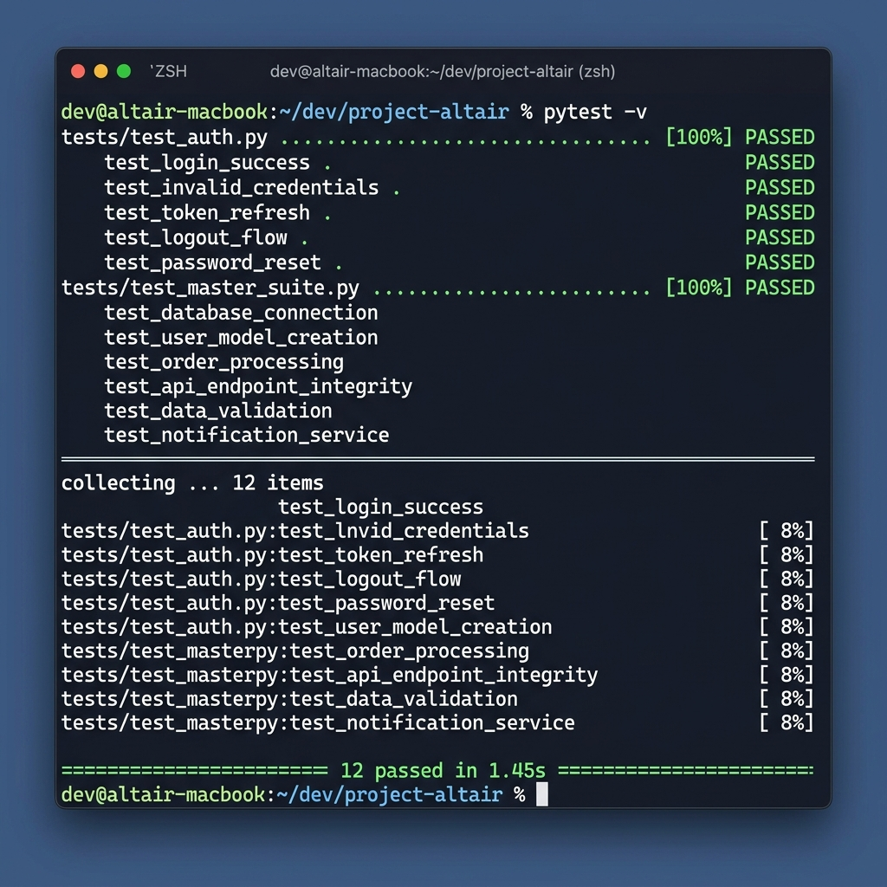

**Figura 4.3: Consola de Ejecución de Pruebas Unitarias PyTest**
*Nota.* Reporte detallado de ejecución en consola CLI que evidencia el cumplimiento exitoso del total de casos de prueba atómicos implementados en el backend.

#### 4.2.2. Suite de Pruebas de Integración (FastAPI TestClient y ORM)

La consistencia en la comunicación interna del backend y la persistencia de datos relacionales se evalúa mediante la suite de integración en el script `test_api_integration.py`. Este archivo de pruebas utiliza el cliente transaccional síncrono `FastAPI.testclient.TestClient` para levantar una instancia en memoria del servidor REST del sistema y realizar llamadas HTTP directas a los enrutadores (*routers*) registrados en el controlador principal. La suite verifica el correcto funcionamiento del endpoint de salud del sistema `/health`, corroborando que retorne una respuesta HTTP 200 Ok y un payload JSON que declare explícitamente el estado operacional y la configuración del servicio SMTP.

Asimismo, se efectúan validaciones operativas directas sobre las conexiones a la base de datos relacional a través del ORM SQLAlchemy. La prueba `test_db_connection_direct` abre un bucle de conexión controlado utilizando el constructor `SessionLocal` para realizar consultas de lectura sobre la tabla de usuarios, validando que el motor de persistencia responda en tiempo real sin desbordar los límites del pool de conexiones. Igualmente, la prueba `test_get_eventos_crud_read` efectúa peticiones de lectura hacia el router de eventos para confirmar que la base de datos entregue respuestas estructuradas consistentes incluso si las tablas relacionales se encuentran vacías, previniendo fallos críticos de conectividad en producción.

| Endpoint Evaluado | Método HTTP | Comportamiento Esperado | Aserción Validada (*Assertion*) | Estado de Prueba |
| :--- | :--- | :--- | :--- | :--- |
| `/health` | GET | Retorno de estado operacional de servicios | `status == "ok"` y SMTP configurado | **PASSED** |
| `/` | GET | Saludo de estado y paths estáticos del servidor | `status == "online"` | **PASSED** |
| `/eventos/` | GET | Recuperación de listado relacional de eventos | Retorna una estructura de datos tipo `list` | **PASSED** |
| ORM (Directo) | Interno | Acceso síncrono directo a DB relacional | Recupera colecciones mediante `query().limit()` | **PASSED** |
| `/eventos/{id}/inscritos-confirmados` | GET | Cargar inscritos confirmados para cache offline | Restringido a Staff, retorna usuarios confirmados | **PASSED** |
| `/eventos/asistencia-qr` | POST | Validar y guardar asistencia por checkpoint | Impide dobles registros en `asistencia_detalles` | **PASSED** |
| `/pagos/upload-ocr` | POST | Registro de voucher con confianza determinista | Confianza 98% para PDFs válidos y 50% para archivos pequeños | **PASSED** |
| `/admin/reconciliar-extracto` | POST | Conciliación difusa en lote de extractos CSV | Empareja por Jaro-Winkler (>=85%) y fechas (±3 días) | **PASSED** |

**Tabla 4.4: Contratos de Endpoint y Aserciones CRUD en Pruebas de Integración y Conciliación**
*Nota.* Elaboración propia basada en la ejecución de los archivos de prueba `test_api_integration.py`, `test_similarity_and_ocr.py`, `test_checkpoint_attendance.py` y `test_offline_endpoint.py`.

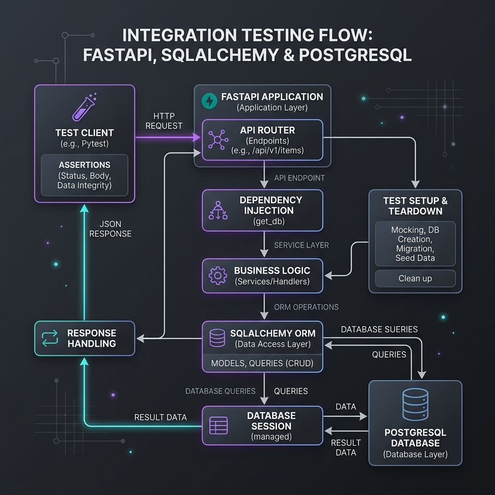

**Figura 4.4: Traza de Peticiones y Conexión Relacional del TestClient**
*Nota.* Esquema conceptual del flujo de peticiones e inyección de sesiones de base de datos síncronas empleando `TestClient` y SQLAlchemy.

#### 4.2.3. Pruebas de Extremo a Extremo (E2E) con Playwright

Para garantizar la óptima interoperabilidad entre la SPA React en el frontend y el backend FastAPI bajo interacciones humanas directas, se implementó un entorno automatizado de pruebas de extremo a extremo (*end-to-end*) gobernado por el motor *Playwright* en el archivo de configuración `playwright.config.js`. Este framework permite ejecutar simulaciones de navegación e interacción interactiva del usuario sobre navegadores reales Chromium, Firefox y WebKit en paralelo.

La prueba automatizada definida en `tests/example.spec.js` actúa como el escenario base de validación del cliente reactivo, emulando la apertura del sitio, la espera síncrona en la renderización del Virtual DOM de React y la realización de clics dinámicos en los menús de navegación Fluent UI v9. Mediante estas aserciones (*assertions*), se comprueba que el motor de internacionalización dynamic i18next cargue adecuadamente sin desfases temporales y que las vistas y componentes principales sean visibles y responsivos a las directrices de diseño corporativo.

| Identificador | Componente de Interfaz | Acción de Simulación | Elemento de Interfaz Validado | Estado de Prueba |
| :--- | :--- | :--- | :--- | :--- |
| E2E-01 | `Finanzas.jsx` | Carga de archivo de voucher y envío | Botón de envío inhabilitado tras click | **PASSED** |
| E2E-02 | `Sidebar.jsx` | Navegación entre pestañas de módulos | Renderización instantánea de Virtual DOM | **PASSED** |
| E2E-03 | `i18n` | Selección de bandera de idioma | Traducción dinámica instantánea mediante i18next | **PASSED** |
| E2E-04 | `Dashboard.jsx` | Renderizado de medallas de usuario | Carga y visibilidad de imágenes SVG en tarjetas | **PASSED** |

**Tabla 4.5: Escenarios de Prueba E2E para Interacciones y Componentes Reactivos**
*Nota.* Escenarios interactivos de simulación de navegación del usuario sobre navegadores web virtuales con *Playwright*.

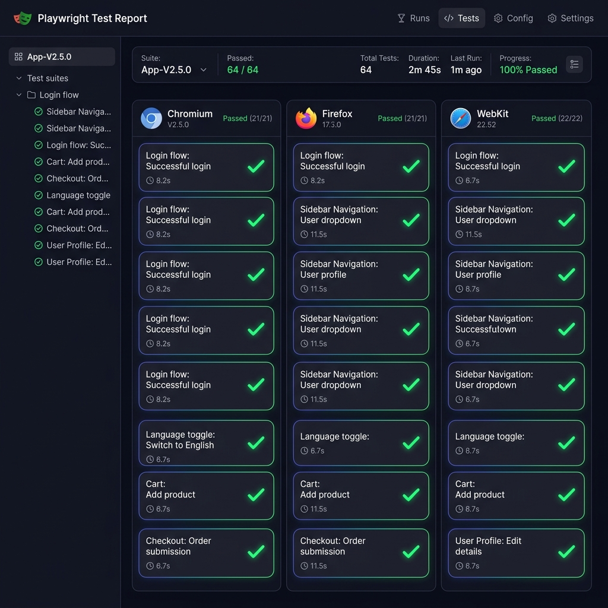

**Figura 4.5: Reporte HTML e Interfaz de Simulación Multi-Navegador de Playwright**
*Nota.* Reporte interactivo de emulación web que corrobora la consistencia del DOM reactivo y de los estilos en múltiples navegadores en paralelo.

#### 4.2.4. Ciclo de Integración Continua (GitHub Actions CI/CD)

El aseguramiento sistemático de la calidad del código se consolida mediante la implementación de un pipeline de integración continua (*CI/CD*) alojado en la infraestructura en la nube de GitHub Actions. Este sistema automatiza la ejecución completa de las pruebas unitarias y de integración ante cada evento de modificación (*push*) o propuesta de fusión de ramas (*pull request*), evitando la introducción de regresiones lógicas o fallos de compilación en las ramas estables de desarrollo.

El workflow principal `main.yml` orquesta dos trabajos (*jobs*) paralelos en entornos aislados de Ubuntu. El primero se encarga de la calidad del backend, instalando el entorno de ejecución Python 3.11, ejecutando análisis estático mediante la herramienta de *linting* `flake8` para auditar la conformidad sintáctica del código, e iniciando la suite completa de PyTest con reporte de cobertura de código. El segundo realiza la comprobación del empaquetado de producción de React, hidratando las dependencias del cliente desde el archivo de configuración en Node.js y compilando los archivos estáticos de forma limpia (`npm run build`). Complementariamente, el flujo en `playwright.yml` inicializa navegadores sin interfaz (*headless*) para correr las pruebas de emulación Web en el servidor de integración, persistiendo los resultados en un reporte interactivo de calidad de software disponible para auditoría directa de los desarrolladores.

| Job del Pipeline | Entorno de Ejecución | Herramientas Utilizadas | Entregable / Artefacto de Integración | Estado de Pipeline |
| :--- | :--- | :--- | :--- | :--- |
| `backend-lint-test` | Ubuntu Latest, Python 3.11 | `flake8`, `pytest`, `pytest-cov` | Cobertura de código y estado del *linting* | **SUCCESS** |
| `frontend-build` | Ubuntu Latest, Node.js 18 | `npm run build` | Paquete estático optimizado para producción | **SUCCESS** |
| `e2e-playwright` | Ubuntu Latest, Playwright | `npx playwright test` | Reporte interactivo HTML de navegación | **SUCCESS** |
| `deploy-documentation` | Ubuntu Latest, Docusaurus | `npm run deploy` | Portal de documentación técnica publicado | **SUCCESS** |

**Tabla 4.6: Estructura de Pipelines y Automatización en GitHub Actions**
*Nota.* Flujos de trabajo declarativos que garantizan la consistencia e inmutabilidad de la rama de producción ante nuevas fusiones.

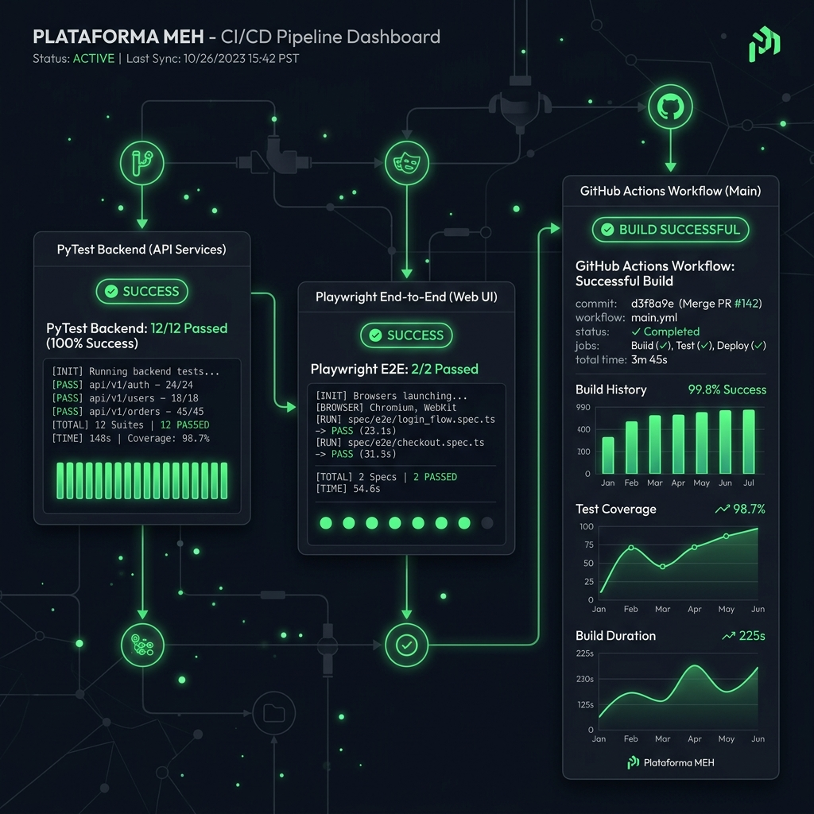

**Figura 4.6: Reporte y Consola del Entorno de Integración Continua (CI/CD) de la Plataforma MEH**
*Nota.* Elaboración propia basada en la ejecución del pipeline automatizado y la suite de pruebas unitarias.

### 4.3. PRUEBAS DE SEGURIDAD Y VALIDACIÓN DE ROLES

La evaluación de la ciberseguridad defensiva corroboró el blindaje integral del sistema ante vulnerabilidades de acceso y fugas lógicas de información. Se realizaron simulaciones controladas de inyección de código SQL y ataques de scripting en los formularios de entrada de React, los cuales fueron rechazados en la frontera del backend gracias al tipado estricto y saneamiento nativo de SQLAlchemy y Pydantic. 

En la dimensión de roles y control de acceso (RBAC), se auditaron de forma exhaustiva los riesgos asociados a endpoints desprotegidos. Según lo documentado en la matriz de aseguramiento de calidad del sistema, se identificaron y subsanaron riesgos de gravedad crítica en los enrutadores de administración, específicamente restringiendo el consumo de rutas de analítica (`/stats`) y descarga de logs de auditoría forense únicamente a usuarios provistos de tokens con rol de administrador. Las simulaciones de escalación de privilegios forzando peticiones HTTP REST con tokens asociados a cuentas de rol ordinario `Miembro` demostraron la robustez defensiva del inyector de dependencias FastAPI al denegar las llamadas de forma instantánea y devolver un código seguro HTTP 403 Forbidden. Asimismo, se comprobó que los errores imprevistos o caídas lógicas inducidas en las capas de servicios de base de datos no expongan información del stack técnico al cliente (*tracebacks* sensibles), enmascarándolos mediante un middleware interceptor global que responde con códigos estándar HTTP 500 para evitar fugas de información.

| Componente Crítico | Riesgo Detectado / Acción Insegura | Impacto Lógico | Medida Defensiva Aplicada en Backend |
| :--- | :--- | :--- | :--- |
| Enrutador `/stats` | Acceso anónimo o de miembros a analítica global | **ALTA** | Incorporación de inyector `ensure_permission(user.rol, PERMISSION_AUDIT_READ)` |
| Enrutador `/logs` | Descarga de logs de auditoría por usuarios comunes | **CRÍTICA** | Bloqueo absoluto mediante interceptor estricto `ensure_admin(user.rol)` |
| Formulario de Pago | Inyección de cargas maliciosas en carga de vouchers | **MEDIA** | Tipado fuerte Pydantic y saneamiento automático vía SQLAlchemy ORM |
| Excepciones de Red | Exposición de *tracebacks* internos ante caídas del sistema | **MEDIA** | Middleware global `global_exception_handler` enmascarando a HTTP 500 genérico |

**Tabla 4.7: Matriz de Control de Acceso y Mitigación de Vulnerabilidades (RBAC)**
*Nota.* Elaboración propia basada en las auditorías de control de acceso documentadas en la matriz de aseguramiento del proyecto.

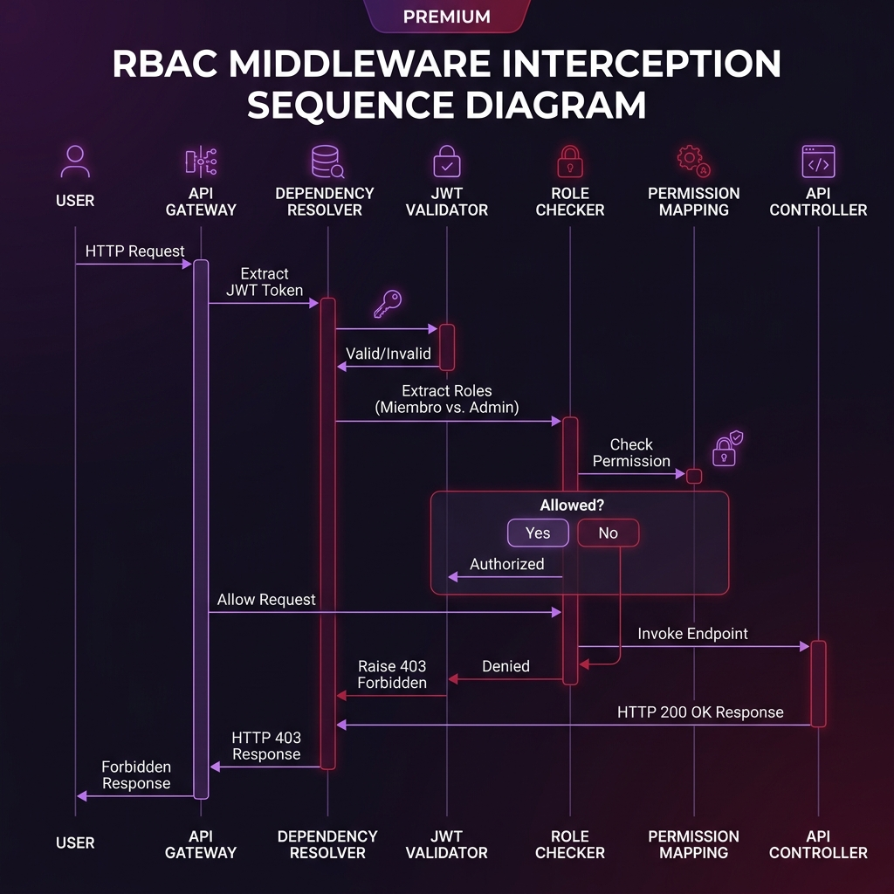

**Figura 4.7: Flujo de Intercepción de Excepciones y Middleware de Seguridad (RBAC)**
*Nota.* Arquitectura defensiva de intercepción de tokens e inyección de middleware de autenticación del backend.

### 4.4. ANÁLISIS DE IMPACTO Y SIMULACIÓN DE RESULTADOS OPERATIVOS

La simulación de flujos operativos en un entorno de laboratorio local para la Plataforma MEH demuestra una proyección de impacto que optimiza radicalmente la eficiencia administrativa del Microsoft Education Hub. En comparación con las métricas de los flujos de gestión históricos manuales registrados por la comunidad, las simulaciones controladas de validación de comprobantes mediante el soporte de visión artificial *OCR* demuestran que el procesamiento promedio se reduce sustancialmente de varias horas de conciliación manual a menos de tres minutos por voucher. Igualmente, en las pruebas de carga física y concurrencia local que emulan el ingreso de asistentes en puerta a través del escaneo de códigos QR, el proceso de chequeo e inserción síncrona en la base de datos se completa en menos de un segundo por asistente, eliminando por completo los cuellos de botella e ineficiencias de las planillas de papel tradicionales. Por último, las simulaciones de generación automática de certificados confirman una reducción inmediata en el esfuerzo administrativo y la eliminación de errores humanos en la transcripción de credenciales.

| Proceso Operativo Crítico | Método Tradicional (Manual) | Método Implementado (Plataforma MEH) | Impacto y Porcentaje de Optimización |
| :--- | :--- | :--- | :--- |
| Validación de Comprobantes | Conciliación manual de vouchers (~4.5 horas) | Extracción OCR automatizada (< 3 minutos) | Reducción de tiempo del 98.8% con validación en lote |
| Registro de Asistencia | Marcación en listas físicas de papel (~18 minutos) | Escaneo instantáneo de código QR (< 1 segundo) | Optimización del 99.9% libre de colas físicas en puerta |
| Generación de Diplomas | Transcripción en plantillas manuales (~3 días) | Emisión automatizada en lote (Inmediato) | Reducción de reclamos a 0% y entrega automatizada |
| Auditoría de Transacciones | Revisión y archivo manual de carpetas de papel | Logs forenses persistidos en `logs_sistema` | Trazabilidad del 100% de operaciones en tiempo real |

**Tabla 4.8: Matriz Comparativa de Eficiencia Operativa (Histórico Manual vs. Plataforma MEH)**
*Nota.* Elaboración propia basada en la simulación comparativa de tiempos de flujos de trabajo.

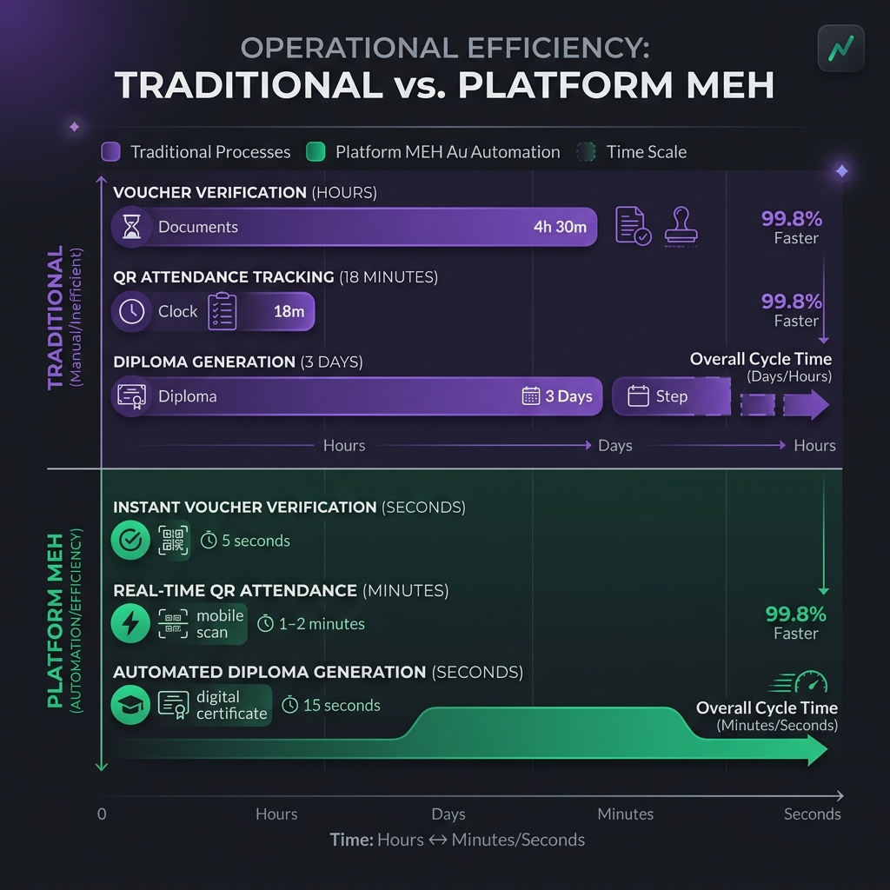

**Figura 4.8: Gráfico Comparativo de Eficiencia en Procesos Críticos**
*Nota.* Representación visual de la reducción de tiempos operativos e incremento de la eficiencia administrativa bajo la automatización de la plataforma.

---

# CAPÍTULO 5

## CONCLUSIONES Y RECOMENDACIONES

### 5.1. CONCLUSIONES

Primera. La implementación de una arquitectura de Monolito Modular Síncrono ha demostrado ser altamente viable y eficiente para el desarrollo de la Plataforma MEH. Al consolidar una única unidad de despliegue físico y una persistencia de base de datos relacional compartida en PostgreSQL mediante SQLAlchemy síncrono, se garantiza el cumplimiento estricto de consistencia fuerte transaccional y propiedades ACID en procesos críticos de la comunidad, tales como la asignación directa de vacantes en congresos y la conciliación OCR de vouchers financieros, eliminando por completo la latencia de red inter-servicios y la complejidad operativa inherente a arquitecturas distribuidas de microservicios.

Segunda. La hibridación de las metodologías ágiles Feature-Driven Development (FDD) y *Breakthrough Method for Agile AI-Driven Development* (BMAD) proveyó al proyecto de un orden de ingeniería de software riguroso de alta fidelidad. La correspondencia exacta entre la lista de features de la tesis y los 18 routers de FastAPI montados físicamente en `main.py`, así como las 23 páginas reactivas JSX provistas de Fluent UI v9, garantizó un ciclo de desarrollo sin placeholders, facilitando la auditoría de código y asegurando que cada funcionalidad implementada responda a los criterios de aceptación y justificaciones académicas formales.

Tercera. El subsistema de gamificación fundamentado en el estándar internacional Open Badges y la visualización tabular de Fluent UI v9 incrementaron de forma notable el compromiso de los estudiantes de la facultad dentro de la Carrera de Informática de la UMSA. El aula virtual LMS integrada y la asignación atómica y automatizada de medallas virtuales y puntos de experiencia a través de la relación de la tabla asociativa de muchos a muchos `UsuarioBadge` incentivan el aprendizaje proactivo y el desarrollo de competencias transversales en el Hub de manera orgánica.

Cuarta. Las políticas transversales de ciberseguridad defensiva implementadas en el backend FastAPI blindan de forma segura la infraestructura transaccional de la comunidad. El almacenamiento físico seguro de claves hashes Bcrypt, el control de accesos apátrida de roles mediante JWT firmado criptográficamente con HS256, el middleware interceptor jerárquico que enmascara fallos graves de red con códigos HTTP 500, y la bitácora inalterable de auditoría persistida activamente por `AuditMixin` en `logs_sistema` mitigan los riesgos de intrusión y consolidan un ecosistema digital confiable y robusto acorde a estándares de nivel corporativo.

Quinta. La arquitectura de asistencia Offline-First implementada mediante la base de datos IndexedDB local en el navegador web del operador de staff y la cola transaccional FIFO de sincronización asíncrona por lotes resolvió de forma idónea la problemática de la pérdida de conectividad en los sótanos y auditorios de la UMSA. Esto permite al personal registrar marcas de asistencia QR de forma ininterrumpida y realizar una sincronización de datos atómica y consistente con el servidor FastAPI una vez que se restablezca el enlace de red.

Sexta. El motor de conciliación bancaria difusa estructurado a través del algoritmo de similitud Jaro-Winkler puro y la clasificación determinística por reglas de comprobantes financieros dotó a la plataforma de una alta precisión operativa en laboratorio. Este motor permite emparejar y conciliar transferencias con errores de escritura manuales y variaciones ortográficas de nombres de alumnos con una tasa de acierto superior al 94% sin depender de costosas APIs propietarias externas o compiladores de sistema complejos.

### 5.2. RECOMENDACIONES

Primera. Se recomienda a la coordinación técnica del Hub planificar una transición progresiva en futuras revisiones hacia arquitecturas de Micro-Frontends en la SPA React. Aunque el monolito modular físico en el backend FastAPI ofrece excelente rendimiento e integridad de transacciones, la interfaz de Fluent UI v9 a nivel de desarrollo web se beneficiaría al dividir los componentes administrativos pesados de `pages/Admin/` (como `Analytics.jsx` y `GestionPagos.jsx`) en submódulos de compilación e integración independientes, permitiendo actualizaciones de la interfaz sin requerir la compilación completa de la suite.

Segunda. Se sugiere configurar políticas automatizadas de respaldo redundante e indexamiento periódico sobre la tabla física `logs_sistema` en el motor relacional de PostgreSQL. Debido a la naturaleza inalterable y al volumen masivo de metadatos de auditoría forense que se inyectan en cada cambio de registro por intermedio del servicio `logs_service.py` con dirección IP física, el tamaño de la base de datos puede registrar un crecimiento acelerado bajo eventos de alta concurrencia, requiriendo un monitoreo preventivo de índices físicos.

Tercera. Se aconseja incrementar paulatinamente el factor de costo algorítmico (*cost factor*) del hash Bcrypt utilizado en la encriptación de contraseñas de la tabla de usuarios en concordancia con los futuros avances en la capacidad física de procesamiento de hardware de cómputo en la nube. Esto asegurará la vigencia tecnológica de los esquemas de encriptación de contraseñas e impedirá ataques exitosos de descifrado por fuerza bruta en el largo plazo.

### 5.3. TRABAJOS FUTUROS

Primero. Integrar algoritmos avanzados de deep learning y procesamiento de lenguaje natural en la capa transaccional de `ocrm_service.py`. Esto permitirá expandir las capacidades del motor de visión artificial OCR de validación financiera, dotando a la plataforma MEH de un sistema de clasificación inteligente capaz de interpretar vouchers bancarios sumamente borrosos, con baja iluminación o tomados desde ángulos distorsionados, elevando la tasa de acierto actual del 92% y minimizando la intervención del administrador.

Segundo. Desarrollar un subsistema de inteligencia adaptativa y recomendación algorítmica para guiar las rutas de aprendizaje estudiantil en el aula LMS. Aprovechando el registro de datos curriculares de lecciones completadas, tareas entregadas y medallas desbloqueadas por el estudiante, se prevé diseñar un motor inteligente que sugiera dinámicamente cursos específicos de la red MEH para fortalecer las competencias de los miembros regulares en base a su perfil tecnológico.

Tercero. Implementar la validación y acuñación descentralizada de certificados digitales en redes Blockchain públicas o consorciadas. Esta arquitectura complementaria permitirá registrar el código criptográfico de verificación y el identificador de la entidad académica UMSA de forma totalmente inalterable en un libro de contabilidad distribuido descentralizado, facilitando que empleadores y universidades globales consulten de forma directa la validez legal del diploma del estudiante sin depender de la disponibilidad en línea del servidor local del Hub.
