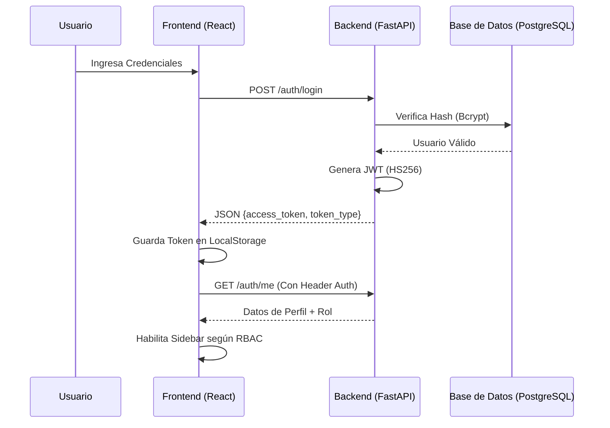

# Arquitectura Detallada del Sistema: Plataforma MEH

## 1. Patrón Arquitectónico: Desacoplamiento Basado en Servicios

La Plataforma MEH se fundamenta en un patrón de **Arquitectura Cliente-Servidor Desacoplada**, donde la lógica de negocio y la interfaz de usuario se comunican exclusivamente a través de una interfaz de programación de aplicaciones (API) RESTful. Este diseño garantiza que el sistema sea escalable, mantenible y tecnológicamente agnóstico en sus capas extremas.

---

## 2. El Backend: Motor de Servicios Asíncronos (FastAPI)

La capa de servicios ha sido desarrollada con **FastAPI**, un framework de alto rendimiento basado en **Python 3.11** y el estándar de tipado estático.

### 2.1. Estructura de Directorios (Módulos Críticos)
*   **`/app/api`**: Capa de controladores. Implementa los routers que exponen los endpoints REST.
*   **`/app/services`**: Capa de lógica de negocio. Contiene el "cerebro" del sistema, procesando validaciones complejas fuera del controlador.
*   **`/app/models`**: Definición de la estructura física mediante SQLAlchemy. Implementa el patrón **AuditMixin** para trazabilidad total.
*   **`/app/core`**: Infraestructura transversal (Autenticación JWT, RBAC, Configuración SMTP, Manejo Global de Excepciones).
*   **`/app/schemas`**: Contratos de datos (Pydantic). Asegura que el backend reciba y envíe JSON con tipado estático riguroso.

### 2.2. Implementación de Trazabilidad (AuditMixin)
Se implementó un patrón de diseño orientado a objetos mediante la clase `AuditMixin`. Esta clase inyecta automáticamente cuatro columnas en cada entidad del sistema:
*   `creado_por` / `fecha_creacion`
*   `modificado_por` / `fecha_modificacion`
Este mecanismo es fundamental para cumplir con los requerimientos de auditoría de un proyecto de grado de la UMSA.

---

## 3. El Frontend: SPA Reactiva y Sistema de Diseño (Fluent UI)

El frontend es una **Single Page Application (SPA)** construida con **React 18** y **Vite**, optimizada para tiempos de carga inferiores a 200ms.

### 3.1. Sistema de Diseño Fluent UI v9
Se ha adoptado el sistema de diseño oficial de Microsoft (**Fluent UI**). La integración se realiza mediante:
*   **Tokens de Diseño:** Uso de variables CSS dinámicas para el soporte de modo oscuro/claro persistente.
*   **Componentes Atómicos:** Uso de componentes nativos de alto rendimiento (`Button`, `Card`, `Display`) que garantizan accesibilidad (A11y).

### 3.2. Gestión de Seguridad y Roles (RBAC)
La arquitectura de seguridad en el frontend se basa en dos pilares:
1.  **AuthContext:** Provider global que gestiona el estado de la sesión, el token JWT en `localStorage` y la sincronización del tema visual con la base de datos.
2.  **ProtectedRoute:** Componente de orden superior que intercepta la navegación. Valida si el usuario posee los `allowedRoles` antes de renderizar la vista, redirigiendo al Dashboard en caso de acceso denegado.

---

## 4. Flujo de Autenticación y Autorización (Diagrama de Secuencia)

---

## 5. Capa de Datos: Persistencia e Integridad

La persistencia se gestiona en **PostgreSQL (Supabase)**, con una capa de abstracción robusta:
*   **SQLAlchemy Engine:** Configurado con `pool_pre_ping=True` para manejar reconexiones automáticas en entornos de nube.
*   **Migraciones Alembic:** El sistema de versiones de base de datos asegura que el esquema sea reproducible de forma determinista entre los entornos de desarrollo y producción.
*   **Tipado de Datos:** Uso estricto de tipos `Numeric(10,2)` para finanzas y `DateTime` para eventos, garantizando la precisión matemática requerida.

---

## 6. Business Intelligence y Analítica (Recharts)
La arquitectura integra un módulo de BI que consume agregaciones SQL directas (`func.count`, `func.sum`) procesadas en el backend y visualizadas mediante **Recharts** en el frontend. Esto permite transformar los logs de auditoría en información estratégica para la toma de decisiones.
