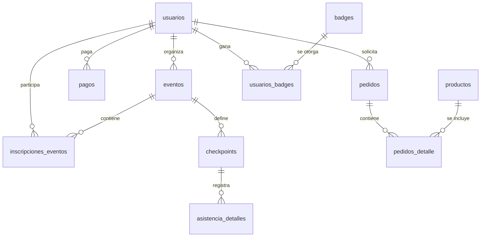

# Especificación Técnica de Persistencia: Diccionario de Datos Integral (100% Alcance)

## 1. Introducción y Estándares de Diseño
La base de datos de la **Plataforma MEH** está implementada en **PostgreSQL**, diseñada bajo el paradigma de normalización **3NF**. Se ha priorizado la integridad referencial y la trazabilidad total mediante la implementación del patrón **AuditMixin**.

---

## 2. Definición Detallada de Entidades (16 Tablas)

### 2.1. Núcleo de Identidad y Roles
*   **`usuarios`**: Entidad maestra de perfiles, autenticación (Bcrypt) y gestión de roles RBAC.

### 2.2. Gestión Académica y Eventos
*   **`eventos`**: Planificación de talleres y conferencias.
*   **`inscripciones_eventos`**: Vínculo asociativo con lógica de QR único.
*   **`cursos`**: Catálogo de formación continua.
*   **`inscripciones_cursos`**: Seguimiento de progreso académico y calificación final.

### 2.3. Control de Operaciones QR
*   **`checkpoints`**: Puntos de control lógico dentro de un evento.
*   **`asistencia_detalles`**: Registro físico de escaneos realizados por el Staff.

### 2.4. Gamificación e Insignias
*   **`badges`**: Catálogo de logros y medallas digitales.
*   **`usuarios_badges`**: Registro de méritos obtenidos por los miembros.

### 2.5. Marketplace y Kits de Evento
*   **`productos`**: Catálogo de merchandising y kits oficiales.
*   **`pedidos`**: Órdenes de adquisición de productos.
*   **`pedidos_detalle`**: Desglose granular de ítems por pedido.

### 2.6. Módulo Financiero y Legal
*   **`pagos`**: Trazabilidad de ingresos y validación de comprobantes.
*   **`certificados`**: Emisión de diplomas con token UUID de verificación externa.

### 2.7. Comunicación y Auditoría
*   **`anuncios`**: Sistema de notificaciones globales en la plataforma.
*   **`recursos`**: Repositorio de materiales VIP/Speaker.
*   **`logs_sistema`**: Trazabilidad absoluta Change-by-Change (JSON).

---

## 3. Diccionario de Atributos Críticos

| Entidad | PK | FK Principales | Atributos Destacados |
| :--- | :--- | :--- | :--- |
| `usuarios` | `id_usuario` | - | `rol`, `correo`, `preferencia_tema` |
| `eventos` | `id_evento` | `id_organizador` | `modalidad`, `token_qr`, `estado` |
| `inscripciones_eventos` | `id_inscripcion` | `id_usuario`, `id_pago` | `codigo_qr`, `asistio` |
| `pedidos` | `id_pedido` | `id_usuario`, `id_pago` | `estado_entrega`, `fecha_pedido` |
| `badges` | `id_badge` | `id_evento_origen` | `nombre_badge`, `imagen_url` |

---

## 4. Diagrama Entidad-Relación (Mermaid ERD)

---

## 5. Propiedades de Auditoría Universal
Todas las tablas heredan de `AuditMixin`:
*   `creado_por`: Usuario origen.
*   `fecha_creacion`: Timestamp UTC.
*   `modificado_por`: Último editor.
*   `fecha_modificacion`: Historial de cambio.
