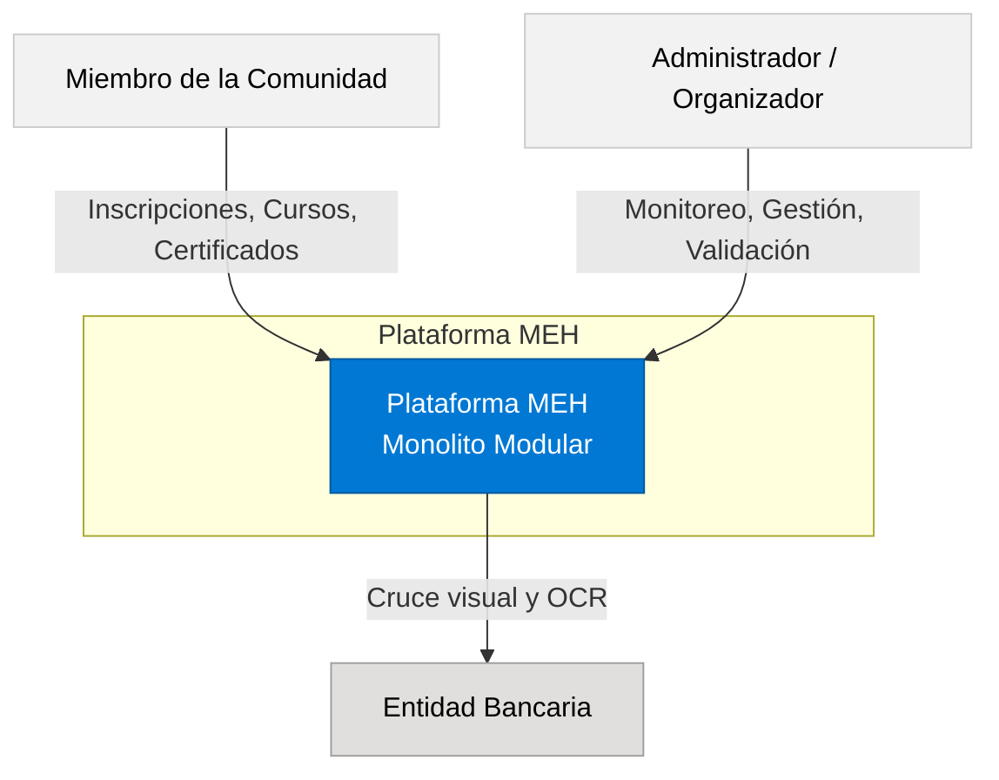
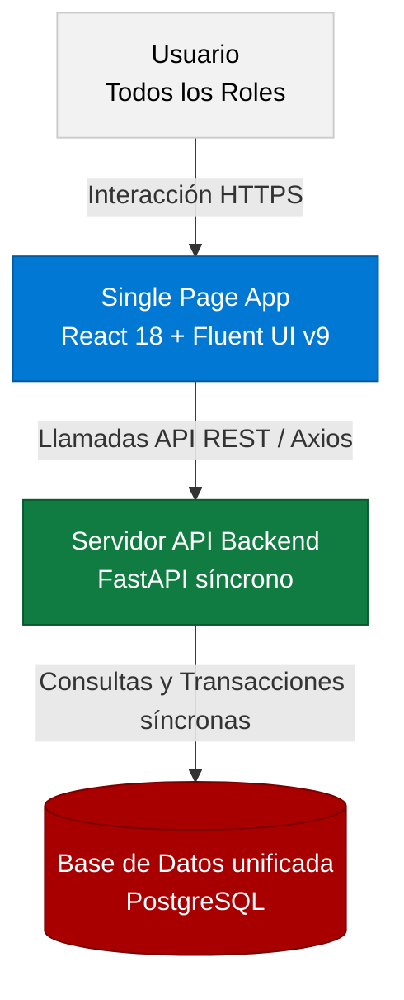

# Arquitectura y Contexto de la Plataforma MEH

:::info METADATOS DEL DOCUMENTO
* **Propietario del Documento:** Nataly Gemio Morales (MLSA Ambassador / Carrera de Informática UMSA)
* **Versión:** 1.2.0
* **Última Actualización:** 2026-05-25
* **Audiencia Destinataria:** Desarrolladores Backend/Frontend, Administradores de Sistemas, Evaluadores Académicos de la UMSA.
:::

## 🎯 Propósito y Ámbito

Este documento expone la fundamentación teórica y metodológica de la arquitectura de software del sistema **Microsoft Education Hub (MEH)**. Define los límites del sistema (Diagrama de Contexto) y su división lógica (Diagrama de Contenedores), sirviendo como base teórica formal para la tesis de grado en la **Universidad Mayor de San Andrés (UMSA)**.

---

## 1. Justificación Científica del Monolito Modular Síncrono

La elección de la arquitectura es uno de los pilares determinantes para la viabilidad, mantenibilidad y robustez de un sistema corporativo. La Plataforma MEH adopta formalmente una arquitectura de **Monolito Modular Síncrono** (Modular Monolith) en el backend y una **Single Page Application (SPA)** en el frontend.

### ¿Cómo sabemos y demostramos con certeza técnica que es un Monolito Modular?

En la defensa académica y auditoría de software, la arquitectura adoptada no se asume por convención, sino que se demuestra empíricamente en base a la topología física y lógica de la base de código real:

1. **Unidad Única de Despliegue Físico:** Todo el backend de la API se compila, empaqueta y ejecuta dentro de un único proceso de servidor (Uvicorn levantando la instancia `app = FastAPI()` en `main.py`). Si este proceso se detiene o sufre una caída física, todas las capacidades y servicios del ecosistema (LMS, finanzas, asistencia, insignias) se detienen sincrónicamente. A nivel de infraestructura, no existe una topología distribuida con múltiples servidores físicos o virtuales independientes para cada dominio del negocio.
2. **Persistencia Unificada y Base de Datos Compartida:** El sistema se centraliza en un único servidor relacional **PostgreSQL** administrado por una sola instancia de conexión ORM de SQLAlchemy y migrado secuencialmente bajo un único historial de Alembic. Las dependencias entre dominios (por ejemplo, relacionar un pago con un usuario, o un curso con su instructor) se resuelven mediante restricciones de integridad relacional nativas (`ForeignKey` y transacciones ACID atómicas con `db.commit()`), en lugar de APIs distribuidas de comunicación inter-bases de datos que introduzcan latencia o inconsistencia eventual (patrón Saga).
3. **Comunicación Síncrona en Memoria (In-Memory Calls):** A diferencia de las arquitecturas fragmentadas en red (como los Microservicios) que requieren protocolos de red remotos (como llamadas HTTP REST, gRPC o colas de mensajería asíncrona como RabbitMQ o Kafka) para interactuar, la Plataforma MEH gestiona la intercomunicación entre módulos en el backend mediante llamadas a funciones directas en memoria y paso de la sesión síncrona de base de datos (`db: Session = Depends(get_db)`) a través del inyector de dependencias de FastAPI.
4. **Modularidad Lógica Estricta:** Aunque comparte la unidad física de despliegue y persistencia relacional, el código no conforma un "monolito de lodo (Spaghetti Monolith)". Existe una estricta separación de responsabilidades y bajo acoplamiento por dominios lógicos estructurados en tres capas bien definidas:
   - **Capa de Entrada y Ruteo (API):** Enrutadores independientes en `backend/app/api/` que encapsulan los endpoints HTTP REST específicos de cada dominio de negocio.
   - **Capa de Lógica de Negocio (Servicios):** Archivos de servicio independientes en `backend/app/services/` que albergan la lógica pura y realizan las transacciones sobre la base de datos.
   - **Capa de Estructuras (Esquemas):** Contiene las validaciones de entrada y salida de datos estructurados con Pydantic en `backend/app/schemas/`.

### Ventajas Técnicas y Justificación frente a Microservicios
* **Consistencia Fuerte e Inmediata:** Permite que la activación de una inscripción o la entrega de una medalla por finalizar un curso ocurra en la misma transacción síncrona de base de datos, eliminando la complejidad de sincronizar bases de datos distribuidas.
* **Cero Latencia de Red Inter-Servicios:** La comunicación en memoria elimina los tiempos de transporte HTTP y la serialización/deserialización constante de JSON.
* **Simplicidad Operativa:** El despliegue de un solo contenedor Docker reduce significativamente los costes de infraestructura y la necesidad de orquestadores complejos (como Kubernetes).

---

## 2. Diagramas de Arquitectura C4

El estándar C4 permite modelar el sistema a diferentes niveles de abstracción, facilitando la comprensión técnica de los límites y componentes del software.

### Nivel 1: Diagrama de Contexto de Sistema
Define los límites tecnológicos del sistema y la interacción de los diferentes usuarios y sistemas externos con la Plataforma MEH.

### Nivel 2: Diagrama de Contenedores de Sistema
Muestra la división en componentes lógicos de alto nivel ejecutables que interactúan para conformar la solución tecnológica.

---

## 🔗 Recursos y Artículos Relacionados

* [02. Detalle de Frontend React](file:///f:/Plataforma-MEH/website/docs/tecnico/02-detalle-frontend.md)
* [03. Mapeo de Componentes .jsx](file:///f:/Plataforma-MEH/website/docs/tecnico/03-mapeo-paginas-jsx.md)
* [04. Detalle de Backend FastAPI](file:///f:/Plataforma-MEH/website/docs/tecnico/04-detalle-backend.md)
* [05. Base de Datos y Seguridad](file:///f:/Plataforma-MEH/website/docs/tecnico/05-base-datos-seguridad.md)
