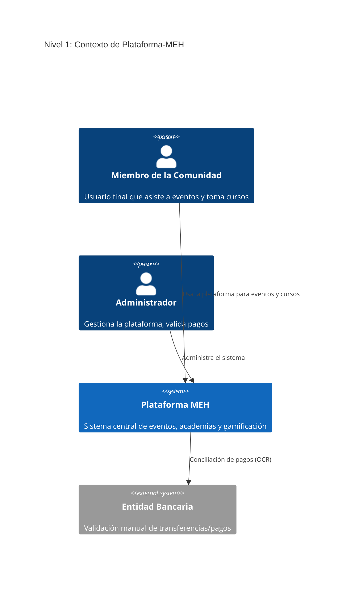
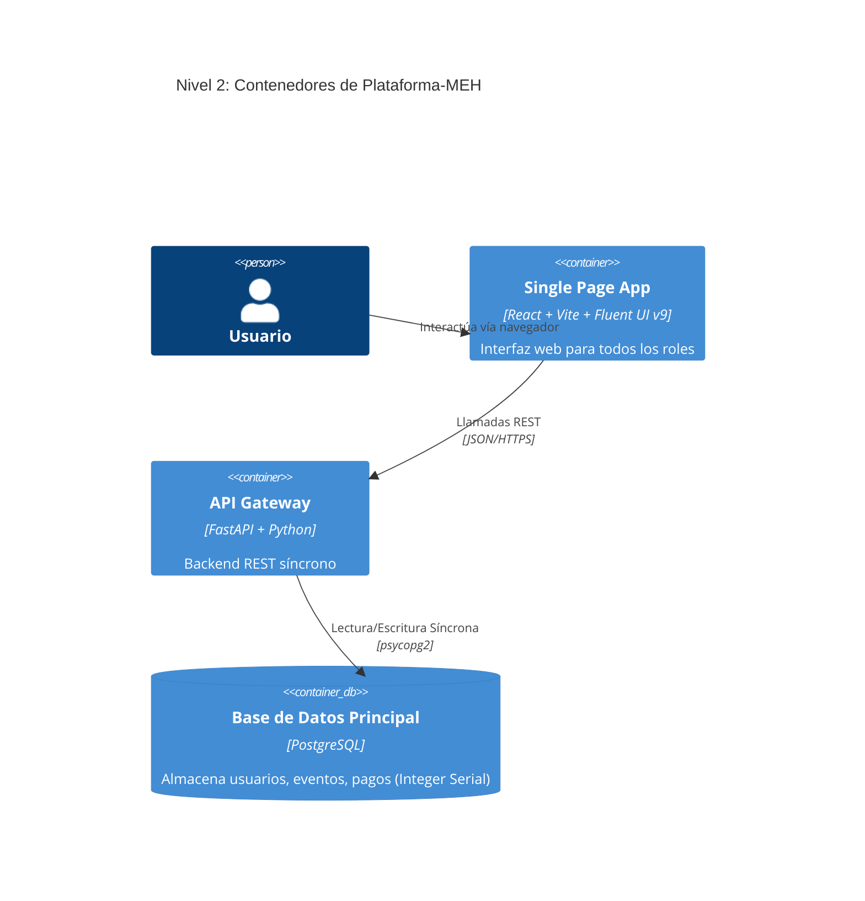

# Visión General

Plataforma-MEH es un sistema integral para la gestión de comunidades, eventos, cursos (Learning Hub), certificados y pagos.

## Stack Tecnológico (Versiones Exactas)
- **Backend:** Python 3.11+, FastAPI 0.104+, SQLAlchemy 2.0+ (Síncrono), psycopg2-binary, python-jose (HS256)
- **Frontend:** React 18, Vite 5, Fluent UI v9 (`@fluentui/react-components`), React Router DOM 6
- **Base de Datos:** PostgreSQL 15+ (usando `INTEGER SERIAL`, sin UUIDs).

## Diagramas C4

### Nivel 1: Contexto

### Nivel 2: Contenedores

