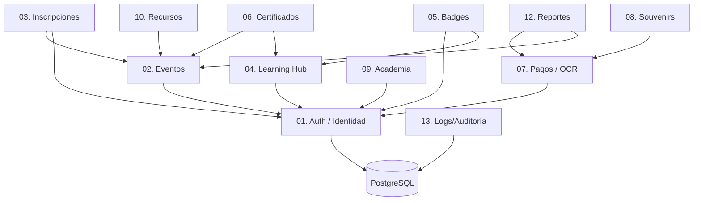

# Mapa de Dependencias

Grafo de dependencias entre módulos del backend.

```mermaid
graph TD
    Auth[01. Auth / Identidad] --> DB[(PostgreSQL)]
    Eventos[02. Eventos] --> Auth
    Inscripciones[03. Inscripciones] --> Eventos
    Inscripciones --> Auth
    Cursos[04. Learning Hub] --> Auth
    Gamificacion[05. Badges] --> Auth
    Gamificacion --> Cursos
    Certificados[06. Certificados] --> Eventos
    Certificados --> Cursos
    Pagos[07. Pagos / OCR] --> Auth
    Productos[08. Souvenirs] --> Pagos
    Academia[09. Academia] --> Auth
    Recursos[10. Recursos] --> Eventos
    Dashboard[12. Reportes] --> Pagos
    Dashboard --> Eventos
    Logs[13. Logs/Auditoría] --> DB
```
