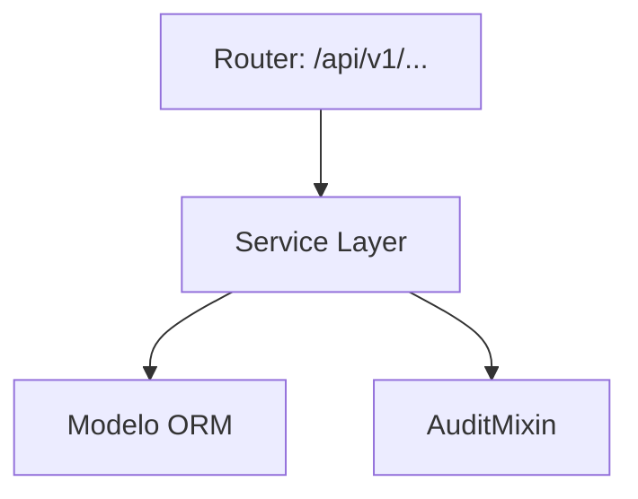
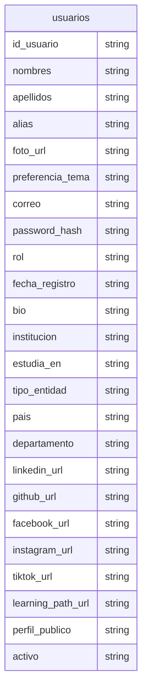

# Auth / Identidad y Acceso

> **⚠️ [GENERADO AUTOMÁTICAMENTE]:** Esta documentación fue generada a partir del análisis estático del código fuente de Plataforma MEH.

## Sección M0 — Decisiones Arquitectónicas Locales (ADR)

| ID | Decisión | Alternativas consideradas | Justificación | Consecuencias |
|---|---|---|---|---|
| ADR-M01-001 | Uso de arquitectura en capas | Monolito o lógica en routers | Mantenibilidad y reusabilidad | Mayor cantidad de archivos y abstracciones |

## Sección M1 — Arquitectura del Módulo (C4 Nivel 3 + Ciclo de Vida)

Ciclo de vida de una petición típica:
1. Llegada al Router (FastAPI).
2. Validación Pydantic.
3. Inyección de dependencia (get_db).
4. Ejecución en Service Layer.
5. Persistencia.
6. Auditoría.
7. Respuesta serializada.

## Sección M2 — Diccionario de Datos

### Tabla: `usuarios`

| Nombre del Campo | Tipo de Dato | Restricciones |
|---|---|---|
| id_usuario | `Integer, primary_key=True, index=True` | - |
| nombres | `String` | - |
| apellidos | `String` | - |
| alias | `String, nullable=True` | - |
| foto_url | `String, nullable=True` | - |
| preferencia_tema | `String, default="dark"` | - |
| correo | `String, unique=True, index=True` | - |
| password_hash | `TEXT` | - |
| rol | `String, default="MIEMBRO"` | - |
| fecha_registro | `DateTime, default=datetime.utcnow` | - |
| bio | `TEXT, nullable=True` | - |
| institucion | `String, nullable=True` | - |
| estudia_en | `String, nullable=True` | - |
| tipo_entidad | `String, default="Estudiante"` | - |
| pais | `String, default="Bolivia"` | - |
| departamento | `String, nullable=True` | - |
| linkedin_url | `String, nullable=True` | - |
| github_url | `String, nullable=True` | - |
| facebook_url | `String, nullable=True` | - |
| instagram_url | `String, nullable=True` | - |
| tiktok_url | `String, nullable=True` | - |
| learning_path_url | `String, nullable=True` | - |
| perfil_publico | `Boolean, default=True` | - |
| activo | `Boolean, default=True` | - |

## Sección M3 — Contratos de APIs

| Método | URI |
|---|---|
| POST | `/api/v1/auth/register` |
| POST | `/api/v1/auth/login` |
| POST | `/api/v1/auth/google` |
| GET | `/api/v1/auth/me` |
| PUT | `/api/v1/auth/me` |
| GET | `/api/v1/auth/usuarios` |
| PUT | `/api/v1/auth/usuarios/{id_usuario}/rol` |

## Sección M4 — Ingeniería Avanzada y Algoritmos Núcleo

Para información sobre la trazabilidad, se usa `AuditMixin` en los modelos para capturar el usuario creador/modificador.

## Sección M5 — Frontend (por módulo)

Revisar la carpeta `frontend/src/` para componentes asociados a este módulo.

## Sección M6 — Migraciones

* Las migraciones asociadas a estas tablas se encuentran en `alembic/versions/`.
