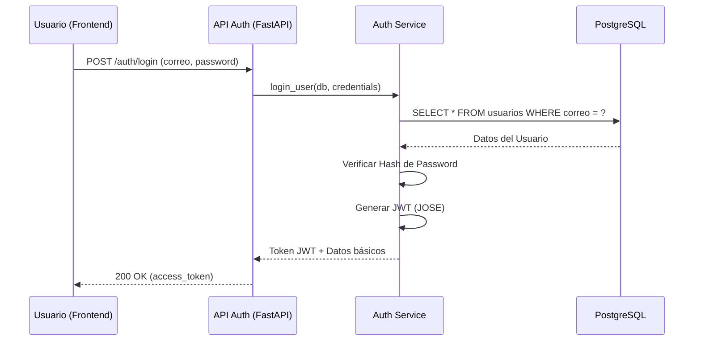
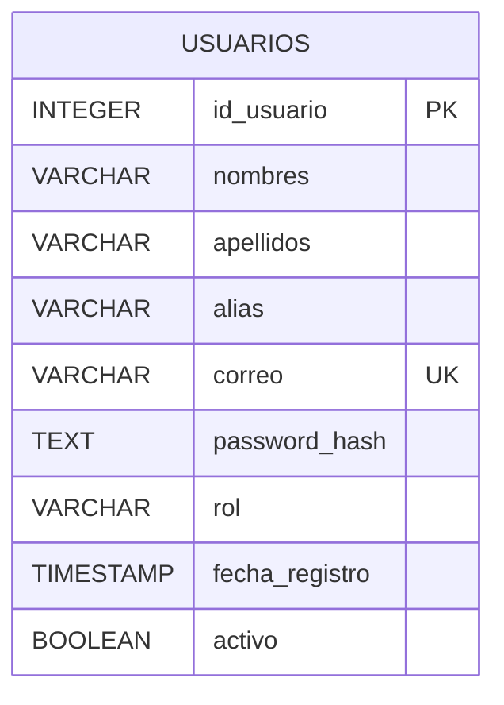
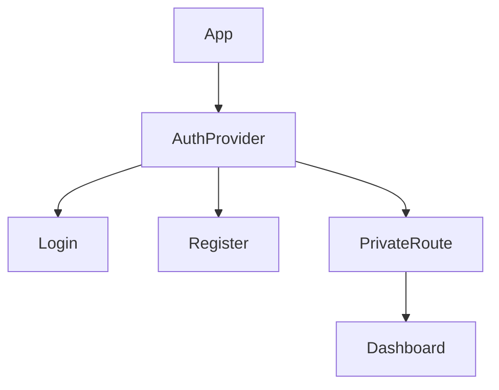

# Módulo 01: Auth / Identidad

El módulo de **Autenticación e Identidad** es el núcleo de seguridad de la Plataforma MEH. Gestiona el ciclo de vida completo de los usuarios, desde el registro y la verificación hasta el control de acceso basado en roles (RBAC). Este módulo garantiza que solo usuarios autorizados puedan interactuar con recursos críticos y proporciona la base para la personalización de la experiencia del usuario.

:::info Propósito
Centralizar la gestión de usuarios, perfiles y permisos, asegurando una capa de seguridad robusta y unificada para todo el ecosistema.
:::

## M0 — ADR Local: Gestión de Identidad Síncrona

| ID | Decisión | Alternativas | Justificación | Consecuencias |
|:---|:---|:---|:---|:---|
| ADR-AUTH-01 | Uso de SQLAlchemy Síncrono | Tortoise ORM, SQLAlchemy Async | Consistencia con el resto de los módulos y simplicidad en la gestión de sesiones en un entorno de alta concurrencia controlada. | Se debe evitar el uso de `await` en los servicios y routers. |
| ADR-AUTH-02 | PKs como INTEGER SERIAL | UUID, String IDs | Optimización de índices en PostgreSQL y facilidad de depuración durante la fase de desarrollo. | Incremento predecible de IDs; se requiere protección adicional contra enumeración de recursos. |
| ADR-AUTH-03 | JWT para Sesiones | Cookies de sesión, OAuth2 Opaco | Facilita la escalabilidad horizontal y permite una integración sencilla con el frontend en React. | El cliente debe almacenar y enviar el token en cada petición; requiere manejo de expiración. |

## M1 — Arquitectura del Módulo

### Descripción del Contexto C4
El módulo interactúa directamente con el **Sistema de Base de Datos PostgreSQL** para persistir la información de los usuarios y con el **Frontend de React** para capturar las credenciales. Utiliza el estándar **OAuth2 con JWT** para la emisión de tokens.

### Diagrama de Secuencia: Login de Usuario

### Ciclo de Vida de la Petición
1. El cliente envía las credenciales mediante un `POST`.
2. El `auth_service` valida la existencia del usuario y la integridad de la contraseña (usando `passlib`).
3. Se genera un log de acceso en la tabla de auditoría si es necesario.
4. El router responde con un `access_token` síncronamente.

## M2 — Diccionario de Datos

### Diagrama ER

### Detalle de la Tabla: `usuarios`
| Campo | Tipo de Dato | Descripción |
|:---|:---|:---|
| `id_usuario` | `INTEGER SERIAL` | Identificador único del usuario (PK). |
| `nombres` | `VARCHAR` | Nombres del usuario. |
| `apellidos` | `VARCHAR` | Apellidos del usuario. |
| `alias` | `VARCHAR` | Nombre artístico o apodo en la comunidad. |
| `correo` | `VARCHAR` | Correo electrónico institucional o personal (Único). |
| `password_hash` | `TEXT` | Hash de la contraseña (Bcrypt/Argon2). |
| `rol` | `VARCHAR` | Rol del usuario (ADMIN, ORGANIZADOR, MIEMBRO, etc.). |
| `fecha_registro` | `TIMESTAMP` | Fecha y hora de registro automático. |
| `perfil_publico` | `BOOLEAN` | Define si el perfil es visible para otros miembros. |
| `creado_por` | `INTEGER` | ID del usuario que creó el registro (AuditMixin). |
| `fecha_creacion` | `TIMESTAMP` | Fecha de creación del registro (AuditMixin). |

## M3 — Contratos de APIs

| Método | URI | Payload (Request) | Respuesta (200/201) | Pydantic Schema |
|:---|:---|:---|:---|:---|
| POST | `/api/v1/auth/register` | `UserCreate` | `UserResponse` | `user_schema.UserCreate` |
| POST | `/api/v1/auth/login` | `UserLogin` | `Token` | `user_schema.UserLogin` |
| POST | `/api/v1/auth/google` | `{"token": "..."}` | `Token` | N/A |
| GET | `/api/v1/auth/me` | N/A | `UserResponse` | `user_schema.UserResponse` |
| PUT | `/api/v1/auth/me` | `UserUpdate` | `UserResponse` | `user_schema.UserUpdate` |
| GET | `/api/v1/auth/usuarios` | `search`, `rol` | `List[UserResponse]` | `user_schema.UserResponse` |

## M4 — Ingeniería Avanzada

### Control de Acceso basado en Roles (RBAC)
La plataforma implementa un sistema de permisos jerárquico:
- **ADMIN:** Acceso total al sistema y gestión de usuarios.
- **ORGANIZADOR:** Gestión de eventos y asistencia.
- **MIEMBRO:** Acceso al Learning Hub y perfil personal.

:::warning Seguridad
Las rutas sensibles están protegidas por la dependencia `get_current_user`, que decodifica el JWT y verifica los permisos síncronamente antes de ejecutar la lógica del servicio.
:::

### Auditoría Integrada
Gracias al `AuditMixin`, cada cambio en el perfil del usuario queda registrado con el ID del editor y la marca de tiempo, permitiendo trazabilidad total en operaciones administrativas.

## M5 — Frontend

### Estructura de Componentes
El frontend gestiona la autenticación mediante un contexto global o hooks personalizados.

- **Componentes:**
  - `Login.jsx`: Formulario de acceso con validación de Fluent UI.
  - `Register.jsx`: Formulario de registro con múltiples pasos.
  - `rbac.js`: Utilidad para verificar permisos en las rutas del lado del cliente.

### Gestión de Estado
Se utiliza **React State** y **LocalStorage** para persistir el JWT de forma segura durante la sesión del navegador.

## M6 — Migraciones Relacionadas

Las siguientes migraciones de Alembic definen la estructura de este módulo:
- `0676e55518a7_initial_clean_baseline`: Creación inicial de la tabla `usuarios`.
- `8fdf69b6f875_add_user_security_flags`: Inclusión de flags `es_nuevo` y campos de reset de password.
- `fbe03e1faad8_fix_schema_typos_and_constraints`: Corrección de tipos y restricciones en el modelo de usuarios.
