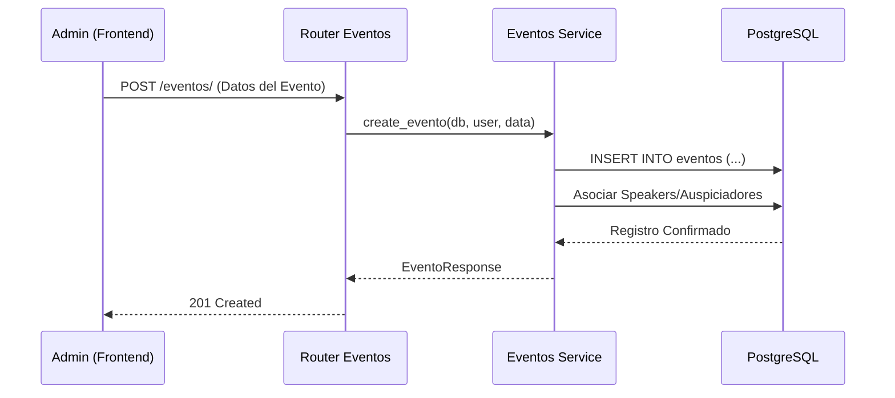
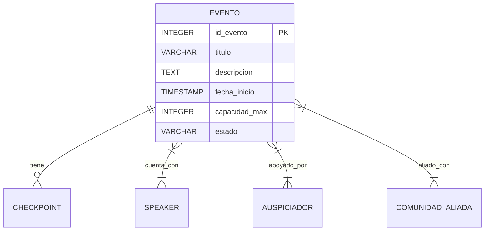
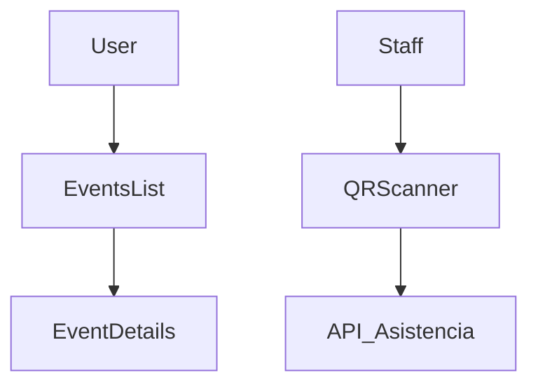

# Módulo 02: Eventos y Comunidad

El módulo de **Eventos y Comunidad** es el motor de interacción social de la Plataforma MEH. Permite la organización, gestión y ejecución de conferencias, workshops y meetups. Su diseño está orientado a facilitar la logística tanto para los organizadores como para los asistentes, integrando una red de speakers, auspiciadores y comunidades aliadas.

:::info Propósito
Gestionar el ciclo de vida de los eventos, desde su planificación y difusión hasta la ejecución presencial con soporte para control de acceso dinámico.
:::

## M0 — ADR Local: Dinamismo en Eventos

| ID | Decisión | Alternativas | Justificación | Consecuencias |
|:---|:---|:---|:---|:---|
| ADR-EV-01 | Agenda en formato TEXT (JSON) | Tablas normalizadas de slots | Permite flexibilidad total para diferentes tipos de eventos sin sobrecargar el esquema de la DB. | Requiere validación y parseo manual en el frontend. |
| ADR-EV-02 | Checkpoints Dinámicos | Un solo flag de asistencia | Facilita el seguimiento de múltiples puntos de control (entrada, almuerzo, talleres) en un mismo evento. | Mayor complejidad en la lógica de escaneo QR. |
| ADR-EV-03 | Relaciones Many-to-Many | IDs embebidos en el modelo | Cumple con la normalización de la DB para speakers y auspiciadores que participan en múltiples eventos. | Requiere el uso de tablas intermedias (`eventos_speakers`, etc.). |

## M1 — Arquitectura del Módulo

### Descripción del Contexto C4
El módulo se conecta con el **Sistema de Gestión de Archivos** para las imágenes de portada y con el **Módulo de Usuarios** para identificar a los organizadores. Interactúa con la base de datos PostgreSQL de forma síncrona.

### Diagrama de Secuencia: Creación de Evento

### Ciclo de Vida de la Petición
1. El staff envía los datos mediante un formulario multi-select para speakers y aliados.
2. El servicio valida la capacidad máxima y las fechas.
3. Se inserta el registro y se generan las relaciones en las tablas intermedias síncronamente.
4. Se devuelve el objeto completo incluyendo los perfiles de los speakers.

## M2 — Diccionario de Datos

### Diagrama ER

### Detalle de la Tabla: `eventos`
| Campo | Tipo de Dato | Descripción |
|:---|:---|:---|
| `id_evento` | `INTEGER SERIAL` | PK único del evento. |
| `titulo` | `VARCHAR` | Título descriptivo del evento. |
| `descripcion` | `TEXT` | Detalles del contenido y objetivos. |
| `tipo_evento` | `VARCHAR` | Categoría (CONFERENCIA, WORKSHOP, etc.). |
| `fecha_inicio` | `TIMESTAMP` | Fecha y hora de inicio proyectada. |
| `modalidad` | `VARCHAR` | PRESENCIAL o VIRTUAL. |
| `ubicacion` | `VARCHAR` | Dirección física o link de sala virtual. |
| `agenda` | `TEXT` | Estructura JSON con el cronograma del evento. |
| `id_organizador` | `INTEGER` | Referencia al usuario que creó el evento. |

## M3 — Contratos de APIs

| Método | URI | Payload | Respuesta | Pydantic Schema |
|:---|:---|:---|:---|:---|
| GET | `/api/v1/eventos/` | N/A | `List[EventoResponse]` | `evento_schema.EventoResponse` |
| POST | `/api/v1/eventos/` | `EventoCreate` | `EventoResponse` | `evento_schema.EventoCreate` |
| GET | `/api/v1/eventos/{id}` | N/A | `EventoResponse` | `evento_schema.EventoResponse` |
| POST | `/api/v1/eventos/asistencia-qr` | `QRScanRequest` | `JSON` | `evento_schema.QRScanRequest` |
| GET | `/api/v1/eventos/{id}/checkpoints` | N/A | `List[CheckpointResponse]` | `evento_schema.CheckpointResponse` |

## M4 — Ingeniería Avanzada

### Checkpoints y Control de Asistencia
El sistema soporta múltiples **Checkpoints** por evento. Esto permite que el personal de staff escanee el mismo código QR del usuario en diferentes puntos:
1. **Checkpoint Entrada:** Marca al usuario como "Asistió" oficialmente.
2. **Checkpoint Refrigerio:** Controla que el usuario no duplique el reclamo de beneficios.
3. **Checkpoint Taller:** Valida el ingreso a sesiones con capacidad limitada.

:::info Implementación
Cada escaneo se registra en `asistencia_detalles` con un `id_checkpoint` específico, permitiendo métricas precisas por zona o momento del evento.
:::

## M5 — Frontend

### Componentes Clave
- `EventsMaster.jsx`: Vista principal para los usuarios con el catálogo de eventos.
- `EscaneoQR.jsx`: Interfaz para el staff que utiliza la cámara para validar entradas.
- `EventsTab.jsx`: Panel administrativo para creación y edición de eventos.

## M6 — Migraciones Relacionadas

- `0676e55518a7_initial_clean_baseline`: Estructura base de eventos, speakers y auspiciadores.
- `b4aeb44856a7_add_event_advanced_fields`: Inclusión de campos para refrigerios y agenda extendida.
- `46f3ac215fad_add_contact_fields_to_ecosystem`: Nuevos campos de contacto para aliados y speakers.
