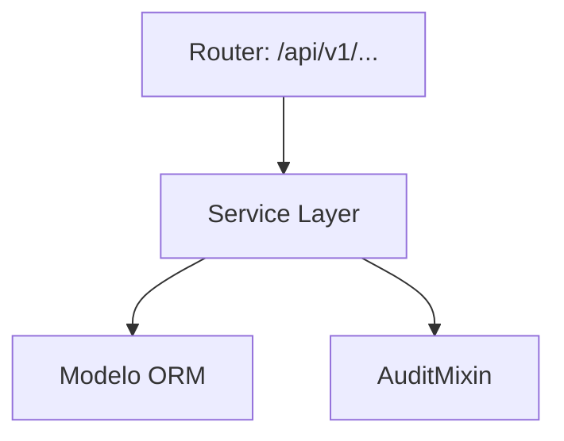
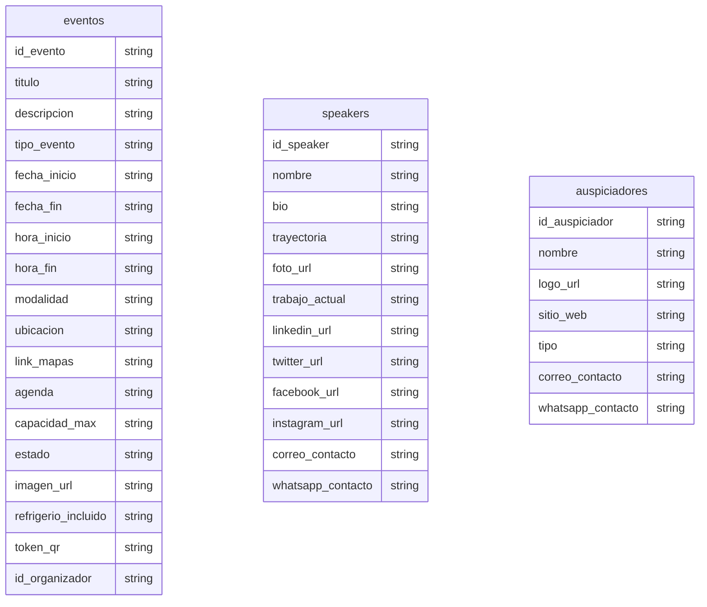

# Eventos

> **⚠️ [GENERADO AUTOMÁTICAMENTE]:** Esta documentación fue generada a partir del análisis estático del código fuente de Plataforma MEH.

## Sección M0 — Decisiones Arquitectónicas Locales (ADR)

| ID | Decisión | Alternativas consideradas | Justificación | Consecuencias |
|---|---|---|---|---|
| ADR-M02-001 | Uso de arquitectura en capas | Monolito o lógica en routers | Mantenibilidad y reusabilidad | Mayor cantidad de archivos y abstracciones |

## Sección M1 — Arquitectura del Módulo (C4 Nivel 3 + Ciclo de Vida)

Ciclo de vida de una petición típica:
1. Llegada al Router (FastAPI).
2. Validación Pydantic.
3. Inyección de dependencia (get_db).
4. Ejecución en Service Layer.
5. Persistencia.
6. Auditoría.
7. Respuesta serializada.

## Sección M2 — Diccionario de Datos

### Tabla: `eventos`

| Nombre del Campo | Tipo de Dato | Restricciones |
|---|---|---|
| id_evento | `Integer, primary_key=True, index=True` | - |
| titulo | `String` | - |
| descripcion | `TEXT, nullable=True` | - |
| tipo_evento | `String, default="CONFERENCIA"` | - |
| fecha_inicio | `DateTime` | - |
| fecha_fin | `DateTime, nullable=True` | - |
| hora_inicio | `String, nullable=True` | - |
| hora_fin | `String, nullable=True` | - |
| modalidad | `String` | - |
| ubicacion | `String, nullable=True` | - |
| link_mapas | `String, nullable=True` | - |
| agenda | `TEXT, nullable=True` | - |
| capacidad_max | `Integer` | - |
| estado | `String, default="PROGRAMADO"` | - |
| imagen_url | `String, nullable=True` | - |
| refrigerio_incluido | `Boolean, default=False` | - |
| token_qr | `String, nullable=True` | - |
| id_organizador | `Integer, ForeignKey("usuarios.id_usuario"), index=True` | - |

### Tabla: `speakers`

| Nombre del Campo | Tipo de Dato | Restricciones |
|---|---|---|
| id_speaker | `Integer, primary_key=True, index=True` | - |
| nombre | `String` | - |
| bio | `TEXT, nullable=True` | - |
| trayectoria | `TEXT, nullable=True` | - |
| foto_url | `String, nullable=True` | - |
| trabajo_actual | `String, nullable=True` | - |
| linkedin_url | `String, nullable=True` | - |
| twitter_url | `String, nullable=True` | - |
| facebook_url | `String, nullable=True` | - |
| instagram_url | `String, nullable=True` | - |
| correo_contacto | `String, nullable=True` | - |
| whatsapp_contacto | `String, nullable=True` | - |

### Tabla: `auspiciadores`

| Nombre del Campo | Tipo de Dato | Restricciones |
|---|---|---|
| id_auspiciador | `Integer, primary_key=True, index=True` | - |
| nombre | `String` | - |
| logo_url | `String, nullable=True` | - |
| sitio_web | `String, nullable=True` | - |
| tipo | `String, default="GENERAL"` | - |
| correo_contacto | `String, nullable=True` | - |
| whatsapp_contacto | `String, nullable=True` | - |

## Sección M3 — Contratos de APIs

| Método | URI |
|---|---|
| POST | `/api/v1/eventos/` |
| GET | `/api/v1/eventos/` |
| GET | `/api/v1/eventos/{id_evento}` |
| PUT | `/api/v1/eventos/{id_evento}` |
| POST | `/api/v1/eventos/asistencia-qr` |
| POST | `/api/v1/eventos/{id_evento}/asistencia-qr` |

## Sección M4 — Ingeniería Avanzada y Algoritmos Núcleo

Para información sobre la trazabilidad, se usa `AuditMixin` en los modelos para capturar el usuario creador/modificador.

## Sección M5 — Frontend (por módulo)

Revisar la carpeta `frontend/src/` para componentes asociados a este módulo.

## Sección M6 — Migraciones

* Las migraciones asociadas a estas tablas se encuentran en `alembic/versions/`.
