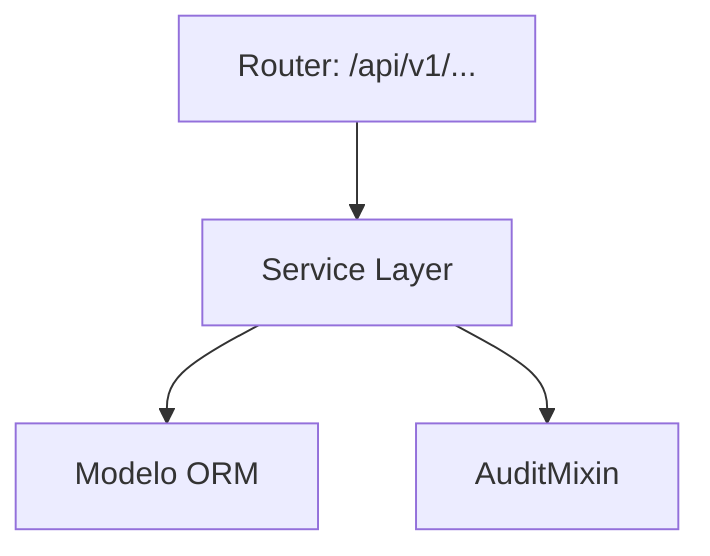
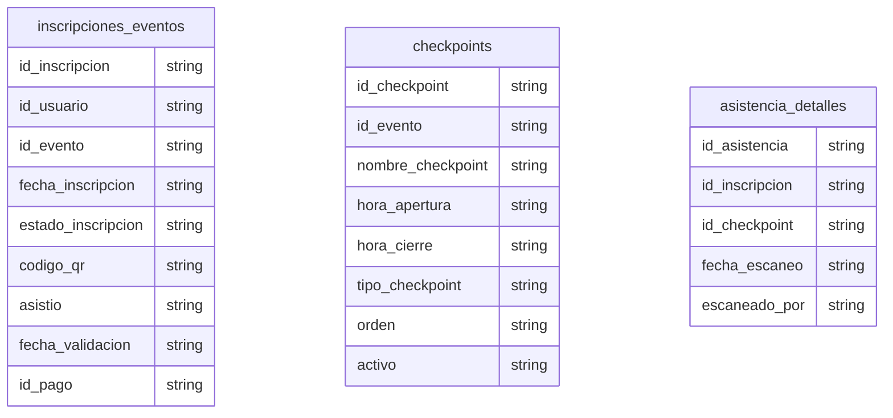

# Inscripciones y Asistencia

> **⚠️ [GENERADO AUTOMÁTICAMENTE]:** Esta documentación fue generada a partir del análisis estático del código fuente de Plataforma MEH.

## Sección M0 — Decisiones Arquitectónicas Locales (ADR)

| ID | Decisión | Alternativas consideradas | Justificación | Consecuencias |
|---|---|---|---|---|
| ADR-M03-001 | Uso de arquitectura en capas | Monolito o lógica en routers | Mantenibilidad y reusabilidad | Mayor cantidad de archivos y abstracciones |

## Sección M1 — Arquitectura del Módulo (C4 Nivel 3 + Ciclo de Vida)

Ciclo de vida de una petición típica:
1. Llegada al Router (FastAPI).
2. Validación Pydantic.
3. Inyección de dependencia (get_db).
4. Ejecución en Service Layer.
5. Persistencia.
6. Auditoría.
7. Respuesta serializada.

## Sección M2 — Diccionario de Datos

### Tabla: `inscripciones_eventos`

| Nombre del Campo | Tipo de Dato | Restricciones |
|---|---|---|
| id_inscripcion | `Integer, primary_key=True, index=True` | - |
| id_usuario | `Integer, ForeignKey("usuarios.id_usuario"), index=True` | - |
| id_evento | `Integer, ForeignKey("eventos.id_evento"), index=True` | - |
| fecha_inscripcion | `DateTime, default=datetime.utcnow` | - |
| estado_inscripcion | `String, default="PENDIENTE"` | - |
| codigo_qr | `String, unique=True, nullable=True` | - |
| asistio | `Boolean, default=False` | - |
| fecha_validacion | `DateTime, nullable=True` | - |
| id_pago | `Integer, ForeignKey("pagos.id_pago"), nullable=True, index=True` | - |

### Tabla: `checkpoints`

| Nombre del Campo | Tipo de Dato | Restricciones |
|---|---|---|
| id_checkpoint | `Integer, primary_key=True, index=True` | - |
| id_evento | `Integer, ForeignKey("eventos.id_evento"), index=True` | - |
| nombre_checkpoint | `String` | - |
| hora_apertura | `DateTime, nullable=True` | - |
| hora_cierre | `DateTime, nullable=True` | - |
| tipo_checkpoint | `String, nullable=True` | - |
| orden | `Integer` | - |
| activo | `Boolean, default=True` | - |

### Tabla: `asistencia_detalles`

| Nombre del Campo | Tipo de Dato | Restricciones |
|---|---|---|
| id_asistencia | `Integer, primary_key=True, index=True` | - |
| id_inscripcion | `Integer, ForeignKey("inscripciones_eventos.id_inscripcion"), index=True` | - |
| id_checkpoint | `Integer, ForeignKey("checkpoints.id_checkpoint"), index=True` | - |
| fecha_escaneo | `DateTime, default=datetime.utcnow` | - |
| escaneado_por | `Integer, ForeignKey("usuarios.id_usuario"), index=True` | - |

## Sección M3 — Contratos de APIs

| Método | URI |
|---|---|
| POST | `/api/v1/inscripciones/eventos/{id_evento}` |
| POST | `/api/v1/inscripciones/inscribir/{id_evento}` |
| GET | `/api/v1/inscripciones/eventos/mis-inscripciones` |
| DELETE | `/api/v1/inscripciones/eventos/{id_inscripcion}` |
| POST | `/api/v1/inscripciones/cursos/{id_curso}` |
| GET | `/api/v1/asistencia/actividades` |
| POST | `/api/v1/asistencia/registrar` |

## Sección M4 — Ingeniería Avanzada y Algoritmos Núcleo

Para información sobre la trazabilidad, se usa `AuditMixin` en los modelos para capturar el usuario creador/modificador.

## Sección M5 — Frontend (por módulo)

Revisar la carpeta `frontend/src/` para componentes asociados a este módulo.

## Sección M6 — Migraciones

* Las migraciones asociadas a estas tablas se encuentran en `alembic/versions/`.
