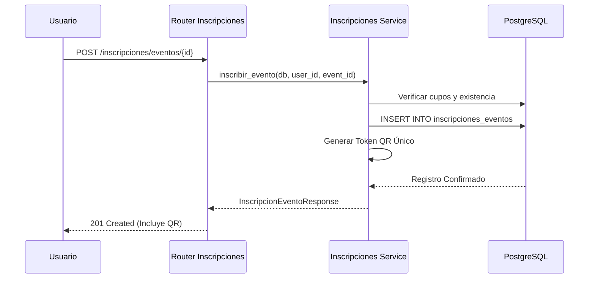
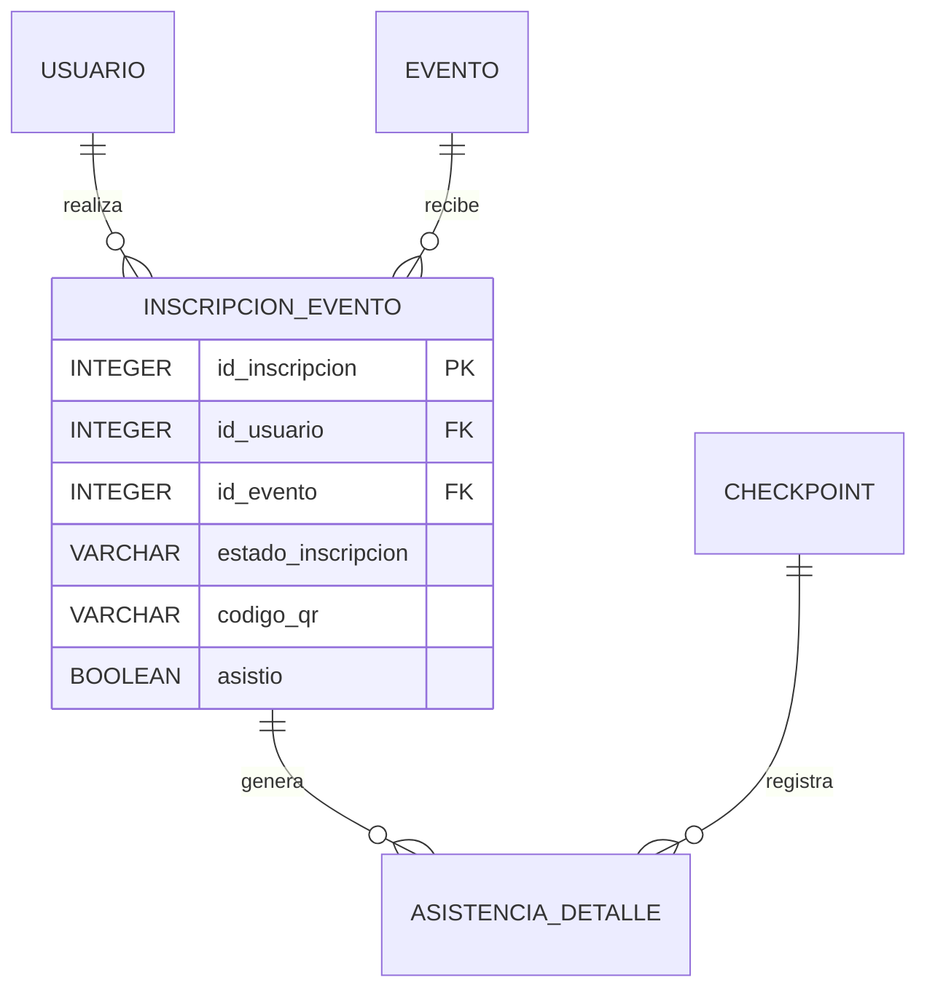
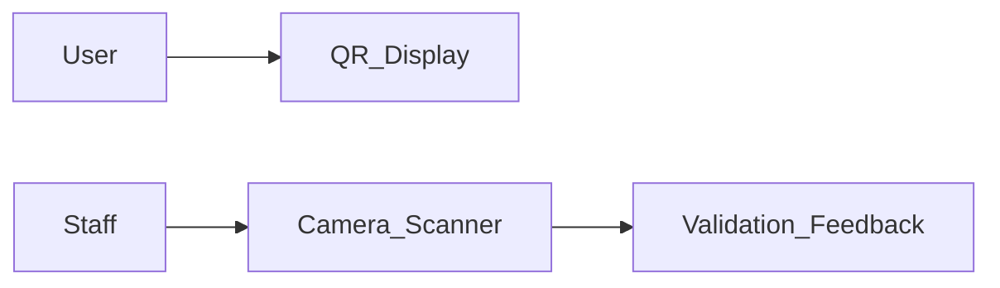

# Módulo 03: Inscripciones y Asistencia

Este módulo gestiona la vinculación entre los usuarios y las actividades (eventos y cursos). Es el responsable de generar las credenciales de acceso (códigos QR) y de validar la presencia física o virtual de los participantes, lo cual es fundamental para la posterior emisión de certificados y badges.

:::info Propósito
Automatizar el flujo de registro a eventos y cursos, garantizando un control de asistencia riguroso y transparente mediante tecnologías QR.
:::

## M0 — ADR Local: Vinculación y Validación

| ID | Decisión | Alternativas | Justificación | Consecuencias |
|:---|:---|:---|:---|:---|
| ADR-INS-01 | Generación de QR Único por Inscripción | QR por usuario, Lista de papel | Permite una validación rápida y segura en cada evento, evitando suplantaciones de identidad. | Requiere que el usuario tenga acceso a su perfil digital en el evento. |
| ADR-INS-02 | Estados de Inscripción (Pendiente/Pagado) | Inscripción directa | Necesario para eventos o cursos que requieren una validación manual de pago antes de habilitar el acceso. | El usuario no recibe su QR hasta que el estado cambie a 'CONFIRMADA' o 'PAGADO'. |
| ADR-INS-03 | Registro de Asistencia por Checkpoint | Flag booleano simple | Permite obtener métricas de permanencia y participación en áreas específicas. | Se requiere una tabla de detalles (`asistencia_detalles`) para cada escaneo. |

## M1 — Arquitectura del Módulo

### Descripción del Contexto C4
El módulo depende críticamente del **Módulo de Usuarios** y del **Módulo de Eventos/Cursos**. Envía notificaciones a través del **Servicio de Email** cuando se confirma una inscripción.

### Diagrama de Secuencia: Inscripción a Evento

### Ciclo de Vida de la Petición
1. El usuario solicita la inscripción.
2. El sistema verifica síncronamente si ya está inscrito o si el evento está lleno.
3. Se crea el registro con estado `PENDIENTE` (si es de pago) o `CONFIRMADA` (si es gratuito).
4. El backend genera un código alfanumérico único para el QR.

## M2 — Diccionario de Datos

### Diagrama ER

### Detalle de la Tabla: `inscripciones_eventos`
| Campo | Tipo de Dato | Descripción |
|:---|:---|:---|
| `id_inscripcion` | `INTEGER SERIAL` | PK único de la inscripción. |
| `id_usuario` | `INTEGER` | FK al usuario inscrito. |
| `id_evento` | `INTEGER` | FK al evento destino. |
| `fecha_inscripcion` | `TIMESTAMP` | Fecha y hora del registro. |
| `estado_inscripcion` | `VARCHAR` | PENDIENTE, CONFIRMADA, CANCELADA. |
| `codigo_qr` | `VARCHAR` | Token único para la generación del código QR. |
| `asistio` | `BOOLEAN` | Flag que se activa al primer escaneo válido. |

## M3 — Contratos de APIs

| Método | URI | Payload | Respuesta | Pydantic Schema |
|:---|:---|:---|:---|:---|
| POST | `/api/v1/inscripciones/eventos/{id}` | N/A | `InscripcionEventoResponse` | `inscripcion_schema.InscripcionEventoResponse` |
| GET | `/api/v1/inscripciones/eventos/mis-inscripciones` | N/A | `List[InscripcionEventoResponse]` | `inscripcion_schema.InscripcionEventoResponse` |
| DELETE | `/api/v1/inscripciones/eventos/{id}` | N/A | 204 No Content | N/A |
| POST | `/api/v1/asistencia/registrar` | Query Params | `JSON` | N/A |

## M4 — Ingeniería Avanzada

### Validación Cruzada de Asistencia
Para evitar fraudes, el sistema realiza una validación síncrona al momento del escaneo:
1. Verifica que el `codigo_qr` exista en la tabla `inscripciones_eventos`.
2. Valida que el `id_evento` del QR coincida con el evento que el staff está controlando.
3. Comprueba si el usuario ya pasó por ese `id_checkpoint` previamente para evitar duplicados.

:::warning Integridad
Si el estado de la inscripción es `PENDIENTE` (por falta de pago), el validador QR rechazará el acceso con una alerta visual roja en la interfaz del staff.
:::

## M5 — Frontend

### Componentes Clave
- `Dashboard.jsx`: Muestra los QRs activos de las inscripciones del usuario.
- `EscaneoQR.jsx`: Cámara activa con visor de estado (Verde = Válido, Rojo = Error).
- `UsersTab.jsx`: Permite a los administradores forzar la asistencia manual en caso de fallos técnicos.

## M6 — Migraciones Relacionadas

- `0676e55518a7_initial_clean_baseline`: Tablas de inscripciones y asistencia básica.
- `fbe03e1faad8_fix_schema_typos_and_constraints`: Ajustes en las llaves foráneas y unicidad del código QR.
- `b4aeb44856a7_add_event_advanced_fields`: Conexión de inscripciones con el sistema de checkpoints.
