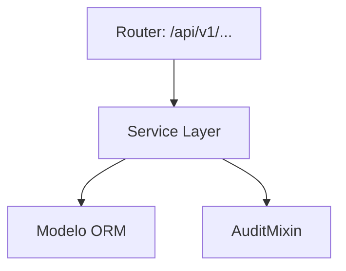
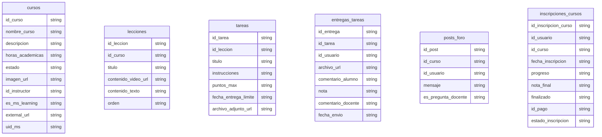

# Learning Hub (Cursos)

> **⚠️ [GENERADO AUTOMÁTICAMENTE]:** Esta documentación fue generada a partir del análisis estático del código fuente de Plataforma MEH.

## Sección M0 — Decisiones Arquitectónicas Locales (ADR)

| ID | Decisión | Alternativas consideradas | Justificación | Consecuencias |
|---|---|---|---|---|
| ADR-M04-001 | Uso de arquitectura en capas | Monolito o lógica en routers | Mantenibilidad y reusabilidad | Mayor cantidad de archivos y abstracciones |

## Sección M1 — Arquitectura del Módulo (C4 Nivel 3 + Ciclo de Vida)

Ciclo de vida de una petición típica:
1. Llegada al Router (FastAPI).
2. Validación Pydantic.
3. Inyección de dependencia (get_db).
4. Ejecución en Service Layer.
5. Persistencia.
6. Auditoría.
7. Respuesta serializada.

## Sección M2 — Diccionario de Datos

### Tabla: `cursos`

| Nombre del Campo | Tipo de Dato | Restricciones |
|---|---|---|
| id_curso | `Integer, primary_key=True, index=True` | - |
| nombre_curso | `String` | - |
| descripcion | `TEXT` | - |
| horas_academicas | `Integer` | - |
| estado | `String, default="ACTIVO"` | - |
| imagen_url | `String, nullable=True` | - |
| id_instructor | `Integer, ForeignKey("usuarios.id_usuario"), nullable=True, index=True` | - |
| es_ms_learning | `Boolean, default=False` | - |
| external_url | `String, nullable=True` | - |
| uid_ms | `String, nullable=True` | - |

### Tabla: `lecciones`

| Nombre del Campo | Tipo de Dato | Restricciones |
|---|---|---|
| id_leccion | `Integer, primary_key=True, index=True` | - |
| id_curso | `Integer, ForeignKey("cursos.id_curso", ondelete="CASCADE")` | - |
| titulo | `String` | - |
| contenido_video_url | `String, nullable=True` | - |
| contenido_texto | `TEXT, nullable=True` | - |
| orden | `Integer, default=1` | - |

### Tabla: `tareas`

| Nombre del Campo | Tipo de Dato | Restricciones |
|---|---|---|
| id_tarea | `Integer, primary_key=True, index=True` | - |
| id_leccion | `Integer, ForeignKey("lecciones.id_leccion", ondelete="CASCADE")` | - |
| titulo | `String` | - |
| instrucciones | `TEXT` | - |
| puntos_max | `Integer, default=100` | - |
| fecha_entrega_limite | `DateTime, nullable=True` | - |
| archivo_adjunto_url | `String, nullable=True` | - |

### Tabla: `entregas_tareas`

| Nombre del Campo | Tipo de Dato | Restricciones |
|---|---|---|
| id_entrega | `Integer, primary_key=True, index=True` | - |
| id_tarea | `Integer, ForeignKey("tareas.id_tarea", ondelete="CASCADE")` | - |
| id_usuario | `Integer, ForeignKey("usuarios.id_usuario")` | - |
| archivo_url | `String` | - |
| comentario_alumno | `TEXT, nullable=True` | - |
| nota | `Integer, nullable=True` | - |
| comentario_docente | `TEXT, nullable=True` | - |
| fecha_envio | `DateTime, default=datetime.utcnow` | - |

### Tabla: `posts_foro`

| Nombre del Campo | Tipo de Dato | Restricciones |
|---|---|---|
| id_post | `Integer, primary_key=True, index=True` | - |
| id_curso | `Integer, ForeignKey("cursos.id_curso", ondelete="CASCADE")` | - |
| id_usuario | `Integer, ForeignKey("usuarios.id_usuario")` | - |
| mensaje | `TEXT` | - |
| es_pregunta_docente | `Boolean, default=False` | - |

### Tabla: `inscripciones_cursos`

| Nombre del Campo | Tipo de Dato | Restricciones |
|---|---|---|
| id_inscripcion_curso | `Integer, primary_key=True, index=True` | - |
| id_usuario | `Integer, ForeignKey("usuarios.id_usuario"), index=True` | - |
| id_curso | `Integer, ForeignKey("cursos.id_curso"), index=True` | - |
| fecha_inscripcion | `DateTime, default=datetime.utcnow` | - |
| progreso | `Integer, default=0` | - |
| nota_final | `Numeric(5, 2), nullable=True` | - |
| finalizado | `Boolean, default=False` | - |
| id_pago | `Integer, ForeignKey("pagos.id_pago"), nullable=True, index=True` | - |
| estado_inscripcion | `String, default="PENDIENTE"` | - |

## Sección M3 — Contratos de APIs

| Método | URI |
|---|---|
| GET | `/api/v1/cursos/` |
| GET | `/api/v1/cursos/mis-certificados` |
| GET | `/api/v1/cursos/verificar/{uuid_cert}` |
| POST | `/api/v1/cursos/` |
| GET | `/api/v1/cursos/{id_curso}` |
| GET | `/api/v1/cursos/instructor/mis-cursos` |
| GET | `/api/v1/cursos/instructor/curso/{id_curso}/alumnos` |
| PUT | `/api/v1/cursos/instructor/nota/{id_inscripcion}` |
| PUT | `/api/v1/cursos/{id_curso}/instructor/{id_instructor}` |
| GET | `/api/v1/learning_path/catalog` |
| GET | `/api/v1/learning_path/catalog/modules` |
| GET | `/api/v1/learning_path/catalog/learning-paths` |

## Sección M4 — Ingeniería Avanzada y Algoritmos Núcleo

Para información sobre la trazabilidad, se usa `AuditMixin` en los modelos para capturar el usuario creador/modificador.

## Sección M5 — Frontend (por módulo)

Revisar la carpeta `frontend/src/` para componentes asociados a este módulo.

## Sección M6 — Migraciones

* Las migraciones asociadas a estas tablas se encuentran en `alembic/versions/`.
