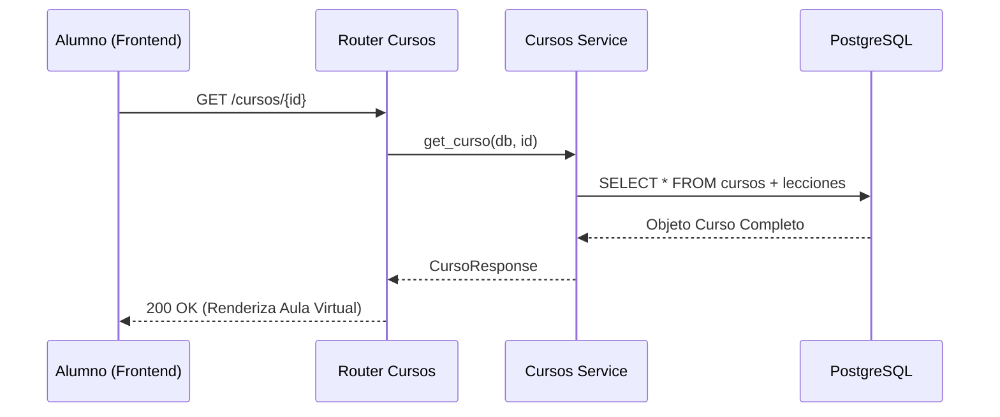
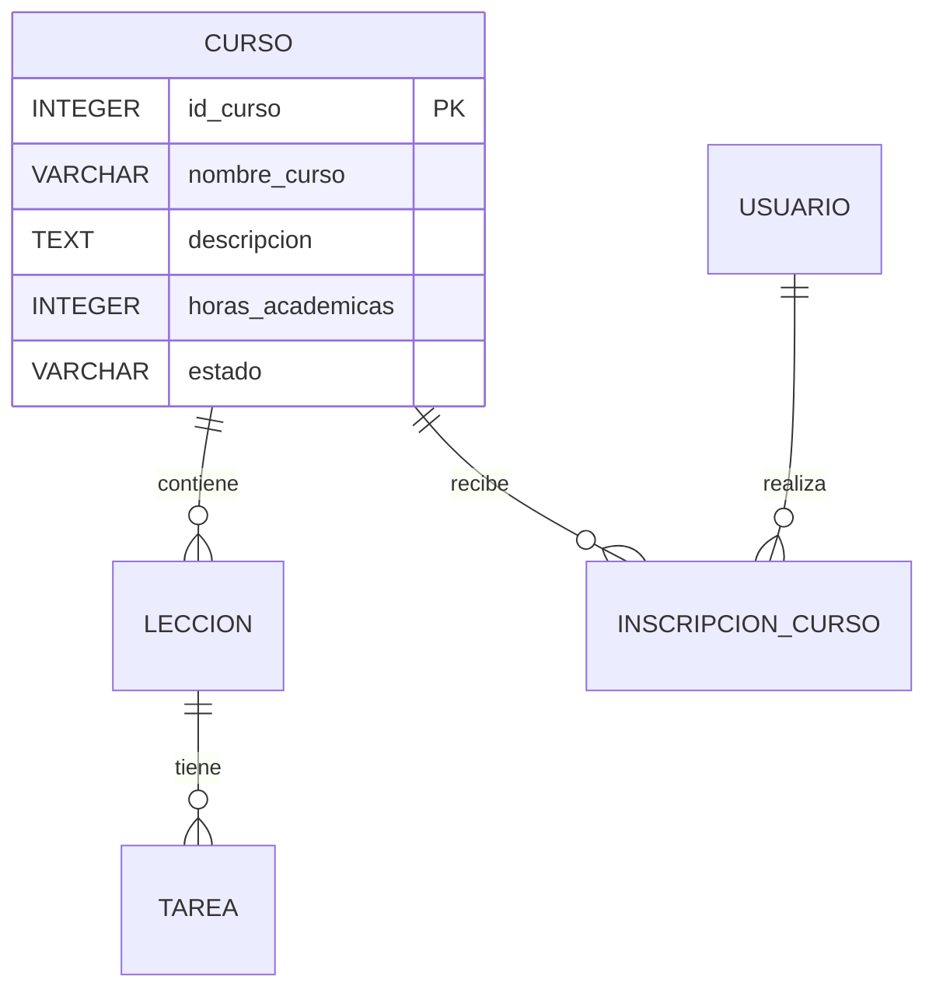
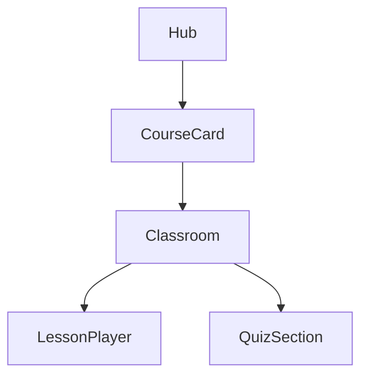

# Módulo 04: Learning Hub y Cursos

El **Learning Hub** es el ecosistema de aprendizaje de la Plataforma MEH. Este módulo permite a los usuarios acceder a contenido educativo estructurado, realizar seguimiento de su progreso y obtener certificaciones académicas. Está diseñado para soportar tanto cursos internos como integraciones con plataformas externas como Microsoft Learning.

:::info Propósito
Proporcionar una experiencia de aprendizaje interactiva y gamificada, centralizando materiales de estudio, evaluaciones y foros de discusión.
:::

## M0 — ADR Local: Gestión de Contenido Educativo

| ID | Decisión | Alternativas | Justificación | Consecuencias |
|:---|:---|:---|:---|:---|
| ADR-EDU-01 | Soporte para MS Learning Externo | Solo contenido interno | Aprovechar recursos de alta calidad ya existentes en el ecosistema de Microsoft. | Requiere campos específicos como `external_url` y `uid_ms`. |
| ADR-EDU-02 | Sistema de Lecciones Ordenadas | Contenido suelto | Permite un flujo pedagógico lógico (Capítulo 1 -> Capítulo 2). | Se debe manejar el campo `orden` de forma manual o mediante lógica de servicio. |
| ADR-EDU-03 | Evaluaciones Síncronas | Formularios externos | Permite que el instructor califique directamente en la plataforma, centralizando la nota final. | Requiere lógica de permisos para que solo el instructor del curso pueda editar notas. |

## M1 — Arquitectura del Módulo

### Descripción del Contexto C4
El módulo interactúa con el **Módulo de Usuarios** (Instructores y Alumnos), el **Módulo de Pagos** (para cursos premium) y el **Módulo de Certificados**. El contenido se almacena en PostgreSQL y los recursos multimedia se sirven vía URL.

### Diagrama de Secuencia: Progreso de Alumno

### Ciclo de Vida de la Petición
1. El alumno accede al aula virtual del curso.
2. El sistema recupera el progreso actual de la tabla `inscripciones_cursos`.
3. Al completar una lección, se envía una señal síncrona para actualizar el `%` de progreso.
4. Si el progreso llega al 100% y la nota es aprobatoria, se habilita la generación del certificado.

## M2 — Diccionario de Datos

### Diagrama ER

### Detalle de la Tabla: `cursos`
| Campo | Tipo de Dato | Descripción |
|:---|:---|:---|
| `id_curso` | `INTEGER SERIAL` | PK único del curso. |
| `nombre_curso` | `VARCHAR` | Nombre oficial del programa. |
| `descripcion` | `TEXT` | Resumen detallado y objetivos. |
| `horas_academicas` | `INTEGER` | Carga horaria para el certificado. |
| `id_instructor` | `INTEGER` | FK al usuario con rol de instructor. |
| `es_ms_learning` | `BOOLEAN` | Flag para identificar cursos externos. |

## M3 — Contratos de APIs

| Método | URI | Payload | Respuesta | Pydantic Schema |
|:---|:---|:---|:---|:---|
| GET | `/api/v1/cursos/` | N/A | `List[CursoResponse]` | `curso_schema.CursoResponse` |
| GET | `/api/v1/cursos/{id}` | N/A | `CursoResponse` | `curso_schema.CursoResponse` |
| POST | `/api/v1/cursos/` | `CursoCreate` | `CursoResponse` | `curso_schema.CursoCreate` |
| GET | `/api/v1/cursos/instructor/mis-cursos` | N/A | `List[CursoResponse]` | N/A |
| PUT | `/api/v1/cursos/instructor/nota/{id}` | `float` | `JSON` | N/A |

## M4 — Ingeniería Avanzada

### Jerarquía de Contenidos
El módulo implementa una estructura en cascada:
- **Curso:** Entidad raíz que contiene la metadata global.
- **Lección:** Unidad mínima de aprendizaje (Video o Texto).
- **Tarea:** Actividad práctica que requiere entrega y calificación.
- **Foro:** Espacio síncrono para dudas entre alumnos e instructores.

:::info Calificación Dinámica
La `nota_final` en la tabla `inscripciones_cursos` es calculada o asignada manualmente por el docente. Una vez guardada, el sistema dispara un evento síncrono para verificar si el alumno es elegible para el certificado de aprobación.
:::

## M5 — Frontend

### Componentes del Aula Virtual
- `LearningHub.jsx`: Catálogo principal de cursos con filtros por categoría.
- `CursoAula.jsx`: Interfaz de reproducción de video y lectura de material.
- `AcademyTab.jsx`: Gestión administrativa de currícula para instructores.

## M6 — Migraciones Relacionadas

- `5d648885e1d4_create_academia_lms_tables`: Creación de la estructura base del LMS (Cursos, Lecciones, Tareas).
- `fbe03e1faad8_fix_schema_typos_and_constraints`: Refuerzo de integridad referencial en lecciones y entregas.
- `0676e55518a7_initial_clean_baseline`: Tablas iniciales de inscripciones académicas.
