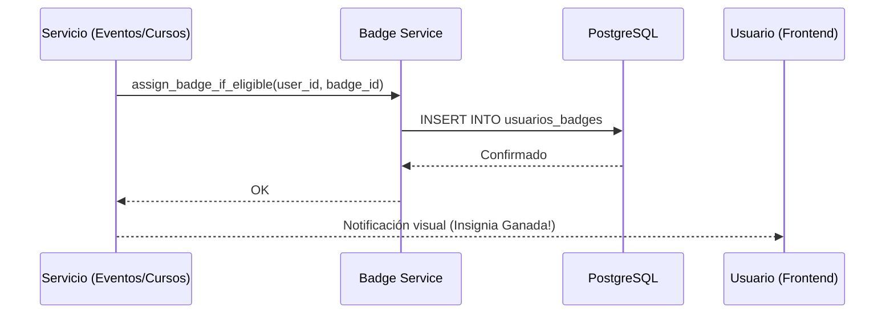
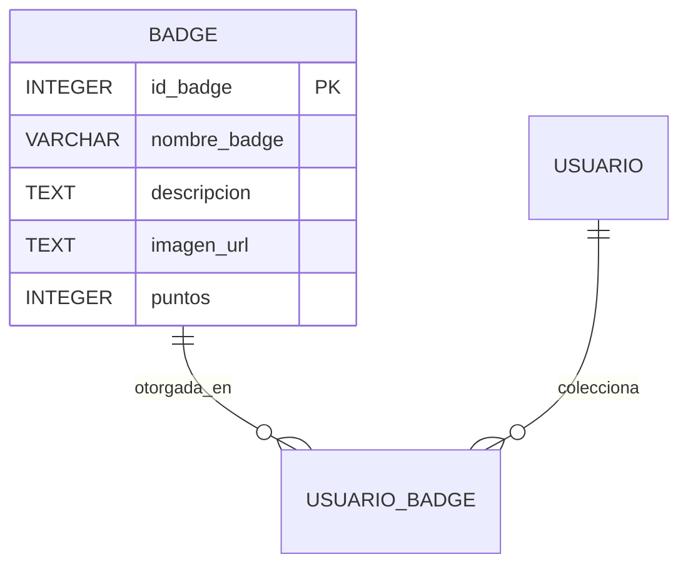
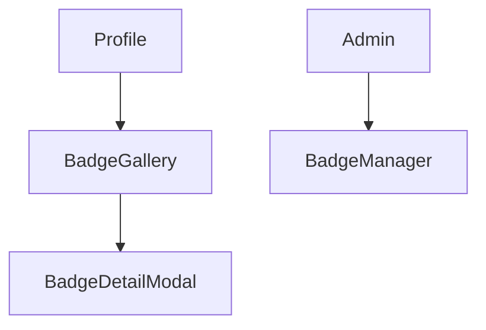

# Módulo 05: Gamificación e Insignias

El módulo de **Gamificación** tiene como objetivo incentivar la participación activa de los usuarios mediante un sistema de recompensas visuales (Badges/Insignias) y puntos de experiencia. Este sistema reconoce los logros individuales, como completar cursos, asistir a eventos o contribuir a la comunidad, fomentando un sentido de pertenencia y competencia sana.

:::info Propósito
Recompensar el compromiso del usuario y visualizar su trayectoria dentro del ecosistema MEH a través de reconocimientos digitales coleccionables.
:::

## M0 — ADR Local: Economía de Reconocimiento

| ID | Decisión | Alternativas | Justificación | Consecuencias |
|:---|:---|:---|:---|:---|
| ADR-GAM-01 | Insignias Atómicas | Sistema de niveles global | Permite una mayor granularidad en el reconocimiento (ej. "Experto en Python", "Asistente Fiel"). | Requiere la creación de múltiples activos gráficos para cada insignia. |
| ADR-GAM-02 | Puntos por Insignia | Solo imagen | Los puntos permiten clasificar a los usuarios en un ranking futuro (Leaderboard). | Se debe registrar el campo `puntos` en la tabla `badges`. |
| ADR-GAM-03 | Vinculación con Origen | Insignias genéricas | Saber si una insignia proviene de un Evento o un Curso permite trazar el esfuerzo del usuario. | Requiere llaves foráneas opcionales a `eventos` y `cursos`. |

## M1 — Arquitectura del Módulo

### Descripción del Contexto C4
El módulo es un consumidor transversal. Se activa mediante gatillos (triggers) en los servicios de **Eventos** (al marcar asistencia) e **Inscripciones de Cursos** (al finalizar un curso). La información se expone principalmente en el perfil del usuario.

### Diagrama de Secuencia: Obtención de Insignia

### Ciclo de Vida de la Petición
1. Una acción del usuario cumple con los requisitos (ej. asistió al evento).
2. El servicio correspondiente llama síncronamente al `badge_service`.
3. Se verifica que el usuario no tenga ya esa insignia para evitar duplicidad.
4. Se registra la obtención con la fecha y hora actual.

## M2 — Diccionario de Datos

### Diagrama ER

### Detalle de la Tabla: `badges`
| Campo | Tipo de Dato | Descripción |
|:---|:---|:---|
| `id_badge` | `INTEGER SERIAL` | PK único de la insignia. |
| `nombre_badge` | `VARCHAR` | Nombre público de la recompensa. |
| `descripcion` | `TEXT` | Explicación de cómo se obtuvo o qué representa. |
| `imagen_url` | `TEXT` | Ruta al activo gráfico de la insignia. |
| `id_evento_origen` | `INTEGER` | (Opcional) Evento que otorga esta insignia. |
| `id_curso_origen` | `INTEGER` | (Opcional) Curso que otorga esta insignia. |
| `puntos` | `INTEGER` | Valor en puntos de experiencia (XP). |

## M3 — Contratos de APIs

| Método | URI | Payload | Respuesta | Pydantic Schema |
|:---|:---|:---|:---|:---|
| GET | `/api/v1/insignias/` | N/A | `List[BadgeResponse]` | `badge_schema.BadgeResponse` |
| POST | `/api/v1/insignias/` | `BadgeCreate` | `BadgeResponse` | `badge_schema.BadgeCreate` |
| GET | `/api/v1/insignias/usuario/{id}` | N/A | `List[BadgeResponse]` | `badge_schema.BadgeResponse` |
| POST | `/api/v1/insignias/asignar` | `{"id_usuario": 1, ...}` | `UsuarioBadgeResponse` | N/A |

## M4 — Ingeniería Avanzada

### Lógica de Asignación Automática
Aunque las insignias pueden asignarse manualmente por un administrador, el sistema está diseñado para el "Auto-Claim":
- **Trigger Asistencia:** Al escanear el QR de salida de un evento, el sistema consulta si existe una insignia asociada a ese `id_evento`.
- **Trigger Académico:** Al momento de actualizar la `nota_final` de un curso a aprobado, se dispara la asignación de la insignia de finalización.

:::info Rendimiento
La verificación de elegibilidad es síncrona pero ligera, asegurando que el usuario vea su recompensa inmediatamente en su perfil tras la acción realizada.
:::

## M5 — Frontend

### Componentes de Gamificación
- `Insignias.jsx`: Galería personal del usuario donde se muestran sus logros (coloridos) vs los pendientes (escala de grises).
- `ValidadorTalento.jsx`: Muestra las insignias de un usuario a terceros (perfil público).
- `BadgeCard.jsx`: Componente reutilizable con efectos de hover para mostrar la descripción de la insignia.

## M6 — Migraciones Relacionadas

- `0676e55518a7_initial_clean_baseline`: Creación de tablas base `badges` y `usuarios_badges`.
- `fbe03e1faad8_fix_schema_typos_and_constraints`: Corrección de relaciones y on-delete cascades para insignias.
