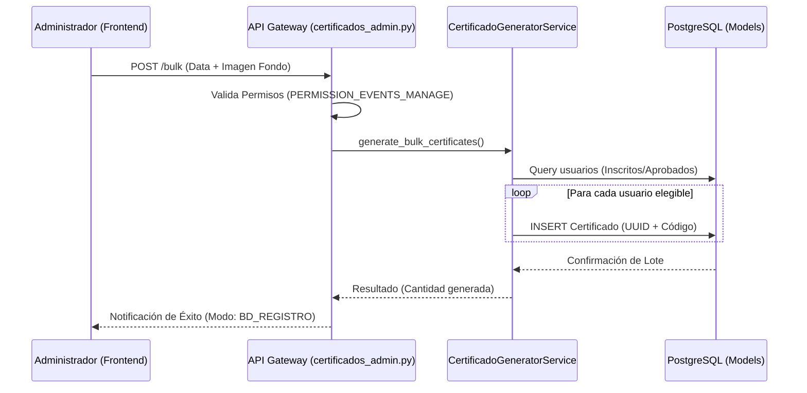
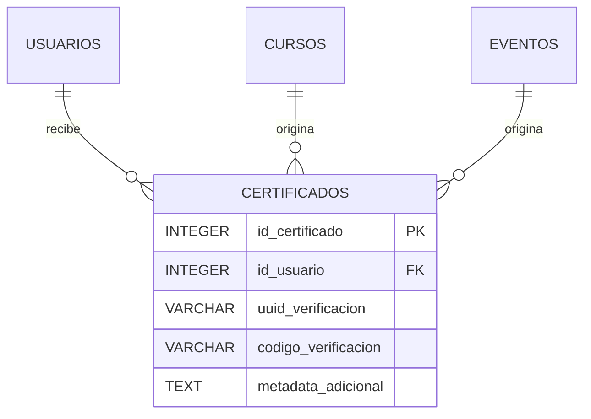
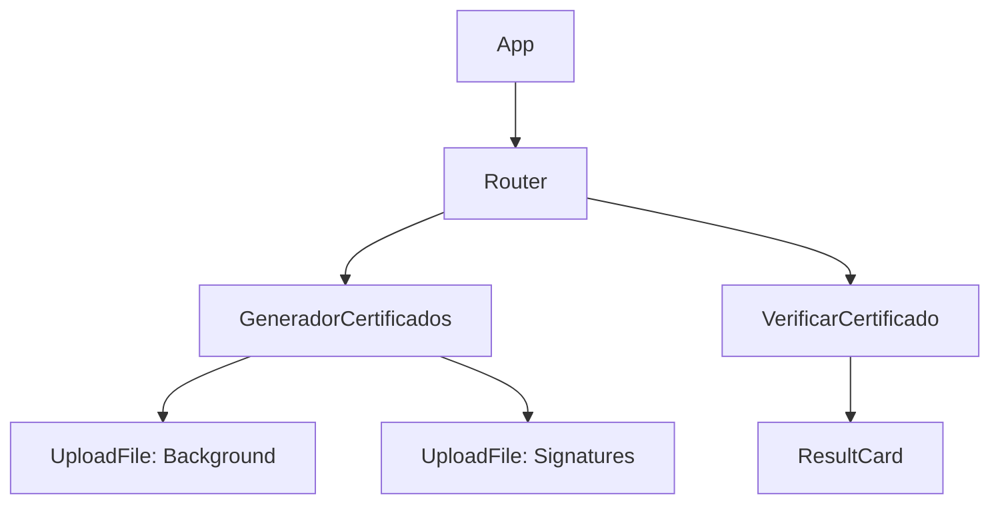

# Módulo de Certificación Digital

El Módulo de Certificados es el componente encargado de la validación de logros, asistencia y participación dentro de la Plataforma MEH. Utiliza un sistema de generación de códigos únicos y verificación criptográfica (UUID) para garantizar la autenticidad de los documentos emitidos.

## M0 — ADR Local: Gestión de Certificación

| ID | Decisión | Alternativas | Justificación | Consecuencias |
|:---|:---|:---|:---|:---|
| ADR-CERT-01 | **Emisión Masiva Síncrona** | Celery / Redis (Async) | La carga de trabajo actual permite procesamiento directo sin sobrecargar el servidor, simplificando la infraestructura. | El administrador debe esperar a que finalice el proceso de guardado en DB antes de recibir respuesta. |
| ADR-CERT-02 | **Códigos de Verificación Legibles** | Solo UUIDs | Los usuarios prefieren códigos cortos (MEH-2024-XXXX) para validación manual rápida. | Se requiere una columna adicional en la base de datos para el código corto. |
| ADR-CERT-03 | **Generación PDF On-the-Fly** | Almacenamiento en S3 | Ahorra espacio de almacenamiento al generar el PDF solo cuando el usuario lo solicita para descarga. | Mayor consumo de CPU en el servidor durante las descargas masivas. |

:::info
Todos los procesos del módulo se rigen por la arquitectura **Síncrona** de la plataforma, utilizando `db.commit()` tras cada lote de generación.
:::

## M1 — Arquitectura del Módulo

El módulo sigue una estructura desacoplada donde el servicio de generación no conoce los detalles del router, permitiendo su reutilización en eventos o cursos.

### Diagrama de Secuencia: Emisión Masiva


### Ciclo de Vida de la Solicitud
1. **Validación de Identidad:** El router verifica que el `current_user` tenga rol administrativo.
2. **Procesamiento de Archivos:** Se reciben los assets (fondo y firmas) y se almacenan en el sistema de archivos local (`static/certificados/assets`).
3. **Selección de Usuarios:** Se filtran los beneficiarios según el criterio (ASISTIERON, APROBADOS, SPEAKERS).
4. **Registro:** Se insertan los registros en la tabla `certificados` con un `url_pdf` marcado como "generado_dinamicamente".

## M2 — Diccionario de Datos

El motor de persistencia es PostgreSQL. Todas las llaves primarias son autoincrementales.

### Tabla: `certificados`
Representa un documento de certificación emitido a un usuario.

| Campo | Tipo | Descripción |
|:---|:---|:---|
| `id_certificado` | `INTEGER SERIAL` | Identificador único (PK). |
| `id_usuario` | `INTEGER` | Referencia al usuario beneficiario (FK). |
| `id_curso` | `INTEGER` | Referencia al curso (opcional, FK). |
| `id_evento` | `INTEGER` | Referencia al evento (opcional, FK). |
| `uuid_verificacion`| `VARCHAR` | Identificador único universal para validación URL. |
| `codigo_verificacion`| `VARCHAR` | Código corto (MEH-YYYY-XXXX) para validación manual. |
| `fecha_emision` | `TIMESTAMP` | Fecha y hora de creación del registro. |
| `url_pdf` | `VARCHAR` | Ruta al archivo o flag de generación dinámica. |
| `metadata_adicional`| `TEXT` | JSON con rutas de firmas y fondo utilizado. |



## M3 — Contratos de APIs

| Método | URI | Payload (Form-Data) | Respuesta (200 OK) |
|:---|:---|:---|:---|
| POST | `/api/v1/certificados-admin/bulk` | `tipo`, `id_referencia`, `background`, `firma1-4` | `{status: "success", mensaje: "..."}` |
| GET | `/api/v1/cursos/mis-certificados` | N/A | `List[CertificadoResponse]` |
| GET | `/api/v1/cursos/verificar/{uuid}` | N/A | `CertificadoPublicResponse` |

:::warning
El endpoint de verificación es de acceso público y no requiere token de portador (JWT), permitiendo que terceros validen la legitimidad del certificado.
:::

## M4 — Ingeniería Avanzada

### Lógica de Validación de Seguridad
El sistema utiliza una combinación de `uuid_verificacion` (seguridad por oscuridad en URLs) y un `codigo_verificacion` único por año.

```python
# Ejemplo de generación de código (Lógica en CertificadoGeneratorService)
codigo_verificacion = f"MEH-{datetime.utcnow().year}-{str(uuid.uuid4().hex[:8]).upper()}"
```

### Gestión de Speakers
Para el caso de **Speakers**, el sistema permite una "Impresión Directa". Dado que los speakers pueden no estar registrados como usuarios en la plataforma, el servicio retorna la data necesaria para que el frontend renderice el certificado en caliente sin persistir un ID de usuario inexistente.

## M5 — Frontend (React + Fluent UI)

El frontend se encarga de la orquestación visual de los certificados.

### Componentes Clave
- `GeneradorCertificados.jsx`: Panel administrativo para cargar fondos, firmas y seleccionar el lote de usuarios.
- `VerificarCertificado.jsx`: Interfaz pública de validación que consulta el UUID y muestra los datos del emisor y el beneficiario.
- `CertificadoVisualizer.jsx`: Modal que utiliza las rutas guardadas en `metadata_adicional` para posicionar dinámicamente el nombre del usuario sobre el fondo del certificado.

### Estructura de Componentes (Mermaid Tree)


## M6 — Migraciones (Alembic)

Las tablas de este módulo fueron definidas en la migración base.

- **Baseline:** `0676e55518a7_initial_clean_baseline.py`
  - Creación de la tabla `certificados`.
  - Definición del `CheckConstraint` para los formatos permitidos: `DIGITAL`, `FISICO`, `AMBOS`.
  - Índices sobre `id_certificado` y `uuid_verificacion`.
