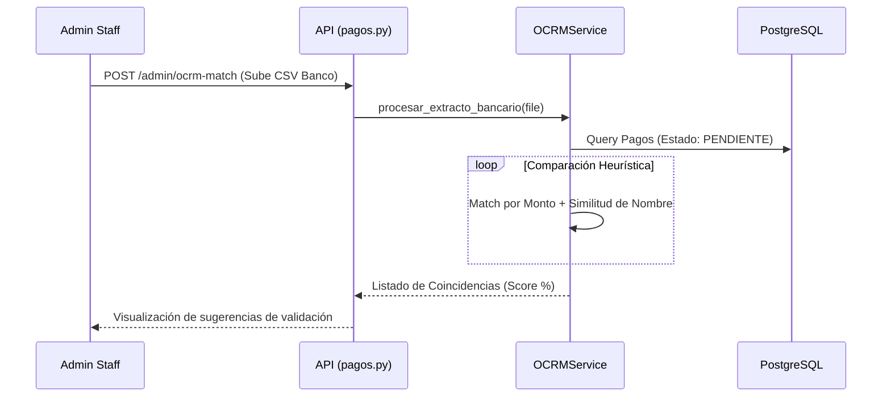
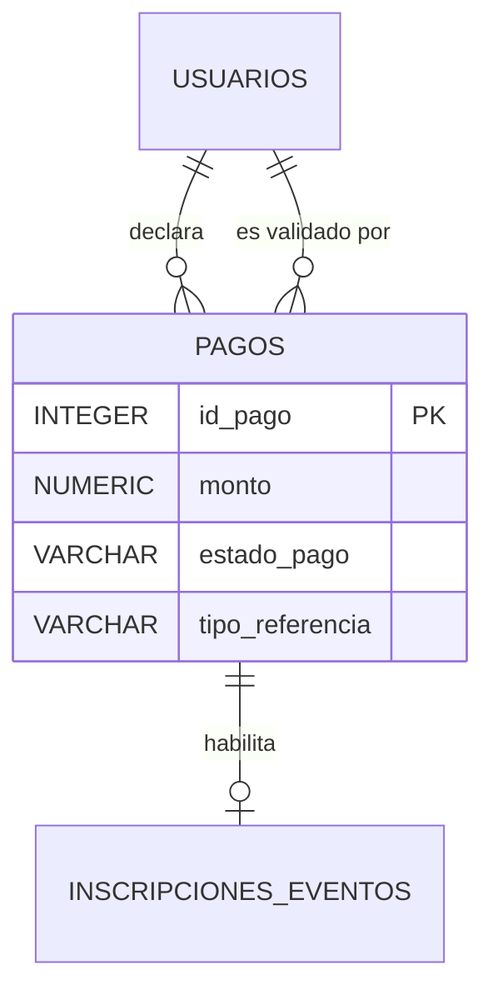

# Módulo de Pagos y Conciliación (OCRM)

Este módulo gestiona el flujo financiero de la plataforma, desde la carga de comprobantes por parte de los usuarios hasta la validación administrativa asistida por algoritmos de conciliación bancaria (OCRM - Optical-CSV Reconciliation Matcher).

## M0 — ADR Local: Gestión Financiera

| ID | Decisión | Alternativas | Justificación | Consecuencias |
|:---|:---|:---|:---|:---|
| ADR-PAY-01 | **Validación Humana Obligatoria** | Pasarelas Automáticas (Stripe/PayPal) | El mercado local (Bolivia) prioriza transferencias QR y depósitos que requieren verificación visual. | Proceso más lento pero con 0% de comisiones por intermediarios externos. |
| ADR-PAY-02 | **Conciliación vía Heurística CSV** | OCR sobre Imágenes (Tesseract) | El OCR sobre fotos de recibos es propenso a errores. El extracto bancario CSV es 100% fiable para contrastar montos. | Se requiere que el administrador descargue el extracto de su banco mensualmente. |
| ADR-PAY-03 | **Persistencia de Comprobantes Local** | Almacenamiento Cloud | Facilidad de implementación inicial y cumplimiento de normativas de privacidad de datos locales. | Se requiere backup periódico de la carpeta `static/comprobantes`. |

:::info
El sistema es **Síncrono**. Cuando un administrador aprueba un pago, la transacción se confirma en la base de datos y se dispara el gatillo de generación de QR/Certificado en el mismo ciclo de solicitud.
:::

## M1 — Arquitectura del Módulo

El flujo se divide en dos fases: **Declaración del Usuario** y **Conciliación del Administrador**.

### Diagrama de Secuencia: Conciliación OCRM


## M2 — Diccionario de Datos

El modelo de Pagos centraliza todas las transacciones de la plataforma.

### Tabla: `pagos`
| Campo | Tipo | Descripción |
|:---|:---|:---|
| `id_pago` | `INTEGER SERIAL` | Identificador único (PK). |
| `id_usuario` | `INTEGER` | Usuario que realizó el pago (FK). |
| `monto` | `NUMERIC(10,2)` | Valor monetario de la transacción. |
| `metodo_pago` | `VARCHAR` | QR, Transferencia, Efectivo, etc. |
| `estado_pago` | `VARCHAR` | PENDIENTE, APROBADO, RECHAZADO. |
| `id_referencia` | `INTEGER` | ID del evento o curso pagado. |
| `tipo_referencia` | `VARCHAR` | 'EVENTO' o 'CURSO'. |
| `url_comprobante` | `VARCHAR` | Ruta física al archivo de imagen guardado. |
| `validado_por` | `INTEGER` | ID del administrador que aprobó (FK). |
| `fecha_validacion` | `TIMESTAMP` | Auditoría de tiempo de aprobación. |



## M3 — Contratos de APIs

| Método | URI | Payload | Respuesta (200 OK) |
|:---|:---|:---|:---|
| POST | `/api/v1/pagos/upload-comprobante` | Multipart (monto, ref, file) | `{id_pago: 12, estado: "PENDIENTE"}` |
| GET | `/api/v1/pagos/mis-pagos` | N/A | `List[PagoResponse]` |
| PUT | `/api/v1/pagos/admin/{id}/validar` | `{estado: "APROBADO", notas: "..."}` | `{status: "success"}` |
| POST | `/api/v1/pagos/admin/ocrm-match` | `.csv` (Extracto Bancario) | `List[MatchInfo]` |

## M4 — Ingeniería Avanzada: Algoritmo OCRM

El servicio `OCRMService` implementa una heurística de comparación de cadenas para asistir al administrador.

### Lógica de Similitud
1. **Filtro de Monto:** Solo se consideran registros del banco que coincidan exactamente con el monto declarado por el usuario.
2. **Análisis de Nombre:** Se tokeniza el nombre del usuario y se busca su presencia en la glosa/descripción de la transferencia bancaria.
3. **Puntaje (Score):**
   ```python
   # Pseudocódigo de la heurística
   palabras_nombre = nombre_completo.split()
   matches = sum(1 for p in palabras_nombre if p in descripcion_banco)
   score = (matches / len(palabras_nombre)) * 100
   ```

## M5 — Frontend (React + Context API)

La gestión de pagos utiliza componentes dinámicos para la carga de archivos.

### Componentes Clave
- `PagoForm.jsx`: Captura los datos del comprobante y realiza la subida asíncrona (vía `axios`).
- `AdminConciliacion.jsx`: Tabla interactiva que muestra los resultados del OCRM, permitiendo aprobaciones masivas en un solo clic.
- `EstadoPagoBadge.jsx`: Componente visual que cambia de color según el estado (`warning` para pendiente, `success` para aprobado).

## M6 — Migraciones (Alembic)

- **Baseline:** `0676e55518a7_initial_clean_baseline.py`
  - Creación de tabla `pagos`.
  - Check constraint: `monto >= 0`.
  - Índices en `id_usuario` e `id_referencia` para optimización de reportes financieros.
