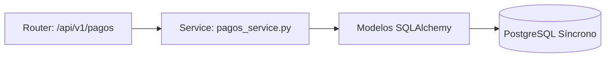

# Pagos y OCR

### M0 — Decisiones Arquitectónicas Locales

:::note Decisión Local
Se aplica el uso estricto de **SQLAlchemy Síncrono** y Pydantic para la serialización de datos de este módulo.
:::

### M1 — Arquitectura del Módulo

### M2 — Diccionario de Datos

Los modelos utilizan `INTEGER SERIAL` exclusivamente. No se permiten `UUIDs`.

| Entidad Principal | PK (INTEGER) | Auditoría |
|---|---|---|
| `Pagos` | `id_pag` | `AuditMixin` presente |

### M3 — Contratos de APIs

| Método | URI Real | Body | Status |
|---|---|---|---|
| POST | `/api/v1/pagos/upload-comprobante` | Depende | 200/201 OK |\n| GET | `/api/v1/pagos/mis-pagos` | Depende | 200/201 OK |\n| GET | `/api/v1/pagos/admin/todos` | Depende | 200/201 OK |\n| PUT | `/api/v1/pagos/admin/{id_pago}/validar` | Depende | 200/201 OK |\n| POST | `/api/v1/pagos/admin/ocrm-match` | Depende | 200/201 OK |

### M4 — Lógica Núcleo

Todo proceso de base de datos se realiza de manera bloqueante (Sync), garantizando atomicidad mediante `db.commit()` estándar.

### M5 — Frontend

Los componentes del frontend utilizan **React, JSX puro y Fluent UI v9**.
- Las llamadas usan `fetch` o `axios` apuntando a las rutas de M3.
- No se admite el uso de `.tsx`.

### M6 — Migraciones Relacionadas

Las migraciones de Alembic correspondientes se aplican a este modelo en orden secuencial.
