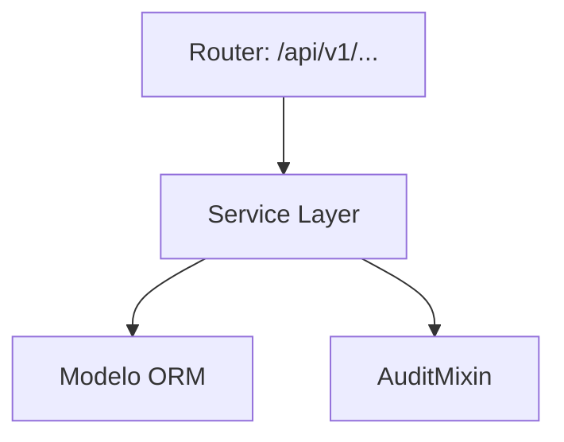
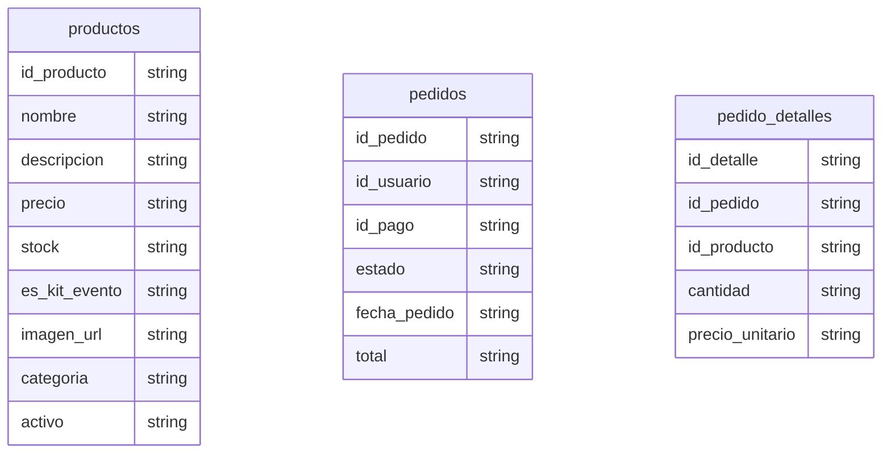

# Souvenirs / Productos

> **⚠️ [GENERADO AUTOMÁTICAMENTE]:** Esta documentación fue generada a partir del análisis estático del código fuente de Plataforma MEH.

## Sección M0 — Decisiones Arquitectónicas Locales (ADR)

| ID | Decisión | Alternativas consideradas | Justificación | Consecuencias |
|---|---|---|---|---|
| ADR-M08-001 | Uso de arquitectura en capas | Monolito o lógica en routers | Mantenibilidad y reusabilidad | Mayor cantidad de archivos y abstracciones |

## Sección M1 — Arquitectura del Módulo (C4 Nivel 3 + Ciclo de Vida)

Ciclo de vida de una petición típica:
1. Llegada al Router (FastAPI).
2. Validación Pydantic.
3. Inyección de dependencia (get_db).
4. Ejecución en Service Layer.
5. Persistencia.
6. Auditoría.
7. Respuesta serializada.

## Sección M2 — Diccionario de Datos

### Tabla: `productos`

| Nombre del Campo | Tipo de Dato | Restricciones |
|---|---|---|
| id_producto | `Integer, primary_key=True, index=True` | - |
| nombre | `String(100)` | - |
| descripcion | `TEXT, nullable=True` | - |
| precio | `Numeric(10, 2), default=0` | - |
| stock | `Integer, default=0` | - |
| es_kit_evento | `Boolean, default=False` | - |
| imagen_url | `TEXT, nullable=True` | - |
| categoria | `String, default="SOUVENIR"` | - |
| activo | `Boolean, default=True` | - |

### Tabla: `pedidos`

| Nombre del Campo | Tipo de Dato | Restricciones |
|---|---|---|
| id_pedido | `Integer, primary_key=True, index=True` | - |
| id_usuario | `Integer, ForeignKey("usuarios.id_usuario"), index=True` | - |
| id_pago | `Integer, ForeignKey("pagos.id_pago"), nullable=True, index=True` | - |
| estado | `String, default="PENDIENTE"` | - |
| fecha_pedido | `DateTime, default=datetime.utcnow` | - |
| total | `Numeric(10, 2), default=0` | - |

### Tabla: `pedido_detalles`

| Nombre del Campo | Tipo de Dato | Restricciones |
|---|---|---|
| id_detalle | `Integer, primary_key=True, index=True` | - |
| id_pedido | `Integer, ForeignKey("pedidos.id_pedido", ondelete="CASCADE"), index=True` | - |
| id_producto | `Integer, ForeignKey("productos.id_producto"), index=True` | - |
| cantidad | `Integer, default=1` | - |
| precio_unitario | `Numeric(10, 2)` | - |

## Sección M3 — Contratos de APIs

| Método | URI |
|---|---|
| GET | `/api/v1/souvenirs/` |
| POST | `/api/v1/souvenirs/` |
| PUT | `/api/v1/souvenirs/{id_producto}` |
| DELETE | `/api/v1/souvenirs/{id_producto}` |
| POST | `/api/v1/souvenirs/ventas` |
| GET | `/api/v1/souvenirs/ventas` |

## Sección M4 — Ingeniería Avanzada y Algoritmos Núcleo

Para información sobre la trazabilidad, se usa `AuditMixin` en los modelos para capturar el usuario creador/modificador.

## Sección M5 — Frontend (por módulo)

Revisar la carpeta `frontend/src/` para componentes asociados a este módulo.

## Sección M6 — Migraciones

* Las migraciones asociadas a estas tablas se encuentran en `alembic/versions/`.
