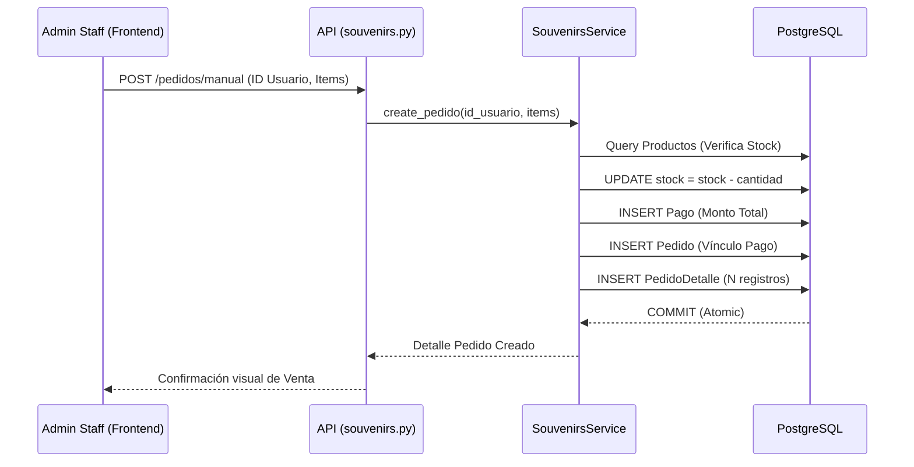
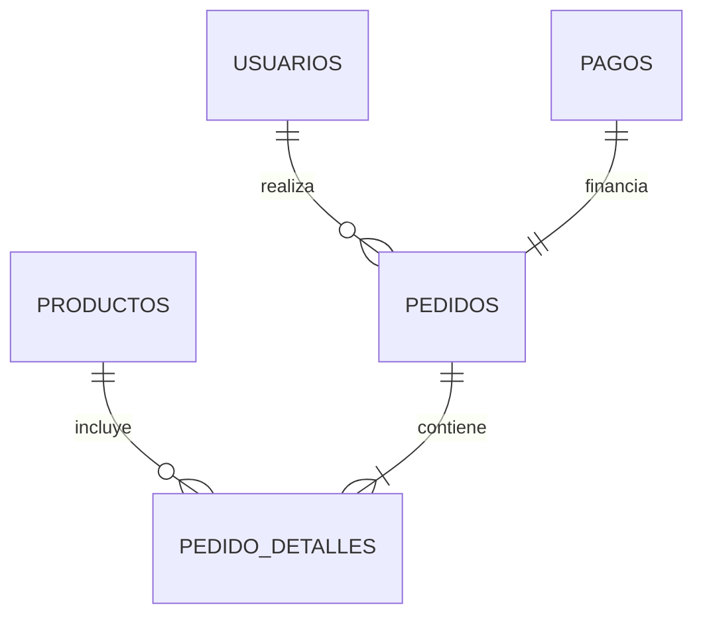
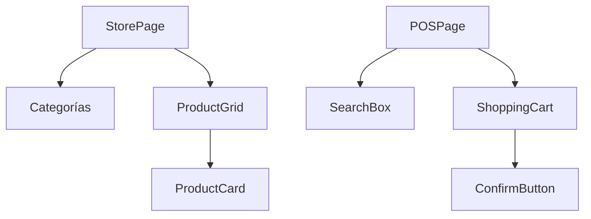

# Módulo de Productos y Souvenirs

Este módulo implementa una tienda interna (Souvenirs) y un sistema de Punto de Venta (POS) para la gestión de inventario físico de la comunidad, permitiendo la venta de kits de eventos, camisetas y otros artículos.

## M0 — ADR Local: Gestión de Inventario y Ventas

| ID | Decisión | Alternativas | Justificación | Consecuencias |
|:---|:---|:---|:---|:---|
| ADR-SOU-01 | **Descuento Automático de Stock** | Ajuste manual periódico | Evita la sobreventa de productos con stock limitado durante eventos presenciales. | Se requiere validación de stock antes de confirmar cualquier pedido. |
| ADR-SOU-02 | **Venta Directa Admin (POS)** | Solo carrito de usuario | En eventos presenciales, el staff debe poder registrar ventas rápidas en nombre de usuarios. | El sistema asume pago completado cuando la venta es realizada por un administrador. |
| ADR-SOU-03 | **Precios en Moneda Local (BOB)** | Soporte Multi-moneda | El sistema está diseñado para una comunidad local; simplifica la contabilidad y el manejo de tipos de cambio. | Menor flexibilidad para ventas internacionales futuras. |

:::info
La integridad del inventario se garantiza mediante el uso de **Transacciones Atómicas** en SQLAlchemy. Si falla la vinculación de un producto al pedido, se revierte automáticamente el descuento del stock.
:::

## M1 — Arquitectura del Módulo

El módulo utiliza el patrón **Service Layer** para encapsular la lógica compleja de ventas que involucra tres tablas distintas.

### Diagrama de Secuencia: Registro de Venta Manual (POS)

## M2 — Diccionario de Datos

El sistema de souvenirs utiliza una estructura de tres niveles para normalizar los datos de venta.

### Tabla: `productos`
| Campo | Tipo | Descripción |
|:---|:---|:---|
| `id_producto` | `INTEGER SERIAL` | Identificador del producto (PK). |
| `nombre` | `VARCHAR(100)` | Nombre comercial. |
| `precio` | `NUMERIC(10,2)` | Precio unitario. |
| `stock` | `INTEGER` | Cantidad disponible (Check stock >= 0). |
| `es_kit_evento` | `BOOLEAN` | Define si es parte de la inscripción a un evento. |
| `categoria` | `VARCHAR` | SOUVENIR, KIT, ACCESORIO, etc. |

### Tabla: `pedidos`
| Campo | Tipo | Descripción |
|:---|:---|:---|
| `id_pedido` | `INTEGER SERIAL` | Identificador de la orden (PK). |
| `id_usuario` | `INTEGER` | Comprador (FK). |
| `id_pago` | `INTEGER` | Vínculo a la tabla de pagos (FK). |
| `total` | `NUMERIC(10,2)` | Sumatoria de los detalles. |
| `estado` | `VARCHAR` | PENDIENTE, COMPLETADO, ENTREGADO. |

### Tabla: `pedido_detalles`
| Campo | Tipo | Descripción |
|:---|:---|:---|
| `id_detalle` | `INTEGER SERIAL` | PK. |
| `id_pedido` | `INTEGER` | FK a pedidos. |
| `id_producto` | `INTEGER` | FK a productos. |
| `cantidad` | `INTEGER` | Unidades compradas. |
| `precio_unitario`| `NUMERIC(10,2)` | Precio al momento de la venta (Snapshot). |

## M3 — Contratos de APIs

| Método | URI | Payload | Respuesta |
|:---|:---|:---|:---|
| GET | `/api/v1/souvenirs/productos` | `categoria` (optional) | `List[Producto]` |
| POST | `/api/v1/souvenirs/admin/productos` | JSON (nombre, precio, stock) | `Producto` |
| POST | `/api/v1/souvenirs/pedidos/manual` | `{id_usuario, items: [...]}` | `PedidoFull` |
| GET | `/api/v1/souvenirs/pedidos` | N/A | `List[Pedido]` |

## M4 — Ingeniería Avanzada

### Seguridad y Auditoría
Cada cambio en el inventario o creación de pedido genera una entrada en la tabla `logs_sistema`. Esto permite reconstruir el historial de ventas incluso si un registro de pedido fuera accidentalmente modificado.

### Restricciones de Integridad (Check Constraints)
Se han implementado restricciones a nivel de base de datos para prevenir errores de lógica de negocio:
- `check_producto_stock_positivo`: Impide que el stock baje de 0.
- `check_pedido_total_positivo`: Garantiza que no existan pedidos con montos negativos.

## M5 — Frontend (React + Fluent UI)

### Componentes Clave
- `SouvenirGallery.jsx`: Catálogo público para usuarios con filtrado por categorías.
- `POSSystem.jsx`: Interfaz optimizada para pantallas táctiles (tablets) utilizada por el staff en eventos. Permite buscar usuarios por alias o correo.
- `InventoryManager.jsx`: CRUD de productos con carga de imágenes a `static/uploads`.

### Árbol de Componentes

## M6 — Migraciones (Alembic)

- **Baseline:** `0676e55518a7_initial_clean_baseline.py`
  - Definición de tablas `productos`, `pedidos` y `pedido_detalles`.
  - Configuración de relaciones `CASCADE` en `pedido_detalles` para limpieza de datos.
  - Creación de índices en `id_pedido` e `id_producto`.
