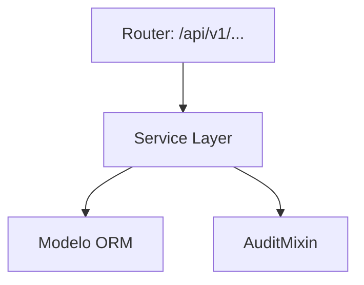

# Academia

> **⚠️ [GENERADO AUTOMÁTICAMENTE]:** Esta documentación fue generada a partir del análisis estático del código fuente de Plataforma MEH.

## Sección M0 — Decisiones Arquitectónicas Locales (ADR)

| ID | Decisión | Alternativas consideradas | Justificación | Consecuencias |
|---|---|---|---|---|
| ADR-M09-001 | Uso de arquitectura en capas | Monolito o lógica en routers | Mantenibilidad y reusabilidad | Mayor cantidad de archivos y abstracciones |

## Sección M1 — Arquitectura del Módulo (C4 Nivel 3 + Ciclo de Vida)

Ciclo de vida de una petición típica:
1. Llegada al Router (FastAPI).
2. Validación Pydantic.
3. Inyección de dependencia (get_db).
4. Ejecución en Service Layer.
5. Persistencia.
6. Auditoría.
7. Respuesta serializada.

## Sección M2 — Diccionario de Datos

[SIN TABLAS PROPIAS]

## Sección M3 — Contratos de APIs

| Método | URI |
|---|---|
| GET | `/api/v1/academia/cursos/{id_curso}/lecciones` |
| POST | `/api/v1/academia/lecciones` |
| PUT | `/api/v1/academia/lecciones/{id_leccion}` |
| DELETE | `/api/v1/academia/lecciones/{id_leccion}` |
| GET | `/api/v1/academia/lecciones/{id_leccion}/tareas` |
| POST | `/api/v1/academia/tareas` |
| PUT | `/api/v1/academia/tareas/{id_tarea}` |
| DELETE | `/api/v1/academia/tareas/{id_tarea}` |
| GET | `/api/v1/academia/tareas/{id_tarea}/entregas` |
| POST | `/api/v1/academia/tareas/entregar` |
| PUT | `/api/v1/academia/entregas/{id_entrega}/calificar` |
| GET | `/api/v1/academia/cursos/{id_curso}/foro` |
| POST | `/api/v1/academia/foro` |

## Sección M4 — Ingeniería Avanzada y Algoritmos Núcleo

Para información sobre la trazabilidad, se usa `AuditMixin` en los modelos para capturar el usuario creador/modificador.

## Sección M5 — Frontend (por módulo)

Revisar la carpeta `frontend/src/` para componentes asociados a este módulo.

## Sección M6 — Migraciones

* Las migraciones asociadas a estas tablas se encuentran en `alembic/versions/`.
