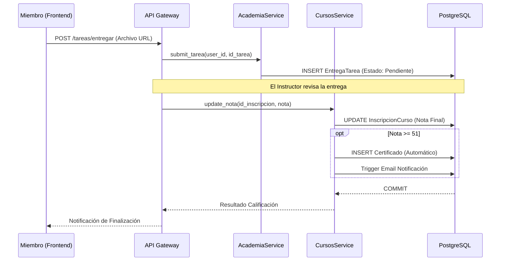
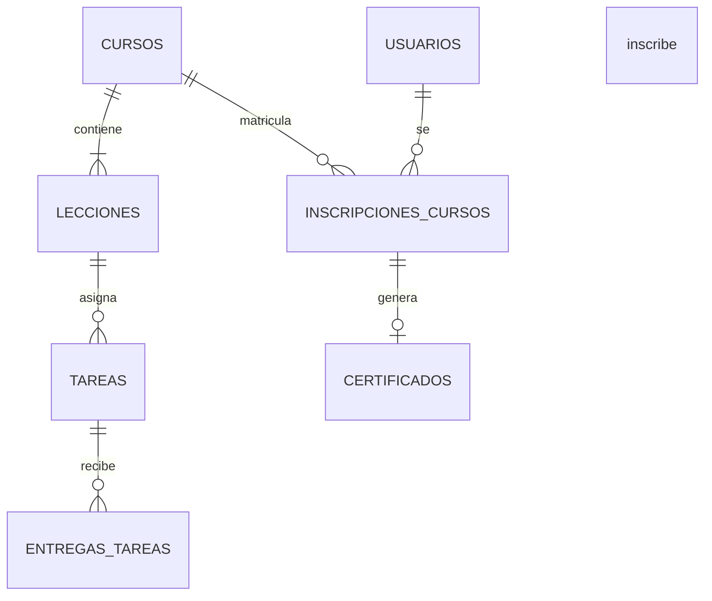
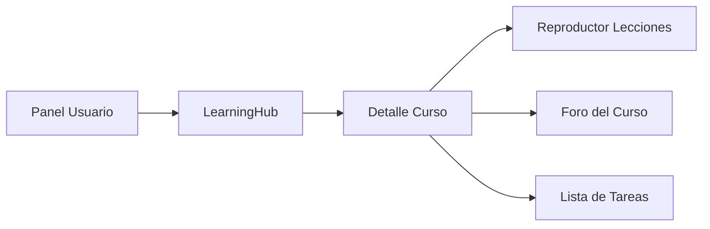

# Módulo de Academia (LMS)

El Módulo de Academia es el corazón del Learning Hub de la Plataforma MEH. Implementa un sistema de gestión de aprendizaje (LMS) completo que permite la creación de rutas de aprendizaje, gestión de lecciones multimedia, foros de discusión y evaluación automatizada.

## M0 — ADR Local: Gestión de Aprendizaje

| ID | Decisión | Alternativas | Justificación | Consecuencias |
|:---|:---|:---|:---|:---|
| ADR-LMS-01 | **Certificación por Nota (>51)** | Solo por asistencia | Garantiza que el miembro ha adquirido los conocimientos mínimos necesarios. | El instructor debe calificar manualmente las tareas antes de la emisión. |
| ADR-LMS-02 | **Estructura Jerárquica Rígida** | Etiquetas (Tags) / Grafos | Facilita la navegación del usuario mediante un árbol de contenido claro: Curso -> Lección -> Tarea. | Menor flexibilidad para cursos no lineales o modulares. |
| ADR-LMS-03 | **Integración MS Learning** | Desarrollo propio de todo el contenido | Permite aprovechar rutas de certificación oficiales de Microsoft integradas en el perfil local. | Dependencia de APIs externas para el progreso en dichas rutas. |

:::info
Toda la lógica de evaluación y progreso es **Síncrona**. El cálculo del promedio final se dispara en el momento en que el docente guarda la última nota en la base de datos.
:::

## M1 — Arquitectura del Módulo

El sistema de academia utiliza una separación de responsabilidades entre la gestión de contenido (`AcademiaService`) y la gestión de usuarios/notas (`CursosService`).

### Diagrama de Secuencia: Ciclo de Vida de una Tarea


## M2 — Diccionario de Datos

El modelo LMS es el más complejo de la plataforma debido a sus múltiples relaciones.

### Tabla: `cursos`
| Campo | Tipo | Descripción |
|:---|:---|:---|
| `id_curso` | `INTEGER SERIAL` | PK. |
| `nombre_curso` | `VARCHAR` | Título del curso. |
| `horas_academicas` | `INTEGER` | Carga horaria para el certificado. |
| `id_instructor` | `INTEGER` | Referencia al usuario con rol MODERADOR/ADMIN (FK). |

### Tabla: `lecciones`
| Campo | Tipo | Descripción |
|:---|:---|:---|
| `id_leccion` | `INTEGER SERIAL` | PK. |
| `id_curso` | `INTEGER` | FK a cursos. |
| `contenido_video_url` | `VARCHAR` | Link a YouTube/Vimeo. |
| `orden` | `INTEGER` | Posición en el temario. |

### Tabla: `inscripciones_cursos`
| Campo | Tipo | Descripción |
|:---|:---|:---|
| `id_inscripcion_curso`| `INTEGER SERIAL` | PK. |
| `id_usuario` | `INTEGER` | Alumno (FK). |
| `progreso` | `INTEGER` | Porcentaje completado (0-100). |
| `nota_final` | `NUMERIC(5,2)` | Calificación promediada. |
| `finalizado` | `BOOLEAN` | Flag que gatilla la certificación. |



## M3 — Contratos de APIs

| Método | URI | Payload | Respuesta |
|:---|:---|:---|:---|
| GET | `/api/v1/academia/cursos/{id}/lecciones` | N/A | `List[LeccionResponse]` |
| POST | `/api/v1/academia/tareas/entregar` | `{id_tarea, archivo_url}` | `EntregaTarea` |
| PUT | `/api/v1/cursos/nota` | `{id_inscripcion, nota}` | `{message: "Nota actualizada"}` |
| GET | `/api/v1/academia/cursos/{id}/foro` | N/A | `List[PostForo]` |

## M4 — Ingeniería Avanzada

### Lógica de Certificación Automática
El sistema implementa un "Gatillo de Éxito" dentro del método `update_nota` en `CursosService`.

```python
# Lógica de negocio core
if nota >= 51:
    inscripcion.finalizado = True
    emitir_certificado_automatico(db, inscripcion.id_usuario, inscripcion.id_curso)
```

### Gestión de Foros Académicos
Cada curso posee un foro independiente donde los alumnos pueden marcar sus mensajes como `es_pregunta_docente`, lo que prioriza la visualización en el panel del instructor para una respuesta rápida.

## M5 — Frontend (React + Fluent UI)

### Componentes Clave
- `LearningHub.jsx`: Vista principal del estudiante con progreso visual mediante barras de porcentaje.
- `CoursePlayer.jsx`: Reproductor de video integrado con visor de Markdown para el contenido de texto de las lecciones.
- `AssignmentDropzone.jsx`: Componente de carga de archivos para tareas con validación de extensiones.

### Estructura de Navegación


## M6 — Migraciones (Alembic)

- **Creación LMS:** `5d648885e1d4_create_academia_lms_tables.py`
  - Implementación de tablas: `cursos`, `lecciones`, `tareas`, `entregas_tareas`.
  - Configuración de `id_instructor` como FK hacia `usuarios`.
  - Definición de cascadas de borrado para que al eliminar un curso se limpien sus lecciones y tareas.
