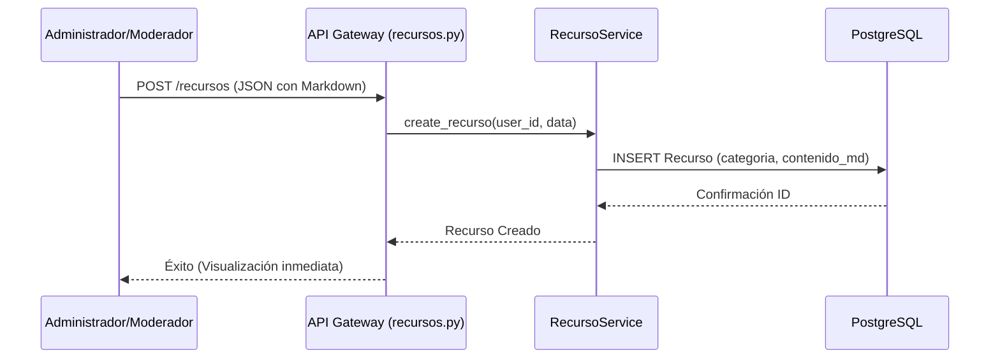
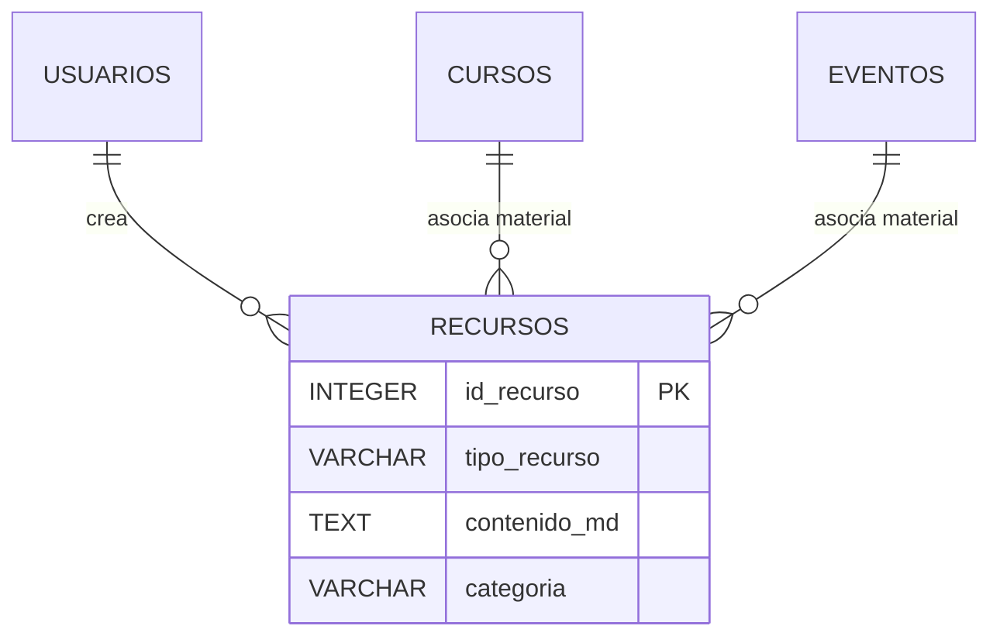
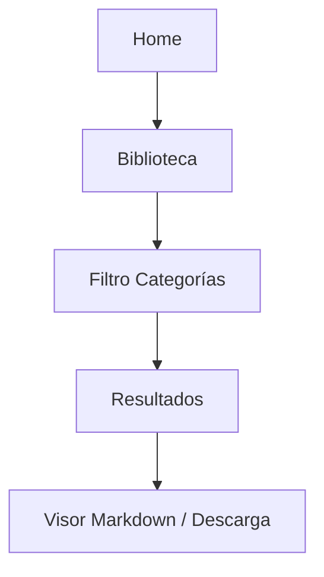

# Módulo de Recursos (Biblioteca Digital)

El Módulo de Recursos funciona como el repositorio centralizado de conocimiento de la plataforma. Permite la gestión de activos digitales, guías técnicas en formato Markdown y material complementario para eventos y cursos.

## M0 — ADR Local: Gestión de Activos Digitales

| ID | Decisión | Alternativas | Justificación | Consecuencias |
|:---|:---|:---|:---|:---|
| ADR-REC-01 | **Soporte Híbrido (Link/Archivo)** | Solo subida de archivos | Muchos recursos son externos (Drive, GitHub, Docs). El soporte de URLs externas reduce la carga del servidor. | Se requiere validación de URL en el frontend para evitar enlaces rotos. |
| ADR-REC-02 | **Renderizado Markdown Server-Side** | HTML Estático | Permite que los autores editen guías técnicas rápidamente sin necesidad de desplegar código nuevo. | Requiere una librería de sanitización en el frontend para prevenir ataques XSS. |
| ADR-REC-03 | **Categorización Flexible** | Carpetas físicas | Las categorías basadas en base de datos permiten que un recurso pertenezca a múltiples filtros sin duplicar datos. | La navegación es lógica (por etiquetas) y no física (por carpetas). |

:::info
Este módulo utiliza la arquitectura **Síncrona** estándar. La creación de un recurso es inmediata y se refleja en la biblioteca global en el mismo ciclo de persistencia de la base de datos.
:::

## M1 — Arquitectura del Módulo

El servicio de recursos es agnóstico al contexto, permitiendo que un recurso sea consultado de forma independiente o como parte de un curso específico.

### Diagrama de Secuencia: Publicación de Guía Técnica

## M2 — Diccionario de Datos

La tabla `recursos` centraliza metadatos de archivos y contenido textual extenso.

### Tabla: `recursos`
| Campo | Tipo | Descripción |
|:---|:---|:---|
| `id_recurso` | `INTEGER SERIAL` | Identificador único (PK). |
| `titulo` | `VARCHAR` | Nombre descriptivo del recurso. |
| `tipo_recurso` | `VARCHAR` | 'ARCHIVO' o 'GUIA_MD'. |
| `contenido_md` | `TEXT` | Contenido en formato Markdown (opcional). |
| `url_descarga` | `VARCHAR` | Link externo o ruta al archivo local. |
| `id_curso` | `INTEGER` | Vinculación opcional a un curso (FK). |
| `id_evento` | `INTEGER` | Vinculación opcional a un evento (FK). |
| `categoria` | `VARCHAR` | Etiqueta para filtrado (Tutorial, Kit, Software). |

## M3 — Contratos de APIs

| Método | URI | Payload | Respuesta |
|:---|:---|:---|:---|
| GET | `/api/v1/recursos` | `categoria` (query) | `List[Recurso]` |
| POST | `/api/v1/recursos` | `RecursoCreate` (JSON) | `Recurso` |
| PUT | `/api/v1/recursos/{id}` | `RecursoUpdate` (JSON) | `Recurso` |
| DELETE | `/api/v1/recursos/{id}` | N/A | `{message: "..."}` |

## M4 — Ingeniería Avanzada

### Vinculación Contextual
A diferencia de otros módulos, Recursos utiliza llaves foráneas opcionales (`id_curso`, `id_evento`). Esto permite que un recurso sea "Material de Curso" pero también sea visible en la "Biblioteca General", maximizando la reutilización de contenido educativo.

### Trazabilidad con AuditMixin
Cada recurso registra quién lo creó y quién realizó la última edición. En el caso de guías técnicas (Markdown), el sistema guarda un log de los cambios realizados para control administrativo.

## M5 — Frontend (React + Markdown Rendering)

### Componentes Clave
- `BibliotecaPage.jsx`: Vista de rejilla (Grid) con búsqueda en tiempo real y filtrado por categorías mediante chips.
- `MarkdownRenderer.jsx`: Wrapper de `react-markdown` que procesa el contenido guardado en la base de datos, aplicando estilos de resaltado de código (PrismJS).
- `ResourceUploader.jsx`: Permite elegir entre subir un archivo físico o redactar contenido directamente en un editor de texto enriquecido.

### Flujo de Usuario

## M6 — Migraciones (Alembic)

- **Expansión de Modelo:** `19edfe311d60_expand_recurso_model.py`
  - Adición de campos para autor externo y tipo de recurso.
  - Implementación de `contenido_md` para soporte de guías extensas.
- **Mejora Visual:** `8b9b66e59fb9_add_portada_to_recurso.py`
  - Adición de `portada_url` para permitir previsualizaciones gráficas en la biblioteca.
