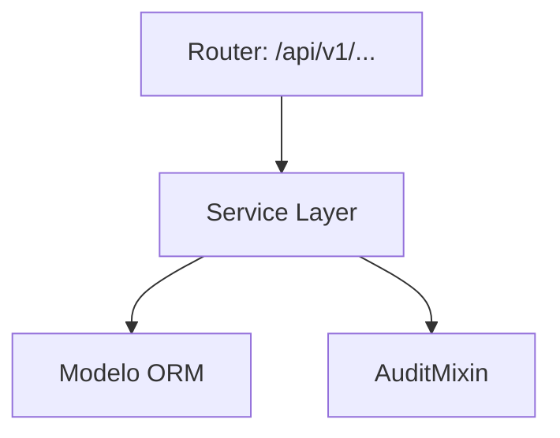
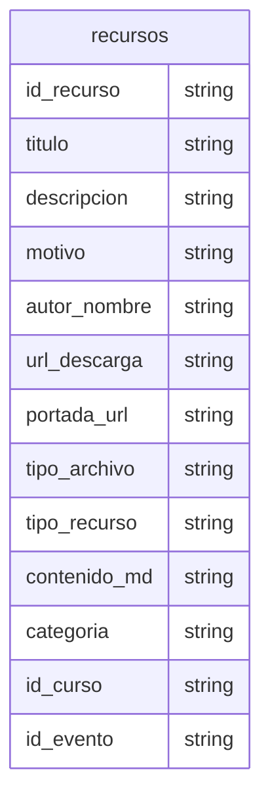

# Recursos

> **⚠️ [GENERADO AUTOMÁTICAMENTE]:** Esta documentación fue generada a partir del análisis estático del código fuente de Plataforma MEH.

## Sección M0 — Decisiones Arquitectónicas Locales (ADR)

| ID | Decisión | Alternativas consideradas | Justificación | Consecuencias |
|---|---|---|---|---|
| ADR-M10-001 | Uso de arquitectura en capas | Monolito o lógica en routers | Mantenibilidad y reusabilidad | Mayor cantidad de archivos y abstracciones |

## Sección M1 — Arquitectura del Módulo (C4 Nivel 3 + Ciclo de Vida)

Ciclo de vida de una petición típica:
1. Llegada al Router (FastAPI).
2. Validación Pydantic.
3. Inyección de dependencia (get_db).
4. Ejecución en Service Layer.
5. Persistencia.
6. Auditoría.
7. Respuesta serializada.

## Sección M2 — Diccionario de Datos

### Tabla: `recursos`

| Nombre del Campo | Tipo de Dato | Restricciones |
|---|---|---|
| id_recurso | `Integer, primary_key=True, index=True` | - |
| titulo | `String` | - |
| descripcion | `TEXT` | - |
| motivo | `String, nullable=True` | - |
| autor_nombre | `String, nullable=True` | - |
| url_descarga | `String, nullable=True` | - |
| portada_url | `String, nullable=True` | - |
| tipo_archivo | `String, nullable=True` | - |
| tipo_recurso | `String, default="ARCHIVO"` | - |
| contenido_md | `TEXT, nullable=True` | - |
| categoria | `String` | - |
| id_curso | `Integer, ForeignKey("cursos.id_curso"), nullable=True` | - |
| id_evento | `Integer, ForeignKey("eventos.id_evento"), nullable=True` | - |

## Sección M3 — Contratos de APIs

| Método | URI |
|---|---|
| GET | `/api/v1/recursos/` |
| POST | `/api/v1/recursos/` |
| PUT | `/api/v1/recursos/{id_recurso}` |
| DELETE | `/api/v1/recursos/{id_recurso}` |

## Sección M4 — Ingeniería Avanzada y Algoritmos Núcleo

Para información sobre la trazabilidad, se usa `AuditMixin` en los modelos para capturar el usuario creador/modificador.

## Sección M5 — Frontend (por módulo)

Revisar la carpeta `frontend/src/` para componentes asociados a este módulo.

## Sección M6 — Migraciones

* Las migraciones asociadas a estas tablas se encuentran en `alembic/versions/`.
