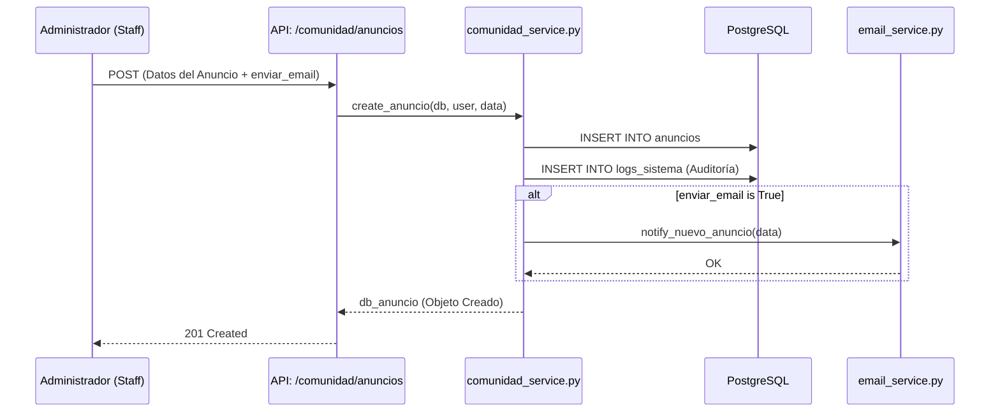
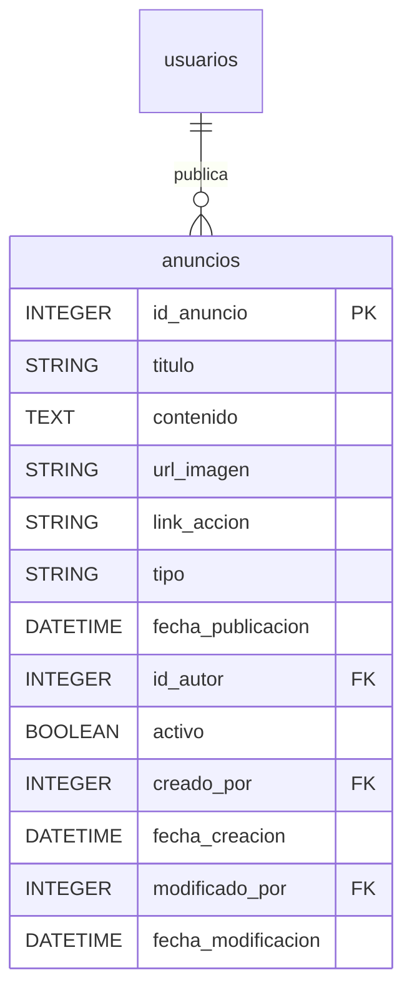
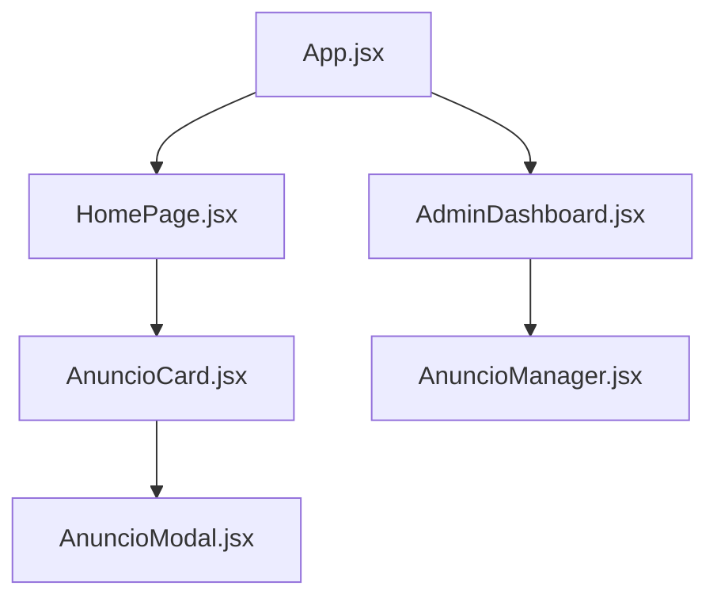

# M11 — Anuncios y Comunicados

El módulo de Anuncios es el componente central para la comunicación oficial de la Plataforma MEH. Permite a los administradores y staff publicar noticias, avisos de eventos, y comunicados importantes que aparecen en el feed principal de la comunidad.

### M0 — ADR Local: Gestión de Comunicados Dinámicos

| ID | Decisión | Alternativas | Justificación | Consecuencias |
|:---|:---|:---|:---|:---|
| **ADR-11-01** | Uso de `Anuncio` con estado `activo` | Soft delete manual | Permite ocultar anuncios sin borrarlos, manteniendo el historial de comunicaciones. | Carga ligera en queries al filtrar por `activo=True`. |
| **ADR-11-02** | Notificación opcional vía Email | Notificar siempre | Algunos anuncios son menores y no requieren saturar el buzón del usuario. | Flexibilidad para el staff al crear contenido. |
| **ADR-11-03** | Registro de Auditoría en Logs | No registrar | Es crítico saber quién publicó o modificó un comunicado oficial por seguridad. | Trazabilidad total en la tabla `logs_sistema`. |

### M1 — Arquitectura del Módulo

El flujo de información en este módulo sigue un patrón de solicitud síncrona, donde el Router de FastAPI delega la lógica al servicio, el cual interactúa con la base de datos de forma bloqueante.

#### Diagrama de Secuencia: Publicación de Anuncio


### M2 — Diccionario de Datos

La estructura de datos se basa en la tabla `anuncios`, la cual hereda de `AuditMixin` para garantizar el seguimiento de cambios.

#### Diagrama ER


#### Especificación de Campos

| Campo | Tipo Real (SQL) | Descripción |
|:---|:---|:---|
| `id_anuncio` | `INTEGER SERIAL` | Identificador único del anuncio (PK). |
| `titulo` | `VARCHAR` | Título corto y descriptivo del comunicado. |
| `contenido` | `TEXT` | Cuerpo completo del mensaje (soporta texto enriquecido). |
| `url_imagen` | `VARCHAR` | Enlace opcional a una imagen destacada. |
| `link_accion` | `VARCHAR` | URL opcional (ej. "Ver más" o "Inscribirse"). |
| `tipo` | `VARCHAR` | Categoría: INFO, URGENTE, EVENTO, etc. |
| `fecha_publicacion` | `TIMESTAMP` | Momento exacto de la salida al público. |
| `id_autor` | `INTEGER` | Usuario (Staff) que generó el contenido. |
| `activo` | `BOOLEAN` | Indica si el anuncio es visible en el frontend. |

### M3 — Contratos de APIs

| Método | URI Real | Payload (Pydantic) | Respuesta | Descripción |
|:---|:---|:---|:---|:---|
| **GET** | `/comunidad/anuncios` | N/A | `List[AnuncioResponse]` | Lista anuncios activos para usuarios. |
| **GET** | `/comunidad/anuncios/all` | N/A | `List[AnuncioResponse]` | Gestión: Lista todos (Solo Staff). |
| **POST** | `/comunidad/anuncios` | `AnuncioCreate` | `AnuncioResponse` | Crea un anuncio y audita la acción. |
| **PUT** | `/comunidad/anuncios/{id}`| `AnuncioUpdate` | `AnuncioResponse` | Actualiza contenido o estado. |
| **DELETE**| `/comunidad/anuncios/{id}`| N/A | `204 No Content` | Eliminación física del registro. |

### M4 — Ingeniería Avanzada

#### Lógica de Notificación Síncrona
El servicio `comunidad_service.py` integra un gatillo para el `email_service`. Si el campo `enviar_email` viene en el request, el sistema detiene la respuesta hasta que el servidor SMTP confirme el envío (o falle), asegurando que el administrador sepa en tiempo real si la comunicación se entregó.

```python
# Ejemplo de lógica interna en comunidad_service.py
if enviar_email:
    notify_nuevo_anuncio(
        db_anuncio.titulo, 
        db_anuncio.contenido
    )
```

#### Middleware de Auditoría
Toda operación de escritura (POST, PUT, DELETE) invoca al `logs_service` para registrar el ID del administrador, la acción realizada (`CREAR_ANUNCIO`) y los valores anteriores/nuevos en formato JSON.

### M5 — Frontend

El módulo se visualiza principalmente en la **Landing Page** y el **Dashboard del Miembro** a través de tarjetas dinámicas.

#### Estructura de Componentes


#### Gestión de Estado
Se utiliza `comunidadService.js` para realizar las peticiones al backend. El estado se maneja localmente en los componentes mediante `useState` y `useEffect` de React para cargar la lista de anuncios al montar el componente.

### M6 — Migraciones

| Archivo de Migración | Descripción |
|:---|:---|
| `0676e55518a7_...` | Creación inicial de la tabla `anuncios` con constraints de integridad. |
| `fbe03e1faad8_...` | Corrección de tipos de datos y ajustes en claves foráneas. |
