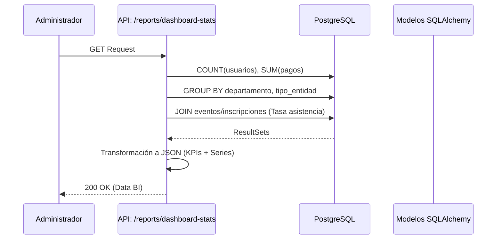
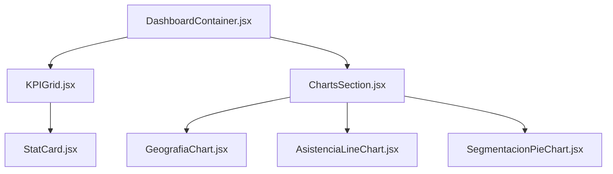

# M12 — Dashboard y Reportes (BI)

Este módulo es el centro de Business Intelligence (BI) de la plataforma. Proporciona vistas diferenciadas según el rol del usuario, permitiendo desde el seguimiento del progreso personal del miembro hasta el análisis de métricas estratégicas para la toma de decisiones por parte de la directiva.

### M0 — ADR Local: Visualización de Datos Dinámicos

| ID | Decisión | Alternativas | Justificación | Consecuencias |
|:---|:---|:---|:---|:---|
| **ADR-12-01** | Agregación Síncrona de KPIs | Pre-cálculo en cache (Redis) | La base de datos actual maneja el volumen sin latencia perceptible y garantiza datos 100% frescos. | Respuesta ligeramente más lenta en queries complejas (compensado por índices). |
| **AD-12-02** | Widgets basados en Permisos | Vistas fijas por Rol | El sistema RBAC permite una granularidad mayor, mostrando widgets de pagos solo a quienes pueden validarlos. | Interfaz adaptativa y segura. |
| **ADR-12-03** | Uso de Recharts para BI | Chart.js / D3.js | Recharts ofrece una integración nativa con React y componentes declarativos fáciles de mantener. | Dependencia de librería externa en el frontend. |

### M1 — Arquitectura del Módulo

El módulo opera mediante un motor de estadísticas que consulta múltiples tablas de forma relacional para construir un objeto JSON complejo que el frontend consume para renderizar los widgets.

#### Diagrama de Secuencia: Carga de Métricas Staff


### M2 — Diccionario de Datos

Aunque el Dashboard no posee una tabla propia, consume datos de las siguientes entidades principales (todas con PK `INTEGER`):

| Entidad | Campo Clave | Relación con Dashboard |
|:---|:---|:---|
| `usuarios` | `id_usuario` | Base para métricas de crecimiento y segmentación. |
| `inscripciones_eventos` | `id_inscripcion` | Cálculo de tasas de asistencia y conversión. |
| `pagos` | `id_pago` | Seguimiento de ingresos y métodos de pago preferidos. |
| `certificados` | `id_certificado` | Métrica de éxito académico y finalización. |

#### Ejemplo de Query de BI (Síncrona)
```sql
SELECT departamento, COUNT(id_usuario) 
FROM usuarios 
WHERE pais = 'Bolivia' 
GROUP BY departamento;
```

### M3 — Contratos de APIs

| Método | URI Real | Respuesta | Descripción |
|:---|:---|:---|:---|
| **GET** | `/dashboard/stats` | `DashboardStats` | KPIs rápidos (personales + widgets staff). |
| **GET** | `/reports/dashboard-stats`| `FullBIReport` | Reporte completo de inteligencia de negocio (Solo Admin). |

### M4 — Ingeniería Avanzada

#### Optimización de Consultas de Reportes
Para evitar bloqueos en la base de datos durante la generación de reportes pesados, el sistema utiliza la función `_safe_value` en el backend, la cual captura excepciones de timeout o errores de query y retorna un valor por defecto (0), garantizando que el dashboard siempre cargue aunque una métrica específica falle.

#### Cálculo de Horas de Formación
El sistema calcula el impacto académico de forma dinámica:
`Horas Estimadas = SUM((progreso / 100.0) * horas_academicas)`
Este cálculo cruza la tabla de cursos con la de inscripciones en tiempo real.

### M5 — Frontend

El Dashboard utiliza una arquitectura de **Mallas (Grid)** donde cada widget es un componente independiente que recibe sus datos por props.

#### Árbol de Componentes (BI)


#### Librerías Utilizadas
- **Recharts:** Para la generación de gráficos de área, barras y circulares.
- **Fluent UI Icons:** Para la representación visual de cada KPI.

### M6 — Migraciones

| Archivo de Migración | Descripción |
|:---|:---|
| `fbe03e1faad8_...` | Creación de índices en `fecha_registro` y `estado_pago` para acelerar el BI. |
| `0676e55518a7_...` | Definición de tablas base que alimentan los reportes. |
