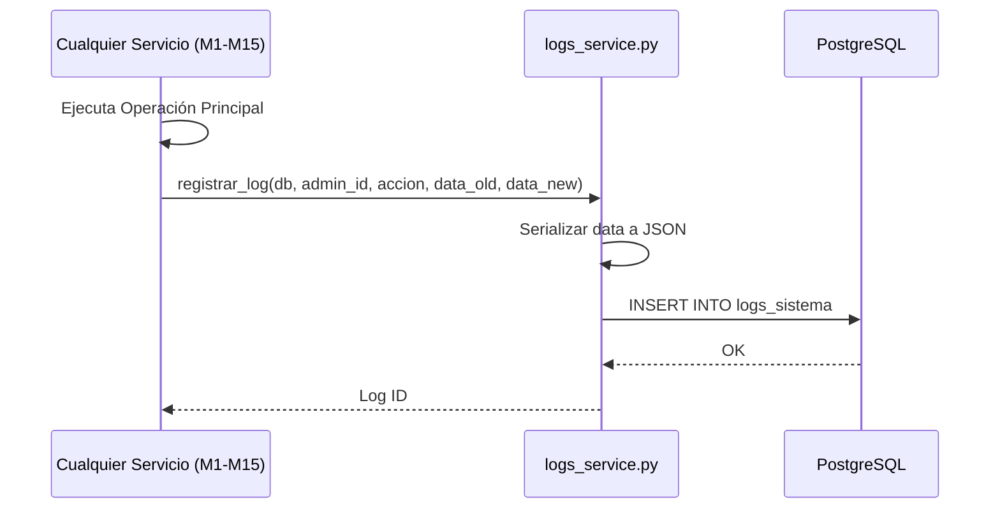
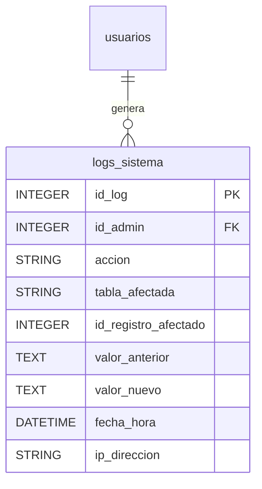
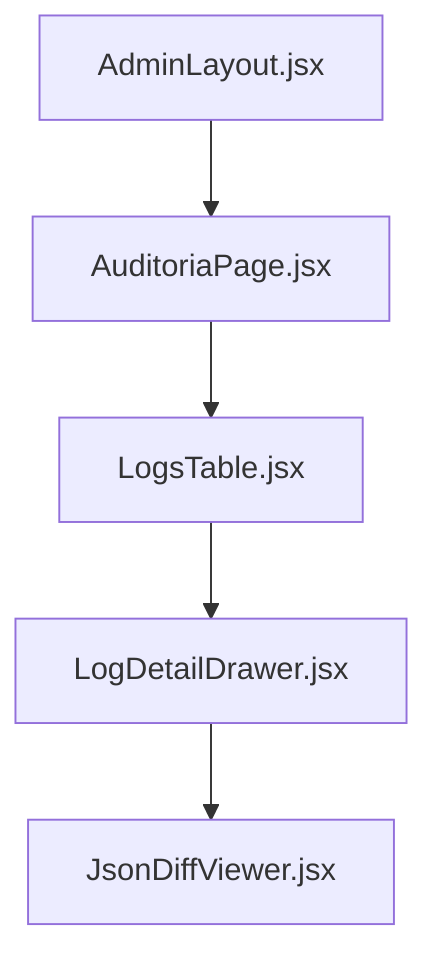

# M13 — Logs y Auditoría de Sistema

El módulo de Auditoría es el guardián de la integridad de los datos en la Plataforma MEH. Registra cada acción administrativa sensible, permitiendo a los directores del proyecto reconstruir el historial de cambios y detectar anomalías en la gestión de recursos, pagos o usuarios.

### M0 — ADR Local: Persistencia de Trazabilidad Total

| ID | Decisión | Alternativas | Justificación | Consecuencias |
|:---|:---|:---|:---|:---|
| **ADR-13-01** | Almacenamiento JSON en BD | Tablas normalizadas por entidad | El volumen de logs es variable; JSON permite guardar el "antes" y "después" de cualquier modelo sin cambiar el esquema. | Requiere parseo síncrono al consultar. |
| **ADR-13-02** | Prohibición de Borrado de Logs | Hard delete permitido | Los logs de auditoría pierden su valor legal y técnico si pueden ser eliminados. | Crecimiento constante de la tabla (requiere archivado futuro). |
| **ADR-13-03** | Registro de IP Origen | Omitir IP | Es vital para identificar accesos no autorizados desde ubicaciones inusuales. | Almacenamiento adicional de strings de IP. |

### M1 — Arquitectura del Módulo

El módulo funciona como un servicio transversal (Middleware de facto) que es invocado por otros servicios cuando se realiza una operación de mutación de datos (Insert, Update, Delete).

#### Diagrama de Secuencia: Auditoría de Cambio


### M2 — Diccionario de Datos

La tabla `logs_sistema` es la única entidad de este módulo y está optimizada para inserciones rápidas y consultas de filtrado temporal.

#### Diagrama ER


#### Especificación de Campos

| Campo | Tipo Real (SQL) | Descripción |
|:---|:---|:---|
| `id_log` | `INTEGER SERIAL` | PK única del registro de auditoría. |
| `id_admin` | `INTEGER` | Referencia al usuario que realizó la acción. |
| `accion` | `VARCHAR` | Etiqueta de la acción (ej: `VALIDAR_PAGO`, `BORRAR_ANUNCIO`). |
| `tabla_afectada` | `VARCHAR` | Nombre técnico de la tabla modificada en el esquema. |
| `id_registro_afectado` | `INTEGER` | ID del registro específico dentro de la `tabla_afectada`. |
| `valor_anterior` | `TEXT (JSON)` | Estado del objeto antes de la modificación. |
| `valor_nuevo` | `TEXT (JSON)` | Estado del objeto después de la modificación. |
| `fecha_hora` | `TIMESTAMP` | Marca temporal exacta de la transacción. |
| `ip_direccion` | `VARCHAR` | Dirección IP desde donde se emitió el request. |

### M3 — Contratos de APIs

| Método | URI Real | Parámetros Filtro | Respuesta | Descripción |
|:---|:---|:---|:---|:---|
| **GET** | `/logs/` | `fecha_inicio`, `accion`, `skip`, `limit` | `List[LogResponse]` | Consulta el historial completo (Solo Staff con privilegios). |

### M4 — Ingeniería Avanzada

#### Serialización Inteligente
El `logs_service.py` incluye una lógica de parseo síncrono que detecta si el contenido almacenado en la base de datos es un JSON válido o texto plano. Al consultar los logs, el backend transforma automáticamente los strings JSON en objetos anidados para que el frontend pueda mostrarlos en un formato amigable (Diff viewer).

```python
# Lógica de parseo en el servicio
def parse_safe(val):
    try:
        return json.loads(val)
    except:
        return val
```

#### Integración con RBAC
La consulta de logs está restringida por el permiso `PERMISSION_AUDIT_READ`. Si un usuario intenta acceder al endpoint sin el rol adecuado, el sistema lanza una `PermisoDenegadoError` capturada por el manejador global de excepciones.

### M5 — Frontend

El frontend de auditoría se encuentra en el panel de administración, utilizando una tabla de alta densidad con capacidades de filtrado por columnas.

#### Estructura de Componentes


#### Visualización de Cambios
Se utiliza un componente de "Visualizador de Diferencias" (Diff Viewer) que resalta en verde los nuevos valores y en rojo los anteriores, facilitando la revisión rápida por parte de los auditores.

### M6 — Migraciones

| Archivo de Migración | Descripción |
|:---|:---|
| `0676e55518a7_...` | Creación de la tabla `logs_sistema` con indexación por `fecha_hora`. |
| `fbe03e1faad8_...` | Ajustes en el campo `ip_direccion` para soportar formatos IPv6. |
