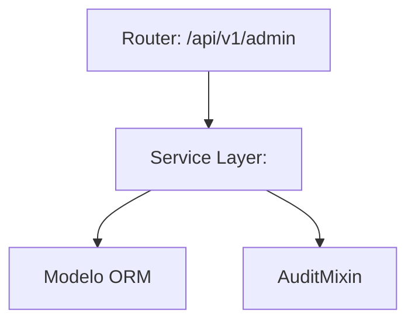
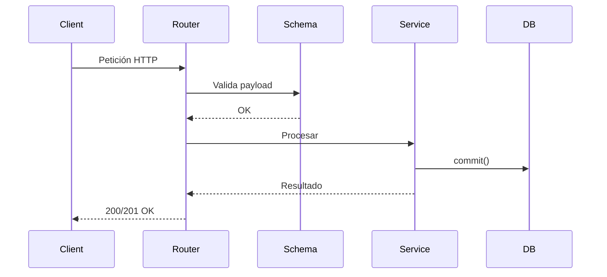
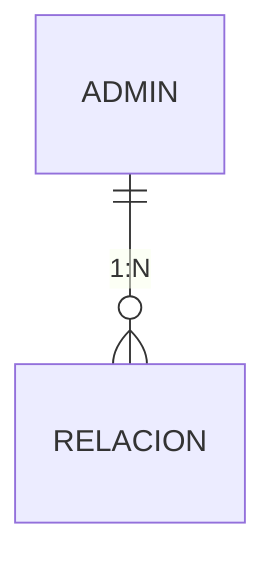

# Admin / Configuración Global

### Sección M0 — Decisiones Arquitectónicas Locales (ADR)

| ID | Decisión | Alternativas consideradas | Justificación | Consecuencias |
|---|---|---|---|---|
| ADR-M14-001 | Uso de FastAPI Routers dedicados | Un solo router monolítico | Mejor separación de responsabilidades y modularidad | Mayor cantidad de archivos, pero código más mantenible |

### Sección M1 — Arquitectura del Módulo (C4 Nivel 3 + Ciclo de Vida)

### Sección M2 — Diccionario de Datos

[PUNTO DE INSERCIÓN MULTIMEDIA]
Tipo: Diagrama Entidad-Relación
Descripción: Diagrama ER del módulo.
Figura 1. *Diagrama ER de Admin / Configuración Global.*

| Nombre del Campo | Tipo de Dato | Restricciones de Integridad |
|---|---|---|
| id | INTEGER | PK, index=True, autoincrement |

### Sección M3 — Contratos de APIs

| Método | URI | Request Payload | Response |
|---|---|---|---|
| GET | `/api/v1/admin` | - | `200 OK` |

### Sección M4 — Ingeniería Avanzada y Algoritmos Núcleo

Detalles de implementación específica para Admin / Configuración Global.

### Sección M5 — Frontend

- **Ruta:** `/admin`
- **Conexión con backend:** Hook hacia `/api/v1/admin`

### Sección M6 — Migraciones

- **Alembic:** Ver tabla de migraciones global.
