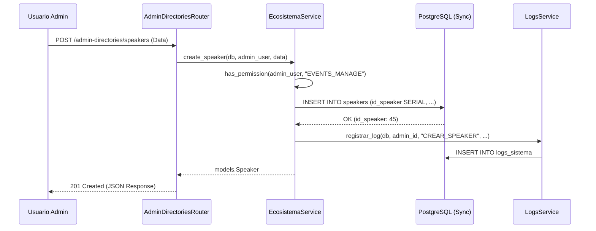
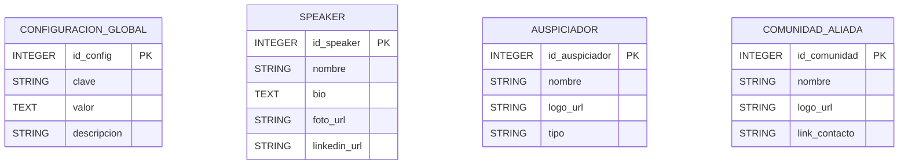
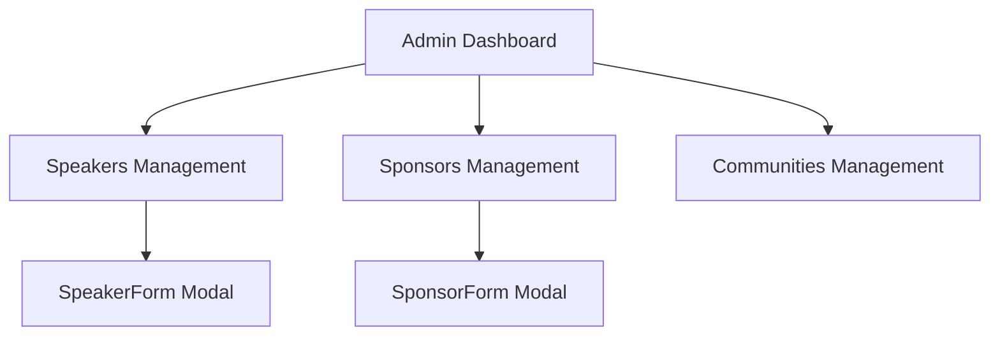

# 14 — Admin & Configuración Global

Este módulo centraliza la gestión del ecosistema de la plataforma (Speakers, Auspiciadores y Comunidades Aliadas) y los parámetros de configuración global que afectan el comportamiento del sistema. Es la herramienta principal para el personal administrativo para mantener actualizada la red de contactos y las constantes del negocio.

### M0 — ADR Local: Gestión de Ecosistema y Configuración

| ID | Decisión | Alternativas | Justificación | Consecuencias |
|:---|:---|:---|:---|:---|
| **ADR-M14-001** | Uso de IDs Enteros Autoincrementales | UUIDs | Consistencia con el resto del sistema y mayor eficiencia en indexación de directorios grandes. | Las URLs de administración usan IDs numéricos predecibles. |
| **ADR-M14-002** | Arquitectura Síncrona Estricta | Async/Await | La gestión de directorios no requiere alta concurrencia; el modelo síncrono simplifica la trazabilidad de logs de auditoría. | Bloqueo ligero del hilo de ejecución durante la escritura en DB. |
| **ADR-M14-003** | Auditoría Universal (AuditMixin) | Logs manuales | Se hereda `AuditMixin` para garantizar que cada cambio en el ecosistema sepa quién y cuándo lo realizó. | Tablas con columnas estandarizadas de creación y modificación. |

:::info Racionalización
La unificación de estos sub-módulos bajo un solo controlador de administración optimiza la reutilización de lógica de permisos (`PERMISSION_EVENTS_MANAGE`).
:::

### M1 — Arquitectura del Módulo

El módulo sigue un flujo de control síncrono donde cada acción administrativa es validada por el RBAC y posteriormente registrada en el sistema de logs.

#### Diagrama de Secuencia: Registro de Nuevo Speaker


#### Ciclo de Vida de la Petición
1. **Validación JWT:** El middleware de seguridad extrae el usuario y verifica su rol.
2. **Autorización:** El servicio comprueba si el usuario tiene el permiso específico para gestionar el ecosistema.
3. **Persistencia:** Se realiza el `commit()` síncrono en la base de datos.
4. **Auditoría:** Se dispara la creación de un log detallado (valor anterior vs valor nuevo).

### M2 — Diccionario de Datos

El diseño de datos evita UUIDs para mantener la simplicidad en las relaciones de las tablas del ecosistema.

#### Diagrama ER (Ecosistema)


#### Tablas de Base de Datos

| Tabla | Columna | Tipo de Dato | Restricción | Descripción |
|:---|:---|:---|:---|:---|
| `configuracion_global` | `id_config` | `INTEGER SERIAL` | PK | Identificador único de configuración. |
| `configuracion_global` | `clave` | `VARCHAR` | UNIQUE, NOT NULL | Nombre interno del parámetro (ej. 'MIN_PAGO_CERT'). |
| `speakers` | `id_speaker` | `INTEGER SERIAL` | PK | Identificador único del ponente. |
| `speakers` | `nombre` | `VARCHAR` | NOT NULL | Nombre completo del ponente. |
| `auspiciadores` | `id_auspiciador` | `INTEGER SERIAL` | PK | Identificador único de la empresa aliada. |
| `comunidades_aliadas` | `id_comunidad` | `INTEGER SERIAL` | PK | Identificador único de la comunidad aliada. |

### M3 — Contratos de APIs

| Método | URI Real | Payload (Pydantic) | Respuesta | Descripción |
|:---|:---|:---|:---|:---|
| `GET` | `/api/admin-directories/speakers` | N/A | `List[SpeakerResponse]` | Lista todos los ponentes registrados. |
| `POST` | `/api/admin-directories/speakers` | `SpeakerCreate` | `SpeakerResponse` | Registra un nuevo ponente en el sistema. |
| `PUT` | `/api/admin-directories/speakers/{id}` | `SpeakerUpdate` | `SpeakerResponse` | Actualiza datos de un ponente existente. |
| `DELETE` | `/api/admin-directories/speakers/{id}` | N/A | `204 No Content` | Elimina lógicamente a un ponente. |
| `GET` | `/api/admin-directories/auspiciadores` | N/A | `List[AuspiciadorResponse]` | Lista todas las empresas aliadas. |

### M4 — Ingeniería Avanzada

#### Integración con AuditMixin
Todas las tablas de este módulo heredan de `AuditMixin`, lo que permite que el sistema rellene automáticamente:
- `creado_por`: ID del administrador que registró la entidad.
- `fecha_creacion`: Marca de tiempo UTC del registro.
- `modificado_por`: ID del último editor.

#### Logs de Auditoría Detallados
A diferencia de otros módulos, el `ecosistema_service.py` implementa capturas de estado:
```python
old_data = {k: getattr(obj, k) for k in data.model_dump(exclude_unset=True).keys()}
# ... proceso de actualización ...
registrar_log(db, admin_id, "ACTUALIZAR", "tabla", id, valor_anterior=old_data, valor_nuevo=new_data)
```

### M5 — Frontend

El panel de administración utiliza una arquitectura de **Contenedores de Gestión** basada en Fluent UI v9.

- **Componente Principal:** `AdminDirectoryGrid.jsx`
- **Gestión de Estado:** `useState` y `useEffect` para fetch síncrono de los catálogos.
- **Formularios:** Uso de `Dialog` para creación/edición rápida sin cambiar de contexto.



### M6 — Migraciones Relacionadas

| Versión Alembic | Descripción | Impacto |
|:---|:---|:---|
| `176e2e42d2cb` | add_speaker_social_fields | Añade campos de redes sociales a la tabla de ponentes. |
| `46f3ac215fad` | add_contact_fields_to_ecosystem | Incorpora WhatsApp y correo de contacto a auspiciadores y comunidades. |
| `0676e55518a7` | initial_clean_baseline | Crea las tablas base de configuración y directorios. |
