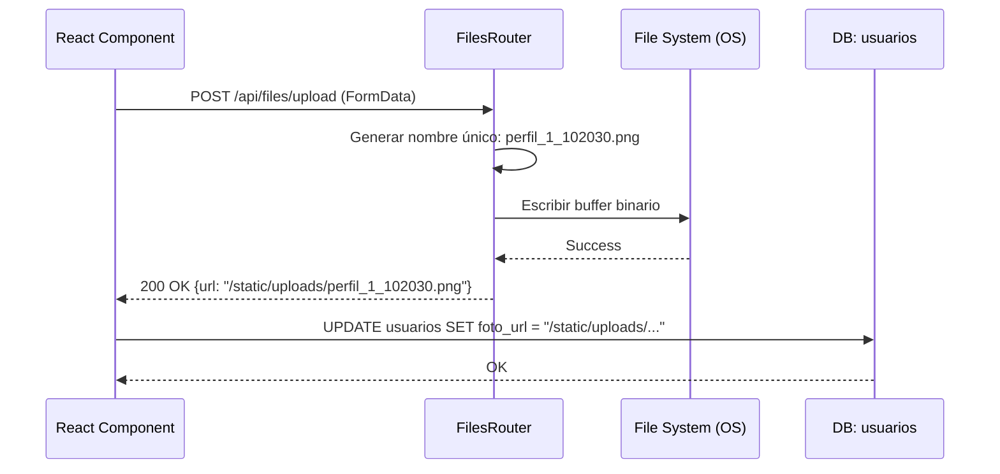

# 15 — Gestión de Archivos (Uploads)

La gestión de archivos en la Plataforma-MEH permite el almacenamiento y recuperación de activos multimedia como fotos de perfil, logotipos de auspiciadores, comprobantes de pago y certificados PDF. El sistema utiliza el sistema de archivos local del servidor para persistencia, exponiéndolos a través de una ruta estática configurada en el backend.

### M0 — ADR Local: Persistencia en Sistema de Archivos

| ID | Decisión | Alternativas | Justificación | Consecuencias |
|:---|:---|:---|:---|:---|
| **ADR-M15-001** | Almacenamiento Local (`/static/uploads`) | Amazon S3 / Cloudinary | Simplicidad en la infraestructura inicial y menor latencia de desarrollo. | Los archivos deben ser persistidos mediante volúmenes en despliegues con Docker. |
| **ADR-M15-002** | Generación de Nombres Únicos | Nombres originales | Evita colisiones de archivos entre diferentes usuarios que suben archivos con el mismo nombre (ej. `foto.jpg`). | Los archivos en disco tienen nombres predecibles basados en el ID del usuario y el timestamp. |
| **ADR-M15-003** | Escritura Síncrona en Disco | Operaciones Async | El volumen de subidas actual no justifica la complejidad de una cola de tareas; la escritura directa garantiza que el archivo existe antes de devolver la URL. | El hilo de ejecución se bloquea brevemente durante la transferencia de bytes. |

:::warning Seguridad
Aunque el sistema acepta archivos, se implementan validaciones de extensión para mitigar la ejecución de scripts maliciosos.
:::

### M1 — Arquitectura del Módulo

El flujo de archivos es unidireccional: el frontend envía el binario, el backend lo guarda y devuelve una cadena de texto (URL) que luego el frontend guarda en la base de datos dentro del modelo correspondiente.

#### Diagrama de Secuencia: Subida de Foto de Perfil


### M2 — Diccionario de Datos

Este módulo no posee una tabla propia de "metadatos de archivos" (Entity-less). Los archivos se representan como `Strings` en otras entidades.

#### Entidades que consumen este módulo

| Modelo Relacionado | Campo | Uso |
|:---|:---|:---|
| `Usuario` | `foto_url` | Imagen de perfil del miembro. |
| `Evento` | `imagen_url` | Banner promocional del evento. |
| `Speaker` | `foto_url` | Retrato del ponente. |
| `Auspiciador` | `logo_url` | Logo corporativo. |
| `Pago` | `comprobante_url` | Imagen del depósito o transferencia bancaria. |
| `Certificado` | `url_pdf` | Documento PDF generado para descarga. |

### M3 — Contratos de APIs

| Método | URI Real | Body (Form-Data) | Respuesta (JSON) | Descripción |
|:---|:---|:---|:---|:---|
| `POST` | `/api/files/upload` | `file: Binary` | `{"url": "...", "status": "success"}` | Sube un archivo y devuelve su URL pública accesible. |

### M4 — Ingeniería Avanzada

#### Lógica de Naming Sanity
Para evitar conflictos y rastrear el origen de los archivos, el backend utiliza un generador de nombres determinista:
```python
unique_name = f"perfil_{current_user.id_usuario}_{datetime.now().strftime('%H%M%S')}{ext}"
```
Esto garantiza que:
1. Ningún usuario sobrescriba los archivos de otro.
2. Se mantenga un historial temporal (vía timestamp).
3. La extensión original se preserve.

#### Exposición Estática
El servidor FastAPI está configurado para servir la carpeta `static` de forma transparente:
```python
app.mount("/static", StaticFiles(directory="static"), name="static")
```

### M5 — Frontend

El manejo de subidas en React se realiza mediante el hook `useFilePicker` o inputs de tipo `file` estándar, procesando la respuesta para actualizar el estado del formulario principal.

- **Componente:** `AvatarUpload.jsx` / `FileDropzone.jsx`
- **Lógica de Envío:**
```javascript
const formData = new FormData();
formData.append('file', file);
const res = await axios.post('/api/files/upload', formData);
setFormValue('foto_url', res.data.url);
```

### M6 — Migraciones Relacionadas

No existen migraciones exclusivas para este módulo, pero las siguientes migraciones añadieron la capacidad de soportar archivos en otras tablas:

| Versión Alembic | Descripción | Impacto |
|:---|:---|:---|
| `8b9b66e59fb9` | add_portada_to_recurso | Añade el campo `portada_url` a la tabla de recursos. |
| `5d648885e1d4` | create_academia_lms_tables | Crea tablas con campos de video y archivos adjuntos para lecciones. |
| `0676e55518a7` | initial_clean_baseline | Establece los campos `foto_url` y `logo_url` base. |
