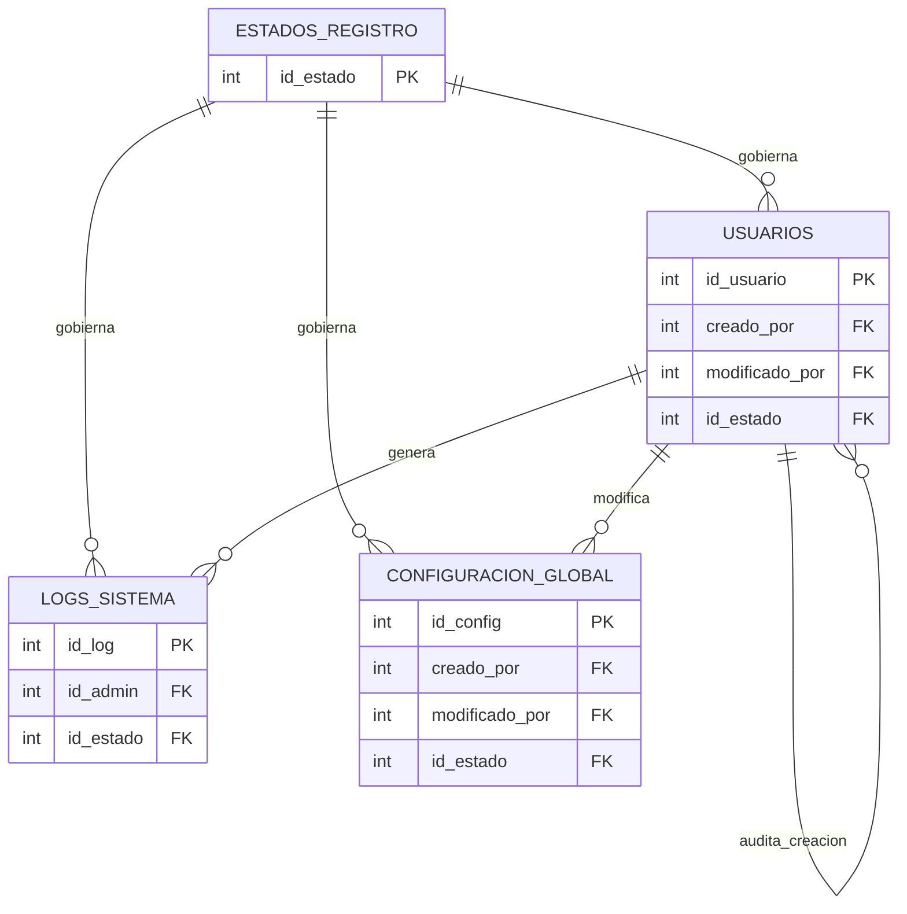
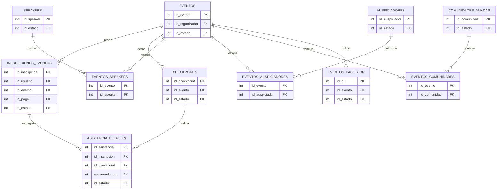
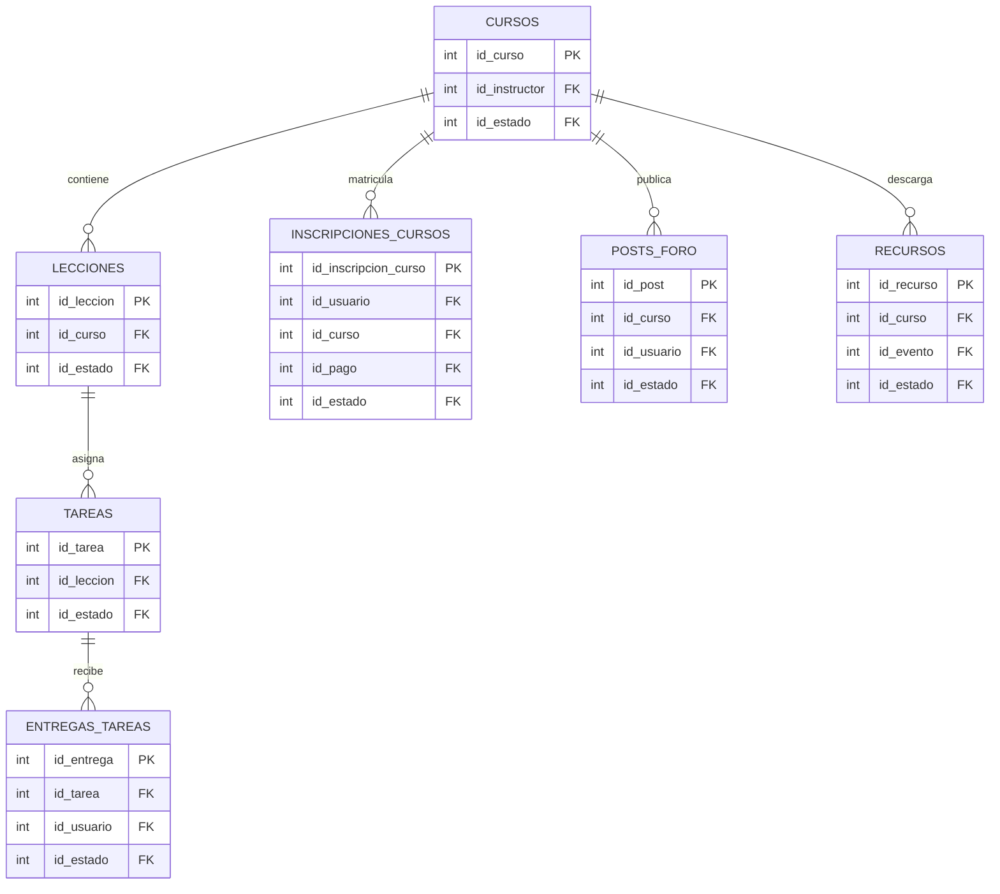
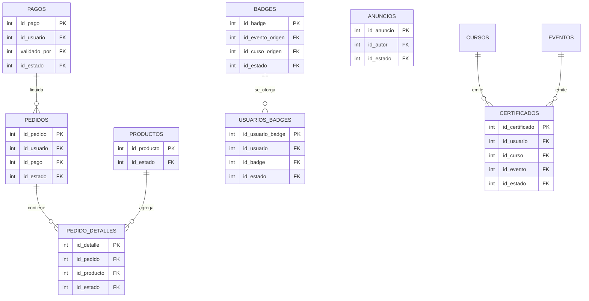

# Base de Datos Relacional y Protocolos de Seguridad (PostgreSQL & SQLAlchemy)

:::info METADATOS DEL DOCUMENTO
* **Propietario del Documento:** Nataly Gemio Morales (MSA Ambassador / Carrera de Informática UMSA)
* **Versión:** 1.2.0
* **Última Actualización:** 2026-05-25
* **Audiencia Destinataria:** Desarrolladores Backend/Frontend, Administradores de Sistemas, Evaluadores Académicos de la UMSA.
:::

## 🎯 Propósito y Ámbito

Este documento tiene como propósito describir la estructura física e integridad referencial de la base de datos relacional PostgreSQL de la **Plataforma MEH**, así como los protocolos de seguridad de profundidad (*Defense in Depth*) implementados. Detalla las relaciones entre entidades, la definición de campos en el Diccionario de Datos, la auditoría automática con `AuditMixin`, y el control jerárquico de excepciones.

---

## 1. Diagrama Entidad-Relación Lógico (Mermaid ERD)

El modelo relacional completo de la base de datos se presenta a continuación segmentado en cuatro módulos funcionales. Para garantizar la legibilidad y claridad visual, los diagramas omiten atributos descriptivos (los cuales están detallados en el Diccionario de Datos) y se centran únicamente en las claves primarias (`PK`), claves foráneas (`FK`) y las relaciones físicas de integridad:

### A. Módulo 1: Usuarios, Auditoría y Configuración
Este módulo gobierna el registro, perfiles, control de estados del ciclo de vida de los datos, auditoría de logs y variables globales de configuración del Hub.

### B. Módulo 2: Gestión de Eventos y Control de Acceso (Asistencia)
Controla la publicación de congresos o talleres, el registro de ponentes (speakers), auspiciadores, comunidades aliadas, venta de entradas con códigos QR, checkpoints logísticos y escaneos de asistencia offline-first.

### C. Módulo 3: Academia Virtual y Progreso Académico
Gestiona la estructura de cursos interactivos, lecciones multimedia, asignación de tareas, entregas de los estudiantes, posts del foro de discusión de clases y recursos o descargas adicionales.

### D. Módulo 4: Tienda, Pagos, Certificados y Badges
Cubre el control de inventario de souvenirs (productos), carritos/pedidos de compra, pasarela OCR de pagos, emisión automática de certificados de participación y asignación de insignias (badges) por gamificación.

## 2. Diccionario de Datos Relacional Completo

### estados_registro

| Nombre del Campo | Tipo de Dato | Clave | Restricciones / Nulidad / Defecto |
|---|---|---|---|
| `id_estado` | `INTEGER` | **PK** | NOT NULL |
| `nombre_estado` | `VARCHAR(50)` |  | NOT NULL, UNIQUE |
| `descripcion` | `TEXT` |  | NULL |

### eventos_speakers

| Nombre del Campo | Tipo de Dato | Clave | Restricciones / Nulidad / Defecto |
|---|---|---|---|
| `id_evento` | `INTEGER` | **FK** (eventos.id_evento) | NULL |
| `id_speaker` | `INTEGER` | **FK** (speakers.id_speaker) | NULL |

### eventos_auspiciadores

| Nombre del Campo | Tipo de Dato | Clave | Restricciones / Nulidad / Defecto |
|---|---|---|---|
| `id_evento` | `INTEGER` | **FK** (eventos.id_evento) | NULL |
| `id_auspiciador` | `INTEGER` | **FK** (auspiciadores.id_auspiciador) | NULL |

### eventos_comunidades

| Nombre del Campo | Tipo de Dato | Clave | Restricciones / Nulidad / Defecto |
|---|---|---|---|
| `id_evento` | `INTEGER` | **FK** (eventos.id_evento) | NULL |
| `id_comunidad` | `INTEGER` | **FK** (comunidades_aliadas.id_comunidad) | NULL |

### usuarios

| Nombre del Campo | Tipo de Dato | Clave | Restricciones / Nulidad / Defecto |
|---|---|---|---|
| `id_usuario` | `INTEGER` | **PK** | NOT NULL |
| `nombres` | `VARCHAR` |  | NULL |
| `apellidos` | `VARCHAR` |  | NULL |
| `alias` | `VARCHAR` |  | NULL |
| `foto_url` | `VARCHAR` |  | NULL |
| `preferencia_tema` | `VARCHAR` |  | NULL, DEFAULT: dark |
| `correo` | `VARCHAR` |  | NULL, UNIQUE |
| `password_hash` | `TEXT` |  | NULL |
| `rol` | `VARCHAR` |  | NULL, DEFAULT: MIEMBRO |
| `fecha_registro` | `DATETIME` |  | NULL, DEFAULT: utcnow |
| `bio` | `TEXT` |  | NULL |
| `institucion` | `VARCHAR` |  | NULL |
| `estudia_en` | `VARCHAR` |  | NULL |
| `tipo_entidad` | `VARCHAR` |  | NULL, DEFAULT: Estudiante |
| `pais` | `VARCHAR` |  | NULL, DEFAULT: Bolivia |
| `departamento` | `VARCHAR` |  | NULL |
| `linkedin_url` | `VARCHAR` |  | NULL |
| `github_url` | `VARCHAR` |  | NULL |
| `facebook_url` | `VARCHAR` |  | NULL |
| `instagram_url` | `VARCHAR` |  | NULL |
| `tiktok_url` | `VARCHAR` |  | NULL |
| `learning_path_url` | `VARCHAR` |  | NULL |
| `perfil_publico` | `BOOLEAN` |  | NULL, DEFAULT: True |
| `activo` | `BOOLEAN` |  | NULL, DEFAULT: True |
| `es_nuevo` | `BOOLEAN` |  | NULL, DEFAULT: True |
| `reset_token` | `VARCHAR` |  | NULL |
| `reset_token_exp` | `DATETIME` |  | NULL |
| `creado_por` | `INTEGER` | **FK** (usuarios.id_usuario) | NULL |
| `fecha_creacion` | `DATETIME` |  | NULL, DEFAULT: utcnow |
| `modificado_por` | `INTEGER` | **FK** (usuarios.id_usuario) | NULL |
| `fecha_modificacion` | `DATETIME` |  | NULL |
| `id_estado` | `INTEGER` | **FK** (estados_registro.id_estado) | NOT NULL, DEFAULT: 2 |
| `fecha_modificacion_estado` | `DATETIME` |  | NULL |

### speakers

| Nombre del Campo | Tipo de Dato | Clave | Restricciones / Nulidad / Defecto |
|---|---|---|---|
| `id_speaker` | `INTEGER` | **PK** | NOT NULL |
| `nombre` | `VARCHAR` |  | NULL |
| `bio` | `TEXT` |  | NULL |
| `trayectoria` | `TEXT` |  | NULL |
| `foto_url` | `VARCHAR` |  | NULL |
| `trabajo_actual` | `VARCHAR` |  | NULL |
| `linkedin_url` | `VARCHAR` |  | NULL |
| `twitter_url` | `VARCHAR` |  | NULL |
| `facebook_url` | `VARCHAR` |  | NULL |
| `instagram_url` | `VARCHAR` |  | NULL |
| `correo_contacto` | `VARCHAR` |  | NULL |
| `whatsapp_contacto` | `VARCHAR` |  | NULL |
| `creado_por` | `INTEGER` | **FK** (usuarios.id_usuario) | NULL |
| `fecha_creacion` | `DATETIME` |  | NULL, DEFAULT: utcnow |
| `modificado_por` | `INTEGER` | **FK** (usuarios.id_usuario) | NULL |
| `fecha_modificacion` | `DATETIME` |  | NULL |
| `id_estado` | `INTEGER` | **FK** (estados_registro.id_estado) | NOT NULL, DEFAULT: 2 |
| `fecha_modificacion_estado` | `DATETIME` |  | NULL |

### auspiciadores

| Nombre del Campo | Tipo de Dato | Clave | Restricciones / Nulidad / Defecto |
|---|---|---|---|
| `id_auspiciador` | `INTEGER` | **PK** | NOT NULL |
| `nombre` | `VARCHAR` |  | NULL |
| `logo_url` | `VARCHAR` |  | NULL |
| `sitio_web` | `VARCHAR` |  | NULL |
| `tipo` | `VARCHAR` |  | NULL, DEFAULT: GENERAL |
| `correo_contacto` | `VARCHAR` |  | NULL |
| `whatsapp_contacto` | `VARCHAR` |  | NULL |
| `creado_por` | `INTEGER` | **FK** (usuarios.id_usuario) | NULL |
| `fecha_creacion` | `DATETIME` |  | NULL, DEFAULT: utcnow |
| `modificado_por` | `INTEGER` | **FK** (usuarios.id_usuario) | NULL |
| `fecha_modificacion` | `DATETIME` |  | NULL |
| `id_estado` | `INTEGER` | **FK** (estados_registro.id_estado) | NOT NULL, DEFAULT: 2 |
| `fecha_modificacion_estado` | `DATETIME` |  | NULL |

### comunidades_aliadas

| Nombre del Campo | Tipo de Dato | Clave | Restricciones / Nulidad / Defecto |
|---|---|---|---|
| `id_comunidad` | `INTEGER` | **PK** | NOT NULL |
| `nombre` | `VARCHAR` |  | NULL |
| `descripcion` | `TEXT` |  | NULL |
| `logo_url` | `VARCHAR` |  | NULL |
| `link_contacto` | `VARCHAR` |  | NULL |
| `correo_contacto` | `VARCHAR` |  | NULL |
| `whatsapp_contacto` | `VARCHAR` |  | NULL |
| `creado_por` | `INTEGER` | **FK** (usuarios.id_usuario) | NULL |
| `fecha_creacion` | `DATETIME` |  | NULL, DEFAULT: utcnow |
| `modificado_por` | `INTEGER` | **FK** (usuarios.id_usuario) | NULL |
| `fecha_modificacion` | `DATETIME` |  | NULL |
| `id_estado` | `INTEGER` | **FK** (estados_registro.id_estado) | NOT NULL, DEFAULT: 2 |
| `fecha_modificacion_estado` | `DATETIME` |  | NULL |

### eventos_pagos_qr

| Nombre del Campo | Tipo de Dato | Clave | Restricciones / Nulidad / Defecto |
|---|---|---|---|
| `id_qr` | `INTEGER` | **PK** | NOT NULL |
| `id_evento` | `INTEGER` | **FK** (eventos.id_evento) | NOT NULL, ON DELETE: CASCADE |
| `nombre_paquete` | `VARCHAR(100)` |  | NOT NULL |
| `monto` | `NUMERIC(10, 2)` |  | NOT NULL |
| `url_qr` | `VARCHAR(255)` |  | NOT NULL |
| `creado_por` | `INTEGER` | **FK** (usuarios.id_usuario) | NULL |
| `fecha_creacion` | `DATETIME` |  | NULL, DEFAULT: utcnow |
| `modificado_por` | `INTEGER` | **FK** (usuarios.id_usuario) | NULL |
| `fecha_modificacion` | `DATETIME` |  | NULL |
| `id_estado` | `INTEGER` | **FK** (estados_registro.id_estado) | NOT NULL, DEFAULT: 2 |
| `fecha_modificacion_estado` | `DATETIME` |  | NULL |

### configuracion_global

| Nombre del Campo | Tipo de Dato | Clave | Restricciones / Nulidad / Defecto |
|---|---|---|---|
| `id_config` | `INTEGER` | **PK** | NOT NULL |
| `clave` | `VARCHAR` |  | NULL, UNIQUE |
| `valor` | `TEXT` |  | NULL |
| `descripcion` | `VARCHAR` |  | NULL |
| `creado_por` | `INTEGER` | **FK** (usuarios.id_usuario) | NULL |
| `fecha_creacion` | `DATETIME` |  | NULL, DEFAULT: utcnow |
| `modificado_por` | `INTEGER` | **FK** (usuarios.id_usuario) | NULL |
| `fecha_modificacion` | `DATETIME` |  | NULL |
| `id_estado` | `INTEGER` | **FK** (estados_registro.id_estado) | NOT NULL, DEFAULT: 2 |
| `fecha_modificacion_estado` | `DATETIME` |  | NULL |

### badges

| Nombre del Campo | Tipo de Dato | Clave | Restricciones / Nulidad / Defecto |
|---|---|---|---|
| `id_badge` | `INTEGER` | **PK** | NOT NULL |
| `nombre_badge` | `VARCHAR` |  | NULL |
| `descripcion` | `TEXT` |  | NULL |
| `imagen_url` | `TEXT` |  | NULL |
| `id_evento_origen` | `INTEGER` | **FK** (eventos.id_evento) | NULL |
| `id_curso_origen` | `INTEGER` | **FK** (cursos.id_curso) | NULL |
| `puntos` | `INTEGER` |  | NULL, DEFAULT: 10 |
| `requisito_nivel` | `VARCHAR` |  | NULL, DEFAULT: Beginner |
| `creado_por` | `INTEGER` | **FK** (usuarios.id_usuario) | NULL |
| `fecha_creacion` | `DATETIME` |  | NULL, DEFAULT: utcnow |
| `modificado_por` | `INTEGER` | **FK** (usuarios.id_usuario) | NULL |
| `fecha_modificacion` | `DATETIME` |  | NULL |
| `id_estado` | `INTEGER` | **FK** (estados_registro.id_estado) | NOT NULL, DEFAULT: 2 |
| `fecha_modificacion_estado` | `DATETIME` |  | NULL |

### usuarios_badges

| Nombre del Campo | Tipo de Dato | Clave | Restricciones / Nulidad / Defecto |
|---|---|---|---|
| `id_usuario_badge` | `INTEGER` | **PK** | NOT NULL |
| `id_usuario` | `INTEGER` | **FK** (usuarios.id_usuario) | NULL |
| `id_badge` | `INTEGER` | **FK** (badges.id_badge) | NULL |
| `fecha_obtencion` | `DATETIME` |  | NULL, DEFAULT: utcnow |
| `creado_por` | `INTEGER` | **FK** (usuarios.id_usuario) | NULL |
| `fecha_creacion` | `DATETIME` |  | NULL, DEFAULT: utcnow |
| `modificado_por` | `INTEGER` | **FK** (usuarios.id_usuario) | NULL |
| `fecha_modificacion` | `DATETIME` |  | NULL |
| `id_estado` | `INTEGER` | **FK** (estados_registro.id_estado) | NOT NULL, DEFAULT: 2 |
| `fecha_modificacion_estado` | `DATETIME` |  | NULL |

### productos

| Nombre del Campo | Tipo de Dato | Clave | Restricciones / Nulidad / Defecto |
|---|---|---|---|
| `id_producto` | `INTEGER` | **PK** | NOT NULL |
| `nombre` | `VARCHAR(100)` |  | NULL |
| `descripcion` | `TEXT` |  | NULL |
| `precio` | `NUMERIC(10, 2)` |  | NULL, DEFAULT: 0 |
| `stock` | `INTEGER` |  | NULL, DEFAULT: 0 |
| `es_kit_evento` | `BOOLEAN` |  | NULL, DEFAULT: False |
| `imagen_url` | `TEXT` |  | NULL |
| `categoria` | `VARCHAR` |  | NULL, DEFAULT: SOUVENIR |
| `activo` | `BOOLEAN` |  | NULL, DEFAULT: True |
| `creado_por` | `INTEGER` | **FK** (usuarios.id_usuario) | NULL |
| `fecha_creacion` | `DATETIME` |  | NULL, DEFAULT: utcnow |
| `modificado_por` | `INTEGER` | **FK** (usuarios.id_usuario) | NULL |
| `fecha_modificacion` | `DATETIME` |  | NULL |
| `id_estado` | `INTEGER` | **FK** (estados_registro.id_estado) | NOT NULL, DEFAULT: 2 |
| `fecha_modificacion_estado` | `DATETIME` |  | NULL |

### pedidos

| Nombre del Campo | Tipo de Dato | Clave | Restricciones / Nulidad / Defecto |
|---|---|---|---|
| `id_pedido` | `INTEGER` | **PK** | NOT NULL |
| `id_usuario` | `INTEGER` | **FK** (usuarios.id_usuario) | NULL |
| `id_pago` | `INTEGER` | **FK** (pagos.id_pago) | NULL |
| `estado` | `VARCHAR` |  | NULL, DEFAULT: PENDIENTE |
| `fecha_pedido` | `DATETIME` |  | NULL, DEFAULT: utcnow |
| `total` | `NUMERIC(10, 2)` |  | NULL, DEFAULT: 0 |
| `creado_por` | `INTEGER` | **FK** (usuarios.id_usuario) | NULL |
| `fecha_creacion` | `DATETIME` |  | NULL, DEFAULT: utcnow |
| `modificado_por` | `INTEGER` | **FK** (usuarios.id_usuario) | NULL |
| `fecha_modificacion` | `DATETIME` |  | NULL |
| `id_estado` | `INTEGER` | **FK** (estados_registro.id_estado) | NOT NULL, DEFAULT: 2 |
| `fecha_modificacion_estado` | `DATETIME` |  | NULL |

### pedido_detalles

| Nombre del Campo | Tipo de Dato | Clave | Restricciones / Nulidad / Defecto |
|---|---|---|---|
| `id_detalle` | `INTEGER` | **PK** | NOT NULL |
| `id_pedido` | `INTEGER` | **FK** (pedidos.id_pedido) | NULL |
| `id_producto` | `INTEGER` | **FK** (productos.id_producto) | NULL |
| `cantidad` | `INTEGER` |  | NULL, DEFAULT: 1 |
| `precio_unitario` | `NUMERIC(10, 2)` |  | NULL |
| `id_estado` | `INTEGER` | **FK** (estados_registro.id_estado) | NOT NULL, DEFAULT: 2 |
| `fecha_modificacion_estado` | `DATETIME` |  | NULL |

### eventos

| Nombre del Campo | Tipo de Dato | Clave | Restricciones / Nulidad / Defecto |
|---|---|---|---|
| `id_evento` | `INTEGER` | **PK** | NOT NULL |
| `titulo` | `VARCHAR` |  | NULL |
| `descripcion` | `TEXT` |  | NULL |
| `tipo_evento` | `VARCHAR` |  | NULL, DEFAULT: CONFERENCIA |
| `fecha_inicio` | `DATETIME` |  | NULL |
| `fecha_fin` | `DATETIME` |  | NULL |
| `hora_inicio` | `VARCHAR` |  | NULL |
| `hora_fin` | `VARCHAR` |  | NULL |
| `modalidad` | `VARCHAR` |  | NULL |
| `ubicacion` | `VARCHAR` |  | NULL |
| `link_mapas` | `VARCHAR` |  | NULL |
| `agenda` | `TEXT` |  | NULL |
| `capacidad_max` | `INTEGER` |  | NULL |
| `estado` | `VARCHAR` |  | NULL, DEFAULT: PROGRAMADO |
| `imagen_url` | `VARCHAR` |  | NULL |
| `refrigerio_incluido` | `BOOLEAN` |  | NULL, DEFAULT: False |
| `token_qr` | `VARCHAR` |  | NULL |
| `id_organizador` | `INTEGER` | **FK** (usuarios.id_usuario) | NULL |
| `creado_por` | `INTEGER` | **FK** (usuarios.id_usuario) | NULL |
| `fecha_creacion` | `DATETIME` |  | NULL, DEFAULT: utcnow |
| `modificado_por` | `INTEGER` | **FK** (usuarios.id_usuario) | NULL |
| `fecha_modificacion` | `DATETIME` |  | NULL |
| `id_estado` | `INTEGER` | **FK** (estados_registro.id_estado) | NOT NULL, DEFAULT: 2 |
| `fecha_modificacion_estado` | `DATETIME` |  | NULL |

### inscripciones_eventos

| Nombre del Campo | Tipo de Dato | Clave | Restricciones / Nulidad / Defecto |
|---|---|---|---|
| `id_inscripcion` | `INTEGER` | **PK** | NOT NULL |
| `id_usuario` | `INTEGER` | **FK** (usuarios.id_usuario) | NULL |
| `id_evento` | `INTEGER` | **FK** (eventos.id_evento) | NULL |
| `fecha_inscripcion` | `DATETIME` |  | NULL, DEFAULT: utcnow |
| `estado_inscripcion` | `VARCHAR` |  | NULL, DEFAULT: PENDIENTE |
| `codigo_qr` | `VARCHAR` |  | NULL, UNIQUE |
| `asistio` | `BOOLEAN` |  | NULL, DEFAULT: False |
| `fecha_validacion` | `DATETIME` |  | NULL |
| `id_pago` | `INTEGER` | **FK** (pagos.id_pago) | NULL |
| `creado_por` | `INTEGER` | **FK** (usuarios.id_usuario) | NULL |
| `fecha_creacion` | `DATETIME` |  | NULL, DEFAULT: utcnow |
| `modificado_por` | `INTEGER` | **FK** (usuarios.id_usuario) | NULL |
| `fecha_modificacion` | `DATETIME` |  | NULL |
| `id_estado` | `INTEGER` | **FK** (estados_registro.id_estado) | NOT NULL, DEFAULT: 2 |
| `fecha_modificacion_estado` | `DATETIME` |  | NULL |

### checkpoints

| Nombre del Campo | Tipo de Dato | Clave | Restricciones / Nulidad / Defecto |
|---|---|---|---|
| `id_checkpoint` | `INTEGER` | **PK** | NOT NULL |
| `id_evento` | `INTEGER` | **FK** (eventos.id_evento) | NULL |
| `nombre_checkpoint` | `VARCHAR` |  | NULL |
| `hora_apertura` | `DATETIME` |  | NULL |
| `hora_cierre` | `DATETIME` |  | NULL |
| `tipo_checkpoint` | `VARCHAR` |  | NULL |
| `orden` | `INTEGER` |  | NULL |
| `activo` | `BOOLEAN` |  | NULL, DEFAULT: True |
| `creado_por` | `INTEGER` | **FK** (usuarios.id_usuario) | NULL |
| `fecha_creacion` | `DATETIME` |  | NULL, DEFAULT: utcnow |
| `modificado_por` | `INTEGER` | **FK** (usuarios.id_usuario) | NULL |
| `fecha_modificacion` | `DATETIME` |  | NULL |
| `id_estado` | `INTEGER` | **FK** (estados_registro.id_estado) | NOT NULL, DEFAULT: 2 |
| `fecha_modificacion_estado` | `DATETIME` |  | NULL |

### asistencia_detalles

| Nombre del Campo | Tipo de Dato | Clave | Restricciones / Nulidad / Defecto |
|---|---|---|---|
| `id_asistencia` | `INTEGER` | **PK** | NOT NULL |
| `id_inscripcion` | `INTEGER` | **FK** (inscripciones_eventos.id_inscripcion) | NULL |
| `id_checkpoint` | `INTEGER` | **FK** (checkpoints.id_checkpoint) | NULL |
| `fecha_escaneo` | `DATETIME` |  | NULL, DEFAULT: utcnow |
| `escaneado_por` | `INTEGER` | **FK** (usuarios.id_usuario) | NULL |
| `creado_por` | `INTEGER` | **FK** (usuarios.id_usuario) | NULL |
| `fecha_creacion` | `DATETIME` |  | NULL, DEFAULT: utcnow |
| `modificado_por` | `INTEGER` | **FK** (usuarios.id_usuario) | NULL |
| `fecha_modificacion` | `DATETIME` |  | NULL |
| `id_estado` | `INTEGER` | **FK** (estados_registro.id_estado) | NOT NULL, DEFAULT: 2 |
| `fecha_modificacion_estado` | `DATETIME` |  | NULL |

### cursos

| Nombre del Campo | Tipo de Dato | Clave | Restricciones / Nulidad / Defecto |
|---|---|---|---|
| `id_curso` | `INTEGER` | **PK** | NOT NULL |
| `nombre_curso` | `VARCHAR` |  | NULL |
| `descripcion` | `TEXT` |  | NULL |
| `horas_academicas` | `INTEGER` |  | NULL |
| `estado` | `VARCHAR` |  | NULL, DEFAULT: ACTIVO |
| `imagen_url` | `VARCHAR` |  | NULL |
| `id_instructor` | `INTEGER` | **FK** (usuarios.id_usuario) | NULL |
| `es_ms_learning` | `BOOLEAN` |  | NULL, DEFAULT: False |
| `external_url` | `VARCHAR` |  | NULL |
| `uid_ms` | `VARCHAR` |  | NULL |
| `creado_por` | `INTEGER` | **FK** (usuarios.id_usuario) | NULL |
| `fecha_creacion` | `DATETIME` |  | NULL, DEFAULT: utcnow |
| `modificado_por` | `INTEGER` | **FK** (usuarios.id_usuario) | NULL |
| `fecha_modificacion` | `DATETIME` |  | NULL |
| `id_estado` | `INTEGER` | **FK** (estados_registro.id_estado) | NOT NULL, DEFAULT: 2 |
| `fecha_modificacion_estado` | `DATETIME` |  | NULL |

### lecciones

| Nombre del Campo | Tipo de Dato | Clave | Restricciones / Nulidad / Defecto |
|---|---|---|---|
| `id_leccion` | `INTEGER` | **PK** | NOT NULL |
| `id_curso` | `INTEGER` | **FK** (cursos.id_curso) | NULL |
| `titulo` | `VARCHAR` |  | NULL |
| `contenido_video_url` | `VARCHAR` |  | NULL |
| `contenido_texto` | `TEXT` |  | NULL |
| `orden` | `INTEGER` |  | NULL, DEFAULT: 1 |
| `creado_por` | `INTEGER` | **FK** (usuarios.id_usuario) | NULL |
| `fecha_creacion` | `DATETIME` |  | NULL, DEFAULT: utcnow |
| `modificado_por` | `INTEGER` | **FK** (usuarios.id_usuario) | NULL |
| `fecha_modificacion` | `DATETIME` |  | NULL |
| `id_estado` | `INTEGER` | **FK** (estados_registro.id_estado) | NOT NULL, DEFAULT: 2 |
| `fecha_modificacion_estado` | `DATETIME` |  | NULL |

### tareas

| Nombre del Campo | Tipo de Dato | Clave | Restricciones / Nulidad / Defecto |
|---|---|---|---|
| `id_tarea` | `INTEGER` | **PK** | NOT NULL |
| `id_leccion` | `INTEGER` | **FK** (lecciones.id_leccion) | NULL |
| `titulo` | `VARCHAR` |  | NULL |
| `instrucciones` | `TEXT` |  | NULL |
| `puntos_max` | `INTEGER` |  | NULL, DEFAULT: 100 |
| `fecha_entrega_limite` | `DATETIME` |  | NULL |
| `archivo_adjunto_url` | `VARCHAR` |  | NULL |
| `creado_por` | `INTEGER` | **FK** (usuarios.id_usuario) | NULL |
| `fecha_creacion` | `DATETIME` |  | NULL, DEFAULT: utcnow |
| `modificado_por` | `INTEGER` | **FK** (usuarios.id_usuario) | NULL |
| `fecha_modificacion` | `DATETIME` |  | NULL |
| `id_estado` | `INTEGER` | **FK** (estados_registro.id_estado) | NOT NULL, DEFAULT: 2 |
| `fecha_modificacion_estado` | `DATETIME` |  | NULL |

### entregas_tareas

| Nombre del Campo | Tipo de Dato | Clave | Restricciones / Nulidad / Defecto |
|---|---|---|---|
| `id_entrega` | `INTEGER` | **PK** | NOT NULL |
| `id_tarea` | `INTEGER` | **FK** (tareas.id_tarea) | NULL |
| `id_usuario` | `INTEGER` | **FK** (usuarios.id_usuario) | NULL |
| `archivo_url` | `VARCHAR` |  | NULL |
| `comentario_alumno` | `TEXT` |  | NULL |
| `nota` | `INTEGER` |  | NULL |
| `comentario_docente` | `TEXT` |  | NULL |
| `fecha_envio` | `DATETIME` |  | NULL, DEFAULT: utcnow |
| `creado_por` | `INTEGER` | **FK** (usuarios.id_usuario) | NULL |
| `fecha_creacion` | `DATETIME` |  | NULL, DEFAULT: utcnow |
| `modificado_por` | `INTEGER` | **FK** (usuarios.id_usuario) | NULL |
| `fecha_modificacion` | `DATETIME` |  | NULL |
| `id_estado` | `INTEGER` | **FK** (estados_registro.id_estado) | NOT NULL, DEFAULT: 2 |
| `fecha_modificacion_estado` | `DATETIME` |  | NULL |

### posts_foro

| Nombre del Campo | Tipo de Dato | Clave | Restricciones / Nulidad / Defecto |
|---|---|---|---|
| `id_post` | `INTEGER` | **PK** | NOT NULL |
| `id_curso` | `INTEGER` | **FK** (cursos.id_curso) | NULL |
| `id_usuario` | `INTEGER` | **FK** (usuarios.id_usuario) | NULL |
| `mensaje` | `TEXT` |  | NULL |
| `es_pregunta_docente` | `BOOLEAN` |  | NULL, DEFAULT: False |
| `creado_por` | `INTEGER` | **FK** (usuarios.id_usuario) | NULL |
| `fecha_creacion` | `DATETIME` |  | NULL, DEFAULT: utcnow |
| `modificado_por` | `INTEGER` | **FK** (usuarios.id_usuario) | NULL |
| `fecha_modificacion` | `DATETIME` |  | NULL |
| `id_estado` | `INTEGER` | **FK** (estados_registro.id_estado) | NOT NULL, DEFAULT: 2 |
| `fecha_modificacion_estado` | `DATETIME` |  | NULL |

### inscripciones_cursos

| Nombre del Campo | Tipo de Dato | Clave | Restricciones / Nulidad / Defecto |
|---|---|---|---|
| `id_inscripcion_curso` | `INTEGER` | **PK** | NOT NULL |
| `id_usuario` | `INTEGER` | **FK** (usuarios.id_usuario) | NULL |
| `id_curso` | `INTEGER` | **FK** (cursos.id_curso) | NULL |
| `fecha_inscripcion` | `DATETIME` |  | NULL, DEFAULT: utcnow |
| `progreso` | `INTEGER` |  | NULL, DEFAULT: 0 |
| `nota_final` | `NUMERIC(5, 2)` |  | NULL |
| `finalizado` | `BOOLEAN` |  | NULL, DEFAULT: False |
| `id_pago` | `INTEGER` | **FK** (pagos.id_pago) | NULL |
| `estado_inscripcion` | `VARCHAR` |  | NULL, DEFAULT: PENDIENTE |
| `creado_por` | `INTEGER` | **FK** (usuarios.id_usuario) | NULL |
| `fecha_creacion` | `DATETIME` |  | NULL, DEFAULT: utcnow |
| `modificado_por` | `INTEGER` | **FK** (usuarios.id_usuario) | NULL |
| `fecha_modificacion` | `DATETIME` |  | NULL |
| `id_estado` | `INTEGER` | **FK** (estados_registro.id_estado) | NOT NULL, DEFAULT: 2 |
| `fecha_modificacion_estado` | `DATETIME` |  | NULL |

### pagos

| Nombre del Campo | Tipo de Dato | Clave | Restricciones / Nulidad / Defecto |
|---|---|---|---|
| `id_pago` | `INTEGER` | **PK** | NOT NULL |
| `id_usuario` | `INTEGER` | **FK** (usuarios.id_usuario) | NULL |
| `monto` | `NUMERIC(10, 2)` |  | NULL |
| `fecha_pago` | `DATETIME` |  | NULL, DEFAULT: utcnow |
| `metodo_pago` | `VARCHAR` |  | NULL |
| `estado_pago` | `VARCHAR` |  | NULL, DEFAULT: PENDIENTE |
| `comprobante_url` | `TEXT` |  | NULL |
| `id_referencia` | `INTEGER` |  | NULL |
| `tipo_referencia` | `VARCHAR` |  | NULL |
| `validado_por` | `INTEGER` | **FK** (usuarios.id_usuario) | NULL |
| `url_comprobante` | `VARCHAR` |  | NULL |
| `fecha_validacion` | `DATETIME` |  | NULL |
| `notas_admin` | `TEXT` |  | NULL |
| `porcentaje_ocr` | `NUMERIC(5, 2)` |  | NULL |
| `texto_ocr` | `TEXT` |  | NULL |
| `creado_por` | `INTEGER` | **FK** (usuarios.id_usuario) | NULL |
| `fecha_creacion` | `DATETIME` |  | NULL, DEFAULT: utcnow |
| `modificado_por` | `INTEGER` | **FK** (usuarios.id_usuario) | NULL |
| `fecha_modificacion` | `DATETIME` |  | NULL |
| `id_estado` | `INTEGER` | **FK** (estados_registro.id_estado) | NOT NULL, DEFAULT: 2 |
| `fecha_modificacion_estado` | `DATETIME` |  | NULL |

### logs_sistema

| Nombre del Campo | Tipo de Dato | Clave | Restricciones / Nulidad / Defecto |
|---|---|---|---|
| `id_log` | `INTEGER` | **PK** | NOT NULL |
| `id_admin` | `INTEGER` | **FK** (usuarios.id_usuario) | NULL |
| `accion` | `VARCHAR` |  | NULL |
| `tabla_afectada` | `VARCHAR` |  | NULL |
| `id_registro_afectado` | `INTEGER` |  | NULL |
| `valor_anterior` | `TEXT` |  | NULL |
| `valor_nuevo` | `TEXT` |  | NULL |
| `fecha_hora` | `DATETIME` |  | NULL, DEFAULT: utcnow |
| `ip_direccion` | `VARCHAR` |  | NULL |
| `id_estado` | `INTEGER` | **FK** (estados_registro.id_estado) | NOT NULL, DEFAULT: 2 |
| `fecha_modificacion_estado` | `DATETIME` |  | NULL |

### certificados

| Nombre del Campo | Tipo de Dato | Clave | Restricciones / Nulidad / Defecto |
|---|---|---|---|
| `id_certificado` | `INTEGER` | **PK** | NOT NULL |
| `id_usuario` | `INTEGER` | **FK** (usuarios.id_usuario) | NULL |
| `id_curso` | `INTEGER` | **FK** (cursos.id_curso) | NULL |
| `id_evento` | `INTEGER` | **FK** (eventos.id_evento) | NULL |
| `uuid_verificacion` | `VARCHAR` |  | NULL, UNIQUE, DEFAULT: uuid.uuid4 |
| `codigo_verificacion` | `VARCHAR` |  | NULL, UNIQUE |
| `fecha_emision` | `DATETIME` |  | NULL, DEFAULT: utcnow |
| `url_pdf` | `VARCHAR` |  | NULL |
| `formato` | `VARCHAR` |  | NULL, DEFAULT: DIGITAL |
| `entregado_fisico` | `BOOLEAN` |  | NULL, DEFAULT: False |
| `es_ruta_linkedin` | `BOOLEAN` |  | NULL, DEFAULT: False |
| `metadata_adicional` | `TEXT` |  | NULL |
| `creado_por` | `INTEGER` | **FK** (usuarios.id_usuario) | NULL |
| `fecha_creacion` | `DATETIME` |  | NULL, DEFAULT: utcnow |
| `modificado_por` | `INTEGER` | **FK** (usuarios.id_usuario) | NULL |
| `fecha_modificacion` | `DATETIME` |  | NULL |
| `id_estado` | `INTEGER` | **FK** (estados_registro.id_estado) | NOT NULL, DEFAULT: 2 |
| `fecha_modificacion_estado` | `DATETIME` |  | NULL |

### recursos

| Nombre del Campo | Tipo de Dato | Clave | Restricciones / Nulidad / Defecto |
|---|---|---|---|
| `id_recurso` | `INTEGER` | **PK** | NOT NULL |
| `titulo` | `VARCHAR` |  | NULL |
| `descripcion` | `TEXT` |  | NULL |
| `motivo` | `VARCHAR` |  | NULL |
| `autor_nombre` | `VARCHAR` |  | NULL |
| `url_descarga` | `VARCHAR` |  | NULL |
| `portada_url` | `VARCHAR` |  | NULL |
| `tipo_archivo` | `VARCHAR` |  | NULL |
| `tipo_recurso` | `VARCHAR` |  | NULL, DEFAULT: ARCHIVO |
| `contenido_md` | `TEXT` |  | NULL |
| `categoria` | `VARCHAR` |  | NULL |
| `id_curso` | `INTEGER` | **FK** (cursos.id_curso) | NULL |
| `id_evento` | `INTEGER` | **FK** (eventos.id_evento) | NULL |
| `creado_por` | `INTEGER` | **FK** (usuarios.id_usuario) | NULL |
| `fecha_creacion` | `DATETIME` |  | NULL, DEFAULT: utcnow |
| `modificado_por` | `INTEGER` | **FK** (usuarios.id_usuario) | NULL |
| `fecha_modificacion` | `DATETIME` |  | NULL |
| `id_estado` | `INTEGER` | **FK** (estados_registro.id_estado) | NOT NULL, DEFAULT: 2 |
| `fecha_modificacion_estado` | `DATETIME` |  | NULL |

### anuncios

| Nombre del Campo | Tipo de Dato | Clave | Restricciones / Nulidad / Defecto |
|---|---|---|---|
| `id_anuncio` | `INTEGER` | **PK** | NOT NULL |
| `titulo` | `VARCHAR` |  | NULL |
| `contenido` | `TEXT` |  | NULL |
| `url_imagen` | `VARCHAR` |  | NULL |
| `link_accion` | `VARCHAR` |  | NULL |
| `tipo` | `VARCHAR` |  | NULL, DEFAULT: INFO |
| `fecha_publicacion` | `DATETIME` |  | NULL, DEFAULT: utcnow |
| `id_autor` | `INTEGER` | **FK** (usuarios.id_usuario) | NULL |
| `activo` | `BOOLEAN` |  | NULL, DEFAULT: True |
| `creado_por` | `INTEGER` | **FK** (usuarios.id_usuario) | NULL |
| `fecha_creacion` | `DATETIME` |  | NULL, DEFAULT: utcnow |
| `modificado_por` | `INTEGER` | **FK** (usuarios.id_usuario) | NULL |
| `fecha_modificacion` | `DATETIME` |  | NULL |
| `id_estado` | `INTEGER` | **FK** (estados_registro.id_estado) | NOT NULL, DEFAULT: 2 |
| `fecha_modificacion_estado` | `DATETIME` |  | NULL |

## 3. Seguridad y Auditoría Activa (`AuditMixin`)

Para garantizar la trazabilidad de cada cambio en los datos y cumplir con las normas de seguridad del Hub, se implementan dos mecanismos a nivel del ORM SQLAlchemy:

### El Rol de la Clase `AuditMixin`:
Todas las entidades transaccionales (como cursos, eventos, pagos y certificados) heredan de la clase mixin `AuditMixin`, la cual inyecta de forma automatizada cuatro columnas de trazabilidad:
- `creado_por`: Clave foránea al `id_usuario` que insertó el registro original.
- `fecha_creacion`: Marca de tiempo UTC (`datetime.utcnow`) registrada al insertar.
- `modificado_por`: Cuenta del administrador que realizó la última actualización.
- `fecha_modificacion`: Marca temporal del cambio físico.

### Auditoría por IP en `logs_sistema`:
Cualquier acción administrativa crítica (como la modificación de roles de usuarios, borrado de lecciones o aprobación manual de transacciones financieras) ejecuta un registro en la tabla física `logs_sistema` a través de `logs_service.py`, detallando la acción ejecutada (`accion`), la base de datos afectada (`tabla_afectada`), la dirección IP del operador y una captura en JSON del valor anterior contra el valor nuevo para auditoría inmediata.

---

## 4. Gestión Jerárquica y Centralizada de Excepciones

El backend implementa un patrón interceptor centralizado en `backend/app/core/exceptions.py` para canalizar los flujos de errores y mitigar riesgos de seguridad:

1. **Excepciones de Dominio Controladas (`BaseDomainError`):** Representa fallas de lógica de negocio (ej. credenciales inválidas, cupo de evento agotado o curso no completado). El middleware intercepta la excepción, loguea el aviso y retorna un JSON con un mensaje limpio detallando el código de error correspondiente, evitando exponer trazas internas de la base de datos.
2. **Excepciones de Infraestructura No Controladas (`Exception` genérico):** Middleware de seguridad de nivel de servidor. Atrapa cualquier fallo no previsto del sistema (ej. error de conexión física a PostgreSQL o desbordamiento en memoria). Registra el log del traceback detallado en el servidor para el equipo técnico, pero enmascara la respuesta de la API enviando un genérico **`HTTP 500 Internal Server Error`** al cliente React para evitar ataques de inyección y denegación de servicio por revelación de secretos de software.

---

## 🔗 Recursos y Artículos Relacionados

* [01. Arquitectura y Contexto C4](file:///f:/Plataforma-MEH/website/docs/tecnico/01-arquitectura-contexto.md)
* [02. Detalle de Frontend React](file:///f:/Plataforma-MEH/website/docs/tecnico/02-detalle-frontend.md)
* [03. Mapeo de Componentes .jsx](file:///f:/Plataforma-MEH/website/docs/tecnico/03-mapeo-paginas-jsx.md)
* [04. Detalle de Backend FastAPI](file:///f:/Plataforma-MEH/website/docs/tecnico/04-detalle-backend.md)
