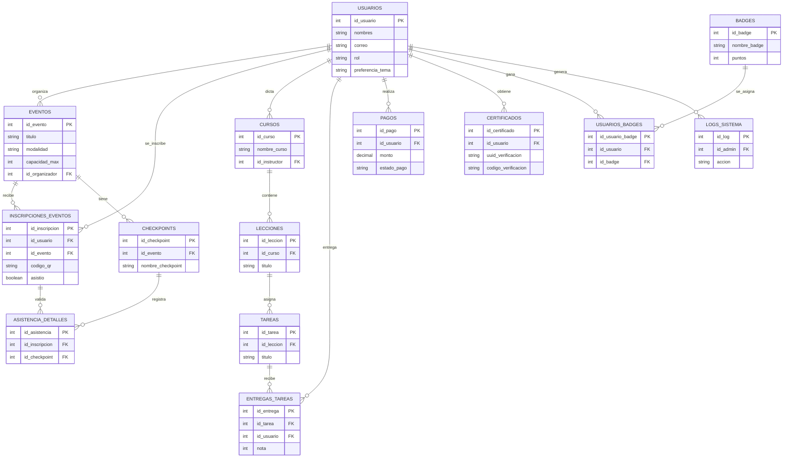

# Base de Datos Relacional y Protocolos de Seguridad (PostgreSQL & SQLAlchemy)

La base de datos relacional PostgreSQL de la Plataforma MEH representa el núcleo persistente y transaccional del sistema. Está gobernada mediante **SQLAlchemy síncrono** y migrada secuencialmente utilizando **Alembic** a través de un historial unificado de 11 revisiones de migración.

---

## 1. Diagrama Entidad-Relación Lógico (Mermaid ERD)

El siguiente modelo lógico Entidad-Relación define las claves primarias (`PK`), claves foráneas (`FK`) y la cardinalidad física que gobierna las transacciones relacionales del ecosistema:

---

## 2. Diccionario de Datos Relacional Completo

Todas las llaves primarias de base de datos son de tipo entero autoincremental secuencial (`SERIAL` en base de datos física, modeladas como `Integer, primary_key=True` en SQLAlchemy). Queda estrictamente documentado que **no** se emplean tipos de datos nativos `UUID` en la base de datos relacional para optimizar el rendimiento de la indexación física y prevenir fragmentación en el almacenamiento.

### A. Tabla `usuarios`
* `id_usuario`: `INTEGER` (SERIAL, Clave Primaria, Autoincremental).
* `nombres`: `VARCHAR` (Nombre de pila del miembro, obligatorio).
* `apellidos`: `VARCHAR` (Apellidos completos del miembro, obligatorio).
* `correo`: `VARCHAR` (Dirección de correo electrónico única e indexada para login).
* `password_hash`: `TEXT` (Contraseña encriptada con Bcrypt).
* `rol`: `VARCHAR` (Rol asignado. Constraint de check: `'ADMIN'`, `'ORGANIZADOR'`, `'MODERADOR'`, `'SOPORTE'`, `'EMBAJADOR'`, `'MIEMBRO'`).
* `preferencia_tema`: `VARCHAR` (Predeterminado: `'dark'`).
* `activo`: `BOOLEAN` (Bandera para habilitar o suspender cuentas, predeterminado: `True`).

### B. Tabla `eventos`
* `id_evento`: `INTEGER` (SERIAL, Clave Primaria).
* `titulo`: `VARCHAR` (Nombre del congreso/taller).
* `tipo_evento`: `VARCHAR` (Predeterminado: `'CONFERENCIA'`).
* `fecha_inicio`: `TIMESTAMP` (Fecha y hora de inicio).
* `modalidad`: `VARCHAR` (Presencial / Online).
* `capacidad_max`: `INTEGER` (Cupo de taquilla física. Constraint check: `capacidad_max > 0`).
* `token_qr`: `VARCHAR` (Token único utilizado para validación de entrada).
* `id_organizador`: `INTEGER` (Clave Foránea a `usuarios.id_usuario`).

### C. Tabla `pagos`
* `id_pago`: `INTEGER` (SERIAL, Clave Primaria).
* `id_usuario`: `INTEGER` (Clave Foránea a `usuarios.id_usuario`).
* `monto`: `NUMERIC(10,2)` (Monto pagado en Bs. Constraint check: `monto >= 0`).
* `estado_pago`: `VARCHAR` (Predeterminado: `'PENDIENTE'`).
* `comprobante_url`: `TEXT` (Ruta de almacenamiento local de la imagen de voucher).
* `porcentaje_ocr`: `NUMERIC(5,2)` (Confianza de coincidencia del motor OCR).
* `texto_ocr`: `TEXT` (Bloque completo de texto extraído por visión artificial).
* `validado_por`: `INTEGER` (Clave Foránea a `usuarios.id_usuario`).

### D. Tabla `certificados`
* `id_certificado`: `INTEGER` (SERIAL, Clave Primaria).
* `id_usuario`: `INTEGER` (Clave Foránea a `usuarios.id_usuario`).
* `id_curso`: `INTEGER` (Clave Foránea a `cursos.id_curso`, nulo si es certificado de evento).
* `id_evento`: `INTEGER` (Clave Foránea a `eventos.id_evento`, nulo si es certificado de curso).
* `uuid_verificacion`: `VARCHAR` (UUID de validación criptográfica única de 36 caracteres, autogenerado en Python vía `str(uuid.uuid4())`).
* `codigo_verificacion`: `VARCHAR` (Hash legible único de 8 caracteres para verificación externa).
* `url_pdf`: `VARCHAR` (Ruta física de descarga en el servidor).

---

## 3. Seguridad y Auditoría Activa (`AuditMixin`)

Para garantizar la trazabilidad de cada cambio en los datos y cumplir con las normas de seguridad del Hub, se implementan dos mecanismos a nivel del ORM SQLAlchemy:

### El Rol de la Clase `AuditMixin`:
Todas las entidades transaccionales (como cursos, eventos, pagos y certificados) heredan de la clase mixin `AuditMixin`, la cual inyecta de forma automatizada cuatro columnas de trazabilidad:
- `creado_por`: Clave foránea al `id_usuario` que insertó el registro original.
- `fecha_creacion`: Marca de tiempo UTC (`datetime.utcnow`) registrada al insertar.
- `modificado_por`: Cuenta del administrador que realizó la última actualización.
- `fecha_modificacion`: Marca temporal del cambio físico.

### Auditoría por IP en `logs_sistema`:
Cualquier acción administrativa crítica (como la modificación de roles de usuarios, borrado de lecciones o aprobación manual de transacciones financieras) ejecuta un registro en la tabla física `logs_sistema` a través de `logs_service.py`, detallando la acción ejecutada (`accion`), la base de datos afectada (`tabla_afectada`), la dirección IP del operador y una captura en JSON del valor anterior contra el valor nuevo para auditoría inmediata.

---

## 4. Gestión Jerárquica y Centralizada de Excepciones

El backend implementa un patrón interceptor centralizado en `backend/app/core/exceptions.py` para canalizar los flujos de errores y mitigar riesgos de seguridad:

1. **Excepciones de Dominio Controladas (`BaseDomainError`):** Representa fallas de lógica de negocio (ej. credenciales inválidas, cupo de evento agotado o curso no completado). El middleware intercepta la excepción, loguea el aviso y retorna un JSON con un mensaje limpio detallando el código de error correspondiente, evitando exponer trazas internas de la base de datos.
2. **Excepciones de Infraestructura No Controladas (`Exception` genérico):** Middleware de seguridad de nivel de servidor. Atrapa cualquier fallo no previsto del sistema (ej. error de conexión física a PostgreSQL o desbordamiento en memoria). Registra el log del traceback detallado en el servidor para el equipo técnico, pero enmascara la respuesta de la API enviando un genérico **`HTTP 500 Internal Server Error`** al cliente React para evitar ataques de inyección y denegación de servicio por revelación de secretos de software.
