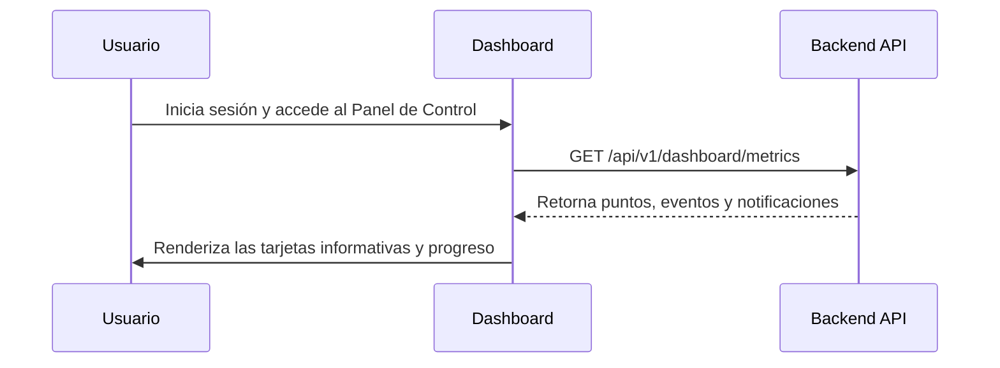

## 🧭 Visión General del Módulo

El Panel de Control es la pantalla principal o centro de comando de tu espacio personal. Ofrece una vista rápida de tu progreso, eventos próximos y el estado general de tu cuenta en la plataforma MEH.

:::security Permisos Requeridos
- **Roles Autorizados:** TODOS (MIEMBRO, ORGANIZADOR, ADMIN, etc.)
- **Scopes Técnicos:** `dashboard.read`
:::

## 🖥️ Interfaz de Usuario (UI) y Elementos Visuales

El dashboard centraliza la información mediante tarjetas de analítica (`AnalyticsCard`) y listas de acceso rápido, estructuradas con el diseño limpio y moderno de Fluent UI. Encontrarás secciones para ver tus puntos, la próxima insignia que puedes ganar y accesos directos a tus cursos o eventos más recientes.

## 🔄 Flujo de Trabajo Estándar (Paso a Paso)

1. **Acción 1:** El usuario inicia sesión y aterriza en el `/dashboard`.
2. **Acción 2:** La vista consulta al backend las métricas principales del usuario.
3. **Acción 3:** El sistema dibuja gráficamente el progreso y los accesos rápidos.

:::tip Buenas Prácticas
Revisa el panel de control frecuentemente para estar al tanto de notificaciones globales y eventos a los que estás inscrito.
:::

## 🛠️ Lógica de Control de Excepciones (Manejo de Errores)

* **¿Qué pasa si los datos no cargan?** Si hay una interrupción temporal con la API, el panel mostrará *skeletons* de carga o un mensaje de reintento en lugar de dejar la pantalla en blanco.
