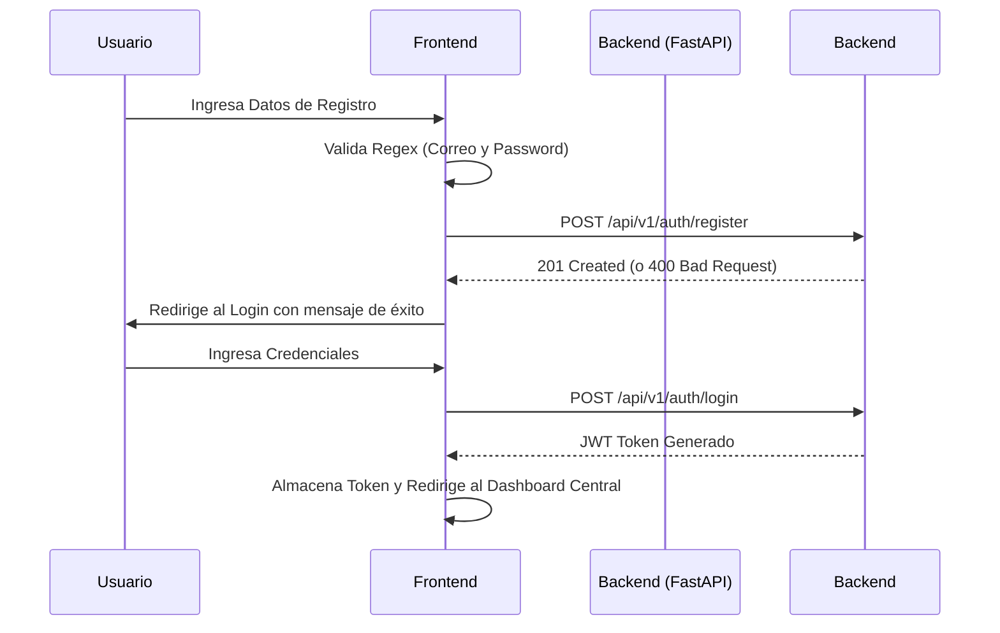

## 🧭 Visión General del Módulo
Este componente es la puerta de entrada a la **Plataforma MEH**. Gestiona de manera segura el ciclo de vida completo de la identidad del usuario, desde el registro inicial ("Comenzar mi viaje") hasta la recuperación de credenciales y la personalización de la experiencia visual (Modo Oscuro/Claro). Constituye el primer paso para interactuar con el ecosistema de gamificación.

:::security Permisos Requeridos
- **Roles Autorizados:** TODOS (Acceso Público para Login/Registro; MIEMBRO+ para edición de perfil).
- **Scopes Técnicos:** `auth.login`, `auth.register`, `profile.update`.
:::

## 🖥️ Interfaz de Usuario (UI) y Elementos Visuales
La interfaz de autenticación está construida bajo los estándares de **Fluent UI v9**, presentando un diseño limpio y centrado. Se compone de tres vistas modulares:
- **Login Card:** Entradas para correo institucional/personal y contraseña.
- **Formulario de Registro:** Distribución responsiva para captura de Nombres, Apellidos, Correo, y validadores visuales de robustez de contraseña.
- **Configuración de Perfil (Sidebar):** Ubicado en la sección inferior izquierda, permite desplegar el modal de edición de preferencias, foto y alias.

## 🔄 Flujo de Trabajo Estándar (Paso a Paso)

1. **Acción 1:** El usuario ingresa a la Landing Page y navega al formulario de **Registro**.
2. **Acción 2:** Completa los campos obligatorios. El sistema valida en tiempo real la longitud de la contraseña y el formato del correo.
3. **Acción 3:** Tras el envío exitoso, el usuario realiza el **Login** e ingresa a la plataforma.

:::tip Buenas Prácticas
Te recomendamos utilizar una contraseña con al menos 8 caracteres, combinando mayúsculas, minúsculas, números y símbolos. Configura tu **Alias** en el perfil inmediatamente después del primer login; este nombre será el que la comunidad verá en foros y rankings.
:::

## 🛠️ Lógica de Control de Excepciones (Manejo de Errores)
* **¿Qué pasa si olvido mi contraseña?** El usuario debe hacer clic en "Olvidé mi contraseña". El sistema solicitará el correo registrado y, si existe en la base de datos, despachará un token temporal válido por 15 minutos vía SMTP. El usuario recibirá un enlace seguro para establecer una nueva clave.
* **¿Qué pasa si el correo ya existe?** El formulario de registro se bloqueará y arrojará un error visual (borde rojo y mensaje flotante) indicando que la cuenta ya pertenece a otro miembro del hub.
