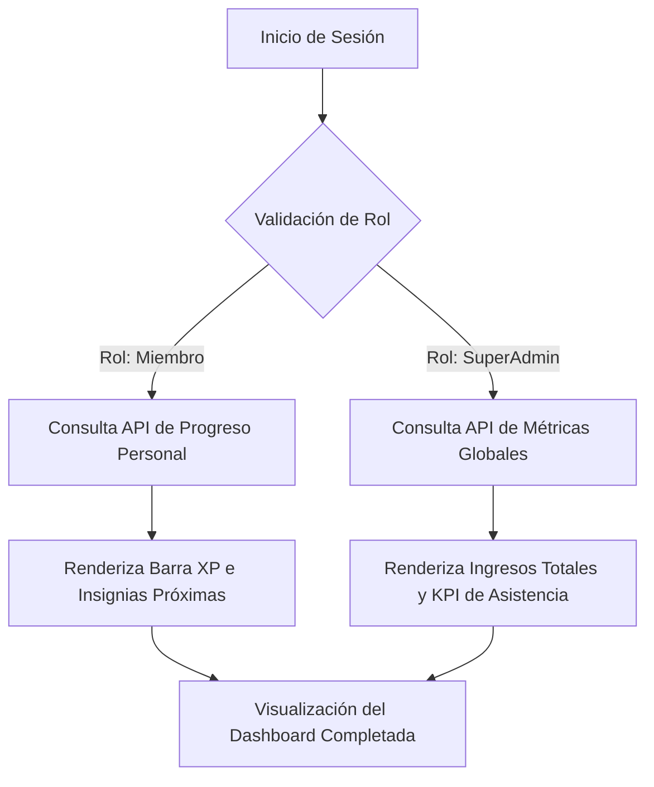

## 🧭 Visión General del Módulo
El **Dashboard Central** es el núcleo de información diaria de la plataforma. Actúa como un contenedor adaptativo (Desktop/Mobile) que renderiza widgets dinámicos según el Rol del usuario. Para los administradores, es un resumen ejecutivo; para los miembros, es el indicador en tiempo real de su progresión técnica, insignias y eventos próximos.

:::security Permisos Requeridos
- **Roles Autorizados:** MIEMBRO, ORGANIZADOR, ADMIN.
- **Scopes Técnicos:** `dashboard.read`, `metrics.view`.
:::

## 🖥️ Interfaz de Usuario (UI) y Elementos Visuales
La pantalla principal se divide en una retícula (Grid) inteligente:
- **Cards Estadísticas (Top):** Tarjetas de resumen (ej. Puntos XP, Eventos Activos).
- **Barra de Progreso Central:** Un medidor visual lineal que calcula dinámicamente la distancia hacia el próximo rango (Beginner ➡️ Explorer ➡️ Expert ➡️ Legend).
- **Muro de Avisos (Derecha):** Panel tipo feed vertical que muestra comunicados oficiales del MEH.

## 🔄 Flujo de Trabajo Estándar (Paso a Paso)

1. **Acción 1:** El sistema detecta el inicio de sesión y lee el `rol` almacenado en el AuthContext.
2. **Acción 2:** El Dashboard ejecuta peticiones asíncronas para traer datos frescos de la tabla `usuarios` y `eventos`.
3. **Acción 3:** La UI inyecta las variables en los componentes gráficos y despliega el muro de anuncios globales en tiempo real.

:::tip Buenas Prácticas
Revisa el Dashboard Central semanalmente. El "Muro de Avisos Comunitario" es el principal canal oficial de comunicación donde el equipo de soporte publicará oportunidades de becas y aperturas de nuevos programas.
:::

## 🛠️ Lógica de Control de Excepciones (Manejo de Errores)
* **¿Qué pasa si hay un fallo de conexión al cargar los widgets?** Si el Backend tarda más de 5 segundos en responder, el sistema implementa un *Skeleton Loader* (animación de carga fantasma) y, de persistir el error, muestra una advertencia amigable ("Hubo un problema recuperando tus estadísticas. Intenta recargar la página"), previniendo la rotura total (White Screen of Death) de la aplicación.
