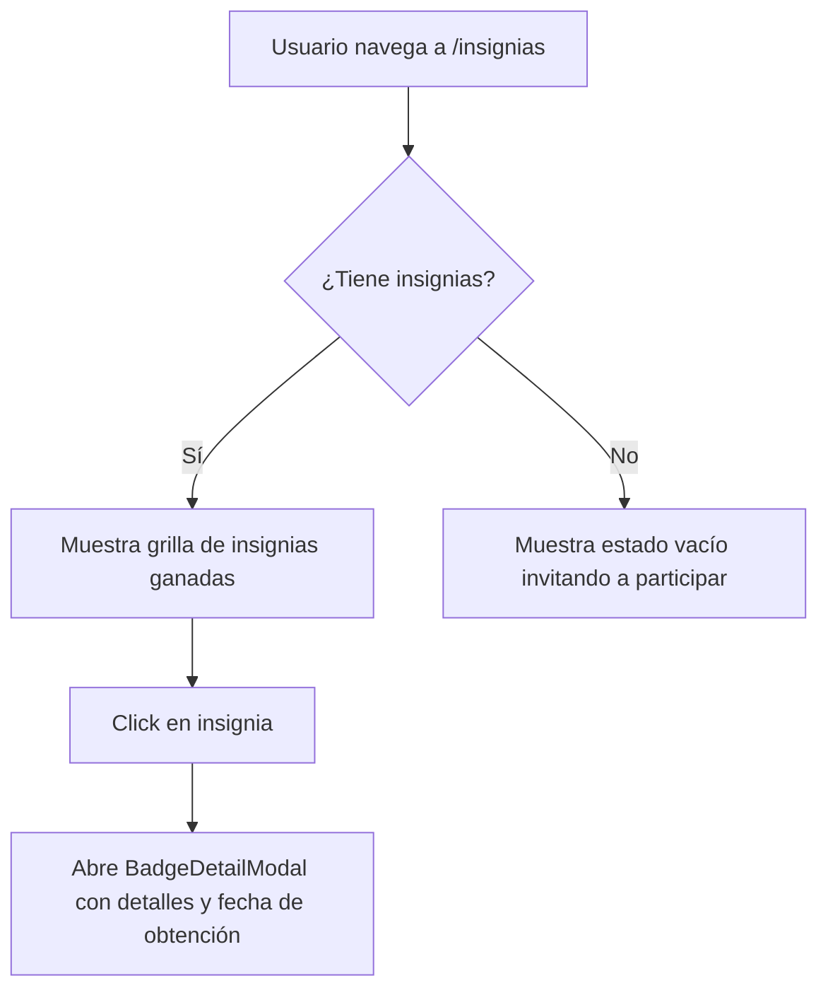

## 🧭 Visión General del Módulo

El módulo de Insignias representa el corazón de la gamificación en la plataforma. Aquí puedes visualizar todos los logros que has obtenido al participar en eventos, cursos y comunidades, así como el progreso necesario para desbloquear los siguientes niveles y beneficios.

:::security Permisos Requeridos
- **Roles Autorizados:** TODOS (MIEMBRO, ORGANIZADOR, ADMIN)
- **Scopes Técnicos:** `badges.read`
:::

## 🖥️ Interfaz de Usuario (UI) y Elementos Visuales

La pantalla utiliza componentes como `BadgeDetailModal` para explorar detalles específicos y `RankBenefitsTable` para comparar tu rango actual con los superiores. Muestra una grilla visual con íconos o imágenes de cada insignia.

## 🔄 Flujo de Trabajo Estándar (Paso a Paso)

1. **Acción 1:** Navegas a la sección "Insignias" en el menú "Mi Espacio".
2. **Acción 2:** El sistema carga la lista de tus insignias desbloqueadas y pendientes.
3. **Acción 3:** Haces clic en cualquier insignia para ver qué acciones específicas requirió para ser desbloqueada.

:::tip Buenas Prácticas
¡No olvides compartir tus insignias en redes sociales (como LinkedIn) para destacar tu participación continua en la comunidad!
:::

## 🛠️ Lógica de Control de Excepciones (Manejo de Errores)

* **¿Qué pasa si gano una insignia pero no aparece?** El sistema tiene sincronización en segundo plano, recargar la página normalmente fuerza una re-evaluación del motor de logros.
