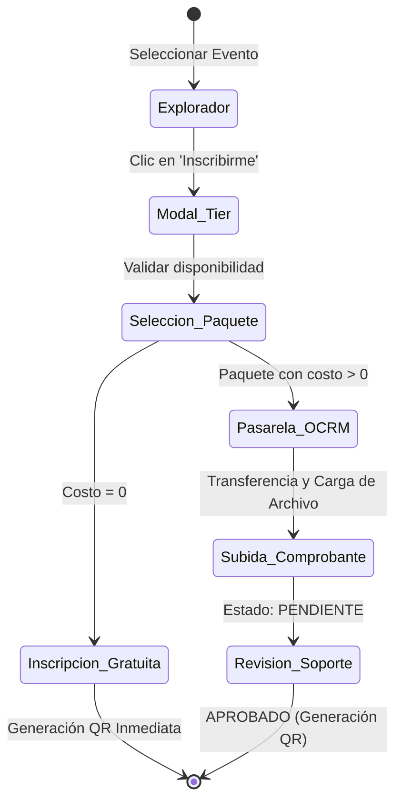

## 🧭 Visión General del Módulo
El **Hub de Eventos** permite a los usuarios descubrir y registrarse en talleres, conferencias y certificaciones del ecosistema MEH. Integra un motor de filtrado de alta velocidad y un componente clave para la recaudación: el **Flujo de Pago OCRM** (Optimizador de Conciliación de Recibos Manuales), que permite subidas de comprobantes seguros sin depender de pasarelas de pago costosas.

:::security Permisos Requeridos
- **Roles Autorizados:** MIEMBRO, ORGANIZADOR, ADMIN.
- **Scopes Técnicos:** `events.read`, `events.register`, `payments.upload`.
:::

## 🖥️ Interfaz de Usuario (UI) y Elementos Visuales
Construido con un Grid System responsivo:
- **Catálogo de Cards:** Cada evento posee una imagen de portada, título, etiquetas de modalidad (Presencial/Virtual), y costo.
- **Modal de Inscripción:** Interfaz emergente para la selección de Tiers (Paquete Estudiante, General, VIP).
- **Pasarela OCRM (Dropzone):** Área dedicada al pago. Muestra el código QR estático de la cuenta bancaria de la comunidad y un área arrastrable (Drag & Drop) para adjuntar la captura de pantalla (`.png`, `.pdf`) del comprobante.

## 🔄 Flujo de Trabajo Estándar (Paso a Paso)

1. **Acción 1:** El usuario explora y hace clic sobre un evento de su interés.
2. **Acción 2:** Selecciona el Tier adecuado. Si es gratuito, queda inscrito inmediatamente. Si tiene costo, se abre la Pasarela OCRM.
3. **Acción 3:** El usuario escanea el QR bancario oficial, realiza la transferencia y arrastra la foto del recibo a la zona de carga indicando su ID de transacción.

:::tip Buenas Prácticas
Asegúrate de que la captura de tu comprobante sea nítida y el número de **ID de Transacción** esté claramente visible. Los comprobantes borrosos serán rechazados por el equipo de Auditoría.
:::

## 🛠️ Lógica de Control de Excepciones (Manejo de Errores)
* **¿Qué pasa si el usuario sube un archivo no soportado?** El área de Dropzone validará el tipo MIME (MIME Type) en caliente. Si el archivo es un `.exe` o un `.docx`, el botón de subida se bloqueará y se mostrará una advertencia roja: "Solo se admiten formatos JPG, PNG y PDF menores a 5MB."
* **¿Qué pasa si el cupo del evento se llena mientras me inscribo?** El sistema hace una verificación de stock (`capacidad_actual`) en el instante de hacer clic en "Pagar/Registrar". Si el evento alcanzó su límite, la transacción es detenida con un aviso de *Sold Out*.
