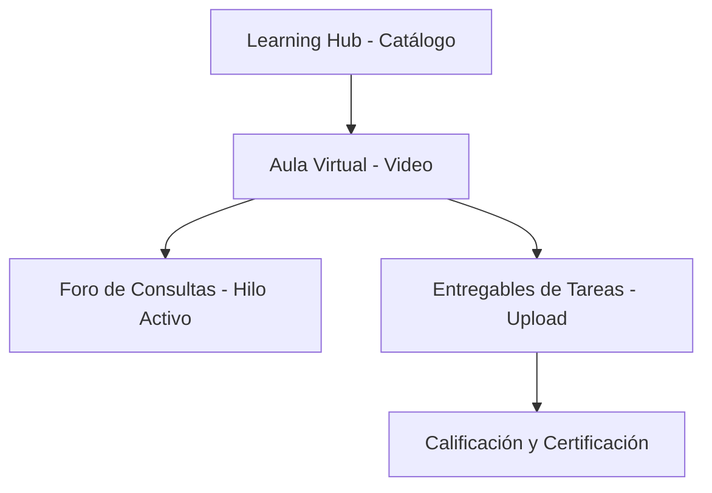
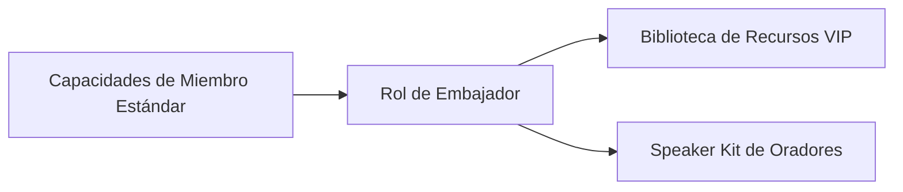

# Flujo de Interacción del Estudiante y Biblioteca VIP (Miembro y Embajador)

Este documento detalla las directrices funcionales, flujos de procesos y guías interactivas paso a paso para los roles de **Miembro** (estudiante de la comunidad) y **Embajador** (líder técnico/ponente). Ambos roles constituyen la base académica y el núcleo de crecimiento de la **Plataforma MEH (Microsoft Education Hub)**.

---

## 👨‍🎓 1. El Flujo de Interacción del Miembro (Estudiante)

El **Miembro** es el rol de aprendizaje estándar asignado automáticamente al registrarse. Su objetivo es cursar asignaturas técnicas, interactuar con la comunidad, asistir a conferencias oficiales y participar del sistema gamificado de puntos e insignias.

A continuación se detalla su flujo de navegación principal, desde que ingresa al portal hasta que obtiene su acreditación.

### 1.1. Acceso a la Plataforma e Interfaz de Inicio (Landing Page)
La experiencia de usuario comienza en la **Landing Page pública** del portal. Esta vista interactiva, optimizada para dispositivos móviles y de escritorio mediante Fluent UI y CSS responsivo en modo oscuro, expone las novedades, carteleras y convocatorias abiertas de la comunidad.

*Figura 1: Interfaz interactiva de inicio para visitantes y usuarios en el portal MEH.*

#### Guía Paso a Paso para Iniciar Sesión:
1. Dirígete a la barra superior de navegación y haz clic en **Iniciar Sesión**.
2. Digita tu correo electrónico registrado y tu contraseña de seguridad.
3. Tras la validación síncrona del token JWT en el backend, serás redirigido de forma automática a tu **Dashboard del Estudiante**.

---

### 1.2. El Dashboard del Estudiante (LMS e Historial)
El Dashboard central del miembro consolida su estado académico, su progreso gamificado y la bitácora de logros.

*Figura 2: Consola del estudiante mostrando el panel de control, insignias obtenidas y avance.*

#### Secciones del Dashboard:
*   **Métricas de Desempeño:** Barra de progreso acumulado y puntuación general (puntos de participación).
*   **Grid de Insignias (Logros Gamificados):** Visualización interactiva de medallas (insignias) desbloqueadas de forma síncrona al finalizar retos prácticos o cursos formativos.
*   **Lecciones y Cursos Activos:** Acceso directo con un solo clic a la última lección reproducida en el aula virtual.

---

### 1.3. Gestión del Aula Virtual (Learning Hub)
El **Learning Hub** es el sistema de gestión del aprendizaje (LMS) integrado de la plataforma. La navegación es intuitiva y se divide en cuatro componentes interactivos:

#### Flujo Operativo del Alumno en Cursos:
1.  **Explorar el Catálogo:** Selecciona un curso activo disponible e inscríbete de manera síncrona.
2.  **Visualizar Contenido en Video:** En la vista interna del curso, reproduce los materiales interactivos de cada módulo y descarga las guías complementarias.
3.  **Participar en el Foro Académico:**
    *   Si tienes dudas sobre un algoritmo o herramienta, haz clic en **Consultar al Docente**.
    *   Registra tu pregunta en el editor de texto. Los moderadores, docentes u organizadores responderán directamente en el hilo lógico del foro.
4.  **Subir Entregables y Tareas:**
    *   En las lecciones que lo requieran, localiza la sección **Entregables**.
    *   Carga tu archivo de resolución (ej. código fuente o reporte PDF) en el formulario seguro.
    *   El backend guardará de forma síncrona el registro en la base de datos para la evaluación del docente.

---

### 1.4. Inscripción a Eventos de la Comunidad
La plataforma centraliza la logística de conferencias y congresos masivos organizados por el Hub:
1.  **Pre-inscripción:** En el feed de eventos, haz clic en el botón de **Inscribirse**.
2.  **Generación de Ticket QR:** Una vez aprobada tu participación, el sistema generará de forma síncrona tu ticket digital único.
3.  **Descarga en PDF:** Puedes descargar este ticket con tu código QR único desde tu perfil para presentarlo en la entrada física del evento.

---

### 1.5. Control de Pagos y Conciliación Financiera (Cursos y Kits)
Algunos congresos de alta especialización técnica o souvenirs físicos de la red requieren un aporte económico. La plataforma automatiza este flujo financiero:

| Fase del Pago | Acción del Miembro | Estado del Registro | Proceso de Backend |
|---|---|---|---|
| **Fase 1: Transacción** | Realiza una transferencia o depósito bancario manual. | `PENDIENTE_PAGO` | Espera el registro del voucher en el portal. |
| **Fase 2: Registro** | Sube la imagen nítida del comprobante/voucher financiero. | `EN_REVISION` | Crea el registro con estado pendiente y cola el OCR. |
| **Fase 3: Aprobación** | Espera la conciliación automática por visión artificial o revisión manual. | `APROBADO` o `RECHAZADO` | Si es aprobado, desbloquea síncronamente los cursos o souvenirs comprados. |

---

## 👑 2. El Flujo de Interacción del Embajador (Líder Técnico)

El **Embajador** es un rol de distinción honorífica dentro del ecosistema MEH. Está diseñado para conferencistas, mentores y estudiantes destacados que asisten directamente en el desarrollo instruccional y logístico de la red de tecnología.

### 2.1. Heredabilidad de Privilegios
El rol de Embajador hereda automáticamente el **100% de los privilegios académicos, financieros y gamificados del Miembro**. Esto le permite continuar cursando lecciones en la academia virtual y registrar comprobantes sin requerir cuentas secundarias.

### 2.2. Biblioteca de Recursos VIP (Ruta: `/recursos`)
El privilegio diferenciador del Embajador reside en el acceso protegido a la **Biblioteca de Recursos VIP** en el menú de Fluent UI de la barra lateral:
1.  **Ingresar a la Vista Protegida:** Al iniciar sesión con credenciales autorizadas, el menú lateral mostrará dinámicamente el botón **Recursos VIP**.
2.  **Explorar Descargas Autorizadas:** Accede a guías avanzadas, plantillas de código limpio de nivel empresarial, materiales didácticos de Microsoft, y el **Speaker Kit oficial** (diapositivas homologadas, pautas de marca y metodologías de enseñanza para conferencias).
3.  **Descargar Material:** Haz clic sobre los botones de descarga de archivos. El frontend validará el token JWT y el microservicio del backend despachará de forma síncrona y segura los enlaces para el almacenamiento local.
