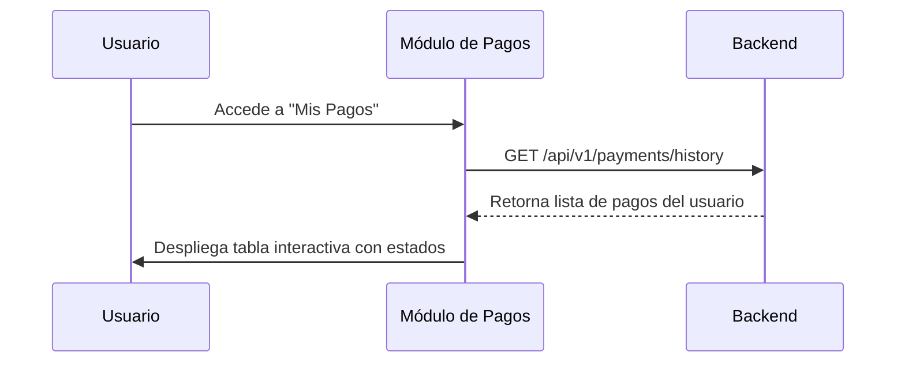

## 🧭 Visión General del Módulo

El módulo de Mis Pagos te permite gestionar todo el historial de transacciones, inscripciones de pago a eventos y descargar recibos o comprobantes. Es tu centro financiero personal dentro de la plataforma MEH.

:::security Permisos Requeridos
- **Roles Autorizados:** TODOS (MIEMBRO, ORGANIZADOR, ADMIN)
- **Scopes Técnicos:** `payments.read_own`
:::

## 🖥️ Interfaz de Usuario (UI) y Elementos Visuales

Consiste en una tabla de registros que muestra la fecha, el evento o servicio pagado, el estado (Aprobado, Pendiente, Rechazado) y el monto total. Utiliza componentes de tabla de Fluent UI y badges de estado.

## 🔄 Flujo de Trabajo Estándar (Paso a Paso)

1. **Acción 1:** El usuario entra a la sección "Mis Pagos".
2. **Acción 2:** Revisa el estado de la validación de un pago reciente (ej. transferencia bancaria pendiente de verificación).
3. **Acción 3:** Descarga el recibo de un pago aprobado.

:::tip Buenas Prácticas
Si realizas un pago manual (ej. OCRM o transferencia), asegúrate de subir el comprobante claro y legible. El equipo de administración validará el pago en un plazo máximo de 24 horas.
:::

## 🛠️ Lógica de Control de Excepciones (Manejo de Errores)

* **¿Qué pasa si mi pago fue rechazado?** Se habilitará un botón de "Reintentar" o "Contactar Soporte" donde podrás subir un nuevo comprobante o corregir la referencia de pago.
