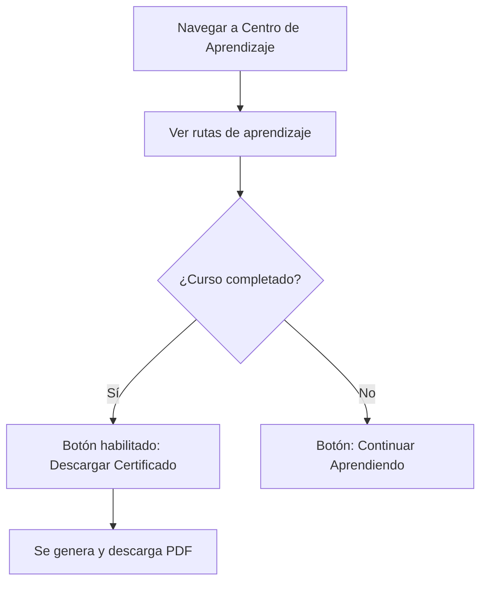

## 🧭 Visión General del Módulo

El Centro de Aprendizaje (Learning Hub) es tu biblioteca de formación. Aquí encontrarás tus rutas académicas activas, acceso a cursos o talleres (como la integración con Microsoft Learning) y los certificados que has obtenido tras completarlos satisfactoriamente.

:::security Permisos Requeridos
- **Roles Autorizados:** TODOS (MIEMBRO, ORGANIZADOR, ADMIN)
- **Scopes Técnicos:** `learning.read`
:::

## 🖥️ Interfaz de Usuario (UI) y Elementos Visuales

La interfaz presenta las rutas de aprendizaje mediante un componente visual tipo `LearningPathModal` y listados de cursos interactivos con barras de progreso. Permite la previsualización y descarga de certificados en PDF.

## 🔄 Flujo de Trabajo Estándar (Paso a Paso)

1. **Acción 1:** El usuario ingresa al Centro de Aprendizaje para ver sus cursos inscritos.
2. **Acción 2:** Continúa consumiendo el contenido o asistiendo a los eventos híbridos/presenciales para marcar progreso.
3. **Acción 3:** Tras completar los requisitos (asistencia + calificación o pago), el sistema habilita la descarga automática del certificado.

:::tip Buenas Prácticas
Verifica siempre que el estado de tu pago (si aplica) y tu asistencia (vía escáner QR) estén registrados correctamente, ya que ambos son pre-requisitos para liberar el botón de certificación.
:::

## 🛠️ Lógica de Control de Excepciones (Manejo de Errores)

* **¿Qué pasa si no puedo descargar mi certificado?** Si las condiciones (`asistencia === true && pago_estado === 'PAGADO'`) no se cumplen, el botón estará deshabilitado, mostrando un `Tooltip` explicando exactamente qué requisito falta completar.
