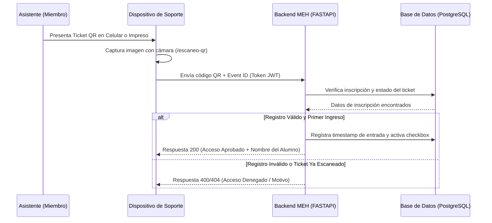
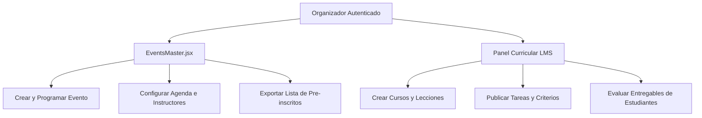

# Flujo de Soporte Logístico y Organizador de Eventos (Soporte y Organizador)

Este documento detalla las directrices operativas y de control de los roles de **Soporte** (encargado de logística física) y **Organizador** (docente o coordinador de eventos). Ambos roles posibilitan la ejecución exitosa de las actividades presenciales, síncronas e híbridas de la **Plataforma MEH (Microsoft Education Hub)**.

---

## 🛡️ 1. Flujo del Rol: Soporte (Personal de Puerta y Logística QR)

El rol de **Soporte** está pensado para estudiantes colaboradores de la comunidad que asumen responsabilidades operativas en el recinto del evento el día de su ejecución. Su principal herramienta es el **Visor de Escaneo QR integrado**.

### 1.1. Procedimiento de Control de Asistencia Física (Modo Online y Offline-First)
El día de la conferencia, seminario o taller, el personal de soporte ejecuta el siguiente protocolo síncrono en la puerta de acceso:

1.  **Ingresar a la Vista de Escaneo (Ruta: `/escaneo-qr`):**
    *   Inicia sesión con tu cuenta de Soporte autorizada.
    *   Haz clic en la opción **Escanear QR** en el menú superior o lateral de Fluent UI.
    *   El navegador te solicitará permisos de cámara. Concede el acceso a la cámara trasera (en dispositivos móviles) o delantera (en laptops).
2.  **Preparación y Caché Local (Si no hay red en puerta):**
    *   **Antes de ingresar al recinto (Con conexión activa)**: Selecciona el Evento de la lista desplegable y el Checkpoint correspondiente (ej. "Entrada General", "Entrega de Kits"). Haz clic en el botón **"Descargar Registrados"** para descargar y cachear localmente toda la nómina de inscritos en IndexedDB.
    *   **Activar Modo Offline Manual**: Si la señal de internet es inestable o nula, activa el interruptor **"Modo Offline Manual"**. El indicador de conexión cambiará de estado a *"Offline Forzado"*.
3.  **Iniciar Escaneo del Asistente:**
    *   Apunta la cámara del dispositivo hacia el código QR de la credencial.
    *   **En Modo Online**: La aplicación despacha una petición REST directa al servidor FastAPI.
    *   **En Modo Offline**: El sistema busca y valida el token QR localmente en IndexedDB.
        *   **Alerta Verde (Éxito)**: La pantalla parpadea en verde y muestra el nombre completo del estudiante con el mensaje *"Ingreso Autorizado (Offline)"*. La marca se añade a la cola local y se actualiza el caché de registrados.
        *   **Alerta Roja (Denegado)**: Se despliega si el QR no está en la base local, si ya fue escaneado anteriormente (prevención de fraude) o si corresponde a otro evento.
4.  **Sincronización de Marcas Pendientes:**
    *   Al retornar a un área con cobertura de red, haz clic en el botón **"Sincronizar Cola"**.
    *   La aplicación subirá una a una las marcas registradas en IndexedDB al servidor FastAPI. Observarás una barra de progreso que indica el estado del lote en tiempo real. Cada marca subida exitosamente será removida de la cola local.

---

## 🎓 2. Flujo del Rol: Organizador (Docente y Planificador)

El **Organizador** es el docente o coordinador responsable de diseñar la agenda, dictar las asignaturas técnicas, evaluar entregables y programar las conferencias del Hub.

### 2.1. Gestión de Eventos en la Consola `EventsMaster.jsx`
Este componente centraliza las acciones operativas asociadas a la planificación logística de congresos presenciales y seminarios online:

*   **Crear y Programar un Nuevo Evento:**
    1.  Ingresa a la consola a través del menú **Organizador -> Eventos**.
    2.  Haz clic en el botón **Nuevo Evento**.
    3.  Completa los campos obligatorios del formulario:
        *   Título descriptivo, Categoría técnica (ej. Cloud Computing, IA, Devops).
        *   Tipo (Presencial / Virtual).
        *   Ubicación física (Edificio, Aula) o enlace a Microsoft Teams si es remoto.
        *   Fecha, hora de inicio y límite de cupos de asistentes.
        *   Logotipo promocional y banners explicativos.
    4.  Presiona **Publicar**. El evento será visible en la Landing Page pública de forma síncrona para todos los visitantes.
*   **Editar Agenda y Ponentes:**
    *   En la ficha del evento, haz clic en **Editar Agenda**.
    *   Registra las lecciones, recesos y horarios.
    *   Asocia ponentes oficiales del Speaker Kit de la comunidad a cada charla técnica.
*   **Reportes Logísticos:**
    *   Accede a la pestaña **Asistentes**.
    *   Visualiza la lista interactiva de estudiantes pre-inscritos.
    *   Descarga el reporte consolidado en formato Excel o PDF para coordinar el stock de refrigerios, credenciales físicas y souvenirs requeridos el día del evento.

---

### 2.2. Gestión Curricular en la Academia LMS
El organizador asume la dirección académica del **Learning Hub**, estructurando las rutas de aprendizaje:

1.  **Diseño Curricular:** Crea cursos agregando títulos, descripciones académicas y estableciendo requisitos previos.
2.  **Inserción de Módulos y Lecciones:** Añade lecciones multimedia por curso, asociando videos formativos, códigos fuentes de ejemplo de repositorios GitHub y archivos PDF teóricos.
3.  **Publicación de Tareas Prácticas:**
    *   Agrega una tarea al final del módulo formativo.
    *   Registra las instrucciones del entregable, la fecha máxima de subida y el puntaje máximo (ej. 100 puntos).
4.  **Revisión y Calificación de Entregas:**
    *   El organizador ingresa a **Calificaciones**.
    *   Visualiza las tareas subidas síncronamente por los miembros.
    *   Descarga el código fuente o documento de resolución provisto por el alumno.
    *   Asigna una calificación numérica y escribe retroalimentación constructiva.
    *   Al guardar, los puntos e insignias de gamificación se computan síncronamente en el perfil del estudiante.
