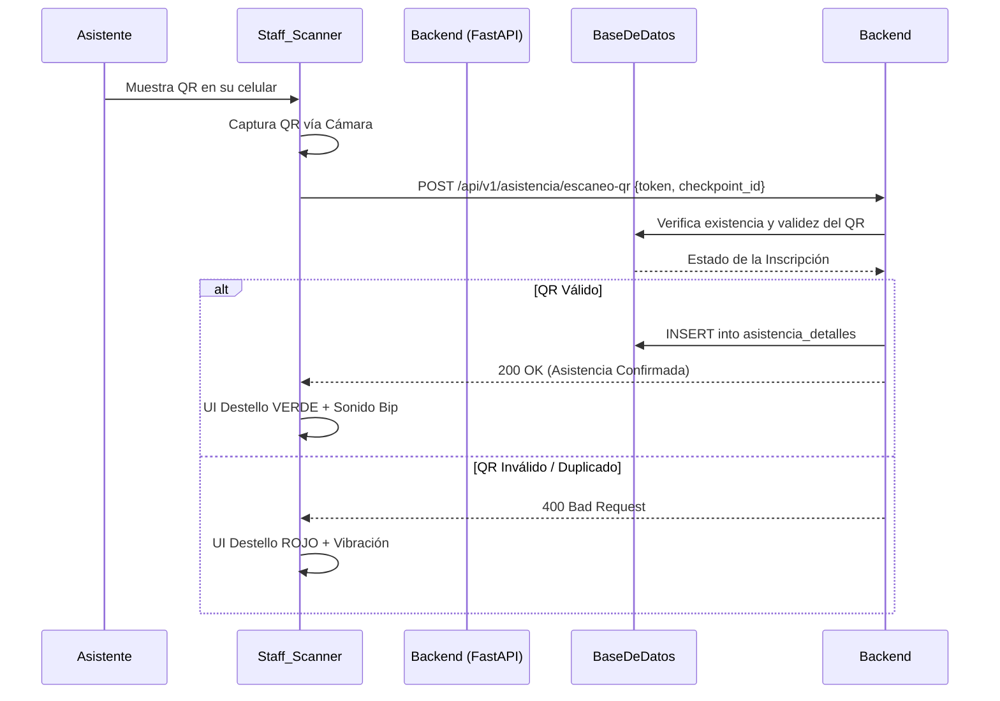

## 🧭 Visión General del Módulo
El **Centro de Operaciones QR** es una herramienta de campo diseñada específicamente para la gestión logística durante eventos presenciales. Transforma cualquier dispositivo móvil o tablet de un miembro del Staff en un terminal inteligente de *Check-in*, automatizando el registro en la tabla de asistencias sin requerir hardware especializado.

:::security Permisos Requeridos
- **Roles Autorizados:** ORGANIZADOR, STAFF, SOPORTE, ADMIN.
- **Scopes Técnicos:** `attendance.scan`, `events.manage`.
:::

## 🖥️ Interfaz de Usuario (UI) y Elementos Visuales
Diseñada bajo el principio "Mobile First" (Optimización para móviles):
- **Visor de Cámara (Scanner):** Área central que se enlaza al hardware del dispositivo utilizando `html5-qrcode`.
- **Selector de Checkpoint:** Dropdown en la parte superior para definir qué punto físico se está controlando (Ej. "Entrada Principal", "Entrega de Materiales").
- **Consola de Resultados:** Panel flotante inferior que parpadea en colores semánticos (Verde = Válido, Rojo = Error) tras cada lectura.

## 🔄 Flujo de Trabajo Estándar (Paso a Paso)

1. **Acción 1:** El organizador selecciona el evento activo y el Checkpoint.
2. **Acción 2:** Escanea el código único presentado por el miembro en pantalla.
3. **Acción 3:** El sistema cruza datos y registra la marca de tiempo exacta de asistencia.

:::tip Buenas Prácticas
Para eventos con más de 200 asistentes, asegura tener al menos dos dispositivos en la entrada principal conectados a redes diferentes (Ej. 4G/LTE y Wi-Fi Local) para evitar cuellos de botella. Limpia periódicamente el lente de la cámara.
:::

## 🛠️ Lógica de Control de Excepciones (Manejo de Errores)
* **¿Qué pasa si no hay internet al escanear?** El módulo implementa una pequeña caché temporal (*Offline Queue*). Si la petición HTTP falla por timeout, el código QR escaneado se guarda en el LocalStorage. En cuanto el dispositivo recupera la conexión, el organizador verá un botón flotante indicando "X registros pendientes por sincronizar" para enviarlos al backend en bloque.
* **¿Qué pasa si un usuario intenta escanear el mismo QR dos veces?** El Backend arroja una excepción HTTP 409, y la pantalla del escáner alertará "ALERTA: Código duplicado. Ya ingresó a las [Hora]".
