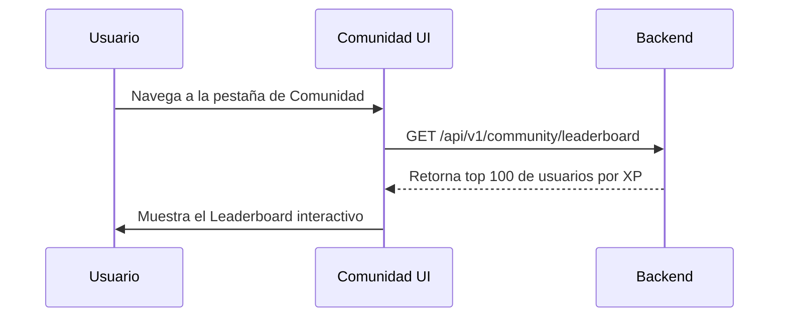

## 🧭 Visión General del Módulo

El espacio de Comunidad es el entorno social de la plataforma MEH, diseñado para conectar a los miembros entre sí. Fomenta el networking, la participación en foros y la visualización de rankings públicos entre los miembros del hub.

:::security Permisos Requeridos
- **Roles Autorizados:** TODOS (MIEMBRO, ORGANIZADOR, ADMIN)
- **Scopes Técnicos:** `community.read`
:::

## 🖥️ Interfaz de Usuario (UI) y Elementos Visuales

Presenta un feed estilo muro y un Leaderboard (Ranking). Emplea componentes de avatar, tarjetas de presentación de usuarios y listas rankeadas para fomentar una competencia sana basada en XP (puntos de experiencia).

## 🔄 Flujo de Trabajo Estándar (Paso a Paso)

1. **Acción 1:** El usuario ingresa a la sección Comunidad.
2. **Acción 2:** Revisa el Top 10 de la semana en el Leaderboard.
3. **Acción 3:** Explora los perfiles públicos (Alias y Bio) de otros usuarios de la comunidad.

:::tip Buenas Prácticas
Mantén tu Alias y tu Biografía actualizados en tu perfil, ya que esa será tu tarjeta de presentación en la sección de Comunidad y en el Leaderboard.
:::

## 🛠️ Lógica de Control de Excepciones (Manejo de Errores)

* **¿Qué pasa si un usuario tiene su perfil privado?** El sistema respetará las preferencias de privacidad; si un usuario opta por ocultar su perfil, aparecerá como "Miembro Anónimo" en los rankings públicos, sin acceso a sus redes sociales.
