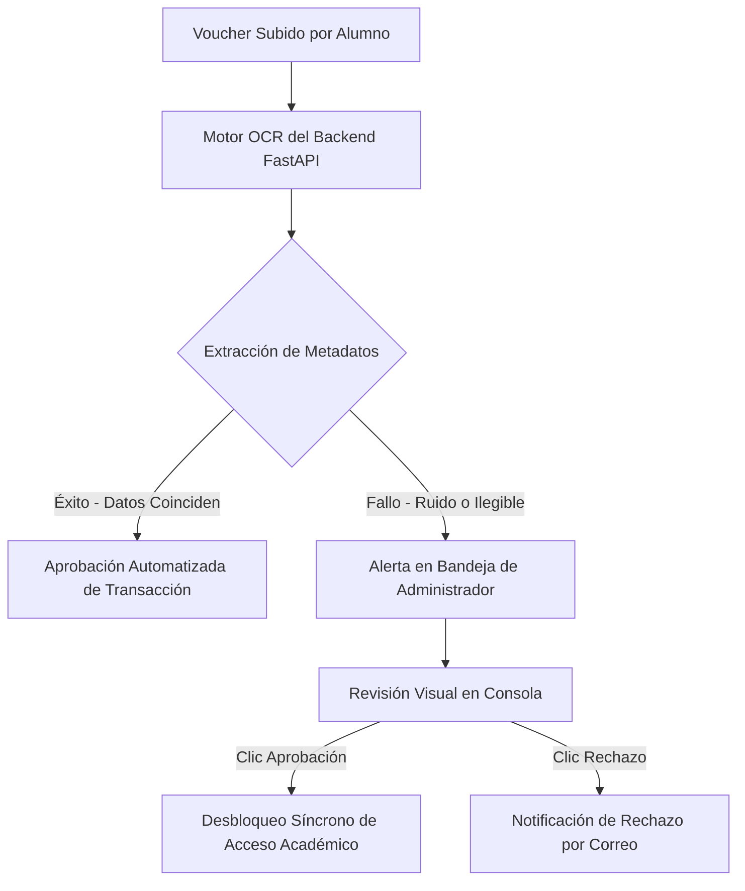

# Consola de Administración y Control Financiero OCR (Administrador)

Este documento describe la funcionalidad integral, las herramientas transaccionales de control de fraude, los motores de automatización de visión artificial y la emisión criptográfica disponibles de manera exclusiva en la **Consola del Administrador** de la **Plataforma MEH**.

El Administrador ejerce el **Control de Acceso Total (Full Access)** a nivel de frontend (`/admin`) y backend, resguardando la integridad del ecosistema comunitario de Microsoft Education Hub.

---

## 💻 1. Panel de Control Maestro (Dashboard Administrativo)

Al iniciar sesión con privilegios jerárquicos de nivel `ADMIN`, el frontend adaptativo despliega un panel lateral extendido con 9 pestañas de analíticas y control operativo:

*Figura 3: Consola central del Administrador que integra los gráficos analíticos de Recharts y la validación automática OCR.*

---

## 📈 2. Analíticas Ejecutivas en Tiempo Real (`Analytics.jsx`)
La pestaña de **Analytics** consolida métricas críticas del estado del Hub mediante diagramas interactivos y reactivos construidos con la librería `Recharts`:

*   **Ingresos Mensuales:** Gráfico de áreas y barras apiladas que visualiza las recaudaciones de souvenirs, kits de eventos e inscripciones de pago, permitiendo proyecciones financieras.
*   **Volumen de Usuarios Activos:** Historial lineal del incremento de registros de estudiantes, embajadores y organizadores en la plataforma.
*   **Tasa de Retención LMS:** Indicadores visuales sobre la velocidad de finalización de cursos por los estudiantes inscritos.

---

## 🔍 3. Consola Financiera y Automatización OCR (`GestionPagos.jsx`)
Una de las innovaciones tecnológicas de la suite es la **Conciliación de Vouchers Financieros mediante Visión Artificial OCR**:

### Guía de Operación Financiera:
1.  **Ingresar a Conciliación OCR:** Accede a la subpestaña **Pagos**.
2.  **Verificar Bandeja de Pendientes:** El sistema muestra una cuadrícula reactiva con los registros cuyo estado es `EN_REVISION`.
3.  **Extracción por Visión Artificial:** El backend procesa las imágenes mediante bibliotecas OCR, extrayendo metadatos como *número de transacción*, *fecha* y *monto depositado*.
4.  **Decisión Operativa:**
    *   Si los metadatos se validan automáticamente con las API bancarias integradas, la plataforma aprueba el registro de manera síncrona sin intervención humana.
    *   En caso de discrepancias (ruido en imagen, voucher borroso), el administrador visualiza la imagen original al lado de los campos detectados, pudiendo aprobar o rechazar manualmente con un solo clic.

---

## 🛍️ 4. Control de Inventario y Souvenirs (`SouvenirsTab.jsx`)
El Administrador gestiona el catálogo oficial de indumentaria y souvenirs del Hub:
1.  **Catálogo Activo:** Monitorea la rejilla interactiva de Fluent UI con los souvenirs de la comunidad (gorras, poleras de eventos, stickers técnicos, pines de insignias).
2.  **Gestión de Stock y Alertas:** Registra nuevos artículos, define los precios unitarios en moneda local y actualiza los stocks disponibles. El sistema emite alertas visuales cuando el inventario cae por debajo de 5 unidades.
3.  **Validación de Entregas:** Una vez conciliado el voucher, el administrador despacha el souvenir al estudiante y actualiza el estado a `ENTREGADO` en la consola física.

---

## 🔐 5. Generador de Certificados Criptográficos Masivos (`GeneradorCertificados.jsx`)
El Administrador puede acreditar académicamente a los estudiantes que han cumplido con las exigencias curriculares del aula virtual o asistido al congreso:

*   **Proceso de Generación Masiva:**
    1.  Selecciona el curso o evento correspondiente.
    2.  Haz clic en **Emitir Certificados Masivos**.
    3.  El backend de FastAPI procesa la lista de estudiantes aprobados de forma síncrona.
    4.  Crea un código criptográfico único (`hash_verificacion`) para cada diploma mediante un algoritmo de seguridad irreversible y genera el documento en formato PDF.
    5.  Los alumnos reciben de forma síncrona el diploma en sus buzones personales.
*   **Buzón de Verificación Pública:** Permite a terceras personas (ej. reclutadores de recursos humanos o directores académicos de la UMSA) ingresar al portal público, digitar el hash y verificar la autenticidad institucional del diploma.

---

## 🛡️ 6. Bitácora de Auditoría y Control de Seguridad (`Auditoria.jsx`)
Para resguardar los datos personales y precaver accesos fraudulentos o escalamientos ilícitos de privilegios, la suite integra una bitácora de auditoría detallada:

*   **Logs de Transacciones Físicas:** Registro permanente e inmutable en base de datos de cada llamada a métodos transaccionales del backend, utilizando el modelo base de auditoría del framework SQLAlchemy.
*   **Atributos Auditados:** Cada entrada incluye el ID del usuario ejecutor, acción realizada (ej. modificación de stock, cambio de rol a usuario), dirección IP física de origen del cliente HTTP y fecha exacta (timestamp de base de datos).
*   **Inspección Rápida:** Filtra los registros en tiempo real en la pantalla de Fluent UI para analizar comportamientos sospechosos o auditar accesos denegados por falta de privilegios JWT.
