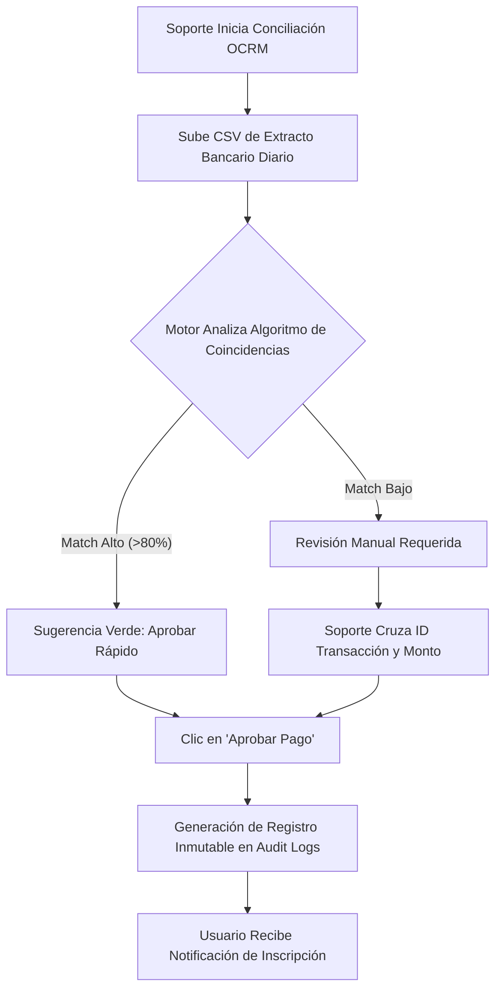

## 🧭 Visión General del Módulo
El **Panel Maestro** agrupa las funcionalidades de más alta criticidad del ecosistema MEH. Incluye herramientas de administración de entidades globales (Eventos, Usuarios, Checkpoints), flujos de conciliación inteligente de cuentas (Consola OCRM para Soporte Financiero) y el sistema de **Auditoría Suprema**, un visor forense inmutable de todas las transacciones históricas de la plataforma.

:::security Permisos Requeridos
- **Roles Autorizados:** SOPORTE, ORGANIZADOR, ADMIN.
- **Scopes Técnicos:** `admin.dashboard`, `audit.read`, `payments.validate`.
:::

## 🖥️ Interfaz de Usuario (UI) y Elementos Visuales
Diseñada para tareas de alta densidad de datos:
- **Consola OCRM Bancaria:** Interfaz de validación en pantalla dividida (Split-Screen). Izquierda: Cola de tickets. Derecha: Visor de comprobante subido vs tabla de sugerencias cruzadas con extracto bancario CSV.
- **Creador de Eventos:** Formulario multipasos estructurado en pestañas (Detalles, Multimedia, Logística QR).
- **Consola de Auditoría (Logs):** Una tabla tipo "DataGrid" masiva, optimizada con virtualización de filas, filtros por Fecha/Administrador/Tabla afectada, y visualizador lateral para payloads en formato JSON.

## 🔄 Flujo de Trabajo Estándar (Paso a Paso)

1. **Acción 1:** El usuario con rol *Soporte* accede a "Validar Pagos" y carga el extracto de cuenta del día.
2. **Acción 2:** El sistema cruza IDs y montos, facilitando botones directos de APROBAR o RECHAZAR.
3. **Acción 3:** Al aprobar, la plataforma acciona los triggers internos, habilitando al miembro su código QR de ingreso. Automáticamente, esta acción genera un registro en la tabla `logs_sistema`.

:::tip Buenas Prácticas
Para operaciones de administración de eventos masivos, utiliza pantallas de resolución FHD (1920x1080) como mínimo. Las consolas OCRM y DataGrids de Auditoría aprovechan mejor el espacio horizontal para comparar columnas de datos financieros.
:::

## 🛠️ Lógica de Control de Excepciones (Manejo de Errores)
* **¿Qué pasa si un organizador borra un registro por error?** El sistema aplica *Soft-Deletes* (borrado lógico) en entidades críticas (ej. cambia el estado a 'Cancelado' u 'Oculto') en lugar de borrarlos del disco. Si ocurriese un borrado real, el Administrador del sistema puede acudir a la **Auditoría Suprema**, ubicar la instrucción `DELETE`, leer el JSON del valor previo afectado y restaurarlo manualmente.
* **¿Qué pasa si el cruce de datos CSV falla en OCRM?** Si el formato del Excel o CSV subido por el Staff de finanzas no coincide con los headers pre-establecidos, el sistema cancelará la lectura evitando que se corrompa la UI y presentará una guía de las columnas requeridas (ej: `Fecha, Referencia, Importe`).
