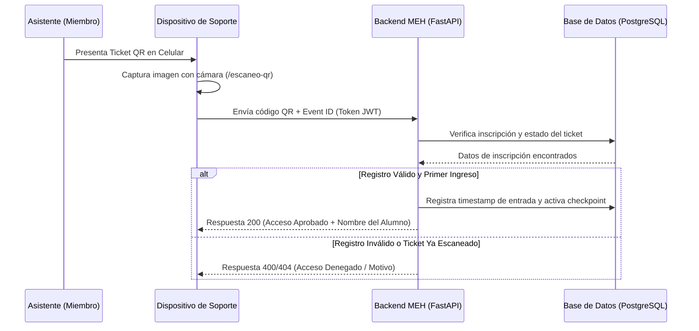

# Manual para Personal de Soporte (Auxiliares Logísticos)

Este bloque detalla las operaciones para el personal de staff asignado al soporte al cliente y control de incidentes en los eventos de la facultad.

---

## 1. Búsqueda y Verificación en Vivo de Alumnos

Si un alumno se presenta en la puerta de entrada alegando que no puede cargar su QR de acceso:

1. Dirígete a la consola de soporte en `/gestion-pagos` o `/escaneo-qr`.
2. Utiliza la barra de búsqueda en tiempo real e introduce su dirección de correo, nombre completo o número de cédula de identidad.
3. El sistema listará las coincidencias filtrando de forma segura contra la base de datos PostgreSQL.
4. **Verificar el Estado del QR:** Comprueba si el estado de su inscripción figura como `'CONFIRMADO'`:
   * Si figura como `'PENDIENTE'` o `'REVISION_MANUAL'`, dirígete al panel de pagos para verificar físicamente el voucher.
   * Si la transacción bancaria es legítima, solicita al administrador la aprobación manual inmediata en el sistema.

:::caution 📷 ACCIÓN REQUERIDA: CAPTURA DE PANTALLA
**Nombre de Archivo a Guardar:** `img/img_consola_soporte.png`  
**Instrucciones de Captura:** Captura de la consola de soporte de mesa de entrada, mostrando la barra de búsqueda reactiva Fluent UI v9 y los resultados de coincidencia con sus estados de validación. Guardar la imagen en `website/static/img/img_consola_soporte.png`.
:::

---

## 2. Diagrama de Secuencia del Control de Asistencia QR

A continuación se detalla cómo interactúan los componentes técnicos cuando se realiza el escaneo:

---

## 3. Diagnóstico de Incidentes de Lectura QR
* Si el escáner del staff devuelve un error de firma criptográfica inválida, solicita al estudiante recargar su Dashboard para refrescar el token QR (los tokens expiran temporalmente por seguridad).
* Si el lector offline no reconoce al estudiante, comprueba que hayas descargado la base de registrados confirmados actualizada más reciente antes del corte de red del recinto.
