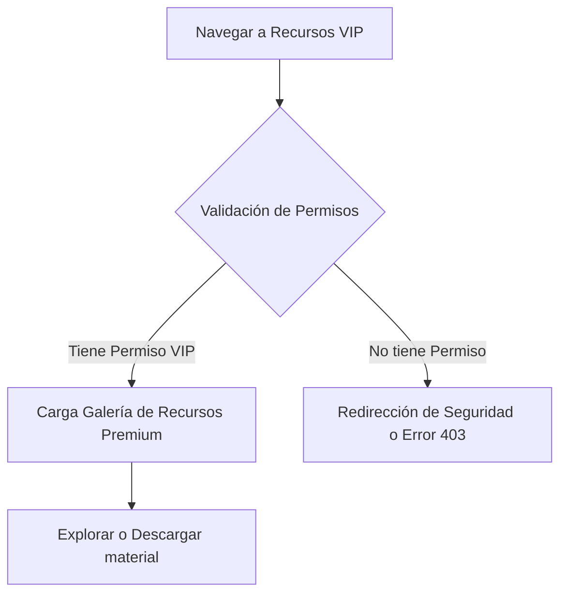

## 🧭 Visión General del Módulo

Este es un componente exclusivo bajo la sección "Liderazgo". Provee acceso a contenido premium, herramientas avanzadas, material de embajadores y documentación confidencial que solo los perfiles con permisos VIP pueden visualizar.

:::security Permisos Requeridos
- **Roles Autorizados:** VIP, ORGANIZADOR, ADMIN
- **Scopes Técnicos:** `vip.access`
:::

## 🖥️ Interfaz de Usuario (UI) y Elementos Visuales

La UI se centra en el despliegue de contenido exclusivo, utilizando un diseño que resalta recursos descargables, guías avanzadas y posibles integraciones multimedia (videos privados). Incluye iconos de candado o badges "VIP" en Fluent UI.

## 🔄 Flujo de Trabajo Estándar (Paso a Paso)

1. **Acción 1:** El usuario autorizado accede al panel de "Recursos VIP".
2. **Acción 2:** Selecciona el recurso deseado (ej. "Guía de Embajador 2024").
3. **Acción 3:** Inicia la lectura interactiva o descarga segura del documento en PDF/Media.

:::tip Buenas Prácticas
Aprovecha al máximo estos recursos para tu crecimiento profesional y liderazgo dentro y fuera del MEH. Este material es confidencial y para uso exclusivo de miembros VIP.
:::

## 🛠️ Lógica de Control de Excepciones (Manejo de Errores)

* **¿Qué pasa si intento acceder sin el rol VIP?** Si por algún motivo se expone la ruta (ej. compartiendo la URL directamente), el Middleware de Frontend y Backend bloquearán el acceso y mostrarán una pantalla de "Acceso Restringido", redirigiendo al dashboard.
