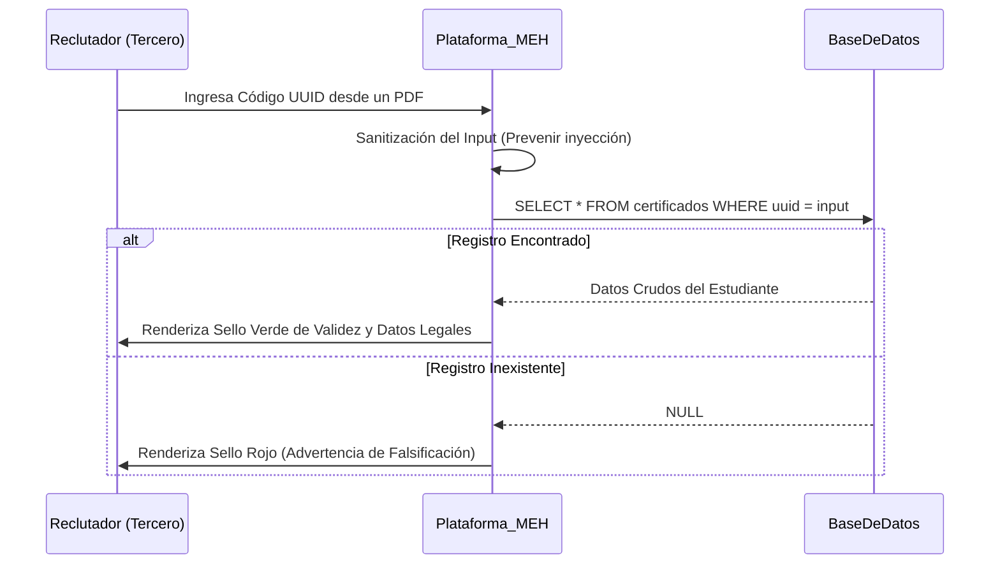

## 🧭 Visión General del Módulo
El **Validador Público de Talento** es una interfaz externa al ecosistema cerrado del Sidebar, diseñada para dar fe pública de las credenciales emitidas por el MEH. Está orientada a terceros (Reclutadores de RRHH, Empresas, Universidades) que necesiten comprobar la autenticidad técnica y logística de un certificado digital presentado por un candidato.

:::security Permisos Requeridos
- **Roles Autorizados:** PÚBLICO (No requiere autenticación).
- **Scopes Técnicos:** `public.verify`.
:::

## 🖥️ Interfaz de Usuario (UI) y Elementos Visuales
Una Landing Page minimalista y de alta confianza:
- **Input de Búsqueda:** Campo de texto prominente con máscara de validación para el ingreso de UUIDs alfanuméricos.
- **Estado de Resolución (Alerts):** Cajas de mensaje dinámicas (Rojo: Falso/No Encontrado | Verde: Documento Oficial).
- **Ficha de Legitimidad (Card):** Cuando la validación es exitosa, se despliega una tarjeta protegida con la identidad del estudiante, el sello de agua oficial, nombre del curso/evento y carga horaria oficial.

## 🔄 Flujo de Trabajo Estándar (Paso a Paso)

1. **Acción 1:** El Reclutador recibe un PDF del candidato, ubica el Código QR o el código de rastreo (UUID).
2. **Acción 2:** Visita el portal oficial de validación del MEH y teclea/pega el código de rastreo en la barra buscadora.
3. **Acción 3:** El sistema cruza contra la base de datos inmutable y arroja instantáneamente la confirmación de autenticidad.

:::tip Buenas Prácticas
Las empresas pueden escanear el Código QR impreso en el certificado físico o digital con la cámara nativa de sus teléfonos inteligentes (iOS/Android), el cual enrutará automáticamente a esta landing page con el código UUID ya autocompletado en la URL.
:::

## 🛠️ Lógica de Control de Excepciones (Manejo de Errores)
* **¿Qué pasa si intentan hacer ataques de fuerza bruta (Adivinar códigos)?** El input implementa un *Rate Limiting* (límite de peticiones por IP). Si una misma conexión externa intenta enviar más de 10 peticiones fallidas por minuto tratando de adivinar UUIDs válidos, la IP será baneada temporalmente (HTTP 429 Too Many Requests), garantizando la integridad de los datos de la comunidad.
* **¿Qué pasa si se envía código malicioso en la barra de búsqueda?** Toda la entrada a través del frontend es sanitizada; los intentos de *SQL Injection* o *Cross-Site Scripting* (XSS) serán bloqueados tanto en el cliente como neutralizados en el Backend gracias al ORM (SQLAlchemy) paramétrico.
