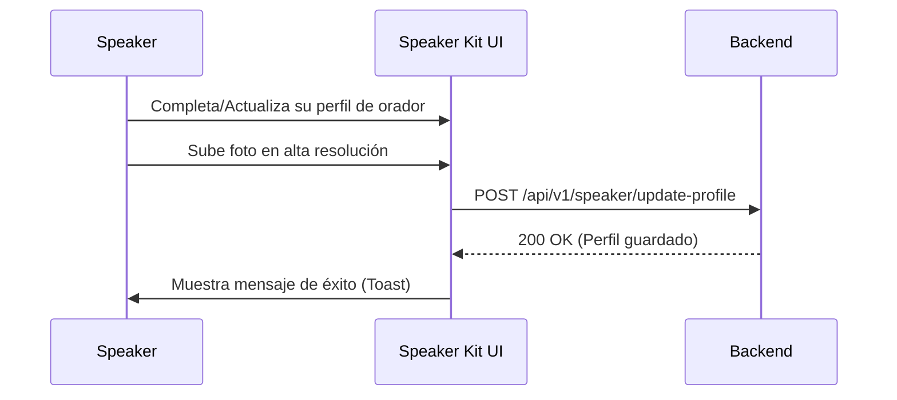

## 🧭 Visión General del Módulo

El "Speaker Kit" es un panel diseñado para oradores, ponentes y líderes de la comunidad. Permite cargar sus perfiles profesionales, materiales de presentación, fotos oficiales y biografía para que sean utilizados por el equipo de marketing y eventos del MEH de forma automatizada.

:::security Permisos Requeridos
- **Roles Autorizados:** SPEAKER, VIP, ADMIN
- **Scopes Técnicos:** `speaker.access`
:::

## 🖥️ Interfaz de Usuario (UI) y Elementos Visuales

Consiste en un formulario avanzado que utiliza controles de Fluent UI para la subida de imágenes (Dropzones), campos de texto enriquecido para biografías, e inputs para enlaces a redes sociales y repositorios de charlas pasadas.

## 🔄 Flujo de Trabajo Estándar (Paso a Paso)

1. **Acción 1:** El orador accede al Speaker Kit desde el menú Liderazgo.
2. **Acción 2:** Rellena o actualiza su información (Biografía corta, temas de especialidad).
3. **Acción 3:** Guarda los cambios, los cuales estarán disponibles inmediatamente para los administradores que organicen eventos.

:::tip Buenas Prácticas
Mantén una foto de perfil profesional, con buena iluminación y fondo neutral, ya que esta será la imagen que se publique automáticamente en las landing pages de los eventos donde participes.
:::

## 🛠️ Lógica de Control de Excepciones (Manejo de Errores)

* **¿Qué pasa si la imagen es muy pesada?** El Dropzone validará en el cliente (Frontend) el tamaño de la imagen. Si excede los 5MB o no es un formato válido (JPG/PNG), rechazará el archivo antes de consumir recursos del servidor y mostrará una alerta de error.
